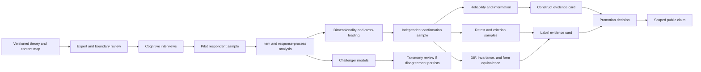

# vNext Empirical Validation Architecture — 2026-08

Status: authoritative vNext respondent-validation and promotion
specification; implementation and public-result promotion remain
version-gated.

Frozen implementation baseline:
<code>f0324dbf27dfc6e35ff557992e4643e3df15ee0e</code>

This specification continues the frozen Measurement Architecture and the
approved taxonomy, Primary, Modifier, Specialist, Context, construct, item,
scoring, and public-claims architectures. It is to be read with the
[Scoring Architecture Specification](scoring-architecture-specification-2026-08.md)
and the [Result Interpretation and Public Claims
Specification](result-interpretation-public-claims-specification-2026-08.md).
It defines the respondent-grounded evidence required before a construct,
configuration, Primary, Modifier, Specialist, form, threshold, uncertainty
display, or public claim can be promoted.

This is a research and governance specification. It does not change the
frozen question bank, scorer, taxonomy roster, Specialist assignment, public
language, or research version bundle. Existing source code under
<code>src/validation</code> and <code>src/research</code> provides reusable
contract and analysis scaffolding; an analysis object with a valid schema,
successful software tests, or an <code>estimable</code> status is not evidence
that a respondent measure is reliable, valid, fair, stable, or accurate.

No genuine contradiction with the frozen Measurement Architecture was found.
The current repository has several additive research-contract boundaries:

1. the existing psychometric report computes diagnostic summaries for available
   records but does not contain the full construct, label, fairness, or
   promotion evidence card required here;
2. existing estimator floors and DIF/form-equivalence contracts define when an
   analysis can be attempted, not when a label or public claim is validated;
3. the cumulative planning log is newer than the runtime research version
   bundle. Historical records retain their original versions until a new
   research release explicitly migrates them.

## 1. Executive decision

The authoritative validation flow is:



The program has five governing rules:

1. respondent evidence is required for respondent-measurement claims;
2. evidence is evaluated at the level of the claim: item, facet, root,
   configuration, label, form, population, language, and time scope;
3. exploratory discovery cannot be presented as confirmatory validation;
4. theoretical and historical standards remain necessary for ideological
   naming even when empirical models discover a stable respondent pattern;
5. promotion is a documented decision with an evidence card, not an automatic
   consequence of a statistic or software test.

### 1.1 Four decision categories

| Category                      | Validation question                                                                                     | Evidence source                                                                  | Release consequence                                                             |
| ----------------------------- | ------------------------------------------------------------------------------------------------------- | -------------------------------------------------------------------------------- | ------------------------------------------------------------------------------- |
| Conceptual / political-theory | Is the object historically, morphologically, and conceptually coherent at its declared granularity?     | Primary sources, scholarship, expert review, graph relations                     | Defines what must be measured and what a result is allowed to mean              |
| Measurement design            | Does the design provide interpretable indicators, gates, scopes, comparison sets, and abstention rules? | Content map, item audit, response-process plan, scoring specification            | Defines the preregistered analysis and minimum evidence card                    |
| Empirical                     | Do respondents understand, answer, differentiate, and reproduce the intended constructs and labels?     | Cognitive interviews, pilot/confirmation/retest/criterion samples, subgroup data | Determines whether a construct or label is supported, held, demoted, or revised |
| Implementation                | Are records, versions, splits, estimands, analyses, and decisions reproducible and isolated?            | Version bundles, manifests, code, audit trails, validation reports               | Determines whether the evidence can be reproduced and attached to a release     |

No one category substitutes for another. A source-backed definition does not
establish respondent validity. A good factor model does not create a historical
ideology. A stable software result does not establish test-retest stability.

## 2. Objects, estimands, and evidence status

### 2.1 Validation objects

| Object                | Primary estimand                                                                                         | Required comparison boundary                                                    |
| --------------------- | -------------------------------------------------------------------------------------------------------- | ------------------------------------------------------------------------------- |
| Item                  | Response interpretation, direction, discrimination, missingness, local dependence, and subgroup behavior | Exact wording, response options, layer, form, language, and item version        |
| Facet                 | Respondent-level estimate of a narrow political distinction                                              | Declared indicator set, neighboring facets, layer, and theory context           |
| Root construct        | Respondent-level estimate of the approved broad construct                                                | Facets, cross-loadings, layer, and expected ideological configurations          |
| Primary configuration | Affinity to a named reference profile over a declared scope                                              | M0 host-plus-facets versus M1 independent configuration, plus nearest neighbors |
| Modifier              | Direct cross-host construct estimate                                                                     | Host traditions, neighboring Modifier domains, and direct indicator set         |
| Specialist            | Conditional within-family or focused tradition comparison                                                | Module, prerequisites, local candidate set, assignment, and evidence status     |
| Form/depth            | Comparable construct and result behavior across forms                                                    | Presented items, anchors, assignment, burden, missingness, and version          |
| Public claim          | An outward statement about a profile, score, label, stability, fairness, or transport                    | Exact population, language, time, form, claim tier, and presentation version    |

### 2.2 Evidence status vocabulary

Every evidence component and every card uses one of these statuses:

| Status                          | Meaning                                                           | What it authorizes                                   |
| ------------------------------- | ----------------------------------------------------------------- | ---------------------------------------------------- |
| <code>not-started</code>        | No planned evidence has been collected                            | No empirical claim                                   |
| <code>design-ready</code>       | Protocol, estimand, instruments, and versioning are preregistered | Collection may begin                                 |
| <code>insufficient-data</code>  | Data exist but do not support the planned estimate                | No pass/fail inference; collect more or narrow scope |
| <code>not-estimable</code>      | The estimate is undefined for the object or data                  | Revise design or mark not applicable                 |
| <code>exploratory-signal</code> | An unregistered or discovery analysis found a pattern             | Hypothesis generation only                           |
| <code>conditional-pass</code>   | Evidence supports a limited scope with named caveats              | Conditional research/display use only                |
| <code>pass</code>               | Preregistered evidence meets the release rule for its scope       | May satisfy one promotion component                  |
| <code>fail</code>               | A preregistered critical requirement is not met                   | Hold, revise, or demote the affected object          |
| <code>superseded</code>         | A later version replaces the record                               | Historical traceability only                         |

<code>insufficient-data</code> and <code>fail</code> are not interchangeable.
The former means the evidence is unresolved; the latter means an analyzed
requirement was not met. A missing component cannot be silently counted as a
pass.

### 2.3 Claim ceiling

The empirical program inherits the public claim tiers in the Result
Interpretation Specification:

| Evidence ceiling | What may be claimed                                                                |
| ---------------- | ---------------------------------------------------------------------------------- |
| PC0              | Version, provenance, content mapping, calculation, missingness, and analysis facts |
| PC1              | Qualified construct-referenced profile and reference-profile similarity language   |
| PC2              | Scoped reliability, information, or precision claims                               |
| PC3              | Scoped dimensionality and construct-validity claims                                |
| PC4              | Scoped criterion/self-identification calibration claims                            |
| PC5              | Scoped test-retest stability claims                                                |
| PC6              | Tested subgroup/language/form comparability and invariance claims                  |
| PC7              | Tested cross-cultural or temporal transport claims                                 |

A label card may contain evidence at different ceilings for different
components. For example, content may be <code>pass</code> while calibration is
<code>insufficient-data</code>. The public claim ceiling is the minimum of the
relevant components, not the strongest component.

## 3. Staged validation program

### 3.1 Stage overview

| Stage | Name                                       | Main question                                                                                                | Data/output                                                                                    | Confirmatory status                                           |
| ----- | ------------------------------------------ | ------------------------------------------------------------------------------------------------------------ | ---------------------------------------------------------------------------------------------- | ------------------------------------------------------------- |
| V0    | Registry and preregistration               | Is the object, scope, estimand, and protocol fixed before respondent analysis?                               | Version bundle, analysis manifest, hypotheses, inclusion plan                                  | Confirmatory setup                                            |
| V1    | Expert/content review                      | Does the item or label represent the intended construct, boundary, and historical object?                    | Content rubric, source map, expert disagreements, revision record                              | Required gate; content evidence is not respondent validity    |
| V2    | Cognitive interviewing                     | Do respondents understand the prompt, construct, response options, labels, and caveats as intended?          | Think-aloud/probing transcript codes, comprehension findings, rewrite decisions                | Required response-process gate                                |
| V3    | Pilot sampling and administration          | Can the planned instrument, modules, criteria, and data-quality process be administered to the target scope? | Pilot dataset, burden/missingness report, administration audit                                 | Exploratory plus prespecified feasibility checks              |
| V4    | Pilot item and response-process analysis   | Which items show ambiguity, extreme distributions, contamination, response-style, or subgroup risk?          | Item report, item flags, preliminary information and missingness analysis                      | Mostly exploratory; registered safety checks are confirmatory |
| V5    | Internal structure and dimensionality      | Do respondent responses support the declared roots, facets, and local Specialist structures?                 | EFA/ESEM/CFA/IRT or other preregistered model reports, cross-loading/local-dependence findings | Confirmation split required for claims                        |
| V6    | Independent confirmation                   | Does the preregistered structure and item behavior replicate without retuning?                               | Holdout model fit, item functioning, construct scores, comparison to baseline                  | Confirmatory                                                  |
| V7    | Reliability and information                | Are estimates sufficiently precise for the declared use, without treating alpha as sufficient evidence?      | Reliability/information, standard errors, conditional precision, missingness effects           | Confirmatory and scope-specific                               |
| V8    | Test-retest                                | Do construct estimates, affinities, abstentions, and uncertainty behave over the declared interval?          | Linked retest pairs, stability estimates, change/attrition analysis                            | Confirmatory                                                  |
| V9    | Criterion and label calibration            | Do constructs and labels relate as preregistered to independent criteria, including self-identification?     | Held-out criterion performance, concordance, calibration, false-positive/abstention analysis   | Confirmatory; self-ID is one criterion source                 |
| V10   | Neighbor and residual discrimination       | Does a named Primary or Specialist add value beyond its host and distinguish its nearest neighbors?          | Pairwise/triadic discrimination, M0/M1 incremental tests, display-value study                  | Confirmatory for named promotion                              |
| V11   | Fairness, invariance, and form equivalence | Does the interpretation transport across tested groups, languages, and quiz depths?                          | DIF/invariance, group coverage/error/abstention, linked-form report                            | Confirmatory for each claimed scope                           |
| V12   | Robustness and uncertainty calibration     | Do conclusions survive omission, scoring alternatives, and plausible response-process models?                | Sensitivity, bootstrap, alternative scorer, uncertainty calibration, rank stability            | Confirmatory robustness set plus exploratory extensions       |
| V13   | Replication and promotion                  | Does the complete card meet the object-specific release gate in an independent or prospective wave?          | Signed evidence card, decision memo, public claim ceiling, migration record                    | Required release gate                                         |

Stages may overlap operationally, but a later-stage result cannot backfill a
failed earlier-stage requirement without an explicit re-specification. A label
with a strong criterion association but unresolved response-process ambiguity
remains held. A stable empirical class without historical coherence remains a
challenger profile, not a named ideology.

### 3.2 Stage V0: registry and preregistration

Before confirmatory respondent analysis, the study must freeze:

- the construct, facet, label, Specialist module, or form being evaluated;
- canonical IDs, conceptual kind, public role, graph relations, and scope;
- the exact item and response versions, including wording and options;
- layer and theory-context metadata;
- the production baseline and every challenger model;
- hypotheses, estimands, contrasts, and minimum detectable effects or precision;
- sample frame, recruitment, quotas, inclusion/exclusion, and weighting policy;
- randomization, label exposure, form/depth, and presentation conditions;
- missingness, refusal, <code>dont_know</code>, invalid, and duplicate rules;
- development, tuning, confirmation, retest, criterion, subgroup, and
  replication split rules;
- item, construct, label, and public-claim promotion thresholds;
- multiplicity control, interval method, bootstrap/seed policy, and deviations;
- the version bundle, code revision, analysis manifest, and data dictionary.

Preregistration may be amended before a new wave is analyzed. Amendments must
preserve the original record, state whether the analysis remains confirmatory,
and identify all affected claims.

### 3.3 Stage V1: expert and content review

The panel reviews content before respondent data are used to tune or promote a
measure. It must include independent reviewers with relevant political-theory,
historical, measurement, and where appropriate regional or community
knowledge. Reviewers should not be asked to certify a respondent score.

For each item, construct, Primary, and Specialist candidate, reviewers record:

1. construct and facet coverage;
2. constitutive versus optional content;
3. historical and morphological coherence;
4. nearest conceptual neighbors and required discriminants;
5. layer and theory-context fit;
6. wording direction, ambiguity, double-barreling, and specialized knowledge;
7. social-desirability, partisan anchoring, temporal anchoring, and
   ideological-asymmetry risks;
8. whether a proposed compound is additive M0 or residual M1;
9. sensitive membership, exclusion, religion, ethnicity, national, or
   authority content requiring special review;
10. whether the item or label should be scored, focused, catalog-only, or
    Context-only.

Experts may establish content validity evidence and identify disagreements. They
cannot establish respondent reliability, internal structure, criterion
concordance, test-retest stability, DIF, or invariance.

### 3.4 Stage V2: cognitive interviewing

Cognitive interviews must precede promotion of rewritten or newly added items,
high-risk labels, compound residuals, sensitive Specialist constructs, and
public wording that could be read as identity assignment.

The protocol should combine think-aloud, paraphrase, targeted probing, and
response-option review. Code:

- comprehension of the proposition and key terms;
- retrieval of relevant experiences or beliefs;
- judgment and comparison process;
- mapping from judgment to response option;
- interpretation of confidence, priority, salience, and <code>dont_know</code>;
- interpretation of ideal versus non-ideal framing;
- interpretation of named labels, neighbors, modifiers, experimental status,
  coverage, uncertainty, and abstention;
- perceived desirability, pressure, offense, threat, or partisan cue;
- specialized-knowledge dependence;
- whether respondents infer more doctrine than the item states.

Recruitment must include the intended language and relevant variation in
political familiarity, age, education, geography, and sensitive identities
where safe and consented. A small interview count can reveal defects but cannot
establish prevalence or psychometric properties.

An item or phrase remains held when respondents systematically interpret it
through an unintended construct, cannot distinguish the response options, or
infer an identity claim the product does not intend.

### 3.5 Stage V3: pilot sampling and administration

The pilot is for feasibility, response-process, item functioning, preliminary
structure, and design correction. It is not a miniature validation release.

Pilot sampling must specify:

- target population and deployment scope;
- recruitment frame and whether the sample is convenience, panel, quota,
  probability, or mixed;
- planned representation of relevant groups and languages;
- oversampling for rare, sensitive, or Specialist-specific constructs;
- duplicate, bot, speed, straight-line, and inattentive-response controls;
- whether label exposure occurs and when self-identification is collected;
- retest invitation and linkage procedures;
- criterion collection and missingness expectations;
- privacy, consent, data minimization, and withdrawal handling.

The pilot should include enough respondents to estimate the planned item and
response-process diagnostics with useful uncertainty. A fixed universal N is
not a substitute for a power, precision, or model-identification plan.
Existing code floors such as 50 complete cases, 30 retest pairs, or 50
criterion cases are estimator diagnostics only. They do not authorize a
promotion decision.

### 3.6 Stage V4: pilot item and response-process analysis

For every item, report:

- valid response rate by form, layer, language, subgroup, and presentation arm;
- refusal, <code>dont_know</code>, salience-skip, not-presented, and invalid
  rates separately;
- response-time and order effects where collected;
- category use, monotonicity, threshold disorder, floor, and ceiling;
- item means, variance, skew, and polarization;
- corrected item-total or item-rest association only where the construct
  structure makes that estimand meaningful;
- preliminary discrimination/information and local dependence;
- cross-loading and multi-axis assignment;
- acquiescence, extreme response, midpoint, and socially desirable response
  patterns;
- partisan, temporal, national, religious, or specialized-knowledge cues;
- subgroup and language differences as signals for DIF/invariance work;
- item omission impact on construct, label rank, abstention, and uncertainty.

Pilot statistics identify candidates for rewrite, replacement, quarantine, or
confirmation. They do not become confirmatory evidence simply because the
pilot sample is large.

## 4. Sampling, splits, and respondent data

### 4.1 Required respondent record

Each validation record must preserve, under consent and privacy controls:

| Record family | Required fields                                                                                             |
| ------------- | ----------------------------------------------------------------------------------------------------------- |
| Response      | Raw answer, coded value, response state, confidence/priority/salience, timestamp or order when collected    |
| Presentation  | Item order, form/depth, module, label exposure arm, result presentation version                             |
| Content       | Exact prompt/options, item version, layer, theory context, construct/facet mappings, weights, review status |
| Respondent    | Pseudonymous ID, administration wave, retest linkage if consented, recruitment/scope metadata               |
| Criteria      | Criterion kind, version, timing, exposure, value/missing reason, independent collection record              |
| Quality       | Inclusion flags, duplicate/bot/speed checks, attention and consent checks, exclusion reason                 |
| Analysis      | Study ID, inclusion manifest, seed, code revision, version bundle, estimand, split membership               |

Sensitive group variables must be voluntary, explicit, minimized, and never
inferred from names, text, ideology answers, or model output. A group variable
used for DIF or fairness must have a declared scope and missingness policy.

### 4.2 Analysis splits

The minimum split logic is:

1. **development:** item and model exploration;
2. **tuning:** preregistered parameter selection, if needed;
3. **confirmation:** untouched data for preregistered hypotheses;
4. **retest:** linked repeated administrations, with no leakage of retest
   responses into initial tuning;
5. **criterion:** independent or temporally separated criterion observations;
6. **subgroup/form:** adequate observations for the declared comparison;
7. **replication:** independent sample, prospective wave, or defensible
   cross-scope replication.

A respondent and all of that respondent’s administrations belong to one split
unless the preregistration explicitly defines a leakage-safe retest analysis.
Item-level random splitting is not acceptable for respondent validation.

### 4.3 Effective sample size

Report nominal N, usable N, complete-case N, weighted N where applicable, and
effective N under clustering or weights. Report the number of respondents with
valid evidence for each construct, facet, label criterion, subgroup, language,
and form. A large overall sample does not solve a sparse Specialist construct
or a small subgroup.

The current DIF contract requires at least 100 usable cases per target group
and prefers 200; those are analysis-contract floors, not proof of invariance.
Any stronger or weaker threshold must be preregistered with a power/precision
justification and a scope-limited conclusion.

### 4.4 Data-quality boundaries

Quality exclusion must be decided before examining the target result whenever
possible. Report both inclusive and quality-screened analyses when exclusions
could affect interpretation. Do not remove respondents solely because their
answers disagree with a prototype or self-label.

Missingness is an empirical object. Compare response, refusal,
<code>dont_know</code>, salience skip, depth omission, and module nonselection
across constructs and groups. Do not treat complete-case results as generally
representative without a missingness analysis.

## 5. Confirmatory and exploratory analysis

### 5.1 Confirmatory analysis

Confirmatory analyses must have a preregistered hypothesis, estimand, model,
comparison, inclusion rule, and release interpretation. Examples include:

- whether a hypothesized facet model fits in confirmation data;
- whether item direction and response options function as reviewed;
- whether a construct has the preregistered precision for its intended use;
- whether a Primary distinguishes its nearest neighbor on held-out criteria;
- whether M1 adds value beyond M0;
- whether a Specialist prerequisite and within-family comparison replicate;
- whether scores are stable over the declared retest interval;
- whether self-identification and external criteria show the preregistered
  relationship;
- whether DIF/invariance and form-equivalence conditions hold;
- whether omitted-item and alternate-scoring sensitivity remains within the
  preregistered robustness envelope.

Confirmatory multiplicity, interval estimates, and decision rules must be
reported even when the result is null or unfavorable.

### 5.2 Exploratory analysis

Exploratory analyses may investigate:

- unexpected facets, cross-loadings, residual dependence, or response styles;
- alternative construct weights, covariance, IRT, unfolding, or network models;
- LCA/LPA and other person-centered structures;
- new compound configurations or candidate labels;
- subgroup patterns not preregistered;
- alternative label neighborhoods, thresholds, and public explanations.

Exploratory results must be labeled exploratory, generate a new hypothesis or
design revision, and enter a fresh preregistration before confirmatory use.
No exploratory model may promote a label using the same data without a
holdout, independent replication, or explicitly relabeled analysis.

### 5.3 Analysis manifest

Every analysis result must link to:

- the preregistration or amendment;
- the exact version bundle and code revision;
- the inclusion/exclusion manifest;
- the sample and split description;
- the estimand and model specification;
- the seed and computational environment;
- the raw-result artifact or reproducible derivation;
- the evidence card component and public claim ceiling it informs.

## 6. Expert, cognitive, and content evidence requirements

### 6.1 Content review record

The content record must preserve independent reviewer judgments, not only an
aggregate score. For each reviewed object, store:

| Field             | Requirement                                                                              |
| ----------------- | ---------------------------------------------------------------------------------------- |
| Object and scope  | Item/facet/root/label ID, role, conceptual kind, layer, theory context, language, period |
| Intended meaning  | Canonical definition, constitutive constructs, optional facets, nearest neighbors        |
| Source basis      | Source units, scholarly disagreements, historical/morphological notes                    |
| Reviewers         | Expertise, independence, conflict declaration, version, review date                      |
| Ratings           | Relevance, clarity, boundary adequacy, construct purity, historical fit, sensitivity     |
| Disagreement      | Per-reviewer comments and adjudication, never only a mean                                |
| Decision          | Retain, edit, rewrite, replace, quarantine, catalog-only, focused, or research-only      |
| Downstream impact | Construct coverage, M0/M1 status, Specialist prerequisites, claim ceiling                |

Content review passes only when the item/label meaning is sufficiently
specified for cognitive and respondent testing. It does not pass the
respondent evidence card by itself.

### 6.2 Cognitive evidence record

The cognitive record must preserve:

- recruitment and interview protocol;
- participant scope and language;
- item/label exposure order;
- prompt and response-option version;
- coding rubric for comprehension, retrieval, judgment, mapping, and
  desirability;
- representative quotations or coded summaries without unnecessary personal
  data;
- disagreement and minority interpretations;
- revisions and reasons;
- re-interview or follow-up evidence when wording changes materially.

An item fails response-process readiness when a substantial or theoretically
important group systematically reads it as a neighboring construct, treats a
descriptive proposition as a value judgment, cannot distinguish options,
requires specialized knowledge not declared by the design, or interprets a
label as a personal identity assignment.

## 7. Construct-level validation

### 7.1 Item analysis

Item analysis is conducted within the declared construct and layer. A
cross-loaded item may be useful for a configuration or a deliberately broad
root, but it cannot be treated as a pure indicator merely because it has a
large item-total correlation.

The confirmatory item report must include:

| Analysis                    | Required interpretation                                                                                 |
| --------------------------- | ------------------------------------------------------------------------------------------------------- |
| Response distribution       | Detect floor, ceiling, midpoint, category sparsity, polarization, and wording asymmetry                 |
| Missingness                 | Separate refusal, dont_know, salience skip, not-presented, invalid, and other states                    |
| Item discrimination         | Estimate only against a preregistered construct model; report uncertainty and local dependence          |
| Category/threshold behavior | Test ordered response functioning for Likert/ordinal items and distinguish ipsative choice behavior     |
| Information/precision       | Report conditional information or equivalent precision across the relevant score range                  |
| Item-rest behavior          | Use corrected item-rest estimates as diagnostics, never as sole validity evidence                       |
| Cross-loading               | Evaluate intended and neighboring construct loadings, residuals, and theory-allowed shared content      |
| Response process            | Link quantitative flags to cognitive evidence, wording, desirability, and specialized-knowledge risks   |
| DIF                         | Test item behavior across declared groups/languages only under the preregistered DIF plan               |
| Omission impact             | Recalculate construct estimates, affinities, margins, abstention, and uncertainty with the item removed |

Statement-choice items require an ipsative or choice-model analysis. They must
not be forced into a common internal-consistency estimate designed for
independent Likert indicators.

### 7.2 Dimensionality and internal structure

Dimensionality is evaluated at the level at which a claim is made:

- roots are not assumed to be single factors because the current scorer has
  one axis ID;
- planned facets are hypotheses, not confirmed respondent dimensions;
- normative, descriptive, and prescriptive layers remain distinct;
- ideal/non-ideal metadata does not become a factor without evidence;
- Specialist-local constructs may have a different structure from global roots;
- compound Primaries require a configuration/residual test rather than a
  forced single factor.

The preregistered sequence should include appropriate alternatives such as
exploratory factor analysis, ESEM, CFA, graded-response/IRT, bifactor,
higher-order, unfolding, or other explicitly justified models. No one fit
index decides dimensionality. Report:

- model identification and estimator;
- item eligibility and excluded/quarantined items;
- fit and residual diagnostics;
- factor correlations and interpretability;
- local dependence and wording clusters;
- cross-loadings and residual covariance;
- parameter uncertainty and sensitivity;
- confirmation performance;
- subgroup/language differences;
- implications for the construct map and item bank.

If the respondent structure persistently contradicts the theoretical map, the
first response is construct and item review. A data-derived factor is not
automatically a new ideology or a replacement for the approved ontology.

### 7.3 Cross-loading evaluation

Cross-loading is not a generic defect; its meaning depends on the construct
architecture. The analysis must classify each cross-loading as:

1. substantively expected shared content;
2. a broad-root indicator that should not be used for a narrow facet;
3. wording or method effect;
4. construct contamination;
5. evidence of an unmodeled facet;
6. unstable or subgroup-specific behavior.

Promotion requires that critical items do not make a named construct
indistinguishable from its nearest conceptual neighbor in the declared use.
If a construct is intentionally relational or compositional, the card must
state the relation and avoid a false claim of independence.

### 7.4 Reliability and information

Reliability is an empirical property of scores in a defined population, form,
and use. Report multiple appropriate sources:

- internal consistency only when a common-score interpretation and local
  dependence assumptions are defensible;
- omega or model-based reliability when the fitted model warrants it;
- test information and conditional standard errors for ordinal/IRT models;
- generalizability or parallel-form evidence when form variation matters;
- test-retest stability as a separate temporal property;
- reliability/precision by score range, subgroup, language, and depth where
  claimed.

Cronbach alpha, split-half estimates, item counts, or complete-case counts
cannot alone promote a construct, label, or public claim. A high coefficient
can coexist with a contaminated or one-sided item set.

### 7.5 Missingness and response-process effects

Estimate whether missingness, refusal, <code>dont_know</code>, salience skip,
and form omission are associated with:

- the intended construct or layer;
- item difficulty or specialized knowledge;
- political interest, identity, or threat;
- subgroup, language, country, age, or education;
- label exposure and self-identification;
- quiz depth or Specialist assignment.

Compare complete-case, missingness-aware, and preregistered sensitivity models.
Do not impute a named label from a missing construct merely because an
alternative model improves rank stability.

### 7.6 Construct-level promotion record

A construct/facet may receive a measurement-ready status only when its card
contains:

1. content and response-process readiness;
2. an interpretable internal-structure result in confirmation data;
3. item functioning and cross-loading decisions;
4. adequate precision for the intended quiz depth and score use;
5. a declared missingness/abstention policy;
6. relevant DIF/invariance and robustness review;
7. a replication or prospective confirmation plan.

The required evidence may be conditional or not applicable for a particular
construct, but the card must explain why. A blank section is not a pass.

## 8. Label-specific evidence cards and promotion records

### 8.1 Card identity

There is one evidence card per canonical scored Primary and one per canonical
Specialist candidate. Card IDs are stable and versioned:

```text
primary:<canonicalLabelId>:validation-v1
specialist:<canonicalLabelId>:validation-v1
```

Historical aliases and legacy IDs point to the canonical card but never create
a second evidence record. A card is scoped to a taxonomy, construct, item,
scoring, Specialist-module, form, language, population, and validation version.

### 8.2 Evidence-card schema

The authoritative record is:

```text
LabelEvidenceCard {
  cardId,
  cardVersion,
  labelId,
  canonicalName,
  productRole,
  conceptualKind,
  historicalScope,
  graphParentsAndRelations,
  publicMeasurementStatus,
  currentCompatibilityStatus,
  constructScope,
  constitutiveConstructIds,
  optionalFacetIds,
  nearestNeighborIds,
  m0HostId,
  m0ModifierOrFacetIds,
  m1ResidualHypothesis,
  moduleId,
  formAndPopulationScope,
  evidence: {
    contentValidity,
    responseProcess,
    internalStructure,
    separability,
    incrementalValidity,
    calibration,
    temporalStability,
    fairness,
    robustness
  },
  preregistrationIds,
  analysisManifestIds,
  dataSplits,
  versionBundle,
  claimTierCeiling,
  publicDisplayState,
  promotionDecision,
  decisionRationale,
  limitations,
  openQuestions,
  reviewers,
  replicationPlan,
  provenance,
  createdAt,
  updatedAt
}
```

Each evidence component uses:

```text
EvidenceComponent {
  status,
  estimand,
  hypothesis,
  method,
  itemOrConstructScope,
  sampleScope,
  usableN,
  effectiveN,
  comparisonSet,
  estimateOrResult,
  uncertainty,
  preregistered,
  confirmationOrExploration,
  replicationStatus,
  limitations,
  artifactLinks,
  reviewerDecision
}
```

The schema stores estimates and interpretations separately. A statistic
without an estimand, sample scope, uncertainty, and decision rule is not an
evidence result.

### 8.3 Required evidence components

Every Primary and Specialist card must address all nine components below,
including a reasoned <code>not-applicable</code> or <code>insufficient-data</code>
status where appropriate.

#### Content validity

The card must identify:

- source-backed definition and historical/morphological boundary;
- constitutive constructs, optional facets, and forbidden proxies;
- conceptual kind and peer-level granularity;
- nearest conceptual and scored neighbors;
- expert panel, review rubric, disagreement, and adjudication;
- content coverage and unresolved scholarly disagreement.

Content pass means the respondent task is well specified. It does not mean
respondents endorse or recognize the label.

#### Response process

The card must report whether respondents:

- understand the defining constructs and labels;
- distinguish the label from nearest neighbors;
- interpret normative, descriptive, and prescriptive items as intended;
- use response options and uncertainty states as designed;
- are relying on specialized knowledge, identity cues, partisan slogans, or
  social desirability;
- read the result as affinity rather than identity assignment;
- show language, subgroup, or sensitive-content interpretation differences.

#### Internal structure

The card must link the label to the construct/facet model and report:

- expected configuration or local module structure;
- item eligibility and measured masks;
- factor/IRT/unfolding/model results;
- cross-loadings, local dependence, and method effects;
- score precision in the intended range;
- confirmation and replication status.

An ideology label can have a multidimensional configuration. The card must not
require a single latent factor when the theory predicts a structured profile.

#### Separability

The card must define a comparison set, not merely evaluate the label in
isolation. Include:

- nearest Primary or Specialist neighbors;
- pairwise and, where relevant, triadic respondent tasks;
- shared constructs and discriminating constructs;
- held-out neighbor margins or classification/rank metrics;
- false-positive and abstention rates;
- performance under sparse coverage and close results;
- subgroup/language/form variation.

Separability means the label adds interpretable distinction in the declared
scope. It does not require every respondent to choose one label.

#### Incremental validity

The card must state what the label adds beyond:

- the broader host Primary;
- relevant Modifier domains/facets;
- the nearest competing Specialist;
- the current production prototype;
- simpler or more parsimonious models.

Use held-out comparisons and preregistered complexity penalties. A higher
in-sample fit, additional items, or more distinctive name is not incremental
validity.

#### Calibration

The card must define the criterion and the estimand. Possible criterion
sources include:

- post-questionnaire self-identification;
- external political scales;
- behavior or organizational affiliation where ethically and substantively
  appropriate;
- resolved forecasts or policy judgments;
- independent expert coding of source units or bridge cases;
- label comprehension and identity-acceptance outcomes.

Self-identification is one criterion source. It is exposure-sensitive,
pluralistic, and not ground truth. Criterion data must be independent of
training/tuning, and label exposure must be recorded.

#### Temporal stability

The card must report construct, profile, affinity, rank, margin, abstention,
and uncertainty behavior over a preregistered retest interval. Stability is
not the same as reliability, validity, or ideological permanence. Large
changes may reflect genuine change, context, form, wording, or measurement
error and require analysis rather than automatic exclusion.

#### Fairness

The card must report:

- target groups and language/form scopes;
- DIF and invariance method;
- item, facet, root, label, coverage, abstention, and uncertainty differences;
- subgroup-specific false-positive/false-negative or neighbor-separation
  behavior where an appropriate criterion exists;
- sensitive-content and community-informed review;
- intersectional or small-group limitations;
- remediation, partial-invariance, or non-display decisions.

No nonsignificant test establishes absence of bias. A label may be held for a
group or language even when its aggregate result looks acceptable.

#### Robustness

The card must evaluate:

- item omission and leave-one-item/facet-out sensitivity;
- alternate content weights and construct weights;
- response coding and salience alternatives;
- covariance-adjusted versus independent-axis similarity;
- missingness and refusal scenarios;
- depth/form differences;
- bootstrap or repeated-split rank and margin stability;
- alternative theory-led model specifications;
- alternative thresholds and abstention rules;
- exposure and presentation-order effects.

Robustness supports scope and limitation statements. It does not prove that
the chosen scorer is the only valid model.

### 8.4 Card decision fields

The decision portion must include:

| Field                | Rule                                                                                                                                         |
| -------------------- | -------------------------------------------------------------------------------------------------------------------------------------------- |
| Promotion level      | Catalog, research-candidate, experimental-display, compatibility-scored-unvalidated, respondent-supported-scored, or validated-scoped-public |
| Minimum claim tier   | Lowest claim tier supported by all relevant card components                                                                                  |
| Critical holds       | Any failed or insufficient constitutive, response-process, fairness, or criterion component                                                  |
| Abstention rule      | Required evidence and the exact condition that suppresses the label                                                                          |
| Scope                | Population, language, region, time, form/depth, module, and item version                                                                     |
| Neighbor set         | Labels used for separability and false-positive evaluation                                                                                   |
| M0/M1 decision       | Host-plus-facets default or independently supported residual configuration                                                                   |
| Public wording       | Approved participant-facing text and prohibited claims                                                                                       |
| Reassessment trigger | Item change, version change, new population/language, new criterion, drift, or adverse evidence                                              |

## 9. Current label-card registry

The following registry instantiates one card for every current Primary and
Specialist ID. The compact grouping of Specialist IDs is an index convenience;
each ID receives a separate card with the full schema above. No row below
asserts respondent validity. The initial empirical status for current labels is
<code>not-started</code> or <code>insufficient-data</code> unless a later
card supplies respondent evidence.

### 9.1 Primary cards

| Card ID suffix              | Current object                                 | Initial empirical disposition                    | Priority evidence                                                                                                                        |
| --------------------------- | ---------------------------------------------- | ------------------------------------------------ | ---------------------------------------------------------------------------------------------------------------------------------------- |
| conservative                | Broad tradition anchor                         | Compatibility-scored, respondent-validation hold | Prudence versus moral traditionalism, national priority, status-quo preference, and nearest conservative variants                        |
| christian-democrat          | Compound/bridge tradition                      | Compatibility-scored, respondent-validation hold | Religious public order, social ethics, solidarity, subsidiarity, social-market order, and M0/M1 residual                                 |
| classical-liberalism        | Broad tradition anchor                         | Compatibility-scored, respondent-validation hold | Liberty, property, rule of law, public goods, and separation from Market Liberal and Right-Libertarian configurations                    |
| democratic-socialist        | Broad/compound tradition                       | Compatibility-scored, respondent-validation hold | Democratic ownership/control, anti-domination, workplace governance, and incremental value over socialist and social-democratic hosts    |
| green-politics              | Broad tradition anchor with omitted morphology | Compatibility-scored, respondent-validation hold | Ecological standing, limits, growth, technology, governance, strategy, and multi-affinity interpretation                                 |
| liberal-conservatism        | Compound/bridge M1 priority                    | Compatibility-scored, M0 default and M1 hold     | Ordering of liberal institutions and inherited continuity; M0 versus M1 residual; cross-cultural label comprehension                     |
| libertarian-socialism       | Compound/bridge tradition                      | Compatibility-scored, respondent-validation hold | Anti-authority, social ownership, workplace self-management, federation, and separation from Marxian Socialism and Right-Libertarianism  |
| market-liberal              | Broad tradition anchor                         | Compatibility-scored, respondent-validation hold | Market governance, enabling state, public goods, welfare, and triad separation from Classical Liberalism and Right-Libertarianism        |
| market-right-libertarianism | Broad family anchor                            | Compatibility-scored, respondent-validation hold | Property/state lineage, exit, voluntary exchange, minimal state versus statelessness, and false-positive separation                      |
| marxian-socialism           | Broad tradition anchor                         | Compatibility-scored, respondent-validation hold | Class structure, historical materialism, social ownership, and separation from Democratic Socialism and Marxism-Leninism                 |
| marxist-leninist            | Compound tradition with constitutive gate      | Compatibility-scored, respondent-validation hold | Vanguard-party organization, centralized transition, party-state authority, doctrine versus regime approval                              |
| national-conservatism       | Compound/bridge M1 priority                    | Compatibility-scored, M0 default and M1 hold     | National community and continuity, bounded national priority, authority/order, liberal institutional relation, and M0 versus M1 residual |
| radical-democracy           | Broad tradition anchor                         | Compatibility-scored, respondent-validation hold | Popular sovereignty, contestability, participation, anti-domination, pluralism, and separation from populist style                       |
| republicanism               | Broad/compound tradition                       | Compatibility-scored, respondent-validation hold | Non-domination, civic self-government, constitutional contestability, and incremental value over liberal liberty                         |
| social-democrat             | Broad tradition anchor                         | Compatibility-scored, respondent-validation hold | Mixed economy, reform strategy, public provision, equality, and separation from Democratic Socialism and Market Liberalism               |
| social-liberalism           | Broad tradition anchor                         | Compatibility-scored, respondent-validation hold | Liberty, social provision, pluralism, public goods, and separation from Classical Liberalism and Social Democracy                        |

All sixteen Primary cards must initially carry the public state
<code>compatibility-scored-unvalidated</code>. A current top-ranked match is
not a promotion result.

### 9.2 Specialist cards with focused modules

| Module/card family          | Separate Specialist card IDs                                                                                                                   | Initial status              | Required module-level evidence                                                                                                                                             |
| --------------------------- | ---------------------------------------------------------------------------------------------------------------------------------------------- | --------------------------- | -------------------------------------------------------------------------------------------------------------------------------------------------------------------------- |
| Feminist faction            | anarcha-feminism, liberal-feminism, socialist-feminism                                                                                         | Provisional focused module  | Feminist construct structure, response-process and identity-boundary interpretation, within-family discrimination, criterion, retest, DIF/invariance                       |
| Identity and sovereignty    | black-nationalism, indigenism, pan-africanism                                                                                                  | Provisional focused module  | Ascriptive membership, minority self-government, community autonomy, territorial/separatist distinctions, sensitive-content safety, regional and language invariance       |
| Anarchist families          | anarcho-capitalist, anarcho-communist, anarcho-syndicalism, individualist-anarchism, market-anarchism, minarchist, mutualist, social-anarchism | Experimental focused module | Anti-authority, property regime, market/communal coordination, federation, strategy, and false-positive separation; no family-level result may substitute for each subtype |
| Green morphology            | deep-ecology, degrowth-green, ecomodernist, ecosocialist, green-capitalism                                                                     | Experimental focused module | Ecological standing, growth/post-growth, technology, market, governance, multi-affinity and cross-loading analysis                                                         |
| Socialist families          | council-communist, guild-socialism, market-socialist, maoism, syndicalist, trotskyism                                                          | Experimental focused module | Social ownership, planning, reform/revolution, organization, historical claims, within-family separation, criterion and fairness                                           |
| Conservative variants       | neoconservative, one-nation-conservatism                                                                                                       | Experimental focused module | Prudential continuity, moral traditionalism, national continuity, internationalism, and separation from Primary hosts                                                      |
| Religious-national politics | hindutva, islamic-democracy, political-islam, zionism, religious-nationalism, theocrat                                                         | Experimental focused module | Religious/legal authority, constitutionalism, civilizational or national membership, minority citizenship, regional meaning, and high-risk false positives                 |
| Technology governance       | techno-anarchism, technocratic-centralist                                                                                                      | Experimental focused module | Algorithmic authority, decentralized infrastructure, expertise, privacy, market/state/commons coordination, and technology-strategy distinctions                           |
| Monarchist and municipal    | absolute-monarchist, democratic-confederalism, libertarian-municipalism, traditional-monarchist                                                | Experimental focused module | Hereditary/constitutional authority, municipal autonomy, confederal coordination, and separation of regime type from decentralization                                      |

### 9.3 Specialist cards awaiting a construct-matched module

Each of the following receives its own card with
<code>specialist:<id>:validation-v1</code>, but remains catalog/provisional until
a dedicated or genuinely construct-matched module exists:

| Card IDs                                                                                                                                                                                                                                          | Initial status                                                                                             |
| ------------------------------------------------------------------------------------------------------------------------------------------------------------------------------------------------------------------------------------------------- | ---------------------------------------------------------------------------------------------------------- |
| agorist, agrarian-populism, anarcho-primitivism, bioregionalism, bleeding-heart-libertarianism, christian-reconstructionism, christian-socialism, eco-fascism, eco-authoritarianism, fascist-authoritarian, georgism, geolibertarian, integralism | Catalog/provisional; direct defining constructs not established in an approved public module               |
| juche, kemalism, left-wing-market-anarchism, national-bolshevism, national-socialism, neoreactionary, objectivism, ordoliberalism, paleoconservatism, paleolibertarianism, participism, stirnerism, strasserism                                   | Catalog/provisional; historical, regional, doctrinal, or organizational residual requires focused evidence |
| voluntaryism, third-way, distributism, neoliberalism, developmentalism, pan-arabism, arab-socialism, radical-feminism, black-feminism, queer-politics, confucian-political-revival, queer-anarchism, welfare-chauvinism                           | Catalog/provisional; no ordinary endpoint may be inferred from neighboring Primary or Modifier scores      |

This registry covers all 78 current Specialist IDs. A module assignment or
completion record does not change a card’s empirical status.

## 10. Primary-specific validation

### 10.1 Nearest-neighbor discrimination

For each Primary, define the neighbor set before confirmation analysis. It must
include:

- the nearest conceptual neighbors from the approved graph;
- the nearest production-scored profiles under the declared scope;
- at least one host or M0 alternative for a compound;
- the most likely false-positive labels identified by expert review;
- relevant Modifier or Specialist configurations where they could be confused.

Use respondent tasks and score analyses that test:

1. whether respondents understand the distinction between the labels;
2. whether the direct construct set changes the rank or margin as predicted;
3. whether each label retains a distinct profile in held-out data;
4. whether abstention prevents false certainty under sparse evidence;
5. whether rank and margin are stable across subgroup, language, depth, and
   omission conditions;
6. whether a criterion source supports the distinction without becoming a
   circular scoring target.

Nearest-neighbor discrimination is not a demand for mutually exclusive
political identities. It is evidence that the label’s declared endpoint adds a
reproducible distinction when the relevant constructs are measured.

### 10.2 Label calibration

Calibration is label-specific and scope-specific. For each Primary, preregister:

- the criterion source or sources;
- the criterion timing and label-exposure condition;
- whether the criterion is recognition, acceptance, self-description,
  behavior, external scale, expert code, or another estimand;
- the expected direction and acceptable uncertainty;
- top-1/top-k, rank, margin, abstention, and coverage analyses;
- false-positive comparisons with nearest labels;
- held-out and replication requirements.

Self-identification concordance is reported as one criterion result, never as
the definition of ideological truth. A respondent may use a broad, local,
strategic, historical, or identity label that is not equivalent to the
instrument’s construct profile.

### 10.3 Compositional-residual tests

For each applicable compound Primary, compare:

| Test                 | M0: host plus facets/Modifiers                                          | M1: independent named configuration                                                                     |
| -------------------- | ----------------------------------------------------------------------- | ------------------------------------------------------------------------------------------------------- |
| Content              | Host and facet definitions explain the observed meaning                 | Independent residual definition and historical morphology are specified before data tuning              |
| Response process     | Respondents understand the label as a combination or configuration      | Respondents recognize the residual distinction and do not simply select the host name                   |
| Internal structure   | Host/facet structure fits without an omitted common residual            | Residual items/facets show reproducible structure beyond host/facets                                    |
| Separability         | M0 distinguishes the compound only where component evidence supports it | M1 improves held-out discrimination against host and nearest compounds                                  |
| Incremental validity | M0 predicts criteria/neighbor behavior at least as well per complexity  | M1 improves held-out criterion, neighbor, or consequential interpretation enough to justify an endpoint |
| Stability            | Host/facet scores and their conjunction are stable                      | The residual and named affinity are stable over the retest interval                                     |
| Fairness/transport   | Component interpretation is acceptable in each scope                    | Residual meaning is not a language, subgroup, or historical artifact                                    |
| Display value        | Participants understand a combined profile without overreading a label  | The name adds useful interpretation and does not increase identity overclaim                            |

M1 requires a preregistered incremental analysis with respondent data,
independent confirmation, criterion interpretation, retest, fairness/scope,
robustness, and display-value evidence. National Conservatism and Liberal
Conservatism remain priority cases. The same test applies to Christian
Democracy, Marxism-Leninism, Social Democracy, Republicanism, Libertarian
Socialism, Green Politics, and any other compound candidate.

Failure to establish M1 does not erase the tradition. The public disposition is
M0 host plus measured facets, Specialist/focused research, or Context, according
to the approved ontology and measurement status.

## 11. Specialist-specific validation

### 11.1 Module validity

Every Specialist module must have:

- a defined target family and candidate set;
- local constructs and facets;
- prerequisite and contradiction gates;
- item and response versions;
- an assignment and administration record;
- a local missingness and abstention policy;
- within-family neighbors and false-positive controls;
- module-specific criterion options;
- a public experimental/provisional status until promotion.

The main quiz cannot validate a Specialist that requires module-local evidence.
The assignment algorithm is never an eligibility criterion.

### 11.2 Within-family tests

For each module, evaluate:

- family-level versus subtype-level dimensionality;
- whether a candidate’s defining constructs are directly measured;
- whether close candidates are distinguishable or should remain multi-affinity;
- whether a family score is being mistaken for every subtype;
- whether historical/regional labels are understood across the intended scope;
- whether sensitive identity/sovereignty content produces coercion,
  desirability, or safety problems;
- whether module completion and assignment affect self-identification or
  criterion responses;
- whether no-evidence and blocked states are correctly abstained.

No Specialist candidate is promoted because it is the highest local fit if a
required construct is missing, a gate is contradicted, or the neighboring
candidate margin is uncalibrated.

### 11.3 Specialist promotion evidence

A Specialist card requires all applicable label-level components plus:

1. module-local response-process evidence;
2. prerequisite and constitutive-gate validation;
3. within-family separability;
4. administration, assignment, and module-version stability;
5. local criterion and self-identification interpretation;
6. local subgroup/language fairness;
7. evidence that a focused module adds value beyond the main profile;
8. public comprehension of provisional/experimental status.

The main Primary result remains unchanged during Specialist experimentation.

## 12. Challenger-model architecture

### 12.1 Three analytical objects

The validation program must report three models separately:

| Model                                     | Purpose                                                                                 | Permitted conclusion                                                                                                    |
| ----------------------------------------- | --------------------------------------------------------------------------------------- | ----------------------------------------------------------------------------------------------------------------------- |
| Theory-led multidimensional model         | Tests the approved construct/facet ontology and layer structure against respondent data | Whether the declared construct architecture is supported, revised, or held in a defined scope                           |
| Production prototype/configuration scorer | Preserves the frozen v13 baseline and tests its respondent behavior                     | How the current scorer behaves, and whether a versioned replacement improves specified outcomes                         |
| Empirical person-centered model           | Discovers respondent profiles/classes or mixtures without assuming the named taxonomy   | Whether recurring response patterns, heterogeneity, or alternative profiles deserve further theory and measurement work |

The models may share respondent data only under an explicit split and
preregistration. No model may silently inherit the claim ceiling of another.

### 12.2 Theory-led multidimensional latent models

Candidate theory-led analyses include:

- correlated-factor, higher-order, and bifactor models where theoretically
  justified;
- EFA/ESEM for discovery of facet boundaries and cross-loadings;
- ordinal/graded-response item models;
- ideal-point or unfolding models where agreement is not the intended response
  process;
- longitudinal or multigroup models for stability and invariance;
- network or residual models only when their estimand is preregistered.

The analysis must state whether a model is testing the existing map, comparing
an alternative map, or exploring an unmodeled structure. A model that fits
better because it adds unrestricted covariance or post hoc factors is not
automatically preferable.

### 12.3 Production prototype/configuration analysis

The frozen production scorer is the baseline for:

- construct and layer score reproducibility;
- Primary affinity, distance, margin, gate, and abstention behavior;
- Modifier direct-evidence behavior;
- Specialist module-local behavior;
- item omission and alternate-weight sensitivity;
- calibration and criterion performance;
- form/depth and subgroup comparisons.

Respondent data may estimate a versioned replacement for weights, covariance,
thresholds, or uncertainty only through a preregistered development/confirmation
process. A prototype distribution or covariance matrix with a valid schema is
not respondent validation.

### 12.4 Person-centered models: LCA/LPA and related challengers

LCA, LPA, mixture, clustering, network, and learned-profile models may examine:

- whether respondents form recurring multidimensional profiles;
- whether profile heterogeneity is hidden by the named taxonomy;
- whether profiles differ in criteria, behavior, or interpretation;
- whether the same profiles replicate across waves, forms, or scopes;
- whether abstention or missingness creates apparent classes.

Report class/profile number selection, local maxima, initialization, entropy or
classification uncertainty, stability, sensitivity to indicators and priors,
replication, and criterion relationships. A class is not an ideology merely
because it has a memorable centroid or resembles a historical tradition.

Person-centered outputs remain descriptive challengers unless they also satisfy
the separate conceptual, historical, morphological, measurement, and public
claim gates for a named ideological object.

### 12.5 Model-disagreement protocol

Disagreement triggers a structured review:

| Disagreement                                       | First review                                                                                | Default disposition                                                              |
| -------------------------------------------------- | ------------------------------------------------------------------------------------------- | -------------------------------------------------------------------------------- |
| Theory-led structure versus production score       | Item mappings, omitted facets, weighting, covariance, missingness, and layer separation     | Hold score change; investigate construct/scoring alternatives                    |
| Theory-led structure versus latent factor/class    | Conceptual coverage, cross-loadings, response process, local dependence, and sample scope   | Revise or preserve theory explicitly; do not rename a factor automatically       |
| Production scorer versus criterion                 | Criterion timing/exposure, label calibration, missingness, false positives, and M0/M1 scope | Hold threshold/label claim; do not tune on the criterion without preregistration |
| Person-centered profile versus named taxonomy      | Replication, class stability, historical coherence, morphology, and naming granularity      | Treat as challenger profile; initiate taxonomy review only if persistent         |
| Model disagreement only in one group/language/form | DIF, invariance, translation, item exposure, and form omission                              | Restrict scope, revise items, or abstain for the affected scope                  |
| Agreement only in synthetic or expert-coded data   | Data provenance and respondent evidence check                                               | No psychometric or public promotion                                              |

Taxonomy review must ask:

1. Is the empirical pattern replicable in respondent data?
2. Does it correspond to a historically and morphologically coherent object?
3. Is it peer-level with existing Primaries or better represented as a
   Specialist, Modifier configuration, Context, or descriptive profile?
4. Does it add residual structure beyond existing hosts?
5. Can it be measured without conflating normative judgment, descriptive
   belief, prescriptive strategy, identity, and specialized knowledge?
6. Does the name improve participant interpretation without overclaiming?

The answer to all six is required before an empirical challenger can motivate a
new named endpoint. A persistent disagreement can also justify retaining a
plural architecture: named traditions as theory-led configurations and
empirical profiles as a separate respondent-derived layer.

## 13. Calibration and uncertainty

### 13.1 Construct-score calibration

For each construct/facet, preregister:

- score scale and orientation;
- reference population and form;
- expected precision range;
- standard-error or information method;
- treatment of missingness and salience;
- whether scores are descriptive, normative, or prescriptive;
- whether shrinkage, factor scores, IRT scores, or simple weighted means are
  being compared;
- criteria for meaningful difference from the midpoint or neighboring
  construct.

No score is called precise merely because its numerical range is bounded.

### 13.2 Primary and Specialist affinity calibration

Affinity calibration must evaluate:

- observed fit/distance distributions by scope and coverage;
- neighbor margins and tie rates;
- false-positive and false-negative behavior against declared criteria;
- abstention coverage and error tradeoffs;
- calibration across depth, subgroup, language, and label exposure;
- sensitivity to item omission, weights, covariance, and missingness;
- whether a leading label adds value over an affinity set.

Current fit thresholds and heuristic uncertainty bands are compatibility
parameters. A respondent-calibrated threshold must be estimated on development
data and evaluated on confirmation/replication data. It must not be chosen to
maximize agreement with self-labels in the same data used to tune the scorer.

Probability or posterior language remains a separate estimand and release
decision. A calibrated affinity display does not automatically authorize
probability of ideological membership.

### 13.3 Uncertainty calibration

The validation report must compare displayed uncertainty with observed
performance:

- coverage bands versus actual item/construct evidence;
- uncertainty bands versus score standard error or held-out instability;
- neighbor margins versus rank reversals and criterion confusion;
- abstention versus missing-construct error;
- Specialist evidence status versus local candidate instability;
- form/depth status versus changes in scores and label neighborhoods.

If an interval is displayed in a future version, report empirical coverage of
the interval under the declared population and model. If a qualitative band is
retained, validate participant interpretation and its relationship to observed
uncertainty. Current answer coverage is not a confidence interval.

### 13.4 Calibration and criterion leakage

The following are prohibited:

- tuning a prototype on self-labels and evaluating on those same self-labels;
- using a label shown to the respondent as an unexposed criterion;
- treating self-identification as an independent baseline after label exposure;
- selecting a threshold after inspecting the held-out criterion;
- reporting only the best-performing criterion among many unregistered tests;
- using external labels whose content duplicates the item bank without
  describing the overlap.

## 14. Fairness, DIF, and measurement invariance

### 14.1 Scope and sampling

Fairness/invariance claims require a declared group or language scope. The
sample plan must identify:

- target groups and the substantive reason for comparison;
- consented group measurement and missingness;
- minimum usable and preferred N per group;
- intersectional limitations;
- translation and back-translation versions;
- country/region and historical-period scope;
- whether political sensitivity or safety makes an item unsuitable for
  subgroup comparison.

No subgroup may be inferred from answers, names, text, or predicted labels.

### 14.2 Invariance sequence

Where an appropriate latent/ordinal model exists, evaluate:

1. configural invariance;
2. loading/metric invariance;
3. threshold/intercept/scalar invariance;
4. residual or strict invariance when the estimand requires it;
5. partial or approximate invariance with explicit noninvariant items;
6. construct-score, affinity, margin, abstention, and uncertainty consequences.

Invariance is not all-or-nothing. If partial invariance is used, report which
constructs/items remain comparable and which claims are restricted.

### 14.3 DIF and fairness outcomes

The preregistered DIF plan must specify:

- item and construct model;
- effect-size rule and confidence/credible interval;
- multiple-testing method;
- uniform versus nonuniform DIF;
- anchor strategy;
- group sample floors;
- remediation and item-retention rules;
- score, label, abstention, and public-display consequences.

Report group differences in:

- item response probabilities;
- construct estimates and precision;
- missingness and <code>dont_know</code>;
- Primary/Modifier/Specialist rank, margins, and abstention;
- criterion relationships and false-positive behavior;
- interpretation of labels and experimental status.

No fairness claim may be based solely on equal mean scores or a nonsignificant
DIF test. A label can be theoretically sound yet not transport as a
respondent-facing classification in a particular group or language.

### 14.4 Sensitive and identity-sovereignty content

For content involving ethnicity, religion, nationality, gender, sexuality,
minority status, territorial sovereignty, or coercive authority, add:

- community-informed content review;
- cognitive safety and comprehension review;
- refusal and nonresponse analysis;
- false-positive and harm analysis;
- privacy and data-minimization review;
- a non-display or focused-module option;
- subgroup-specific claim restrictions.

Sensitive content must not be used to infer identity or group membership.

## 15. Quiz-form equivalence and robustness

### 15.1 Form/depth equivalence

Compare forms only within a preregistered linking design. The equivalence
estimand must specify whether the target is:

- construct-score agreement;
- facet/rank agreement;
- Primary neighborhood stability;
- Modifier display agreement;
- Specialist eligibility or candidate stability;
- coverage and uncertainty comparability;
- respondent burden versus information.

The report must include:

- exact form fingerprints and presented item IDs;
- anchor items or linking method;
- sample overlap and assignment;
- axis/construct agreement;
- neighborhood/rank stability;
- coverage and uncertainty differences;
- abstention differences;
- burden and completion;
- DIF/invariance and language scope;
- held-out evaluation.

Item counts alone cannot establish equivalence. A shorter form may be
adequately useful for a limited profile while remaining non-equivalent for a
named Primary or Specialist.

### 15.2 Item omission and missingness robustness

Run preregistered sensitivity analyses for:

- leave-one-item-out;
- leave-one-facet-out;
- removal of high cross-loading items;
- removal of high-desirability or specialized-knowledge items;
- observed missingness patterns;
- refusal and <code>dont_know</code> patterns;
- depth-specific structural omission;
- module nonselection;
- alternative no-imputation and missingness-aware estimators.

Track changes in:

- construct/facet scores;
- measured masks and coverage;
- Primary affinity, rank, margin, and gate;
- Modifier eligibility;
- Specialist prerequisites and matches;
- uncertainty and abstention;
- public claim ceiling.

Robustness failure does not automatically identify the correct alternative. It
identifies a claim or score that requires narrowing, revision, or abstention.

### 15.3 Scoring-alternative robustness

Compare only preregistered alternatives:

- declared content weights versus respondent-estimated weights;
- independent-axis RMS versus covariance-adjusted distance;
- root versus facet scoring;
- salience as point weight versus evidence/uncertainty metadata;
- alternative response-style controls;
- prototype distributions and shrinkage;
- hard versus soft gates;
- alternate tie/margin policies;
- production baseline versus theory-led latent score.

Do not choose the alternative with the most favorable label concordance without
reporting all registered alternatives, complexity, fairness, missingness, and
replication consequences.

### 15.4 Robustness interpretation

A label is robust only within a declared envelope. The card must state the
conditions under which its status changes. A result that changes from a Primary
to abstention under plausible item omission should not be displayed as a
stable exclusive classification.

## 16. Promotion gates

### 16.1 Promotion states

| State                            | Meaning                                                                                      | Allowed use                                                      |
| -------------------------------- | -------------------------------------------------------------------------------------------- | ---------------------------------------------------------------- |
| Catalog/context                  | Conceptually documented; respondent evidence absent or not intended                          | Browse and research documentation only                           |
| Research candidate               | A validation protocol and card exist                                                         | Collect data; no respondent label claim                          |
| Experimental display             | Direct focused evidence passes a limited display gate                                        | Clearly marked experimental/provisional comparison               |
| Compatibility-scored-unvalidated | Frozen scorer returns the object under current production rules                              | PC0/qualified PC1 similarity language only; not validated        |
| Respondent-supported-scored      | Required construct, structure, separability, and scoped criterion evidence pass              | Versioned scored/displayed use within the tested scope           |
| Validated-scoped-public          | Full applicable card, replication, fairness/scope review, uncertainty and display gates pass | Public claims only at the card’s authorized claim tier           |
| Held/demoted                     | Critical evidence fails, is missing, or no longer supports the use                           | Abstain, restrict, return to research, or retain Context history |

Promotion state is independent of conceptual kind and historical importance.

### 16.2 Object-specific minimum gates

| Object               | Minimum gates before respondent-supported scoring                                                                                                                              |
| -------------------- | ------------------------------------------------------------------------------------------------------------------------------------------------------------------------------ |
| Item                 | Content, cognitive response process, item functioning, missingness, and relevant DIF review                                                                                    |
| Facet/root construct | Item gate plus dimensionality, cross-loading, precision, retest or declared non-temporal scope, robustness, and relevant invariance                                            |
| Primary host         | Construct gates, nearest-neighbor separation, criterion calibration, retest, fairness/scope, robustness, and independent confirmation                                          |
| M1 compound Primary  | All Primary gates plus direct residual measurement, M0 incremental value, historical/morphological review, and display-value evidence                                          |
| Direct Modifier      | Direct indicators, construct gates, cross-host portability, host-separation, criterion/interpretation, retest, fairness, and omission robustness                               |
| Specialist           | Module-local construct and prerequisite gates, within-family separation, focused criterion, retest, fairness, administration stability, and experimental/display comprehension |
| Quiz form/depth      | Anchor/linking, construct and neighborhood agreement, coverage/uncertainty, burden, missingness, DIF/invariance, and held-out equivalence                                      |
| Public claim         | The specific PC tier’s evidence plus role/status, scope, version, wording, and participant-comprehension review                                                                |

All mandatory gates must be <code>pass</code> or explicitly
<code>conditional-pass</code> with a narrower scope. A critical
<code>fail</code>, unresolved response-process problem, missing constitutive
construct, or untested high-risk group blocks public promotion.

### 16.3 No automatic family promotion

Evidence for one label does not promote:

- its parent, subtype, hybrid, or regional variant;
- every label in the same Specialist module;
- a Modifier combination;
- a broader or narrower Primary;
- a translated or historical version;
- a self-identification criterion for another label.

Every card records the evidence actually attached to that label and scope.

### 16.4 Promotion decision record

The final release record must contain:

```text
ValidationPromotionRecord {
  recordId,
  decisionVersion,
  cardId,
  decision: promote | retain | hold | demote | revise | abstain,
  fromState,
  toState,
  authorizedScope,
  claimTier,
  evidenceCardVersion,
  preregistrationIds,
  confirmationAndReplicationIds,
  criticalFailures,
  conditions,
  publicLanguageVersion,
  scoringAndTaxonomyMigration,
  reviewerSignatures,
  decisionDate,
  reassessmentDate
}
```

The decision memo must explain why evidence supports the object’s conceptual
kind and public role, not only why a model fit statistic improved.

## 17. Preregistration and reporting requirements

### 17.1 Minimum preregistration contents

Each confirmatory wave must preregister:

- research question and conceptual object;
- label/construct IDs and relation scope;
- hypothesis, estimand, and criterion;
- sample and recruitment scope;
- item/form/module versions;
- label exposure and self-identification timing;
- data-quality, missingness, and exclusion rules;
- model, estimator, priors, identification, and fit criteria;
- development/confirmation/replication split;
- subgroup/language/form plan;
- multiplicity and interval procedure;
- decision thresholds and abstention policy;
- robustness and sensitivity analyses;
- public-claim consequence of every possible outcome;
- amendment and deviation policy.

### 17.2 Reporting null and adverse results

Validation reports must report:

- null effects;
- failed constructs/items;
- unstable labels;
- subgroup-specific failures;
- nonconvergence and model-selection uncertainty;
- missing or insufficient samples;
- criterion disagreement;
- thresholds that would cause abstention;
- all preregistered alternatives and deviations.

Suppressing an adverse result from a label card invalidates the card’s
promotion record.

### 17.3 Version and provenance requirements

Every evidence card and analysis must carry:

```text
{
  studyId,
  preregistrationId,
  analysisId,
  codeRevision,
  inclusionManifestId,
  itemFingerprint,
  formFingerprint,
  questionBankVersion,
  constructOntologyVersion,
  taxonomyVersion,
  scoringVersion,
  calibrationVersion,
  specialistRosterAndModuleVersion,
  criterionVersion,
  DIFPlanVersion,
  formEquivalenceVersion,
  validationReportVersion,
  seed
}
```

The current research version bundle remains the compatibility record for
existing studies. This document does not rewrite it.

## 18. Public-claim consequences

### 18.1 Current release

Until respondent evidence cards are completed, current public output remains:

- a multidimensional profile;
- qualified Primary reference-profile similarity;
- direct Modifier evidence where the frozen scorer permits it;
- conditional experimental/provisional Specialist comparisons;
- evidence coverage, uncertainty, and abstention;
- Context and related-tradition documentation.

The current release may not claim that a construct or label is reliable,
valid, accurate, calibrated, stable, fair, cross-cultural, or an identity
classifier merely because the validation program exists.

### 18.2 Future release

A future public release must derive its language from the minimum card claim
ceiling:

| Card outcome                  | Public consequence                                     |
| ----------------------------- | ------------------------------------------------------ |
| Content/response only         | Explain meaning and similarity; no psychometric claim  |
| Reliability/information pass  | Add scoped precision/reliability language only         |
| Dimensionality/construct pass | Add scoped construct-validity language                 |
| Criterion/calibration pass    | Add scoped criterion association, never identity truth |
| Retest pass                   | Add scoped stability language                          |
| DIF/invariance pass           | Add tested subgroup/language/form comparability        |
| Cross-cultural/temporal pass  | Add only the tested transport claim                    |
| Any critical hold             | Narrow scope, mark provisional, or abstain             |

Participant wording remains governed by the Result Interpretation Specification.
No public claim is promoted by changing documentation alone.

## 19. Codex-ready acceptance criteria

### Governance and data

- [ ] Every validation object has a canonical ID, conceptual kind, role,
      scope, version, and evidence-card owner.
- [ ] Preregistration fixes estimands, hypotheses, splits, thresholds,
      missingness, multiplicity, and public consequences before confirmation.
- [ ] Raw response states, forms, item versions, exposure, criteria, and
      quality exclusions are reproducible.
- [ ] Retest respondents and duplicate records cannot leak across analysis
      splits.
- [ ] Group variables are voluntary and never inferred.

### Content and respondent evidence

- [ ] Expert review records disagreements and boundaries, not only aggregate
      content scores.
- [ ] Cognitive interviews test item meaning, response options, labels,
      uncertainty, coverage, abstention, and identity overclaim.
- [ ] Pilot item analysis reports response distributions, missingness,
      information, cross-loading, response style, and omission sensitivity.
- [ ] Confirmation analysis is independent of item/model tuning.
- [ ] Reliability/information, dimensionality, cross-loading, retest,
      criterion, DIF/invariance, form, and robustness analyses are scoped.

### Labels and promotion

- [ ] A separate evidence card exists for all 16 Primary and 78 Specialist
      IDs in the current roster.
- [ ] Every card covers content, response process, internal structure,
      separability, incremental validity, calibration, temporal stability,
      fairness, and robustness.
- [ ] M0/M1 tests are explicit for every applicable compound.
- [ ] Specialist assignment is not treated as validity or eligibility.
- [ ] No label is promoted from a module, family, or model without its own
      evidence and scope decision.
- [ ] Critical missing, failed, or high-risk evidence forces hold, scope
      restriction, or abstention.

### Models and claims

- [ ] Theory-led, production-baseline, and person-centered models are separate
      analytical objects.
- [ ] Exploratory LCA/LPA or related profiles cannot silently become ideology
      labels.
- [ ] Persistent model disagreement triggers taxonomy review under historical
      and morphological naming standards.
- [ ] Current claims remain within PC0/qualified PC1 until the relevant card
      evidence supports a higher tier.
- [ ] Promotion records include the evidence card, scope, claim tier, wording
      version, migration, reviewers, and reassessment date.

## 20. Unresolved empirical questions

- **U86 — Validation sample design:** what target populations, quota structure,
  panel/probability resources, and effective-N targets are required for each
  construct family and Specialist module?
- **U87 — Construct dimensionality:** which planned facets are respondent-level
  dimensions, method effects, or configurations rather than independent
  factors?
- **U88 — Response-process thresholds:** what cognitive and quantitative
  evidence is sufficient to retain or quarantine socially desirable,
  specialized-knowledge, partisan, or temporally anchored items?
- **U89 — Item and construct weights:** do respondent-estimated weights improve
  held-out precision and discrimination without reducing interpretability or
  fairness?
- **U90 — Covariance and cross-loading:** when does covariance adjustment
  improve similarity, and when does it erase theoretically meaningful
  distinctions?
- **U91 — Neighbor separation:** what respondent-calibrated margin and
  abstention rules distinguish a useful affinity set from an unjustified
  exclusive result?
- **U92 — M0/M1 residual value:** do National Conservatism, Liberal
  Conservatism, and other compounds add incremental held-out value beyond M0?
- **U93 — Specialist local structure:** which modules support subtype
  distinctions, multi-affinity profiles, or only family-level abstention?
- **U94 — Criterion interpretation:** how should self-identification,
  recognition, identity acceptance, external scales, behavior, and expert
  coding be combined without treating one as ideological truth?
- **U95 — Retest design:** what intervals and forms distinguish stability,
  genuine change, context effects, and measurement error?
- **U96 — DIF/invariance:** which sensitive constructs, languages, groups, and
  intersections can support comparable scores or require scope restrictions?
- **U97 — Form equivalence:** can shorter depths support the same construct,
  neighborhood, uncertainty, and abstention claims as the full form?
- **U98 — Uncertainty calibration:** how should heuristic evidence/margin bands
  be replaced or validated against respondent-level precision and rank
  instability?
- **U99 — Person-centered challenge:** do LCA/LPA or related profiles add
  explanatory value without replacing the named theory-led taxonomy?
- **U100 — Label exposure:** how much do names, explanations, and result
  ordering affect self-identification, criterion responses, and follow-up
  stability?
- **U101 — Promotion thresholds:** what evidence-card combination authorizes
  respondent-supported scoring versus validated scoped public claims for each
  product role?

Until these questions are resolved by preregistered respondent evidence, the
validation architecture authorizes research collection, analysis, and
transparent evidence cards. It does not authorize psychometric, identity,
fairness, population, cross-cultural, or temporal claims for the frozen
production instrument.
