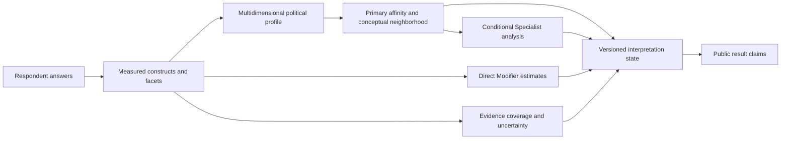

# vNext Result Interpretation and Public Claims Specification — 2026-08

Status: authoritative vNext public-interpretation and claim-language
specification; implementation and public-result promotion remain
version-gated.

Frozen implementation baseline:
<code>f0324dbf27dfc6e35ff557992e4643e3df15ee0e</code>

This specification is cumulative with the frozen Measurement Architecture, the
completed taxonomy Deep Research, the approved Primary, Modifier, Specialist,
Context, construct, item, and [Scoring Architecture
Specification](scoring-architecture-specification-2026-08.md). It defines how
an already-scored result may be interpreted and described to participants,
researchers, documentation readers, API consumers, and people viewing shared
results. It does not silently change the frozen scorer, question bank,
taxonomy, research records, or current UI implementation.

The authoritative flow remains:



The primary output is a measured, layered profile. Named traditions are
secondary, graded profile-similarity interpretations. A Primary is not a
diagnosis, a membership determination, an exclusive identity assignment, or a
probability of belonging. A Modifier is a direct cross-cutting construct view,
not a complete ideology. A Specialist is a conditional product-resolution
surface, not an automatic subtype classification. Context entries are
documentation and research references, not scored results.

No genuine contradiction with the frozen Measurement Architecture was found.
The current implementation contains presentation compatibilities that must be
versioned when corrected:

1. the current AxisBar calls answer-coverage wording “Result confidence”; the
   vNext public contract treats this as a wording defect, not psychometric
   confidence;
2. the current result link serializes answers plus bank/scoring metadata and
   recomputes a result, rather than carrying an immutable result snapshot; the
   vNext contract makes that behavior explicit to prevent stale-result claims;
3. historical research and compatibility objects use names such as
   predictedLabelIds, while the public interpretation contract defines those
   values as ranked affinity/reference-profile IDs unless a later version
   explicitly changes the schema.

These are additive interpretation and implementation boundaries. They do not
authorize a production scorer, taxonomy, question-bank, Specialist roster, or
public-language change without a new versioned decision.

## 1. Executive decisions

### 1.1 Core interpretation rules

1. A result is a multidimensional profile of measured responses, with normative,
   descriptive, and prescriptive layers kept distinct.
2. A Primary neighborhood is a set of nearby versioned reference profiles and
   conceptually related traditions in the declared construct space. It is not a
   social group, a membership category, a latent class, or a claim of personal
   identity.
3. An affinity/similarity value is a bounded closeness statistic calculated by
   the versioned scoring contract over the measured scope. It is not a
   probability, percentage of ideological agreement, confidence level,
   prevalence estimate, or posterior membership probability.
4. Multiple nearby traditions are a normal and interpretable result. Close
   results must be presented as a neighborhood or affinity set, not forced into
   one winner.
5. A displayed Modifier must be supported by direct indicators in its own
   construct contract. Primary proximity, source coverage, a theoretical
   relation, or a respondent’s self-label cannot substitute for missing direct
   evidence.
6. A Specialist result is conditional on assignment, module administration,
   prerequisites, local evidence gates, and the module’s measurement status.
   Assignment is routing, not evidence of the Specialist ideology.
7. Evidence coverage describes which relevant indicators were available and
   answered. It is not reliability, validity, precision, or certainty.
8. Uncertainty must identify its source: coverage, separation, response
   process, layer divergence, parameter, form, or data quality. A single
   undifferentiated “confidence” badge is not authoritative.
9. Abstention is a valid result. If required evidence is absent, the system
   must withhold the named claim rather than infer it from neighboring axes,
   centroids, self-identification, or theoretical coherence.
10. Self-identification is an optional external criterion and interpretation
    outcome. It is not a scoring input and is not treated as ground truth.
11. Shorter quiz depths report the evidence available at that depth. They do
    not inherit full-form validity or automatically become comparable to a
    longer form.
12. Provisional and experimental classifications must be visibly marked on
    every participant-facing surface and must not be phrased as validated
    identity claims.

### 1.2 Decision categories

The following categories remain separate throughout this specification:

| Category                               | Governs                                                                                                   | Does not establish                                                         |
| -------------------------------------- | --------------------------------------------------------------------------------------------------------- | -------------------------------------------------------------------------- |
| Conceptual / political-theory decision | What an ideological object, construct, neighborhood, relation, or label means                             | That respondents understand or express it as intended                      |
| Measurement-design decision            | What evidence, scope, gates, and display conditions a result requires                                     | Reliability, dimensionality, criterion validity, or invariance             |
| Empirical question                     | What must be learned from respondent data, response processes, retests, criteria, or subgroup comparisons | A production change before the preregistered evidence and release decision |
| Implementation decision                | How status, versions, fields, abstention, language, and migration are encoded                             | The substantive validity of the resulting measure                          |

## 2. Interpretation objects and public statuses

Every result-facing object must carry both a conceptual identity and a
measurement/public status. Neither layer may be inferred from the other.

### 2.1 Result objects

| Object                | Conceptual meaning                                                                                                                     | Public interpretation                                                                 |
| --------------------- | -------------------------------------------------------------------------------------------------------------------------------------- | ------------------------------------------------------------------------------------- |
| Profile               | The respondent’s measured positions on declared constructs and facets, with layer and evidence masks                                   | The primary result; describe what was measured and what was not                       |
| Primary configuration | A broad tradition or named configuration represented by a versioned target over a declared construct scope                             | A reference profile with an affinity relation to the respondent profile               |
| Primary neighborhood  | Nearby eligible Primary reference profiles plus explicitly marked conceptual neighbors                                                 | A graded family-resemblance map, not exclusive classification                         |
| Modifier              | A cross-host political characteristic represented by a direct construct and indicator set                                              | An independently measured tendency that may coexist with several Primaries            |
| Specialist            | A narrower subtype, compound, historical-regional, identity-sovereignty, institutional, doctrinal, strategic, or organizational object | A conditional focused comparison whose status depends on local evidence and promotion |
| Context entry         | A tradition, proposal, institution, mechanism, historical reference, or unmeasured candidate retained for intellectual navigation      | Documentation/research context; never silently converted into a score                 |
| Evidence record       | Coverage, missingness, gates, provenance, and uncertainty information                                                                  | Limits what the public claim may say                                                  |

### 2.2 Public result status vocabulary

The authoritative vNext statuses are:

| Status                      | Meaning                                                                                             | Participant-facing consequence                                               |
| --------------------------- | --------------------------------------------------------------------------------------------------- | ---------------------------------------------------------------------------- |
| profile-available           | At least one measured construct/layer is available                                                  | Show the measured profile and its scope                                      |
| profile-only                | A profile is available but no named Primary meets the display rule                                  | Show the profile and explain why no named affinity is shown                  |
| affinity-set                | One or more Primary candidates are eligible, but no exclusive winner is justified                   | Show a ranked or tied neighborhood and margin/uncertainty language           |
| best-supported-affinity     | A later respondent-calibrated rule authorizes a leading affinity with adequate gates and separation | Show the leading reference profile, still with neighbors and caveats         |
| insufficient-evidence       | Required profile or candidate evidence is missing, unmeasured, blocked, or invalid                  | Abstain from the affected named claim; identify the missing evidence         |
| modifier-estimated          | A direct Modifier construct passes its own evidence gates                                           | Show the Modifier as a cross-cutting measured tendency                       |
| modifier-unmeasured         | The Modifier is conceptual or catalogued but direct evidence is absent                              | Do not show it as a respondent estimate                                      |
| specialist-not-administered | No focused module was administered                                                                  | Do not infer a Specialist result from the main quiz                          |
| specialist-insufficient     | A module was administered but lacks required local evidence                                         | Show abstention, not a forced subtype                                        |
| specialist-experimental     | A module and candidate comparison pass current experimental display gates                           | Mark every match experimental/provisional and keep the main result unchanged |
| specialist-validated        | A later release decision has promoted the module and candidate for a defined scope                  | Use only the validated scope and mark its limitations                        |

best-supported-affinity is reserved for a future respondent-calibrated display
rule. The frozen v13 compatibility scorer may rank and display nearest
profiles, but its top-ranked label is not thereby a validated best-supported
classification.

### 2.3 Claim status versus data status

An answer can be present while its interpretation remains uncertain. A source
can be authoritative for a tradition’s history while offering no respondent
measurement evidence. A result can be mathematically reproducible while not
being psychometrically validated. Public rendering must preserve these
distinctions rather than collapsing them into one badge.

## 3. Primary ideological neighborhoods

### 3.1 Definition

A Primary ideological neighborhood is the bounded set of broad traditions and
named configurations that are close to a respondent’s measured profile under a
versioned Primary scope, together with explicitly labeled conceptual neighbors
from the approved polyhierarchical ideology graph.

It has three related but non-identical components:

| Component               | Built from                                                                                                   | What it answers                                              | What it does not answer                                                           |
| ----------------------- | ------------------------------------------------------------------------------------------------------------ | ------------------------------------------------------------ | --------------------------------------------------------------------------------- |
| Scored neighborhood     | Eligible Primary prototype/configuration distances                                                           | Which reference profiles are closest on measured constructs? | Whether the respondent identifies with, belongs to, or fully endorses a tradition |
| Conceptual neighborhood | Approved subtype_of, hybrid_of, overlaps_with, often_combines_with, influenced_by, and other graph relations | Which traditions are historically or theoretically adjacent? | Whether a graph edge predicts respondent similarity                               |
| Evidence neighborhood   | Candidates sharing enough directly measured scope to be interpretable                                        | Which nearby comparisons have adequate evidence?             | That adequate content coverage equals psychometric validity                       |

The public result may combine these only when the source of each relation is
visible. A scored neighbor must be labeled as a scored/reference-profile
comparison; a graph neighbor must be labeled as conceptual or related; an
unmeasured Context entry must not appear in the scored ranking.

### 3.2 Family resemblance

The labels describe graded family resemblance in a declared political
construct space. Family resemblance permits:

- partial overlap on constitutive or discriminating constructs;
- disagreement on other constructs;
- multiple simultaneous affinities;
- cross-layer divergence between normative values, descriptive beliefs, and
  prescriptive strategy;
- a respondent profile that fits no named tradition closely enough for a public
  label;
- a configuration that is personally coherent without being a canonical
  historical membership claim.

Family resemblance must not be translated into “percentage ideology,” “percent
agreement,” “membership probability,” or “how much of an ideology” unless a
future evidence package explicitly defines and validates such an estimand.

### 3.3 Scored versus conceptual adjacency

Conceptual adjacency and numerical proximity answer different questions. Two
traditions can be historical neighbors but distant on the measured axes. Two
traditions can be numerically close because the current scope omits a
discriminating construct while remaining conceptually distinct. The result
must make that distinction explicit:

> “This tradition is nearby in the current measured profile. The catalog also
> identifies related traditions for historical or conceptual reasons. Those are
> different kinds of relationship.”

The system must not use a high fit on a sparse scope to erase a known
constitutive difference. Required gates and evidence masks take precedence over
proximity.

### 3.4 Primary configurations and M0/M1

For a compositionally specific Primary, the public interpretation follows the
approved M0/M1 decision:

- **M0:** interpret the respondent through the broader host Primary plus the
  directly measured relevant Modifier/facets. This is the default when the
  compound has no independently measured residual structure.
- **M1:** interpret the compound as a separately named configuration only when
  its historical, conceptual, morphological, and respondent-measured residual
  structure is established and released under its own version.

A theoretical residual, source-backed definition, synthetic prototype, or
software recovery is not sufficient for M1 public wording. Until the M1 gate is
passed, language must say “the profile overlaps the broader host and related
facets” or “this compound is a conceptual/configuration candidate,” not “you
are [compound].” National Conservatism and Liberal Conservatism remain priority
residual cases, but the same criterion applies to Christian Democracy,
Marxism-Leninism, Social Democracy, Republicanism, and every other applicable
compound.

## 4. Affinity and similarity interpretation

### 4.1 Formal meaning

Let x be the respondent’s measured construct vector, t_p be the
versioned target for Primary p, S_p be its declared scope, and M_p
be the measured/gate-passing mask. The frozen compatibility distance is:

```
d_p(x) = sqrt( sum_{j in S_p and M_p(j)=1} w_j * (x_j - t_pj)^2
                / sum_{j in S_p and M_p(j)=1} w_j )
fit_p = clamp(1 - d_p(x) / 2, 0, 1)
```

The exact weighting, scope, gates, evidence heuristics, and version tuple are
defined in the Scoring Architecture. The public meaning is:

> fit_p is a bounded similarity value for the respondent’s measured answers
> and the current reference profile for p, over the evidence that passed that
> comparison’s gates.

It is not:

- a probability that the respondent belongs to p;
- a percentage of the respondent’s identity;
- a percentage of agreement with every proposition associated with p;
- a confidence interval or standard error;
- a prevalence or population estimate;
- an empirical claim that the target profile is the true profile of all
  adherents;
- evidence that the respondent endorses unmeasured doctrine;
- a psychometric validity coefficient.

### 4.2 Display precision

The participant-facing result should prefer qualitative bands such as “very
close axis profile,” “close axis profile,” “some axis overlap,” and “limited
axis overlap” under the current compatibility language. Numeric fit may be
available in research or an expanded inspector only when accompanied by its
formula, scope, version, evidence mask, and a statement that it is similarity,
not probability.

Numeric precision must not imply precision that has not been estimated. A
future respondent-calibrated display may determine meaningful rounding, but
the current prototype must not display more precision merely because the
implementation stores more decimals.

### 4.3 Rank and margin

Rank means ordered closeness among the eligible reference profiles in this
version and scope. It does not mean that the first label is the only plausible
tradition or that the rank is invariant across forms, populations, languages,
wording, or future versions.

The nearest-neighbor margin is the difference between the leading candidate and
the next eligible candidate under the same scope and evidence rules. It is a
separation indicator, not a correctness score. Small margins must raise
separation uncertainty and trigger neighborhood language.

The display must preserve at least these states:

| Margin/evidence state                             | Interpretation                                                        | Required wording                                                                                         |
| ------------------------------------------------- | --------------------------------------------------------------------- | -------------------------------------------------------------------------------------------------------- |
| Adequate evidence, small margin                   | Several reference profiles are similarly close                        | “Several traditions are similarly close on the constructs measured.”                                     |
| Adequate evidence, larger margin but uncalibrated | One profile is nearest in this version, without validated exclusivity | “This is the nearest reference profile in this comparison; nearby alternatives are also shown.”          |
| Sparse evidence, any margin                       | The apparent ordering may depend on missing scope                     | “The comparison is limited because some required constructs were not measured.”                          |
| Gate failure, any numerical proximity             | The candidate is not interpretable under its declared definition      | “No named affinity is shown for this comparison because required evidence was missing or contradictory.” |

### 4.4 Close results and ties

The public system must not manufacture a winner by arbitrary list order when
results are within the versioned tie/margin tolerance. If the scorer has a
deterministic order for reproducibility, that order is not substantive evidence
and must not be described as a meaningful distinction.

When results are close:

1. show the shared measured directions that make the candidates nearby;
2. show the largest measured differences or omitted discriminating constructs;
3. identify each candidate’s conceptual relation if one exists;
4. state that the current evidence does not separate them decisively;
5. preserve the possibility of a mixed or personally adapted configuration;
6. do not average labels into a new ideology or imply equal endorsement of all
   nearby traditions.

### 4.5 Why a label is nearby

The “Why is this nearby?” explanation must be directional and scope-specific.
It may say:

- which measured constructs point in a similar direction;
- which measured constructs diverge;
- how many relevant constructs were measured;
- which layers are close, mixed, or different;
- which required construct was unavailable or failed a gate.

It must not say that the respondent “shares the ideology” unless an approved
criterion claim authorizes that statement. It must not use a source describing a
tradition as proof that the respondent holds it.

## 5. Multiple traditions, layers, and divergences

### 5.1 Multiple affinities are expected

The instrument is designed to represent configurations over constructs rather
than force one-dimensional placement. A respondent can therefore be close to
several Primaries for different substantive reasons. The UI should present:

- a short neighborhood preview, normally the top five eligible comparisons;
- the leading affinity only as “nearest” or “most similar in this comparison”
  until a calibrated exclusive-display rule exists;
- a visible margin/separation note when candidates are close;
- relevant Modifier estimates separately;
- conceptual and historical neighbors as separate from scored matches.

The list is not a ballot, diagnosis, or ranking of political worth.

### 5.2 Layer-specific interpretation

Normative, descriptive, and prescriptive scores are distinct. A respondent may
be close to one tradition on normative values and another on prescriptive
strategy. The result must not conceal this by producing one label that appears
to summarize all layers equally.

Approved language:

> “Your profile is mixed across layers: your measured values are nearer to one
> set of reference profiles, while your beliefs about institutions or preferred
> strategies are nearer to another.”

Disallowed language:

> “You are internally inconsistent,” “your true ideology is,” or “the label
> overrides the layer scores.”

Layer divergence is descriptive. It is not a moral evaluation and does not by
itself indicate response error.

### 5.3 Ideal and non-ideal differences

When the result shows ideal and current-condition/non-ideal divergences, it may
describe a difference between the respondent’s preferred ordering and their
strategy under constraints. It must not infer hypocrisy, bad faith, or a stable
ideological subtype from that gap.

## 6. Modifier interpretation

### 6.1 Meaning of a Modifier

A Modifier is a cross-cutting construct that can occur across multiple Primary
hosts. Its public meaning is limited to the directly measured domain and facet
scope. It may represent a disposition, strategy, identity boundary,
institutional preference, economic orientation, cultural orientation, national
orientation, organizational principle, or another approved political facet.

The result must identify the Modifier’s conceptual kind and avoid presenting it
as a complete tradition. A Modifier can coexist with several Primaries, and the
same Modifier level can be reached through different ideological configurations.

### 6.2 Direct evidence rule

The ordinary Modifier display is allowed only if:

1. the Modifier is in the versioned direct-scored roster;
2. its declared indicator set contains enough valid substantive responses;
3. required facets and constitutive gates are satisfied;
4. uncertainty is not above the public display threshold;
5. the result exposes the direct coverage and the relevant construct scope.

The following cannot create a Modifier estimate:

- a nearby Primary label;
- a related Specialist result;
- a self-reported ideology;
- a source-backed label description;
- an unmeasured numeric placeholder;
- a score on a neighboring but contaminated construct.

### 6.3 Modifier wording

Preferred:

> “Measured cross-cutting orientation: [Modifier]. This estimate uses direct
> indicators of [construct/facets]. It can coexist with several Primary
> affinities.”

If evidence is limited:

> “[Modifier] is conceptually relevant, but this quiz did not collect enough
> direct evidence to show a respondent estimate.”

Avoid:

- “[Modifier] is your ideology”;
- “[Primary] plus [Modifier] proves [compound tradition]”;
- “you are X because you scored near X’s host”;
- “unmeasured” presented as a midpoint or neutral position.

### 6.4 Modifier combinations

Two or more Modifier estimates may be shown together, but their conjunction is
not automatically a named ideology. A compound Modifier display requires an
explicit configuration definition, direct evidence for each constitutive
facet, a compositional-residual decision, and a separate respondent-validation
gate. Otherwise use additive language: “The profile shows measured signals on
X and Y,” not “this proves Z.”

## 7. Specialist interpretation

### 7.1 Product-resolution role

Specialist is a public product-resolution role layered over a more precise
conceptual ontology. Underlying Specialist objects may be subtypes, compound
traditions, historical-regional variants, identity-sovereignty traditions,
institutional forms, economic-doctrinal traditions, strategic-organizational
forms, or other declared specialistKind values.

The public role does not determine the object’s conceptual kind. A historically
important broad tradition may remain a Specialist in the product because the
ordinary quiz does not measure its defining distinctions. Conversely, a
conceptual subtype may remain unmeasured or Context-only.

### 7.2 Eligibility and assignment

Specialist assignment, module availability, and candidate eligibility are
separate states:

| State                      | Meaning                                                                  | Public interpretation                              |
| -------------------------- | ------------------------------------------------------------------------ | -------------------------------------------------- |
| Not assigned               | No module was routed to the respondent                                   | No Specialist claim; do not infer from the Primary |
| Assigned, not administered | A module was available or selected but no answers were recorded          | No Specialist estimate                             |
| Administered, insufficient | Some module answers exist but local prerequisites or evidence gates fail | Abstain; show missing prerequisites                |
| Administered, blocked      | A constitutive contradiction or required construct prevents comparison   | Abstain; do not show a forced subtype              |
| Experimental candidate     | Current local fit/evidence threshold is met                              | Show provisional/experimental comparison only      |
| Validated Specialist       | A later scoped release decision has promoted the module/candidate        | Use the validated scope and mark its limitations   |

The deterministic assignment strategy, including balanced-hash-v2, is a
routing procedure. It is not evidence that a respondent belongs to a family.

### 7.3 Specialist public result

Until a module is explicitly promoted, the participant-facing heading must
identify it as a focused experiment or provisional comparison. The main result
must remain unchanged. The result must say that “sufficient evidence” means
enough mapped module constructs for the current display threshold, not
reliability, validity, representativeness, or identity evidence.

Specialist sources may establish historical meaning, boundaries, and internal
debates. They do not validate the module’s numeric comparison or the
respondent’s identity.

### 7.4 Specialist abstention

When a Specialist prerequisite is absent, the public result should explain the
missing construct at the appropriate level:

> “This focused comparison was not shown because the module did not collect
> enough direct evidence about [required distinction]. The main result is
> unchanged.”

It must not say:

> “You are probably not [Specialist]” or “the general quiz ruled it out.”

Absence of measurement is not evidence of absence of an ideology.

## 8. Evidence coverage, uncertainty, and abstention

### 8.1 Evidence coverage

Evidence coverage is a record of measurement opportunity and response
availability. It may include:

- number of relevant indicators presented;
- number answered with valid substantive content;
- weighted answered coverage;
- construct/facet measured masks;
- required versus optional scope;
- missingness type;
- module and depth;
- gate status.

Coverage may be described as broad, moderate, limited, or too little under the
current compatibility bands. Those labels are descriptive heuristics. They do
not mean high/medium/low reliability.

“Answered” also does not mean “understood,” “discriminating,” or “valid.” Those
require respondent evidence.

### 8.2 Missingness and refusal

The following states remain distinct in interpretation:

| State                 | Public meaning                                                             | Required handling                                                                     |
| --------------------- | -------------------------------------------------------------------------- | ------------------------------------------------------------------------------------- |
| Valid response        | A substantive answer was coded under the current item contract             | Contributes to the declared construct estimate                                        |
| dont_know             | The respondent did not claim knowledge of a descriptive proposition        | No descriptive point contribution; report uncertainty when material                   |
| Refusal               | The respondent chose not to provide a political answer                     | No point contribution; do not convert to neutrality                                   |
| not_presented         | The item was absent from the selected depth/form/module                    | Structural missingness; do not treat as respondent refusal                            |
| salience_skipped      | A substantive answer was given but requested salience evidence was omitted | Preserve the answer-state semantics and current scorer behavior; disclose if material |
| Invalid/contradictory | The record fails response or gate validation                               | Exclude from the affected estimate and record the reason                              |

No missingness state may be silently imputed from neighboring constructs or
label prototypes in a public result.

### 8.3 Separate uncertainty sources

The interpretation layer must distinguish:

- **coverage uncertainty:** required indicators were not answered or not
  presented;
- **separation uncertainty:** the leading affinity is close to a neighbor;
- **response-process uncertainty:** confidence/priority, salience omission,
  acquiescence, or other response-process flags may affect interpretation;
- **layer uncertainty:** normative, descriptive, and prescriptive profiles do
  not point in the same direction;
- **parameter uncertainty:** estimated weights, prototypes, covariances, or
  thresholds are not known precisely;
- **form uncertainty:** depth or module assignment changes the available scope;
- **data-quality uncertainty:** invalid, inconsistent, duplicate, or otherwise
  questionable records.

The current scorer exposes heuristic uncertainty bands. They are display states,
not standard errors, confidence intervals, reliability coefficients, or
probabilities. A future validated score may add standard errors or intervals,
but must not relabel the current bands retroactively.

### 8.4 Abstention hierarchy

Abstention occurs at the narrowest affected level where possible:

1. a missing item does not erase the whole profile if other constructs remain
   measured;
2. an unmeasured facet is not displayed as neutral;
3. a missing required Primary construct suppresses that Primary comparison;
4. a missing direct Modifier indicator set suppresses that Modifier estimate;
5. a missing Specialist prerequisite suppresses the Specialist candidate;
6. if no named candidate remains interpretable, show profile-only or
   insufficient-evidence rather than invent a label.

Abstention text must identify whether the reason is “not measured,” “not enough
answers,” “blocked by a required distinction,” “not administered,” or “not
validated for this public result.” These reasons should not be conflated.

### 8.5 Coverage is not confidence

The current coverageLabel language is retained as a compatibility rendering,
but the authoritative vNext term is “answer coverage” or “evidence coverage.”
The current AxisBar phrase “Result confidence” must be treated as a
presentation migration item. It must not be cited in documentation as proof of
psychometric confidence, and a future presentation version should replace it
with “Answer coverage” or the more specific uncertainty source.

## 9. Self-identification and measured results

### 9.1 Role of self-identification

Self-identification is an optional post-questionnaire, pre-result criterion. It
can measure:

- whether respondents recognize or accept a label;
- how the measured profile relates to a respondent’s own description;
- criterion alignment under a defined exposure condition;
- label comprehension, identity acceptance, and follow-up stability.

It cannot be treated as an independent baseline when the questionnaire or
presented labels may influence the answer. The existing project rule remains:
self-identification is a criterion, not a scoring input.

### 9.2 Public interpretation

Participant-facing results must not say that the score corrected, disproved, or
revealed the respondent’s “true” identity. Use:

> “Your self-description and your measured profile are separate pieces of
> information. They may align, differ, or cover different aspects of your
> political identity.”

If the participant supplies a self-label, it must not be displayed as a
validation badge. A mismatch may reflect label familiarity, identity context,
multidimensional commitments, measurement scope, wording, or genuine
disagreement; it is not automatically respondent error.

### 9.3 Criterion claims

Self-identification can support a criterion-calibration claim only after:

1. timing and label exposure are recorded;
2. the criterion is not fed into scoring;
3. the criterion definition and missingness rules are preregistered;
4. the validation sample and target scope are stated;
5. performance is reported with uncertainty and held-out evaluation;
6. label recognition and identity acceptance are not treated as the same
   outcome;
7. criterion performance is not generalized across populations, languages, or
   historical periods without new evidence.

Current public results do not meet this release gate.

## 10. Quiz depths and form comparability

### 10.1 Depth meaning

A quiz depth is a form-specific evidence opportunity. A shorter form may still
provide a useful partial profile, but it measures fewer constructs/facets and
has different abstention and uncertainty behavior. Depth names are not quality
ratings.

Participant-facing language should say:

> “This result uses the questions included in the [depth] form. Some
> constructs required for narrower comparisons were not presented.”

It should not say:

- “the short form is 80% as accurate”;
- “the longer form reveals your true ideology”;
- “all depth results are interchangeable”;
- “the missing questions were neutral.”

### 10.2 Cross-depth comparison

Results from different depths are not directly comparable unless an approved
linking design demonstrates comparable construct meaning, score scale,
uncertainty, and display behavior. Item counts alone cannot establish
equivalence.

Every shared result and export must carry form/depth ID, presented item IDs,
question-bank version, and scoring version. A result comparison must warn when
profiles were produced under different forms or versions.

### 10.3 Depth-specific display

For a short form:

1. show the profile dimensions actually measured;
2. show unmeasured dimensions as unmeasured or unavailable;
3. apply the same constitutive gates, not a lower standard hidden from the
   participant;
4. suppress labels requiring absent core constructs;
5. avoid calling a sparse result “low confidence” when the source is structural
   form omission;
6. do not imply that a longer form would necessarily change the respondent’s
   politics—only that it would provide more measurement evidence.

## 11. Provisional, experimental, and validated classifications

### 11.1 Status is always visible

Every label surface must expose the status that governs the displayed claim:

| Status                     | Allowed participant wording                                         | Disallowed wording                                           |
| -------------------------- | ------------------------------------------------------------------- | ------------------------------------------------------------ |
| Core Primary compatibility | “Primary reference profile,” “nearest measured profile,” “affinity” | “validated identity,” “you are”                              |
| Direct Modifier            | “measured cross-cutting orientation”                                | “complete ideology,” “proof of compound tradition”           |
| Catalog-only/context       | “related tradition,” “context entry,” “not currently measured here” | “your result,” “unscored result” implying hidden measurement |
| Provisional Specialist     | “provisional specialist comparison”                                 | “confirmed subtype,” “validated match”                       |
| Experimental Specialist    | “experimental follow-up comparison”                                 | “authoritative classification”                               |
| Validated Specialist       | “validated for [declared scope]”                                    | unscoped universal identity claim                            |

### 11.2 Experimental result contract

An experimental result must show:

- the module name and module version;
- assignment/administration status;
- defining constructs and local evidence coverage;
- candidate fit as an experimental comparison;
- gates, abstention, and uncertainty;
- the statement “main result unchanged” where applicable;
- the population/form limitations of the research evidence;
- a source note distinguishing tradition interpretation from measurement
  validation.

The current Specialist UI’s “COMMUNITY INPUT / EXPERIMENT,” “MAIN RESULT
UNCHANGED,” “experimental follow-up result,” and explicit non-reliability
language are compatible with this contract and should be preserved or made more
precise in future presentation versions.

### 11.3 Promotion

No label moves from provisional or experimental to validated merely because:

- a module can be assigned;
- participants complete the module;
- a synthetic prototype is recovered;
- code tests pass;
- experts agree on a definition;
- sources are available;
- a self-label matches in the same data used to tune the result.

Promotion requires the evidence package in Section 16 and a new versioned
decision.

## 12. Evidence-dependent public claim tiers

### 12.1 General rule

Every outward claim has a minimum evidence tier. A claim may be published only
if the relevant tier is supported for the exact construct, label, form,
population, language, and version being described. The presence of a higher
tier for one construct does not promote unrelated constructs or labels.

The tiers are cumulative in spirit but not mechanically interchangeable. For
example, a construct can have a reliability estimate without having established
cross-cultural invariance; a criterion correlation does not by itself establish
dimensionality.

### 12.2 Claim-tier table

| Tier | Name                                          | Minimum evidence                                                                                                                                                   | Claims it can support                                                                                                                                      | Claims it cannot support                                                                                  |
| ---- | --------------------------------------------- | ------------------------------------------------------------------------------------------------------------------------------------------------------------------ | ---------------------------------------------------------------------------------------------------------------------------------------------------------- | --------------------------------------------------------------------------------------------------------- |
| PC0  | Integrity and provenance                      | Frozen/versioned implementation, deterministic calculations, response-state traceability, source scope, reproducible serialization                                 | “This result used version X”; “this item maps to construct Y”; “this label is a reference profile”; coverage/missingness facts                             | Respondent reliability, validity, identity, population, or fairness claims                                |
| PC1  | Content-referenced profile description        | Approved conceptual definitions, item/construct review, wording and direction review, cognitive evidence where required, explicit measured mask                    | “Your answers lean toward this pole on the measured construct”; “these reference profiles are nearest in the declared scope”; qualitative layer divergence | “The construct is psychometrically unidimensional”; “the label is accurate or validated for you”          |
| PC2  | Reliability and precision                     | Respondent-based internal consistency/local dependence analysis, test information or equivalent precision analysis, appropriate uncertainty estimates, replication | Scoped reliability/precision statements for the tested form and population                                                                                 | Dimensionality, criterion validity, subgroup equivalence, identity, or general population claims          |
| PC3  | Dimensionality and construct validity         | Respondent-based dimensionality analysis, convergent/discriminant/content/response-process evidence, held-out confirmation, cross-loading review                   | Claims that a construct/facet measures the declared conceptual distinction in a defined scope; validated separation from named neighbors where tested      | Self-ID agreement, temporal stability, fairness, or cross-cultural generalization                         |
| PC4  | Criterion and self-identification calibration | Independent, preregistered criterion; timing/exposure control; held-out evaluation; calibration and uncertainty; criterion interpretation                          | Scoped association/calibration with self-description, external scale, behavior, forecast, expert code, or other declared criterion                         | Truth of identity, causal claims, universal classification, or validity outside the criterion scope       |
| PC5  | Test-retest stability                         | Repeated administration with defined interval, form/wording controls, attrition/missingness analysis, respondent-based stability estimates                         | Scoped stability language such as “tends to be stable over [interval] in [sample]”                                                                         | Reliability in general, construct validity, fairness, or cross-time invariance beyond the tested interval |
| PC6  | DIF and measurement invariance                | Adequate subgroup samples, preregistered DIF/invariance plan, item/construct effects, partial-invariance handling, fairness review                                 | Comparability claims across tested groups/languages/forms, with limitations                                                                                | Global fairness, absence of all bias, or generalization to untested groups                                |
| PC7  | Cross-cultural and temporal transport         | Linked translations/forms, cultural adaptation and cognitive evidence, invariance, replication across locations and periods, scope-specific criterion review       | Claims that a construct or interpretation transports across the named cultures, languages, or time periods                                                 | Universal human classification, timeless ideology identity, or unbounded population prevalence            |

### 12.3 Current release ceiling

The current public compatibility release may make PC0 claims and carefully
qualified PC1 profile-similarity descriptions. It may describe the content and
mathematical operation of the scorer. It may not use “reliable,” “valid,”
“accurate,” “calibrated,” “objective,” “probability,” “diagnostic,” or
“validated identity” as claims about respondent measurement.

Current source coverage and expert review support content traceability and
interpretation of traditions. They do not promote a label or construct beyond
the respondent-evidence tier actually established.

### 12.4 Claim gate algorithm

```
authorizeClaim(claim, object, result, evidence):
  assert claim.scope == object.scope == result.version.scope
  assert claim.presentationVersion is recorded
  requiredTier = claim.minimumPublicClaimTier
  if evidence.supportedTier(object, result.form, result.population,
                            result.language) < requiredTier:
    return held(claim, reason="evidence tier not established")
  if result.gates.fail or result.requiredEvidence.missing:
    return abstain(claim, reason=result.gateOrEvidenceReason)
  if claim.isExclusive and not evidence.supportsExclusiveDisplay:
    return held(claim, reason="exclusive display not calibrated")
  return authorized(claim, scope=result.scope, caveats=evidence.limitations)
```

The supportedTier function is an evidence registry, not a judgment inferred
from item counts or tests. A new claim tier requires a decision-log entry,
version bump, and validation report.

## 13. Current public claims inventory

### 13.1 Claims that may be made now

Subject to the result’s gates, evidence mask, and version tuple, current public
surfaces may say:

| Area             | Allowed current claim                                                                               |
| ---------------- | --------------------------------------------------------------------------------------------------- |
| Profile          | “This is a multidimensional profile of the political constructs measured by your answers.”          |
| Axis direction   | “Your measured answers lean toward [pole] on [construct].”                                          |
| Layer            | “Your normative/descriptive/prescriptive answers show [position] on the measured scope.”            |
| Primary          | “[Label] is a nearby/nearest reference profile in this versioned comparison.”                       |
| Multiple results | “Several traditions are similarly close on the constructs measured.”                                |
| Similarity       | “This comparison shows axis overlap/proximity; it is not a probability or identity assignment.”     |
| Modifier         | “[Modifier] is a measured cross-cutting orientation supported by direct indicators.”                |
| Coverage         | “Broad/moderate/limited/too little answer coverage.”                                                |
| Uncertainty      | “The comparison is tentative because [coverage/separation/form/etc.].”                              |
| Abstention       | “No named result is shown because the required evidence was not measured or did not pass the gate.” |
| Specialist       | “This is an experimental/provisional focused comparison; it does not change the main result.”       |
| Context          | “This is a related tradition or context entry, not a scored result.”                                |
| Self-description | “Your self-description is separate research information and is not used to calculate this result.”  |

### 13.2 Claims held for evidence

The following require the indicated evidence tier or higher:

| Held claim                                                      | Minimum tier                                                                                                                                               |
| --------------------------------------------------------------- | ---------------------------------------------------------------------------------------------------------------------------------------------------------- |
| “This scale is reliable” or “the result is precise”             | PC2                                                                                                                                                        |
| “This is a valid measure of [construct]”                        | PC3                                                                                                                                                        |
| “This label predicts/recovers self-identification”              | PC4                                                                                                                                                        |
| “This result is stable over time”                               | PC5                                                                                                                                                        |
| “Scores are comparable/fair across [group/language]”            | PC6                                                                                                                                                        |
| “This interpretation applies across countries/cultures/periods” | PC7                                                                                                                                                        |
| “You are [ideology]” or “you belong to [tradition]”             | No default public tier; requires an explicit identity estimand, evidence, consent, and release decision, and remains prohibited as ordinary result wording |
| “There is a [x]% chance you are [ideology]”                     | No current public authorization; requires a new probabilistic estimand and calibration release                                                             |
| “Most people with this profile are [ideology]”                  | Population/criterion evidence beyond current public contract                                                                                               |

### 13.3 Source claims versus measurement claims

For every label or construct, documentation should distinguish:

1. what scholarship or primary sources say about the tradition;
2. how the project operationalizes that tradition or construct;
3. what the respondent answered and what was measured;
4. what empirical evidence supports the interpretation;
5. what remains theoretical, provisional, or unmeasured.

A source note may support a definition, boundary, historical relationship, or
layer interpretation. It must never be written as if it validates a numeric
centroid, respondent identity, psychometric property, or universal claim about
adherents.

## 14. Participant-facing terminology rules

### 14.1 Preferred vocabulary

Use the following terms consistently:

| Term                                | Meaning in the product                                                                |
| ----------------------------------- | ------------------------------------------------------------------------------------- |
| Measured profile                    | The construct/facet pattern estimated from valid responses                            |
| Reference profile                   | A versioned ideological target used for comparison                                    |
| Affinity                            | A graded closeness relation to a reference profile                                    |
| Similarity/proximity                | The mathematical comparison, not a membership probability                             |
| Neighborhood                        | Several nearby reference profiles and/or clearly marked conceptual neighbors          |
| Construct/facet                     | A declared political dimension or subdimension                                        |
| Cross-cutting orientation           | A direct Modifier construct that can occur across hosts                               |
| Answer/evidence coverage            | The amount of relevant response evidence available                                    |
| Unmeasured                          | No valid direct evidence was available for the construct or comparison                |
| Tentative/limited comparison        | A qualitative display of uncertainty source, not reliability                          |
| Conditional follow-up               | A Specialist module whose availability or assignment is separate from the main result |
| Experimental/provisional comparison | A Specialist or configuration result not yet promoted to validated public use         |
| Abstain/no named result             | The system intentionally withholds a label because evidence is insufficient           |

### 14.2 Terms to avoid in ordinary public results

Do not use:

- “you are [ideology]”;
- “you belong to [tradition]”;
- “true ideology,” “real identity,” or “objective identity”;
- “diagnosis,” “political diagnosis,” or “ideology test result” as a clinical-
  sounding determination;
- “confidence” for answer coverage or heuristic fit uncertainty;
- “reliable,” “valid,” “accurate,” or “validated” without the authorized claim
  tier and scope;
- “probability,” “posterior,” “chance,” or “percentage match”;
- “pure,” “authentic,” or “most genuine” tradition;
- “left/right” as a complete summary when the underlying construct is
  narrower or multidimensional;
- “unmeasured” rendered as “neutral,” “moderate,” or “centrist”;
- “sufficient evidence” without explaining that it is a display gate and not a
  psychometric finding;
- “the score disproves your self-identification.”

### 14.3 Participant comprehension rule

Any result card that uses a named ideological label must answer, in close
proximity:

1. What is being compared?
2. Which constructs were measured?
3. How much relevant evidence was available?
4. Is this a Primary, Modifier, Specialist, or Context object?
5. Is it experimental, provisional, or validated for this scope?
6. What should the participant not infer?

The explanation may be collapsed behind an accessible disclosure, but it may
not be omitted from the result product altogether.

## 15. Reusable language by surface

The following templates are normative defaults. A versioned presentation may
shorten them for space, but it must preserve their meaning.

### 15.1 Results UI

**Opening result explanation**

> Your result is a multidimensional profile of the values, beliefs, and
> strategies expressed in your answers. Ideological names are reference
> profiles that help describe nearby construct patterns; they do not identify
> you or establish your political identity.

**Primary neighborhood**

> These are the closest eligible reference profiles in the constructs measured
> by this version of the quiz. Several can be nearby at once, and proximity can
> coexist with important disagreements.

**Nearest profile**

> [Label] is the nearest reference profile in this comparison. This is a
> similarity result, not a probability of belonging or an exclusive identity
> assignment.

**Close results**

> Several traditions are similarly close on the constructs measured. The
> current result does not support one exclusive label; open each comparison to
> see the shared directions and differences.

**Layer divergence**

> Your values, beliefs about how politics works, and preferred strategies do
> not all point to the same neighborhood. The result keeps those layers
> separate rather than forcing one label to summarize them.

**Modifier**

> This is a measured cross-cutting orientation supported by direct indicators.
> It can coexist with several Primary affinities and is not a complete
> ideology label.

**Coverage**

> Answer coverage: [broad/moderate/limited/too little]. This describes how much
> relevant evidence was available; it is not a reliability or correctness
> score.

**Uncertainty**

**Template:** This comparison is [tentative/limited] because [the required
constructs were only partly measured / nearby labels are similarly close / this
form omitted relevant questions / response evidence is incomplete].

**Abstention**

> No named result is shown for this comparison because the required evidence
> was not measured or did not pass the comparison gate. The absence of a label
> is not a claim that the tradition does not describe you.

**Specialist**

> Experimental focused comparison. This module explores narrower distinctions
> and does not change your main result. Any match shown is provisional and is
> not an authoritative identity claim.

**Context**

> Related tradition/context. This entry is included for political and
> historical reference and is not currently measured as an ordinary result.

**Self-description**

> Your self-description is optional research information. It is kept separate
> from the scoring calculation and may align with, differ from, or describe a
> broader identity than this measured profile.

### 15.2 Methodology pages

> The scorer estimates a multidimensional profile from the constructs and
> facets directly measured by the selected form. Named traditions are compared
> through versioned reference profiles over declared scopes. A similarity value
> indicates closeness in that measured space; it is not a probability,
> percentage match, diagnosis, or validated identity estimate.

> Answer coverage records which relevant indicators were available and
> answered. It does not establish reliability, validity, precision, or
> certainty. Reliability, dimensionality, criterion validity, test-retest
> stability, subgroup invariance, and cross-cultural transport require separate
> respondent-based evidence.

> When required evidence is missing, the system abstains rather than filling
> the gap from a neighboring construct or label prototype. A Specialist
> follow-up is conditional and experimental until a separately versioned
> validation decision promotes it.

### 15.3 General documentation

Documentation should use a four-sentence pattern:

**Template:** **Concept:** [What the tradition or construct means in political
theory and history.] **Operationalization:** [Which constructs/facets and layers
this version uses.] **Interpretation:** [What an affinity or score means in that
scope.] **Limit:** [What is not measured or validated yet.]

For a compound label, add:

**Residual status:** [Whether the compound has independent residual structure
beyond its broader host, and whether that residual is currently measured and
validated.]

For a Context entry, add:

> **Role:** This entry is retained for historical, conceptual, institutional,
> or research reference and is not a respondent-scored endpoint in this version.

### 15.4 Shared results

Shared-result pages must display:

- “shared profile” or “shared comparison,” not “shared identity”;
- question-bank, form/depth, taxonomy, scoring, and presentation versions;
- whether the page is recomputed from encoded answers or is an immutable
  snapshot;
- answer/evidence coverage and any abstention;
- the same Primary/Modifier/Specialist status markers as the original result;
- a warning when a comparison uses different versions or depths.

For the current share contract, the required wording is:

> This link contains encoded answers and version metadata. The profile is
> recomputed only when those versions are compatible; it is not a permanent
> snapshot of a past interpretation. Labels describe similarity to the
> measured profile and do not establish political identity.

The page must not imply that the link proves the person currently holds the
displayed labels, especially if a future scorer could produce a different
result from the same historical answers.

### 15.5 Research materials

Research materials must distinguish:

- the production prediction/reference-profile comparison;
- the presentation/exposure condition;
- the participant’s self-identification or other criterion;
- the research estimand;
- the evidence tier being evaluated;
- the population and form scope;
- the exploratory/challenger status of any model.

The named-label exposure explanation remains:

> These ideological names describe similarity to your measured political
> profile; they do not identify you or establish your ideological identity.

Research records must not use a label shown to a participant as an independent
criterion without recording exposure timing and arm. A self-label collected
after the questionnaire remains a criterion and not a scoring input.

### 15.6 Exports and API surfaces

Machine-readable outputs must expose interpretation status, not only a numeric
fit. The vNext contract should include fields equivalent to:

```
resultInterpretationVersion
claimTierCeiling
publicStatus
profileScope
formDepth
primaryAffinities[] {
  labelId
  conceptualKind
  productRole
  rank
  similarity
  distance
  neighborMargin
  evidenceCoverage
  measuredConstructIds
  missingConstructIds
  gateStatus
  uncertaintySources[]
  publicClaimStatus
}
modifiers[] {
  labelId
  constructId
  directIndicatorCoverage
  evidenceStatus
  uncertaintySources[]
  publicClaimStatus
}
specialist {
  assignmentStatus
  moduleId
  moduleVersion
  administrationStatus
  prerequisites[]
  publicStatus
  candidates[]
}
abstentions[] { objectId, level, reason, missingEvidence }
versions { bank, form, taxonomy, construct, scoring, calibration,
           specialist, presentation, responseCoding }
```

Legacy fields such as predictedLabelIds may be preserved for compatibility,
but their documentation must say “ranked affinity/reference-profile IDs” and
must not imply identity prediction. A new API version should prefer
primaryAffinities or an equivalent explicit name.

Numeric fields must be labeled similarity, fit, or distance according to the
scoring specification. The field confidence must not be used for answer
coverage or heuristic uncertainty. If a legacy field cannot be renamed, its
schema must carry a deprecation/semantic note and a presentation version.

Exports must not omit the evidence mask, abstention reason, status, or version
tuple merely because a consumer wants a compact label list.

## 16. Validation and promotion requirements

The staged respondent program, evidence-card schema, challenger analyses, and
promotion states are governed by the
[Empirical Validation Architecture](empirical-validation-architecture-2026-08.md).
This specification defines the public claim consequence of that evidence; it
does not treat a planned or schema-valid analysis as validation.

### 16.1 Interpretation-language validation

Before a new public presentation version, collect respondent evidence for:

- comprehension of “reference profile,” “affinity,” “neighborhood,” and
  “coverage”;
- whether participants incorrectly read a label as identity assignment;
- whether “experimental,” “provisional,” and “not measured” are understood;
- whether participants understand close results and abstention;
- whether layer-specific and Modifier explanations reduce rather than increase
  construct contamination;
- whether shared results are mistaken for immutable or current identity claims;
- whether labels change self-identification or criterion responses through
  exposure;
- accessibility and plain-language comprehension across target groups.

### 16.2 Measurement evidence gates

Interpretation wording must not outrun the measurement object’s evidence:

1. content and historical descriptions require source and expert review;
2. item and label explanations require cognitive/response-process review where
   ambiguity or specialized knowledge is plausible;
3. construct claims require dimensionality and construct-validity evidence;
4. reliability/precision language requires respondent-based reliability or
   information evidence;
5. self-identification/criterion language requires independent, held-out
   criterion calibration;
6. stability language requires test-retest evidence;
7. subgroup and language comparisons require DIF/invariance evidence;
8. cross-cultural or temporal language requires linked-scope validation;
9. exclusive Primary, M1, Modifier-combination, and Specialist display requires
   incremental discrimination and display-value evidence;
10. every promoted claim requires replication and a versioned release record.

### 16.3 No shortcut evidence

The following may establish implementation or content traceability only:

- synthetic respondent generation;
- centroid recovery;
- prototype/configuration reconstruction;
- unit/integration/browser/software tests;
- theoretical coherence;
- source counts or citation presence;
- expert agreement without respondent response-process evidence;
- a close match to a post-questionnaire self-label in the same tuned sample.

They cannot establish psychometric validity, identity classification accuracy,
reliability, test-retest stability, DIF/invariance, or cross-cultural transport.

## 17. Production, research, and challenger separation

The following objects must remain separate:

| Object                                           | Public interpretation                                         | Research role                                                          |
| ------------------------------------------------ | ------------------------------------------------------------- | ---------------------------------------------------------------------- |
| Theory-led construct model                       | Defines meaning and expected relationships                    | Tests conceptual adequacy against respondent data                      |
| Frozen production prototype/configuration scorer | Produces bounded similarity and gate states                   | Compatibility baseline and comparator                                  |
| Respondent-calibrated construct model            | May support stronger construct/precision claims after release | Confirmatory candidate                                                 |
| LCA/LPA/person-centered profiles                 | Never silently renamed into canonical ideologies              | Exploratory challenger and possible descriptive profile layer          |
| Criterion/self-ID model                          | Not a scoring input                                           | Calibration and interpretation study                                   |
| Presentation/exposure model                      | Does not change substantive profile                           | Studies label interpretation, identity acceptance, and display effects |

No challenger model may silently replace the theory-led taxonomy, change a
public label’s meaning, or be reported as an identity classifier before a new
decision and evidence package.

## 18. Versioning and migration

### 18.1 Interpretation version tuple

Every public claim must be reproducible from:

```
{
  questionBankVersion,
  formOrDepthVersion,
  responseCodingVersion,
  constructOntologyVersion,
  taxonomyVersion,
  primaryScopeAndPrototypeVersion,
  modifierVersion,
  specialistRosterStrategyAndModuleVersions,
  scoringVersion,
  calibrationVersion,
  resultInterpretationVersion,
  presentationVersion,
  researchExposureVersion (when applicable)
}
```

Changing wording that changes claim meaning, coverage labels, status markers,
tie language, source disclosure, or uncertainty terminology requires a new
resultInterpretationVersion or presentation version. Changing response coding,
weights, scopes, thresholds, gates, covariance, depth linking, or Specialist
assignment also requires the corresponding scoring/data version.

Historical records remain interpretable under the versions with which they were
created. A migration may add semantic metadata or clearer labels, but it must
not silently rewrite a historical result as if it had been generated under a
new claim contract.

### 18.2 Current compatibility migration

The following are documentation and future implementation priorities, not
runtime changes in this work item:

1. replace “Result confidence” with “Answer coverage” or a named uncertainty
   source;
2. keep “more stable comparison/tentative comparison/very tentative
   comparison” explicitly heuristic until respondent stability evidence exists;
3. add public result status and claim-tier metadata to serialized results;
4. distinguish shared-result recomputation from immutable snapshots;
5. document legacy predictedLabelIds as affinity/reference-profile IDs;
6. ensure every public Specialist and Context surface carries its role/status;
7. make abstention reason and unmeasured masks visible in compact exports.

## 19. Codex-ready acceptance criteria

### Interpretation core

- [ ] Results describe the profile before presenting named traditions.
- [ ] Every named Primary is labeled as a reference-profile affinity or
      neighborhood comparison, never as an identity assignment.
- [ ] Similarity/fit is not rendered as probability, percentage match,
      confidence, accuracy, or reliability.
- [ ] Rank, fit, distance, and neighbor margin are versioned and scoped.
- [ ] Close candidates preserve a neighborhood/tie state and do not create a
      substantive winner from list order.
- [ ] Conceptual graph neighbors are distinguishable from numerical neighbors.
- [ ] Layer divergence is shown without forcing a single label or moralizing.

### Evidence and abstention

- [ ] Coverage is labeled as answer/evidence coverage, not psychometric
      confidence.
- [ ] Unmeasured, not-presented, refusal, dont_know, salience skip, and
      invalid/blocked states remain distinguishable where material.
- [ ] Missing required Primary, Modifier, or Specialist evidence suppresses
      the affected named claim.
- [ ] No centroids, neighboring labels, self-identification, or sources fill a
      missing direct construct.
- [ ] Every abstention has a human-readable reason and machine-readable level.

### Modifiers and Specialists

- [ ] Modifier cards show direct construct and indicator coverage.
- [ ] Modifier combinations do not become named ideology claims without a
      separate residual and respondent-evidence gate.
- [ ] Specialist assignment is not displayed as classification.
- [ ] Experimental/provisional Specialist results say that the main result is
      unchanged and display module/evidence status.
- [ ] Context-only entries cannot appear as ordinary scored matches.

### Self-identification and depth

- [ ] Self-identification remains outside scoring and records timing/exposure.
- [ ] Public results do not call a score correct/incorrect relative to a
      respondent’s self-description.
- [ ] Form/depth and presented-item metadata travel with results and shares.
- [ ] Cross-depth comparisons warn or abstain without an approved linking
      contract.

### Claims and release control

- [ ] Every reusable claim has a declared PC0–PC7 minimum tier.
- [ ] Current public claims are limited to integrity and qualified
      content/profile-similarity language.
- [ ] Reliability, validity, criterion, retest, DIF/invariance, and
      cross-cultural/temporal claims are held until the corresponding evidence
      gate is met.
- [ ] Synthetic prototypes and software tests are never reported as respondent
      validation.
- [ ] Presentation, interpretation, scoring, and research-exposure versions
      are serialized and migration-tested.
- [ ] Shared links and exports state whether they are recomputed or immutable
      snapshots and carry claim/status metadata.

## 20. Unresolved decisions

- **U76 — Coverage vocabulary migration:** whether and when to replace all
  compatibility “confidence” wording with answer/evidence coverage, including
  legacy API and test-facing names.
- **U77 — Neighborhood display policy:** the respondent-calibrated margin,
  tie, and maximum-neighborhood rules for exclusive versus affinity-set
  presentation.
- **U78 — Primary claim tier:** the minimum respondent evidence needed before a
  Primary can be described as more than a content-referenced reference-profile
  comparison.
- **U79 — Modifier interpretation:** whether direct Modifier scores should be
  displayed as bounded orientations, facets, or calibrated trait-like
  estimates after dimensionality and response-process evidence.
- **U80 — Specialist promotion:** the module-specific evidence required to move
  an experimental Specialist to a validated public role, including local
  dimensionality, criterion, retest, DIF/invariance, and display-value tests.
- **U81 — M0/M1 public language:** whether any compositionally specific Primary
  can obtain an independent public M1 endpoint after incremental respondent
  evidence, beginning with National Conservatism and Liberal Conservatism.
- **U82 — Self-identification interpretation:** how to separate recognition,
  acceptance, identity centrality, and criterion agreement without treating any
  one as ideological truth.
- **U83 — Depth linking:** whether the available quiz depths can support shared
  affinity language or must use form-specific neighborhoods.
- **U84 — Cross-scope transport:** which language, cultural, subgroup, and
  historical scopes can share interpretation wording after invariance and
  linking evidence.
- **U85 — API semantic migration:** when legacy predictedLabelIds, confidence,
  and stability names can be replaced by explicit affinity, coverage, and
  uncertainty fields without breaking historical consumers.

Until these are resolved, this specification authorizes transparent
profile-similarity interpretation and research scaffolding, not a claim that
the current prototype/configuration system is psychometrically validated or an
identity classifier.
