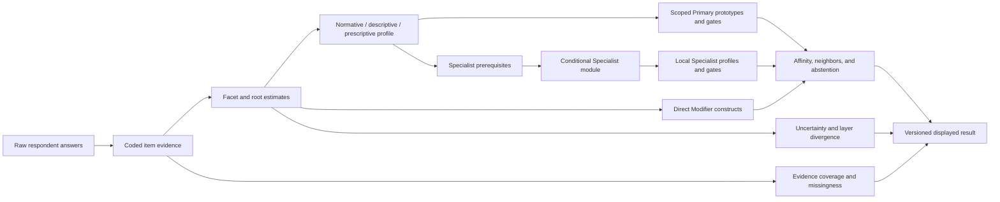

# vNext Scoring Architecture Specification — 2026-08

Status: authoritative vNext scoring and measurement-design specification;
implementation and public-result promotion remain version-gated.

Frozen implementation baseline:
`f0324dbf27dfc6e35ff557992e4643e3df15ee0e`

This specification is cumulative with the frozen Measurement Architecture,
the completed taxonomy Deep Research, the approved Primary, Modifier,
Specialist, Context, construct, and item decisions, the current repository,
and the [cumulative methodological decision
log](methodological-change-decision-log-2026-08.md). It specifies how the
current scorer is to be interpreted and how a later vNext scorer may be
implemented. It does not silently change the frozen question bank, weights,
taxonomic roles, Specialist assignment strategy, or public result language.

The outward meaning, participant-facing terminology, claim tiers, shared-result
rules, and public presentation statuses are governed by the [Result
Interpretation and Public Claims Specification](result-interpretation-public-claims-specification-2026-08.md).

No genuine contradiction with the frozen Measurement Architecture was found.
The specification records two compatibility boundaries rather than resolving
them invisibly:

1. the v13 scorer returns a numeric `normalized: 0` for an unmeasured axis,
   while `itemCount: 0` is the authoritative evidence signal; vNext must carry
   an explicit measured mask and must never display that zero as neutrality;
2. v13 label matching uses an independent-axis RMS distance and heuristic
   evidence bands, without a respondent-estimated covariance matrix or a
   calibrated Primary probability; vNext may add those only in a new,
   respondent-validated scoring version.

## 1. Executive decision

The authoritative measurement flow is:



The production object is a multidimensional political profile, not a single
latent ideology score. A named ideology is a similarity/configuration result
over a declared construct scope. A Modifier is a direct cross-host construct
view. A Specialist is a conditional, module-scoped resolution surface. A
Context entry is never produced by this scorer.

The architecture has three analytically separate objects:

| Object                                   | What it does                                                                                                                     | Status                                                                         |
| ---------------------------------------- | -------------------------------------------------------------------------------------------------------------------------------- | ------------------------------------------------------------------------------ |
| Theory-led construct model               | Defines roots, facets, layers, relations, constitutive requirements, and expected ideological configurations                     | Authoritative ontology and content specification; not itself a validity claim  |
| Production prototype/configuration model | Applies fixed item mappings, normalized scores, scoped prototype distances, gates, evidence coverage, and similarity language    | Frozen v13 compatibility contract; vNext implementation requires a new version |
| Empirical challenger models              | Tests dimensionality, covariance, latent classes/profiles, item parameters, missingness, and calibration against respondent data | Research-only; cannot directly replace named labels or public results          |

Synthetic prototypes, centroid recovery, software tests, theoretical
coherence, source coverage, and expert agreement may verify implementation or
content traceability. None establishes psychometric validity, respondent
classification accuracy, reliability, invariance, or criterion validity.

## 2. Scope, objects, and notation

### 2.1 Stable objects

The current architecture preserves:

- 26 frozen root axis IDs: 10 normative, 7 descriptive, and 9 prescriptive;
- the vNext facet IDs in the construct blueprint, without treating them as
  runtime scores until separately versioned;
- the current 16 Primary IDs and their source-backed `scoringScope` records;
- the seven direct Modifier construct contracts in
  `2026-08-modifier-construct-v1`;
- nine conditional Specialist modules, 78 Specialist IDs, 54 local planning
  constructs, the frozen roster
  `2026-08-specialist-roster-v1`, and `balanced-hash-v2` assignment;
- stable question IDs, response layers, item provenance, effective-bank
  transformations, and research-form fingerprints.

The effective inventory is 338 active core items plus 68 active conditional
Specialist items. It is not one 406-item form. The current question bank and
the item-level dispositions in the [full effective item
audit](full-effective-item-audit-2026-08.md) remain authoritative until a
separate implementation decision changes them.

### 2.2 Notation

For respondent `r`, item `i`, construct or root `c`, layer `l`, Primary
configuration `p`, Modifier `m`, and Specialist candidate `s`:

- `a_ri` is the raw answer record;
- `x_ri` is the coded political response on `[-1, 1]`, or missing;
- `q_i` is the question metadata and version;
- `w_ic` is the signed item-to-construct weight;
- `n_rc` is the substantive item count for construct `c`;
- `C_rc` is content/evidence coverage, never psychometric reliability;
- `z_rc` is the normalized construct/root estimate;
- `P_r` is the profile vector plus measured masks and metadata;
- `t_pc` is the versioned prototype/configuration target for Primary `p`;
- `S_p` is the Primary evidence/eligibility state;
- `d_{rp}` is a scoped similarity distance and `f_{rp}` its fit transform;
- `g_p` is a constitutive or core evidence gate;
- `u` is a qualitative uncertainty state unless a respondent-calibrated
  standard-error model is explicitly attached.

All estimates are layer-specific. Normative, descriptive, and prescriptive
responses must not be silently pooled into one untyped political score.

## 3. Production status and decision classes

Every scoring rule or parameter belongs to exactly one class.

### 3.1 Theoretically specified production rules

These rules are fixed by the architecture and may not be learned from the
same respondent data used to claim validity:

- response-state coding and the distinction between substantive answers,
  `dont_know`, refusal, omitted, and skipped salience;
- item polarity and declared construct mappings;
- layer separation;
- the denominator and normalization convention for the frozen compatibility
  scorer;
- Primary scope membership and constitutive gates;
- direct-only Modifier matching;
- conditional Specialist routing, module-local constructs, and evidence
  abstention;
- no imputation of missing defining constructs;
- profile-similarity language rather than identity or probability language;
- version and provenance requirements;
- public suppression of unsupported Context, Modifier, Specialist, or Primary
  claims.

### 3.2 Parameters requiring respondent-data estimation

These may become production parameters only after preregistered respondent
studies, held-out evaluation, and a new decision record:

- item discrimination, thresholds, local dependence, and response-style
  effects;
- facet/root dimensionality and cross-loadings;
- construct and facet weights beyond declared content weights;
- covariance or residual covariance used in similarity;
- response-process adjustments for confidence, priority, and salience;
- missingness and `dont_know` mechanisms;
- depth-linking and short-form equivalence;
- Primary and Specialist fit cutoffs, margins, and display thresholds;
- uncertainty intervals or standard errors;
- M0/M1 incremental value for compositional traditions;
- subgroup DIF, invariance, fairness, and language-specific parameters;
- calibration against external criteria or respondent self-description.

### 3.3 Exploratory challenger models

These are not production output:

- EFA/CFA and bifactor or hierarchical factor models;
- ordinal IRT and graded-response models;
- regularized covariance or Mahalanobis similarity;
- unfolding or ideal-point models;
- respondent-level LCA/LPA, network, mixture, and profile models;
- supervised or semi-supervised label models using independently collected
  criteria;
- multiple-imputation and missing-not-at-random sensitivity analyses;
- alternative salience, item-weight, and depth-linking models.

Challenger models may test whether the theory-led configuration architecture
is incomplete. They may not silently reassign a respondent to a named label or
change the public scorer.

## 4. Response coding contract

### 4.1 Raw response states

The canonical research record must preserve the raw answer and a normalized
response state. The following states are not interchangeable:

| State                  | Meaning                                                                  | Political score contribution                                                       | Evidence meaning                                       |
| ---------------------- | ------------------------------------------------------------------------ | ---------------------------------------------------------------------------------- | ------------------------------------------------------ |
| `substantive`          | Valid numeric Likert response or valid statement option                  | Contributes after coding and salience rule                                         | Direct response evidence                               |
| `dont_know`            | Respondent cannot or does not claim to know a descriptive proposition    | No contribution                                                                    | Descriptive uncertainty; item was presented            |
| `prefer_not_to_answer` | Respondent declines the item                                             | No contribution                                                                    | Refusal; item was presented                            |
| `omitted`              | No answer was recorded for a presented item                              | No contribution                                                                    | Item nonresponse; distinguish from refusal where known |
| `not_presented`        | Item was not in the assigned depth/form/module                           | No contribution                                                                    | Structural missingness; not a respondent refusal       |
| `salience_skipped`     | Political answer was given but requested confidence/priority was skipped | Non-normative current scorer excludes the item; normative item remains substantive | Salience evidence missing; do not convert to neutral   |
| `invalid`              | Out-of-range, malformed, wrong-option, or incompatible answer            | No contribution                                                                    | Data-quality failure; retain raw record for audit      |

The current `Answer` type encodes `dont_know` and
`prefer_not_to_answer` as nonnumeric values, and `salienceSkipped` as a
separate flag. A vNext response schema may make all states explicit, but it
must preserve the old values and map them deterministically.

`0` on a Likert scale is a substantive midpoint. It is not missing,
uncertain, refusal, or evidence of ideological neutrality beyond that item.

### 4.2 Likert coding

For a valid Likert response `v_i`:

```text
max_i = 2 for likert5; 3 for likert7
x_ri = clamp(v_i / max_i, -1, 1)
if reverseScored_i: x_ri = -x_ri
```

The current bank supplies semantically keyed weights and uses
`reverseScored` at normalization. Reverse scoring is an item-semantic
operation; it must not be applied again in an axis aggregate.

Out-of-range numeric values are invalid for the research record. The frozen
compatibility function clamps them; a later strict response validator must
report the invalid state while retaining the compatibility result only when a
versioned migration explicitly permits it.

### 4.3 Statement-choice coding

For a valid statement-choice answer, the stored number is an option index, not
a political magnitude. The selected option receives its own declared signed
axis/construct weights:

```text
x_ri = 1
w_ic = selectedOption_i.axisWeights[c]
```

An option with no weight for construct `c` contributes no evidence to `c`.
The option index must be checked against the versioned option list. The six
current ipsative questions require option-level audit and must not be treated
as ordinary agree/disagree items.

### 4.4 Salience, confidence, and priority

The frozen compatibility scorer uses:

```text
s_ri = 1                                      for normative items
s_ri = clamp(confidence_ri / 5, 0.2, 1)        for rated descriptive items
s_ri = clamp(priority_ri / 5, 0.2, 1)           for rated prescriptive items
s_ri = 1                                      when no rating is supplied
s_ri = missing                                when salience is explicitly skipped
                                                on a non-normative item
```

The current root scorer multiplies the numerator by `s_ri` but retains the
unweighted absolute item-weight denominator. Thus low confidence or priority
pulls a root estimate toward zero, while an explicitly skipped non-normative
salience rating removes that item. The current direct Modifier matcher uses
salience as an effective weight in both numerator and denominator and uses it
to reduce evidence coverage. This asymmetry is a documented v13 compatibility
behavior, not a settled psychometric principle.

The vNext production decision remains open until respondent evidence compares
at least these preregistered candidates:

1. current salience-as-point-weighting;
2. political position from the substantive answer with confidence/priority
   affecting evidence and uncertainty only;
3. a layer-specific model in which salience is an explicitly estimated
   response-process parameter.

No candidate may be selected from theoretical preference or synthetic
recovery alone. Until then, current v13 semantics remain the compatibility
rule and salience fields must be displayed as salience/evidence metadata, not
as psychometric precision.

## 5. Item contributions and construct estimates

### 5.1 Declared item contribution

For a substantive item and a declared signed weight `w_ic`, the compatibility
contribution is:

```text
y_ric = x_ri * s_ri * w_ic
```

If the item is missing, invalid, non-substantive, has a skipped non-normative
salience rating, or has no declared weight for `c`, `y_ric` is missing and is
not a zero contribution.

No item receives a data-derived production weight merely because it is easier
to score, appears in more forms, or agrees with a synthetic centroid. A future
quality/discrimination factor `q_i` may be introduced only as a versioned
respondent-estimated parameter and must be reported separately from the
content weight:

```text
w*_ic = w_ic * q_i
```

The same item may load several roots or facets because the current bank does
so, but the audit flags such cross-loading. A cross-loading is not evidence
that the constructs are one trait.

### 5.2 Root estimates in the frozen compatibility scorer

For root `c` within its layer, let `I_rc` be the expected active indicator set
for the assigned form and let `A_rc` be the substantive, non-skipped set. The
current root estimate normalizes over the answered contributing items, not the
unanswered form items:

```text
raw_rc        = sum(i in A_rc) x_ri * s_ri * w_ic
denominator_rc = sum(i in A_rc) abs(w_ic)
z_rc          = clamp(raw_rc / denominator_rc, -1, 1) if denominator_rc > 0
               0 otherwise
n_rc          = |A_rc|
```

`n_rc = 0` is the decisive unmeasured state. The numeric `z_rc = 0` in this
case is a compatibility placeholder and must not enter an ideology distance
as measured neutral evidence.

The current implementation uses the active question list supplied to the
scorer, so an omitted depth or module changes the available indicator and
coverage set. vNext must additionally store the full intended scope and an
explicit `presented`/`not_presented` mask, so structural missingness is not
confused with respondent missingness. A denominator that includes unanswered
items would be a new scoring rule, not a harmless refactor.

### 5.3 Facet estimates

The vNext facet estimate follows the same weighted-mean form only when the
facet has a direct, versioned indicator set:

```text
z_rf = sum(i in A_rf) x_ri * s_ri * w_if
       ------------------------------------
       sum(i in A_rf) abs(w_if)
```

It is missing when no direct evidence is present. A facet must not inherit its
parent root estimate. A root may be displayed as a root estimate while its
facets remain unmeasured, but the result must state the limitation.

Parent aggregation of facets is a future model choice. It requires a
predeclared aggregation rule, nonredundant item coverage, respondent
dimensionality evidence, and a new score version. A facet label in the
ontology, a source statement, or a Specialist relation cannot create a facet
score.

### 5.4 Layer profiles

For each layer `l`, the profile is:

```text
P_rl = {
  estimates: { z_rc : c in layer l },
  measured:  { c : n_rc > 0 },
  counts:    { n_rc },
  coverage:  { C_rc },
  salience:  { observed salience metadata },
  missing:   { response-state counts and not-presented mask }
}
```

Normative, descriptive, and prescriptive vectors are reported separately. A
descriptive belief is not treated as a normative value, and a prescriptive
strategy preference is not treated as a descriptive prediction.

### 5.5 Coverage measures

Coverage is an evidence accounting quantity, not reliability. For a construct
or root:

```text
C_rc = sum(i in A_rc) abs(w_ic) / sum(i in I_rc) abs(w_ic)
```

The report must also include:

- substantive item count `n_rc`;
- presented item count;
- `dont_know`, refusal, omitted, and invalid counts;
- salience-observed count for descriptive/prescriptive items;
- direct facet coverage and root proxy coverage;
- expected full-form coverage and actual depth coverage.

The compatibility Primary evidence strength is:

```text
e_rc = min(1, n_rc / 3)
E_rp = sum(c in scope_p) e_rc / |scope_p|
```

This is the current sparse-axis evidence heuristic. It is not internal
consistency, test-retest reliability, a standard error, or a probability that
the respondent belongs to a label.

Coverage must not be increased by:

- centroid values on unmeasured axes;
- neighboring roots or facets;
- Primary or Specialist membership;
- source records or historical importance;
- software defaults that return zero;
- imputation, including mean, centroid, regression, or latent-class
  imputation in a public result.

## 6. Weighting, balance, normalization, and covariance

### 6.1 Item weights

The signed `axisWeights` and statement-option weights are theory/content
metadata in v13. Their magnitude controls contribution and denominator share;
their sign indicates the keyed semantic direction. They are not empirical
loadings. The audit's `PROXY`, `XL`, `ASY`, and contamination flags remain
attached to every item.

The vNext item-development rule is:

- preserve an item's stable ID and current weight provenance when content is
  retained;
- do not adjust weights to improve a label fixture or centroid recovery;
- use diverse indicators within a facet rather than repeated high weights;
- separate content weighting from empirically estimated discrimination;
- re-estimate or recalibrate only after a new item/scoring version and a
  pre-registered respondent analysis.

### 6.2 Directional balance

Directional balance means balanced content coverage of a construct's
substantive positions, not an artificial equal count of positive and negative
keyings. The scorer must:

- preserve the declared semantic direction;
- avoid double reversal of `reverseScored` and signed weights;
- retain positive and negative item counts and option-level direction in the
  audit metadata;
- test agreement-format acquiescence, extreme response, midpoint, and
  socially desirable response styles in respondent data;
- avoid treating a politically desirable position as the construct's positive
  direction.

If a facet cannot be worded in a reasonably balanced way, its content and
response-process risk must be disclosed and its public display may require a
separate safety/validity decision. Software tests can verify polarity
bookkeeping but cannot verify directional fairness.

### 6.3 Unequal construct coverage

The point estimate is normalized within each construct by its declared
absolute weight denominator. Unequal item volume therefore must not make a
root numerically larger merely because it has more items. Unequal coverage does
affect evidence status, missingness, uncertainty, and eligibility.

No root may gain precision solely from being overrepresented. The vNext report
must expose both `z_rc` and `C_rc`; a high-volume contaminated root may have
high content coverage and still be unsuitable for a distinct interpretation.

### 6.4 Covariance and cross-loading

The frozen compatibility similarity treats measured roots as independent
coordinates. This is intentionally simple and can double-count correlated
content or fail to account for covariance. The v13 scorer must not estimate a
covariance matrix from a synthetic fixture or silently whiten the profile.

A respondent-estimated covariance challenger may use:

```text
d^2_M(r,p) = (P_r - T_p)' M (P_r - T_p)
```

where `M` is a preregistered, regularized inverse covariance estimated from an
appropriate respondent sample, with layer and form handling declared in
advance. It may enter production only if it improves held-out discrimination,
retest stability, interpretability, fairness, and depth comparability without
erasing substantively distinct constructs. Until that evidence exists,
Euclidean/RMS compatibility distance remains the production similarity.

## 7. Primary affinity and configuration scoring

### 7.1 Primary configuration record

Each Primary scoring record must include:

```text
PrimaryConfiguration {
  labelId
  conceptualKind
  hostRelations
  scopeVersion
  axisIds                 // all comparison roots
  requiredAxisIds         // constitutive evidence boundary
  minimumItemCounts
  prototypeVersion
  prototype               // targets only on declared scope axes
  compoundGateIds
  nearestNeighborIds
  limitation
  measurementStatus
}
```

The current `scoringScope` records in
`2026-08-primary-core-v1` are authoritative. Their required axes are
evidence gates, not agreement requirements: measured disagreement lowers fit;
unmeasured constitutive evidence produces abstention.

### 7.2 Primary distance and fit

For scope `S_p`, use only measured axes and the current evidence weight:

```text
e_rc = min(1, n_rc / 3)
M_rp = { c in S_p : n_rc > 0 }

d_rp = sqrt(
  sum(c in M_rp) e_rc * (z_rc - t_pc)^2
  -----------------------------------------
  sum(c in M_rp) e_rc
)

f_rp = max(0, 1 - d_rp / 2)
E_rp = sum(c in S_p) e_rc / |S_p|
```

The native coordinate range is `[-1,1]`, so RMS distance is bounded by `2`.
Dividing by the number of axes again would incorrectly reward or penalize
different scope lengths.

`f_rp` is a similarity fit on the declared scope. It is not a posterior,
probability, classification accuracy, or respondent identity score.

The current matcher returns up to 20 eligible nearest labels, ranks by
distance, and assigns heuristic uncertainty bands. A later implementation may
add a validated threshold, but a fit cutoff must not be invented from current
fixtures.

### 7.3 Constitutive gates

A Primary candidate is eligible only if every required evidence condition is
met:

```text
coreGate(p) = passed iff
  for every c in requiredAxisIds_p:
    n_rc >= minimumItemCounts_p[c]  // default 1 in current v13 scopes

compoundGate(p) =
  insufficient-evidence if any gate construct is unmeasured
  blocked            if any measured min/max condition is contradicted
  passed             otherwise
```

Gate states are not fit scores:

- `passed`: the defining evidence was measured and no hard contradiction was
  observed;
- `blocked`: the defining evidence was measured and contradicts the
  candidate;
- `insufficient-evidence`: one or more defining constructs were not measured;
- `not-applicable`: no gate is declared for the candidate.

An ineligible label must not be rescued by a low distance on other axes.
Gates do not establish that a respondent is the ideology; they prevent a
centroid from laundering absent or contradicted commitments.

### 7.4 Thresholds, ties, and neighboring labels

Current compatibility parameters are:

| Parameter                          |                                              Current value | Meaning and limitation                                                |
| ---------------------------------- | ---------------------------------------------------------: | --------------------------------------------------------------------- |
| Primary nearest count              |                                                         20 | Number of eligible nearest matches returned; not a validity threshold |
| Evidence half-saturation           |                                                    3 items | `min(1, n/3)` per scoped root; content heuristic only                 |
| High-uncertainty evidence cutoff   |                                                   `< 0.40` | Current qualitative evidence band                                     |
| Medium-uncertainty evidence cutoff |                                                   `< 0.70` | Current qualitative evidence band                                     |
| High top-margin cutoff             |                                               `< 0.03` fit | Current global top-vs-runner heuristic                                |
| Medium top-margin cutoff           |                                               `< 0.08` fit | Current global top-vs-runner heuristic                                |
| Direct Modifier minimum items      |                                                          2 | Hard direct-indicator coverage gate                                   |
| Direct Modifier fit threshold      |                                                     `0.65` | Compatibility fit gate, not calibrated classification accuracy        |
| Direct Modifier evidence threshold |                                                     `0.40` | Compatibility evidence gate                                           |
| Specialist construct coverage      | at least two answered where possible and `>=0.50` weighted | Current module evidence heuristic                                     |

The current runner-up margin is defined only for rank one:

```text
margin_r = f_rp1 - f_rp2
```

The vNext result object must additionally compute a neighbor margin over the
declared conceptual nearest-neighbor set `N(p)`:

```text
neighborMargin_rp = f_rp - max(q in N(p)) f_rq
```

If a candidate is tied or within the versioned tie tolerance of another
candidate, the result must preserve the tie and raise uncertainty. Stable
label-ID ordering is permitted only as a serialization tie-break, never as
substantive evidence. A candidate may not be called uniquely best solely
because its ID sorts first.

Empirical cutoffs for exclusive display, family-level display, or abstention
remain unresolved. They require held-out respondent calibration and must be
stored with the scoring version.

### 7.5 Primary display rule

The vNext public result must use the following statuses:

| Status                    | Rule                                                                                                              | Display                                                                                        |
| ------------------------- | ----------------------------------------------------------------------------------------------------------------- | ---------------------------------------------------------------------------------------------- |
| `insufficient-evidence`   | No eligible Primary, missing required scope, or all candidates blocked                                            | Profile and missing/evidence explanation; no named Primary claim                               |
| `profile-only`            | The profile is available but no candidate meets an approved display rule                                          | Measured profile, nearest conceptual neighbors if useful, explicit non-classification language |
| `affinity-set`            | One or more eligible candidates are sufficiently measured but not uniquely separated                              | Ranked affinities, neighbor margin, uncertainty, and no exclusive identity wording             |
| `best-supported-affinity` | One candidate clears a later respondent-calibrated display rule and has acceptable gates, margin, and uncertainty | One best-supported affinity plus nearest neighbors and evidence caveat                         |

Until a calibrated display rule exists, v13-compatible output may continue to
show the ranked nearest-label set. It must preserve `fit`, `evidenceStrength`,
gate states, and uncertainty, and must not translate fit into probability,
membership, or validated identity.

## 8. Compositional-residual evaluation

### 8.1 M0 and M1 definitions

For any compositionally specific Primary or derived configuration:

- `M0` is the best supported representation as a broader host/tradition plus
  directly measured Modifier/facet components;
- `M1` is an independent named configuration with its own prototype and
  residual construct requirements.

The question is not whether the label has a familiar name. The M1 endpoint is
justified only when it has a residual that is historical, conceptual, and
morphological, not merely the arithmetic sum of its components.

For candidate `k`, define the conceptual residual set:

```text
R_k = requiredConstructs(M1_k)
      minus constructs already represented by M0_k
```

The production scorer may expose M1 only if every required residual construct is
directly measured and the M1 gate passes. It may not estimate the residual from
the host score or a Modifier label.

### 8.2 Applicable current Primary candidates

The same criterion applies to every relevant composition; the priority cases
are not special pleading:

| Candidate                   | M0 representation to test                                                                                       | M1 residual structure to test                                                                                                                                                                   | Current scoring disposition                                                                     |
| --------------------------- | --------------------------------------------------------------------------------------------------------------- | ----------------------------------------------------------------------------------------------------------------------------------------------------------------------------------------------- | ----------------------------------------------------------------------------------------------- |
| National Conservatism       | Conservative/prudential host + national-community salience/priority and membership/continuity facets            | A historically coherent ordering of national political community, inherited continuity, sovereignty, and conservative anti-redesign; direct membership/sovereignty evidence is still incomplete | Retain Primary conceptually; M1 evidence hold; current ordinary scope remains narrow            |
| Liberal Conservatism        | Liberal host + market/property/liberty facets + prudential/gradualist orientation                               | A stable liberal-conservative ordering of rights, market institutions, inherited continuity, and gradual change that is not just “liberal plus low cultural plasticity”                         | Retain Primary conceptually; M1 evidence hold; current ordinary scope remains narrow            |
| Christian Democracy         | Liberal/conservative host + social-market, solidarity, subsidiarity, and religious-public-order facets          | A historically coherent social-ethical and institutional synthesis; religious public order must not be substituted by generic traditionalism                                                    | Retain current Primary; direct religious-social and subsidiarity residual remains limited       |
| Marxism-Leninism            | Marxian/socialist host + authority, centralization, revolutionary transition, and state-action facets           | Party/vanguard organization, centralized revolutionary transition, and historically specific state form beyond generic socialism or state intervention                                          | Retain current Primary and compound gate; no claim that gate validates the historical tradition |
| Libertarian Socialism       | Socialist/egalitarian host + anti-authority, anti-domination, decentralist, and communal/worker-control facets  | Non-additive relation between anti-capitalist ownership and anti-hierarchical organization, including institutional morphology                                                                  | Retain current Primary; workplace/class and organization residual is undermeasured              |
| Radical Democracy           | Egalitarian/anti-domination host + popular sovereignty, contestation, participation, and institutional openness | A democratic theory in which participatory contestation is constitutive, not just a low-authority or equality profile                                                                           | Retain current Primary; direct participatory/popular-sovereignty evidence is incomplete         |
| Market-Right Libertarianism | Liberal/property/market host + strong anti-state authority and exit facets                                      | A consistent state-skeptical property/market order distinct from classical liberal constitutional limitation                                                                                    | Retain current Primary; current scope measures only a constrained signal                        |
| Social Democracy            | Egalitarian liberal/socialist host + mixed-economy public action and reform strategy                            | A durable ordering of equality, market coexistence, public provision, and reform that differentiates it from democratic socialism                                                               | Retain current Primary; direct policy-mechanism residual remains limited                        |
| Democratic Socialism        | Social ownership/equality host + democratic control and anti-domination facets                                  | Democratic control of productive institutions and non-Leninist transition/organization beyond generic equality                                                                                  | Retain current Primary; direct workplace/democratic-control facet is missing                    |
| Green Politics              | Ecological standing host + growth, technology, ownership, governance, and strategy facets                       | A green morphology linking ecological standing to a distinct political economy and institutional strategy                                                                                       | Retain narrow Primary anchor; morphology is conditional Specialist work                         |
| Republicanism               | Liberty host + anti-domination and civic self-government facets                                                 | Freedom as non-domination plus civic institutional self-rule, not merely civil liberty or anti-authority                                                                                        | Retain current Primary; civic self-government facet is limited                                  |

The remaining Primaries are broad tradition anchors rather than immediate M0/M1
priority cases, but they remain subject to the same test if future research
proposes a compound endpoint. No M1 promotion is authorized by this document.

### 8.3 Respondent evidence for incremental M1 value

An eventual M0/M1 study must collect, or link independently collected:

1. direct indicators for every M0 component and every M1 residual facet;
2. response-process evidence that respondents understand the combination as
   distinct rather than as a generic host plus a salient issue;
3. pre-registered M0 and M1 estimators evaluated on held-out respondents;
4. incremental discriminant information: M1 must separate candidates or
   predict an external criterion beyond M0, not merely fit an in-sample
   centroid;
5. nearest-neighbor and within-family comparisons;
6. test-retest stability of the residual;
7. criterion interpretation, self-description used only as a criterion and
   not as a scoring input, and any behavioral/policy comparison justified by
   the construct;
8. subgroup DIF/invariance, translation, sensitive-content, and fairness
   review;
9. display-value and user-interpretation evidence showing that M1 reduces
   misleading compression without creating false precision.

If M1 fails the incremental test, retain its historical and conceptual record
as a configuration or Specialist/Context object; do not erase the tradition or
silently turn M0 into a definitive synonym.

## 9. Modifier estimates

### 9.1 Direct construct rule

The ordinary Modifier surface is direct-indicator-only. For a direct construct
`m` with indicator set `J_m`, direction `d_im`, and normalized item response
`x_ri`, the compatibility matcher computes:

```text
v_rim = x_ri * d_im

distance_rm = sqrt(
  sum(i in A_rm) s_ri * (v_rim - 1)^2
  ----------------------------------
  sum(i in A_rm) s_ri
)

fit_rm = max(0, 1 - distance_rm / 2)
E_rm   = sum(i in A_rm) s_ri / |J_m|
```

An ordinary Modifier is returned only when:

- the registry says `availability: core-construct`;
- at least the declared minimum two direct indicators are substantive;
- `fit >= 0.65` under the compatibility contract;
- `E >= 0.40`;
- uncertainty is not high.

The current matcher returns at most five direct Modifier matches. The result
must identify the construct and indicator IDs so the card cannot be mistaken
for a fit across a full ideology centroid.

### 9.2 Non-direct Modifier states

`focused-follow-up` and `catalog-only` entries are not scored as ordinary
Modifiers. Their states are:

- conceptual and documented;
- available for a dedicated module or research battery;
- not inferred from a Primary, neighboring Modifier, source, or label name;
- not promoted by theoretical portability alone.

This applies especially to the National Orientation domain, Populism,
left/right configurations, territorial projects, fiscal orientation,
ethnonational membership, and technology/human-enhancement facets.

### 9.3 Modifier configurations

`left-wing-nationalism`, `left-wing-populism`, and `right-wing-populism` are
configuration nodes. A future resolver would require:

```text
host evidence AND direct Modifier-domain evidence AND
all configuration-specific residual gates AND acceptable uncertainty
```

It must not compute a new score by adding a Primary fit to a Modifier fit.
The configuration needs its own declared relation and display policy, and is
subject to the same M0/M1 residual test.

## 10. Specialist eligibility and classification

### 10.1 Assignment is not eligibility

The current `balanced-hash-v2` assignment is a stable research/product
routing mechanism. The assigned module ID, strategy, and roster version do
not mean that the respondent belongs to the module's ideological family.
Assignment balance is not a validity result.

A Specialist module is eligible to be administered only when:

- the module is present in the versioned roster;
- the module version and question form are known;
- the respondent has the required consent and the product flow permits the
  follow-up;
- the module is selected, assigned, or explicitly requested under its policy;
- any prerequisite host/core construct evidence declared by the module is
  available, or the module explicitly permits an exploratory no-host route.

Skipping or declining a module never changes the ordinary Primary result.

### 10.2 Local Specialist constructs

Specialist scoring uses local construct weights, not global axis scores. For
local construct `f`, a module must declare whether salience is used. The
current experimental modules use module-specific numeric normalization and do
not establish a common salience contract; a future module may use the
following compatible form only after declaring and validating that rule:

```text
z_rf = sum(i in A_rf) x_ri * s_ri * w_if
       -----------------------------------
       sum(i in A_rf) abs(w_if)
```

The module evidence contract reports:

- answered and total item counts;
- answered and total absolute construct weight;
- weighted coverage;
- effective item count;
- whether the construct is sufficient;
- module-level answered coverage and weighted coverage.

The current sufficiency heuristic requires at least two answered items when
the construct has two or more items and at least `0.50` weighted coverage.
The candidate-profile sufficiency rule requires at least two covered required
constructs for profiles with more than one required construct, or all required
constructs for a one-construct profile.

These rules are evidence guards, not estimates of Specialist reliability.

### 10.3 Specialist candidate distance and gates

For candidate `s` with local signals `t_sf`, use only covered signal
constructs:

```text
M_rs = { f : f is a candidate signal and local evidence is sufficient }

d_rs = sqrt(
  sum(f in M_rs) (z_rf - t_sf)^2 / |M_rs|
)

fit_rs = max(0, 1 - d_rs / 2) if |M_rs| > 0, otherwise 0
```

Before a Specialist candidate can be displayed as an experimental affinity,
evaluate its prerequisite gates:

- missing gate construct -> `insufficient-evidence`;
- measured min/max contradiction -> `blocked`;
- all gates measured and not contradicted -> `passed`.

The module may return multiple high-fitting candidates. It must not force a
single subtype where local constructs do not separate them. The criterion
self-description collected after a module is a research outcome and must not
be fed back into the affinity score.

### 10.4 Specialist public state

Until respondent validation promotes a module, its result is:

- `experimental` when the module has sufficient local evidence and no gate
  contradiction;
- `insufficient-evidence` when coverage/prerequisites are missing;
- `blocked` when a measured constitutive gate is contradicted;
- `not-administered` when the module was not assigned, selected, or completed.

No Specialist is currently a validated public identity classifier. Promotion
requires focused cognitive work, local dimensionality, indicator diversity,
retest, criterion interpretation, DIF/invariance, fairness and safety review,
replication, and display-value evidence.

## 11. Missingness, refusal, and depth

### 11.1 Missingness invariants

The following are hard invariants:

1. missing is not zero;
2. `dont_know` is not agreement or disagreement;
3. refusal is not a substantive political position;
4. skipped salience is not a midpoint;
5. an unpresented depth item is not a respondent refusal;
6. no missing required construct is imputed for a label or Specialist;
7. an answer in one layer cannot fill a missing construct in another layer;
8. a missing facet cannot be reconstructed from a parent root, label centroid,
   source, or neighboring facet;
9. missingness counts remain visible to the evidence and uncertainty layers.

Multiple imputation may be used only as a research sensitivity analysis with
an explicit estimand and missingness model. It cannot produce an ordinary
public label until a new respondent-validated decision authorizes it.

### 11.2 Depth comparability

The current core tiers are cumulative in item membership, but they are not
automatically equivalent forms:

| Depth     | Current role                 | Scoring consequence                                                                                                               |
| --------- | ---------------------------- | --------------------------------------------------------------------------------------------------------------------------------- |
| Blitz     | 19-item legacy short profile | Many descriptive and strategy roots are structurally absent; Primary/Modifier gates must abstain when required evidence is absent |
| Quick     | 52 cumulative core items     | Partial scope; no assumption of equivalence with moderate/full                                                                    |
| Moderate  | 206 cumulative core items    | Broader profile but still depth-specific evidence masks                                                                           |
| Extensive | 338 active core items        | Full current core coverage, not full facet or psychometric coverage                                                               |

For every result, store form/depth ID, presented item IDs, assignment and
presentation fingerprints, layer counts, available roots/facets, and module
state. A score from a short form must not be compared to a full-form score as
if the same constructs were measured with the same precision.

Future depth calibration requires anchor items or a documented linking design,
respondent overlap or randomized matrix administration, construct-specific
equivalence tests, DIF/invariance, and held-out validation. Counts alone do
not establish short-form equivalence.

### 11.3 Unequal form scoring

Within-form normalization prevents raw item volume from changing the coordinate
scale. It does not make an undercovered form valid for a label. A Primary whose
required construct is missing must abstain even if other axes produce a close
prototype distance. A direct Modifier whose indicator items are not in the
form must remain unmeasured. A Specialist module must report not-administered
or insufficient evidence rather than inherit the core profile.

## 12. Uncertainty and evidence coverage

### 12.1 Separate uncertainty sources

The result must distinguish at least:

- **coverage uncertainty:** the required constructs or indicators were not
  sufficiently presented/answered;
- **separation uncertainty:** the top label is close to its nearest neighbor;
- **response-process uncertainty:** low confidence, skipped salience,
  acquiescence, social desirability, specialized knowledge, or sensitive-item
  concerns;
- **layer uncertainty:** normative, descriptive, and prescriptive profiles
  diverge materially;
- **parameter uncertainty:** estimated item/prototype/covariance parameters
  are uncertain in a respondent-calibrated model;
- **form uncertainty:** depth or module assignment changes the available
  evidence;
- **data-quality uncertainty:** invalid, inconsistent, or duplicate records.

The current v13 `low`/`medium`/`high` band covers only a subset of these
sources. It must not be described as a confidence interval.

### 12.2 Compatibility uncertainty bands

For current Primary matching:

```text
high   if E_rp < 0.40 or (rank 1 and margin < 0.03)
medium if E_rp < 0.70 or (rank 1 and margin < 0.08)
low    otherwise
```

For direct Modifiers, high uncertainty also applies when fewer than two direct
items are measured; high-uncertainty direct matches are suppressed by the
current matcher. Specialist modules use their explicit evidence status and
gate status.

These bands are heuristic display states. They do not support claims about
probability, precision, reliability, or validity.

### 12.3 Future standard errors and calibrated uncertainty

A respondent-validated scoring version may attach a standard error or interval
only when the item/construct model, sample, estimator, missingness treatment,
and population scope are explicit. Intervals must be calculated separately
for roots/facets and label affinities. A confidence/priority response field
must not be repurposed as a psychometric standard error.

## 13. Production-versus-challenger model matrix

| Component          | Frozen/v13 production                                 | Empirical parameter study                                 | Challenger models                                      |
| ------------------ | ----------------------------------------------------- | --------------------------------------------------------- | ------------------------------------------------------ |
| Response coding    | Declared Likert/choice normalization; strings missing | Invalid-response and salience response-process parameters | Ordinal threshold/IRT, response-style models           |
| Item weights       | Declared signed content weights                       | Item discrimination and quality estimates                 | LASSO/elastic-net or learned embeddings, research only |
| Construct estimate | Weighted normalized mean by layer                     | Facet loadings, residual covariance, item thresholds      | CFA/IRT/bifactor/unfolding                             |
| Primary similarity | Scoped RMS Euclidean distance                         | Scope weights, covariance, fit/margin cutoffs             | Mahalanobis, ideal-point, supervised classifier        |
| Primary gates      | Required axes and compound min/max gates              | Gate thresholds and incremental validity                  | Soft probabilistic gates                               |
| Modifier           | Seven direct constructs only; fixed gates             | Indicator discrimination and subgroup behavior            | Joint host-plus-facet latent models                    |
| Specialist         | Module-local prototype, evidence/gate abstention      | Local dimensionality, cutoffs, module routing             | LCA/LPA, networks, cross-module mixtures               |
| Uncertainty        | Qualitative evidence/margin bands                     | SEs, intervals, calibration                               | Posterior or bootstrap distributions                   |
| Depth              | Versioned form masks and no-imputation gates          | Linking and equivalence parameters                        | Matrix completion or joint missingness models          |
| Final labels       | Similarity/affinity language, no probabilities        | Calibrated display thresholds if justified                | Latent class labels only as challengers                |

LCA/LPA or other person-centered models may reveal that respondent profiles do
not align with the named taxonomy. That is a valuable result for theory and
future architecture, but it is not permission to replace the construct-led
profile or to call a class a named ideology without a new conceptual and
empirical decision.

## 14. Calibration and validation requirements

The staged respondent evidence, label evidence cards, challenger-model
separation, fairness/invariance plan, and promotion gates are governed by the
[Empirical Validation Architecture](empirical-validation-architecture-2026-08.md).
This scoring document specifies what must be estimated or challenged; the
validation document specifies how respondent evidence authorizes a claim.

### 14.1 Required respondent data

A calibration/validation release must preserve, at minimum:

- raw answers and response states;
- exact question prompts, options, layers, domains, weights, and item IDs;
- effective-bank and form fingerprints;
- construct/facet and Specialist-local mappings;
- response timing/order/arm metadata when used in the study;
- confidence, priority, and salience-skipped fields;
- language, population/sampling scope, and relevant subgroup variables under
  consent and privacy controls;
- Primary/Modifier/Specialist versions and all gates;
- independently collected criteria, if used;
- consent, inclusion, and research-administration records.

Self-identification can be collected after scoring as a criterion, but must not
be used to force a label or tune a respondent's score in the same analysis.

### 14.2 Analysis separation

Each empirical release must distinguish:

1. exploratory item and dimensionality work;
2. parameter estimation/training data;
3. tuning/selection data;
4. held-out validation data;
5. subgroup, language, and fairness analyses;
6. replication or prospective confirmation.

Splits must prevent duplicate respondents, retest leakage, and form-arm
contamination. The estimand, population, label exposure, and missingness
policy must be preregistered before confirmatory evaluation.

### 14.3 Validation gates

No root, facet, Primary, Modifier, Specialist, or display threshold can be
promoted solely on item count. The relevant evidence may include:

- expert content and boundary review;
- cognitive interviews and response-process observation;
- dimensionality and local-dependence analysis;
- item functioning and information/precision analysis;
- internal consistency only where its assumptions fit the construct;
- test-retest stability;
- convergent/discriminant validity against independent measures;
- criterion or consequential validity where theoretically appropriate;
- subgroup DIF and measurement invariance;
- fairness, safety, translation, and community-informed review for sensitive
  constructs;
- held-out replication;
- depth and module equivalence;
- user interpretation and display-value review.

The full item-audit dispositions remain in force: `retain` means contentually
retained, not psychometrically validated; `rewrite`, `replace`, and
`empirical review required` remain non-production queues until separately
authorized.

### 14.4 Calibration claims

The following terms are prohibited in current public scoring unless a new
validated version authorizes them:

- probability of belonging;
- diagnostic identity;
- validated reliability based on item count;
- calibrated confidence based on `fit`;
- latent class membership as a named ideology;
- precision inferred from synthetic prototypes or software tests.

The allowed current language is profile similarity, affinity, measured,
unmeasured, evidence coverage, gate status, and qualitative uncertainty.

## 15. Final displayed result contract

The fields below are interpreted through the [Result Interpretation and Public
Claims Specification](result-interpretation-public-claims-specification-2026-08.md).
The scoring contract defines what is computed; the interpretation contract
defines what may be claimed from it.

The final serialized result must contain, directly or by versioned references:

```text
Result {
  profile: {
    normative, descriptive, prescriptive,
    root/facet estimates,
    measured masks,
    item counts,
    coverage and missingness
  },
  primary: {
    ranked affinities,
    fit and distance,
    scope and prototype versions,
    gate states,
    global and neighbor margins,
    uncertainty,
    display status
  },
  modifiers: {
    direct construct matches only,
    indicator coverage,
    construct version,
    uncertainty
  },
  specialist: {
    assignment/module state,
    prerequisites,
    local construct scores,
    candidate fits,
    gate/evidence status,
    criterion kept separate
  },
  context: {
    documentation-only references, if requested,
    never scored as affinity
  },
  versions: {
    bank, form, taxonomy, construct, primary, modifier,
    specialist roster/strategy/module, scoring, calibration, presentation
  }
}
```

The public presentation must:

- show the three profile layers separately;
- visibly distinguish measured from unmeasured roots/facets;
- describe the Primary as an affinity/configuration, not a diagnosis or
  identity assignment;
- show nearest conceptual neighbors and margins where useful;
- attach Modifier cards only to their direct construct evidence;
- show Specialist results as conditional and experimental until promoted;
- suppress unsupported labels rather than filling them from centroids;
- disclose refusal, `dont_know`, missing salience, sparse depth, or module
  nonselection when they materially affect interpretation;
- retain source/provenance notes separately from measurement evidence;
- avoid numeric claims that the version has not calibrated.

Layer divergence may be shown as a distinct explanatory result. It must not be
used to force a single cross-layer ideology label or to conceal a difference
between what a respondent believes, values, and recommends.

### 15.1 End-to-end production pseudocode

The compatibility pipeline is equivalent to:

```text
scoreResult(input):
  assertVersions(input.bank, input.form, input.taxonomy, input.scoring)

  coded = []
  for question in input.presentedQuestions:
    response = normalizeResponseState(question, input.answers[question.id])
    coded.append({ question, response })

  profile = emptyLayeredProfile()
  for layer in [normative, descriptive, prescriptive]:
    for root in rootsIn(layer):
      observed = substantiveWeightedItems(coded, root)
      profile[layer][root] = weightedMeanOnAnsweredItems(observed)
      profile[layer][root].measured = observed.count > 0
      profile[layer][root].coverage = coverageAgainstExpectedForm(coded, root)
      profile[layer][root].missingness = responseStateCounts(coded, root)

  facets = estimateOnlyDirectlyMappedFacets(coded, input.facetRegistry)

  primaryCandidates = []
  for primary in input.primaryConfigurations:
    core = evaluateCoreScope(profile, primary)
    compound = evaluateCompoundGates(profile, primary)
    distance = scopedRmsOverMeasuredAxes(profile, primary.prototype)
    if core == insufficient-evidence or compound == insufficient-evidence:
      primaryCandidates.append(abstainedPrimary(primary, core, compound))
    elif compound == blocked:
      primaryCandidates.append(blockedPrimary(primary, core, compound))
    else:
      primaryCandidates.append(similarityMatch(primary, distance, profile))
  primaries = rankEligiblePrimaryMatches(primaryCandidates)

  modifiers = directModifierMatches(coded, input.directModifierRegistry)

  if input.specialist.isAdministered:
    specialist = scoreLocalSpecialistModule(
      input.specialist.module,
      input.specialist.answers,
      input.specialist.prerequisites,
    )
  else:
    specialist = notAdministeredSpecialistState(input.specialist)

  uncertainty = combineCoverageMarginsMissingnessAndLayerDivergence(
    profile, primaries, modifiers, specialist
  )
  return buildVersionedDisplay(profile, facets, primaries, modifiers,
                               specialist, uncertainty, input.versions)
```

`weightedMeanOnAnsweredItems`, `scopedRmsOverMeasuredAxes`, and every gate
function must preserve missingness masks. No helper may replace an absent
estimate with a centroid, zero, mean, or neighboring construct before an
eligibility decision.

## 16. Versioning and migration

### 16.1 Version tuple

Every scored result must be reproducible from a version tuple containing at
least:

```text
{
  taxonomyVersion,
  constructOntologyVersion,
  questionBankVersion,
  formAlgorithmVersion,
  formFingerprint,
  primaryScopeVersion,
  prototypeVersion,
  modifierMeasurementVersion,
  specialistRosterVersion,
  specialistAssignmentStrategy,
  specialistModuleVersion,
  scoringVersion,
  calibrationVersion,
  presentationVersion,
  responseCodingVersion
}
```

The current compatibility anchors are:

- `RESULT_SCORING_VERSION = 2026-08-13-taxonomy-v8`;
- `PRIMARY_MEASUREMENT_VERSION = 2026-08-primary-core-v1`;
- `MODIFIER_MEASUREMENT_VERSION = 2026-08-modifier-construct-v1`;
- `SPECIALIST_ASSIGNMENT_ROSTER_VERSION = 2026-08-specialist-roster-v1`;
- `SPECIALIST_ASSIGNMENT_STRATEGY = balanced-hash-v2`;
- `RESEARCH_FORM_VERSION = profile-form-v3`.

This document is a specification version, not a runtime version. Implementing
any vNext rule requires a new scoring version and a migration decision.

### 16.2 Migration invariants

- Existing result records remain interpretable under their original versions.
- New code must not recompute historical results with vNext parameters unless
  an explicit migration is requested and recorded.
- Stable question IDs and provenance remain available across item rewrites;
  changed wording or weights require a new item/scoring version.
- Changing response coding, denominator, salience semantics, scope, gates,
  thresholds, covariance, depth linking, Specialist assignment, or public
  wording is a breaking scoring/presentation change.
- A removed item requires a coverage-consequence record and an authorized
  replacement or explicit gap.
- Frozen v13 research records must not be retroactively labeled as having
  used vNext constructs, calibration, or validity evidence.

### 16.3 Migration consequences

The first implementation wave may add typed scoring metadata, evidence masks,
response-state records, facet mappings, configuration manifests, and versioned
display statuses without changing the v13 numeric path. A later wave may add a
new scorer only after the empirical parameters and public gates in this
specification have been approved. The source repository's current tests and
fixtures remain compatibility tests; they are not respondent validation.

## 17. Codex-ready acceptance criteria

An implementation of this specification is acceptable only if all applicable
criteria pass:

### Response and aggregation

- [ ] Valid Likert5/Likert7 responses map exactly to `[-1,1]` with declared
      reverse scoring.
- [ ] Statement-choice answers use selected-option weights and never the
      option index as a political magnitude.
- [ ] `0`, `dont_know`, refusal, omission, not-presented, invalid, and skipped
      salience remain distinct in the serialized evidence record.
- [ ] Missing/non-substantive items contribute neither numerator nor evidence
      count.
- [ ] Current v13 root normalization matches the frozen formula, including
      its salience and denominator behavior, until a versioned replacement is
      approved.
- [ ] Normative, descriptive, and prescriptive profiles cannot be collapsed by
      an accidental map key or aggregate.
- [ ] Facet estimates are absent when direct facet evidence is absent; parent
      root scores never silently fill them.
- [ ] Item polarity is applied exactly once and is testable from provenance.

### Primary and Modifier matching

- [ ] Primary comparisons use only each label's declared scope.
- [ ] Unmeasured axes are excluded from distance and retained in the evidence
      mask; compatibility zero placeholders cannot rank as neutral evidence.
- [ ] Required core axes and compound min/max gates produce the exact states
      `passed`, `blocked`, and `insufficient-evidence`.
- [ ] Missing defining evidence cannot be imputed from centroids, neighboring
      labels, host Primaries, or Modifiers.
- [ ] Fit is serialized as similarity, never as probability or membership.
- [ ] Direct Modifier output is limited to declared core indicators and keeps
      construct/indicator provenance attached.
- [ ] Catalog-only and focused-follow-up Modifiers abstain from ordinary
      matching.
- [ ] Tie handling is deterministic but does not convert a substantive tie into
      a unique winner.
- [ ] Global and conceptual-neighbor margins are separately available.

### Specialist handling

- [ ] Assignment strategy and roster versions are serialized and stable.
- [ ] Random assignment is not represented as ideological eligibility.
- [ ] Specialist local constructs are scored from local weights, not global
      Primary centroids.
- [ ] Module, construct, candidate-profile, and constitutive-gate evidence are
      separately reported.
- [ ] Missing gate evidence abstains; measured contradiction blocks.
- [ ] Multiple close Specialist candidates remain possible; no forced subtype
      is emitted without a validated resolver.
- [ ] Post-module criterion/self-description data never enters the affinity
      score.

### Depth, uncertainty, and display

- [ ] Form membership, presentation, depth, layer counts, and fingerprints are
      stored with the result.
- [ ] A short form cannot claim full-form equivalence from item counts alone.
- [ ] Evidence coverage is not labeled reliability or precision.
- [ ] High uncertainty and insufficient evidence suppress exclusive named
      claims under the versioned display policy.
- [ ] Displayed results preserve layer divergence and material missingness.
- [ ] Context entries never enter ordinary affinity ranking.
- [ ] Public text contains no uncalibrated probability, diagnostic identity,
      or validated-reliability claim.

### Research and versioning

- [ ] Respondent data, item provenance, form assignment, scoring parameters,
      consent, and version tuple are reproducible.
- [ ] Any estimated parameter has a preregistered sample, estimand, training/
      validation/holdout plan, and subgroup/fairness analysis.
- [ ] LCA/LPA, IRT, covariance, imputation, and alternative salience models
      are isolated as challenger outputs.
- [ ] M0/M1 candidates have direct residual indicators and held-out
      incremental-value tests before independent display.
- [ ] A scoring-version bump occurs for any change to response coding, weights,
      denominator, scope, gates, thresholds, covariance, depth linking,
      Specialist assignment, or result language.
- [ ] Tests prove compatibility and invariants; no test is described as
      respondent psychometric validation.

## 18. Unresolved decisions

The following remain explicitly open and require respondent evidence or an
additional methodological decision:

- **U65 — salience semantics:** whether confidence/priority should continue to
  change point estimates, affect only evidence/uncertainty, or enter a
  calibrated response-process model;
- **U66 — facet dimensionality:** whether roots divide into the planned facets
  or a different respondent-level structure;
- **U67 — empirical item/construct weights:** whether any data-derived weight
  improves held-out measurement without sacrificing interpretability or
  fairness;
- **U68 — covariance:** whether covariance-adjusted similarity improves
  discriminant performance and depth comparability without double-correcting
  content relations;
- **U69 — thresholds and margins:** empirical cutoffs for exclusive Primary,
  Modifier, Specialist, and configuration display;
- **U70 — missingness:** whether `dont_know`, refusal, salience skipping, and
  depth omission are related to constructs or groups in ways requiring a
  respondent model;
- **U71 — M0/M1 residual value:** incremental measurement and display value for
  National Conservatism, Liberal Conservatism, and every other applicable
  compound candidate;
- **U72 — depth linking:** whether Blitz, Quick, Moderate, Extensive, and
  controlled research forms can support comparable construct estimates;
- **U73 — Specialist local structure:** whether current modules require
  module-specific factors, shared constructs, or evidence-based abstention
  with no subtype display;
- **U74 — cross-language and subgroup invariance:** which constructs, sensitive
  membership items, and display rules transport across populations;
- **U75 — latent-profile challenge:** whether respondent-derived profiles add
  useful information without replacing the theory-led named taxonomy.

Until these are resolved, this specification authorizes transparent
compatibility scoring and research scaffolding, not a claim that the current
prototype/configuration system is psychometrically validated.
