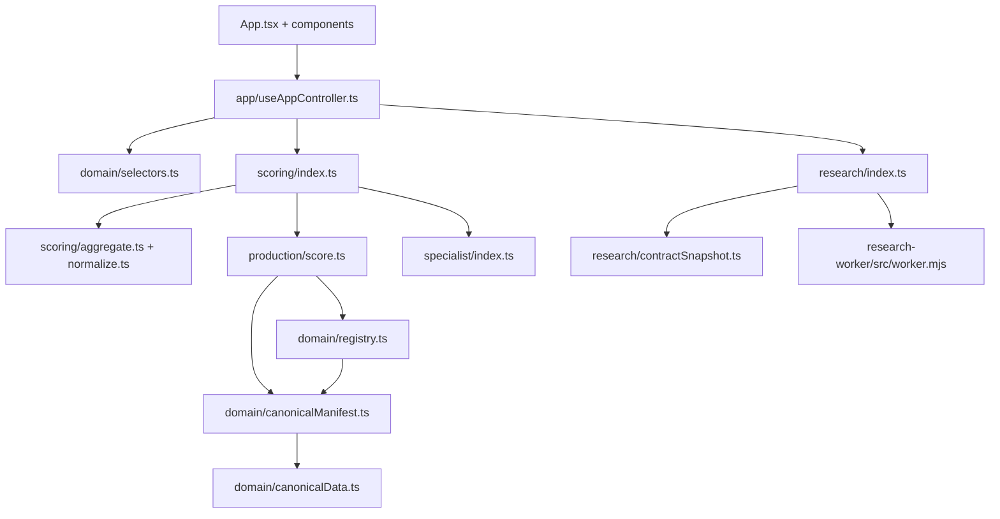

# v2 Architecture Inspection Report (Phase 0)

## 1) Current v1 architecture map (from inspection)

The current runtime is an integrated application shell plus a layered scoring stack that still shares historical contracts and compatibility projections.

### 1.1 Runtime boundaries in practice

`src/App.tsx` → `src/app/useAppController.ts` → `src/app/useApp*State.tsx` → `src/scoring/*` / `src/production/*` / `src/specialist/*` / `src/research/*`.

`src/domain/*` currently imports canonical TS authority from `src/domain/canonicalData.ts` via `CANONICAL_MANIFEST` and exports projection shapes through `selectors.ts`.

`research-worker/src/worker.mjs` validates request contracts and validates strict manifest/serialization metadata before accepting browser payloads.

### 1.2 Current module dependency sketch



### 1.3 Source-of-authority inventory in v1

| Artifact | Evidence | Why it matters |
|---|---|---|
| `research-worker/generated/canonical-manifest.json` | Loaded by Worker and manifests fields: `version`, `schemaVersion`, `fingerprint` | Finalized canonical inventory artifact used in deployed research flow |
| `src/domain/canonicalManifest.ts` | `CANONICAL_MANIFEST_SCHEMA_VERSION`, `CANONICAL_MANIFEST_VERSION`, `CANONICAL_MANIFEST_FINGERPRINT`, `CANONICAL_COUNTS` | Canonical metadata contract used by in-repo runtime and scripts |
| `src/domain/canonicalMigration.ts` | `FROZEN_SOURCE_COMMIT`, `APPROVED_METHODOLOGY_COMMIT`, `CANONICAL_MIGRATION_VERSION`, `EXPECTED_CANONICAL_COUNTS` | Migration checksums and roster identity used as audit boundary |
| `src/domain/registryValidation.ts` and `src/domain/registry.ts` | Validation and in-memory registry behavior | Defines schema, uniqueness, and reference integrity checks |
| `src/domain/canonicalSerialization.ts` | Canonical serialization and SHA-256 digest helpers | Deterministic serialization and fingerprinting primitives |
| `src/production/contracts.ts` and `src/production/score.ts` | Production-response + profile result contract versions | Stable production scoring contract surface |
| `src/research/contractSnapshot.ts` | Research contract metadata schema | Versioned research envelope contract and forbidden-field scan |

### 1.4 Active v2 canonical inventory

The active v2 counts, response-type breakdown, and content fingerprint are
machine-generated from the compiled bundle in
`docs/v2/generated/content-inventory.md`. The v1 migration counts remain
historical evidence in the extraction ledger and reconciliation report; they are
not repeated as a second active source of truth here.

### 1.5 Legacy coupling issues to break

- `vite.config.ts` alias still maps legacy import `./data/questions` to `src/data/effectiveQuestions.ts`.
- `src/domain/selectors.ts` retains old `Question`, `Axis`, `IdeologyLabel` shape and `LEGACY_QUESTION_BANK_VERSION`/compatibility checks.
- dual result shape currently exists: legacy `buildResultProfile()` and production `scoreProduction()` are both invoked in `src/scoring/index.ts`.
- production scoring still performs mapping inference fallbacks from manifest constructs and per-item fields before failing.

## 2) Proposed v2 architecture (clean-room target)

### 2.1 Package intent map

- `packages/contracts/`: stable public contracts for manifest, response, result, version metadata.
- `packages/content/`: schema validation, loader, compiler, bundle emitter.
- `packages/engine/`: pure and deterministic scoring kernel.
- `packages/view-model/`: UI-oriented projection only.
- `apps/web/`: React shell + routing + render only.
- `services/research-worker/`: request validation + envelope capture, no scoring logic.
- `research/analysis/`: offline methods and reproducible scripts.
- `reference/v1/`: immutable case fixtures and expected v1-v2 behavior classification.

### 2.2 Proposed dependency graph

```text
contracts
   ↓
content → engine → view-model → apps/web
contracts ← services/research-worker
contracts ↔ reference/v1 (fixtures for diff)
```

### 2.3 Engine purity constraints

- `engine` cannot import React.
- `engine` cannot import browser APIs.
- `engine` cannot import research code or v1 runtime code.
- `engine` cannot import `canonicalData.ts` or any `src/data/*` legacy passes.
- `view-model` and `apps/web` cannot contain scoring formulas.

### 2.4 Authoritative-source table for v2 implementation

| Source | Role in v2 | Versioned metadata | Migration status |
|---|---|---|---|
| `research-worker/generated/canonical-manifest.json` | Baseline content export for compiler input | Manifest version/fingerprint from current canonical run | Preserve values, re-authored as JSON seed |
| `src/domain/canonicalManifest.ts` | Compatibility mapping and freeze utility behavior | Manifest schema/version constants and counts | Use as reference, reimplement in `content` package |
| `src/domain/registryValidation.ts` | Validation behavior patterns (shape, duplicate, reference checks) | n/a | Reuse validation rules in new compiler |
| `src/domain/canonicalSerialization.ts` | Canonical serialization + strict JSON hashing | `canonical-json-v1` and hashing patterns | Reuse algorithmic behavior with stricter package contract |
| `src/production/contracts.ts` | Response/result version naming and metadata fields | `production-result-v1` etc | Port contracts into `packages/contracts` with stricter version separation |


## Phase 1 contract and schema baseline

- `v2/packages/contracts` now defines stable canonical contracts for content, responses, results, scoring gates, and version metadata.
- `v2/packages/content` now owns JSON schemas, structural validation, semantic cross-reference validation, deterministic serialization, and fingerprinting.
- Version contracts are separated into independent fields (`contentSchemaVersion`, `contentVersion`, `contentFingerprint`, `scoringVersion`, `responseSchemaVersion`, `resultSchemaVersion`, `researchSchemaVersion`).
- No v2 package imports from legacy runtime modules (`src/data`, `src/domain`, `src/scoring`, `src/production`, `src/specialist`, `src/validation`, `src/research`) in phase 1 scope.

## Phase 2 content boundary

`v2/content/` is the declarative canonical source. Its records are compiled and
validated by `v2/packages/content`; `v2/generated/` contains immutable derived
artifacts only. Extraction tools may read the approved v1 manifest and bounded
secondary evidence, but no v2 runtime package imports v1 runtime architecture or
historical overlay machinery.

## Phase 3 engine boundary

`v2/packages/engine` is a pure response-to-contribution boundary. It may read
Phase 1 contracts and the compiled Phase 2 content bundle, but it must not
import v1 runtime modules, UI modules, browser storage, or historical overlay
composition. It validates response and content invariants, normalizes raw
values, and emits explicit per-mapping contribution records only.

Construct aggregation, evidence thresholds, profile similarity, modifier
matching, specialist scoring, uncertainty, and `AssessmentResult` assembly
begin in later phases. No Phase 3 function may perform those operations.

## Phase 4 boundary: construct aggregation

Phase 4 adds the first scoring layer to the pure v2 engine. It consumes
Phase 3 normalized responses and explicit contribution records and produces
immutable construct scores, evidence coverage, support status, uncertainty,
and construct-level abstention. It does not perform profile matching,
modifier matching, specialist profile scoring, result labeling, UI work, or
deployment. Construct results are the only scoring authority introduced at
this phase and are the input boundary for Phase 5.

## Phase 5 boundary: primary profile matching

Phase 5 consumes only the immutable Phase 4 \`ConstructAssessment\` and the
canonical profile content. It does not import raw response contracts,
normalization, contribution generation, v1 runtime modules, modifiers,
specialist scoring, UI code, or deployment code. Profile requirements are the
sole comparison authority; ontology ancestry cannot supply missing targets.

The layer emits explicit profile-level scored/abstained results, gate
evaluations, evidence coverage, weighted RMS distance, bounded similarity,
deterministic ranking, and tie metadata. It does not assemble the final
assessment result.

## Phase 8 boundary: downstream diagnostics

Diagnostics consume authoritative Phase 3-7 outputs only. They sort and reconcile
existing contribution, evidence, comparison, gate, and specialist records; they
do not normalize responses, aggregate constructs, calculate profile distance,
match modifiers, or score specialists. Core scoring modules do not import the
diagnostics modules. Cross-dimension divergence pairs are explicit canonical
diagnostic relations, not name-matching heuristics.

## Phase 9 boundary: unified assessment result

## Phase 10 reference boundary

Behavioral comparison is isolated under `v2/reference/`, `scripts/v2-reference/`,
and `tests/v2-differential/`. The frozen v1 commit and behavior classifications
are explicit artifacts. No v2 runtime package imports the v1 adapter, reference
fixtures, historical overlays, or generated v1 TypeScript authority.

`v2/packages/engine/src/assessment/score-assessment.ts` is the only supported
end-to-end scoring entrypoint. It validates the exact content/version binding,
invokes the Phase 3-8 authorities in dependency order, and emits one immutable
`AssessmentResult`. The result does not contain raw responses or a nested
legacy/production result. `diagnostics.contributions` is the single canonical
contribution table; all other result layers use IDs or scored records emitted
by their authoritative layer.

## Phase 12 boundary: persistence and sharing

`v2/packages/persistence` is downstream of the public contracts and upstream
of the web state adapter. It owns versioned private envelopes, canonical
serialization, corruption detection, explicit legacy classification, and the
privacy-minimized public result projection. It does not import the v1 runtime,
the scoring engine, or historical overlays. The web validates imported inputs
through the public `validateAssessmentInput` facade and invokes
`scoreAssessment` exactly once when the user requests results.

## Phase 13 research boundary

Optional research is a post-result, explicit-consent consumer of the v2 response contract. The research package projects raw response states and version bindings; the isolated Worker validates and stores them. Neither imports v1 research code or scoring. Production writes are disabled in code. See `research-architecture.md` and `research-scoring-separation-audit.md`.
