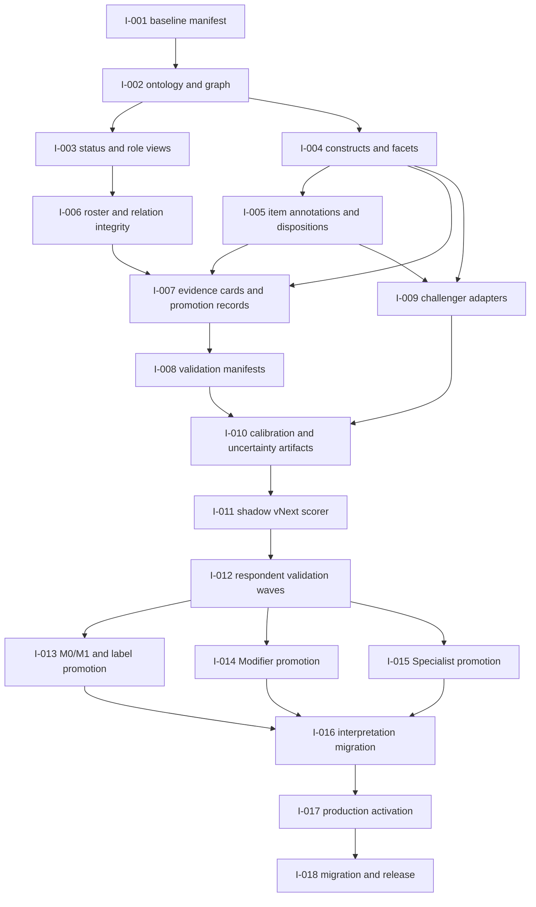

# Ideology Normative Sorter vNext Codex Implementation Specification — 2026-08

Status: dependency-ordered implementation plan for the integrated vNext
architecture. It authorizes scaffolding and research-only surfaces, not
automatic political-theory, taxonomy, measurement, or psychometric decisions.

Implementation specification version: `2026-08-vnext-codex-implementation-v1`

System authority:
[`vnext-integrated-system-specification-2026-08.md`](vnext-integrated-system-specification-2026-08.md)

Frozen baseline:
`f0324dbf27dfc6e35ff557992e4643e3df15ee0e`

## 1. Codex execution contract

Codex may implement a unit only when its listed methodological decisions,
inputs, and prerequisites are present. Codex must not decide any of the
following by inference:

- whether a label is a legitimate ideological tradition;
- whether two labels should merge, split, be renamed, or change role;
- whether a construct is valid, reliable, invariant, or fair;
- whether a respondent belongs to, identifies with, or is accurately classified
  by a tradition;
- whether a fit, margin, threshold, prototype, or latent class supports public
  promotion;
- whether a source-backed definition authorizes a respondent measurement claim.

If an implementation input is missing or two authoritative records conflict,
Codex must stop that unit, preserve the current behavior, and create a
decision-log or unresolved-question record. It must not invent a political or
psychometric resolution.

The repository is a mixed worktree. Preserve unrelated edits, do not stage or
rewrite broadly, and do not modify `sources/`. The current task produces
specifications and scaffolding only; no commit, push, production scorer change,
question replacement, or public-role promotion is authorized by this document.

## 2. Dependency graph and activation classes



| Activation class                    | Meaning                                                                                                                            |
| ----------------------------------- | ---------------------------------------------------------------------------------------------------------------------------------- |
| Immediate, compatibility-preserving | Documentation, manifests, types, research-only registries, validators, and regression tests that do not alter current output       |
| Research-only, respondent-gated     | New items, facet scores, challenger estimators, validation records, calibration, DIF, form comparison, and shadow scoring          |
| Promotion-gated                     | Any scored/displayed label, threshold, uncertainty language, modifier expansion, Specialist promotion, or claim tier above PC1     |
| Cutover-gated                       | Any change to current `buildResultProfile`, active bank, role arrays, production versions, stored result schema, or public wording |

## 3. Current repository component map

| Concern                    | Current authority                                                                                               | vNext target                                                                       |
| -------------------------- | --------------------------------------------------------------------------------------------------------------- | ---------------------------------------------------------------------------------- |
| Labels and v13 roles       | `src/data/labelTaxonomy.ts`, `src/data/labels.ts`                                                               | Add separate vNext ontology/role registries; retain v13 arrays                     |
| Primary scopes             | `src/data/primaryMeasurement.ts`                                                                                | Add vNext conceptual scope and facet requirements beside root compatibility scopes |
| Modifiers                  | `src/data/modifierMeasurement.ts`, `src/scoring/modifierConstructMatch.ts`                                      | Add domain/subdimension registry and evidence-gated future resolvers               |
| Axes/roots                 | `src/data/axes.ts`                                                                                              | Preserve root IDs; add facet registry without changing current axis scoring        |
| Core bank                  | `src/data/effectiveQuestions.ts`, `src/data/questions.ts`                                                       | Add research-only facet/construct annotation manifest                              |
| Item metadata              | `src/data/itemMetadata.ts`                                                                                      | Extend research-only metadata after annotation decision                            |
| Construct map              | `src/data/constructFamilies.ts`                                                                                 | Preserve domain family map; add canonical facet map and coverage ledger            |
| Production scoring         | `src/scoring/aggregate.ts`, `src/scoring/labelMatch.ts`, `src/scoring/index.ts`                                 | Add shadow adapter first; no replacement until promotion                           |
| Specialist routing/modules | `src/specialist/index.ts`, `src/data/experimentalSpecialists.ts`, `src/data/specialistEvidence.ts`              | Add explicit kind/prerequisite/status metadata; preserve routing roster            |
| Research versions          | `src/research/versions.ts`, `src/validation/researchContracts.ts`                                               | Add only approved vNext research constants; keep current bundle valid              |
| Validation contracts       | `src/validation/psychometrics.ts`, `src/validation/analysisContracts.ts`, `src/validation/researchContracts.ts` | Add evidence-card/promotion layer, not a validity shortcut                         |
| Public result UI           | `src/components/ResultsScreen.tsx`, `LabelCard.tsx`, `AxisBar.tsx`, `SpecialistModuleResultScreen.tsx`          | Add versioned statuses/language only after interpretation gate                     |
| Documentation              | `docs/`                                                                                                         | Keep integrated spec and implementation spec as entry points                       |

## 4. Implementation units

### I-001 — Freeze and validate the current baseline manifest

| Field                     | Specification                                                                                                                                                                         |
| ------------------------- | ------------------------------------------------------------------------------------------------------------------------------------------------------------------------------------- |
| Methodological decisions  | D-00, D-29, D-103–D-112, D-113–D-124; integrated IA-01–IA-14                                                                                                                          |
| Rationale                 | Every vNext artifact must identify the exact current baseline and distinguish active from historical records                                                                          |
| Affected files/components | Add `src/validation/vnextBaseline.ts` or a research-only manifest module; add `scripts/check-vnext-baseline.mjs`; tests under `src/validation/`                                       |
| Dependencies              | None beyond the frozen repository                                                                                                                                                     |
| Exact behavior            | Assert current commit metadata when supplied, version tuple, active core count 338, Specialist count 68, 26 roots, roster counts, module order, and no Context/retired scoring inputs |
| Migration                 | None; read-only compatibility check                                                                                                                                                   |
| Version bumps             | New research/check version `2026-08-vnext-baseline-check-v1`; do not change runtime bundle                                                                                            |
| Compatibility             | Must pass against the current v13 bundle and never rewrite historical records                                                                                                         |
| Tests                     | Unit assertions for counts and version tuple; registry cross-check; full `npm test`, lint, build, and `npm run research:check`                                                        |
| Documentation             | Record generated baseline evidence in the integrated specification and decision log                                                                                                   |
| Acceptance criteria       | A stale bank, roster, version, count, or role boundary fails closed with an actionable message; no production import is introduced                                                    |

### I-002 — Add the vNext ontology and faceted graph types

| Field                     | Specification                                                                                                                                                                                                                                         |
| ------------------------- | ----------------------------------------------------------------------------------------------------------------------------------------------------------------------------------------------------------------------------------------------------- |
| Methodological decisions  | D-32, D-33, D-36, D-65–D-75; integrated Sections 5–7                                                                                                                                                                                                  |
| Rationale                 | v13 `parentId` and role/status fields cannot represent the approved polyhierarchy or independent conceptual kinds                                                                                                                                     |
| Affected files/components | Add `src/types/vnextOntology.ts`, `src/data/vnextOntology.ts`, `src/data/vnextGraph.ts`, and `src/validation/vnextGraph.ts`                                                                                                                           |
| Dependencies              | I-001                                                                                                                                                                                                                                                 |
| Exact behavior            | Define `OntologyNode`, controlled `conceptualKind`, independent status fields, typed edge records, aliases, source scopes, and graph validation. Preserve v13 records as an imported compatibility view, never as the vNext graph itself              |
| Migration                 | Map existing `parentId`/typed relations into versioned vNext edges with provenance; retain original fields and IDs                                                                                                                                    |
| Version bumps             | `2026-08-vnext-ontology-v1`, `2026-08-vnext-graph-v1`                                                                                                                                                                                                 |
| Compatibility             | Research-only modules must not be imported by production scoring; v13 `labelTaxonomy` behavior remains unchanged                                                                                                                                      |
| Tests                     | Every active ID resolves; no duplicate node IDs; relation target existence; allowed relation types; alias acyclicity; `subtype_of` cycle checks within facets; symmetric relation derivation; no Context/retired edge accidentally exposed as a score |
| Documentation             | Add registry field definitions and edge constraints to the integrated system specification                                                                                                                                                            |
| Acceptance criteria       | The graph can represent multiple parents, hybrid relations, regional/history facets, institutionalization, non-equivalence, and Context relations without changing a v13 result                                                                       |

### I-003 — Add independent readiness and derived-role views

| Field                     | Specification                                                                                                                                                                                                              |
| ------------------------- | -------------------------------------------------------------------------------------------------------------------------------------------------------------------------------------------------------------------------- |
| Methodological decisions  | D-31, D-34, D-40–D-41, D-65–D-75, D-103–D-108                                                                                                                                                                              |
| Rationale                 | Conceptual standing, respondent readiness, and product role must be independently addressable                                                                                                                              |
| Affected files/components | Add `src/data/vnextRolePolicy.ts`, `src/validation/vnextRoleResolver.ts`, and research-only status types                                                                                                                   |
| Dependencies              | I-001, I-002                                                                                                                                                                                                               |
| Exact behavior            | Resolve a role view from conceptual kind, graph, measurement status, high-risk policy, evidence coverage, and explicit role policy. Emit reasons and blocking conditions. Never infer a role from fit or a v13 array alone |
| Migration                 | Produce a read-only vNext view for all current IDs; do not replace `roleForLabel` or current scoring arrays                                                                                                                |
| Version bumps             | `2026-08-vnext-role-policy-v1`                                                                                                                                                                                             |
| Compatibility             | Current v13 role/status output remains unchanged; adapters must expose both views during research                                                                                                                          |
| Tests                     | All 16/78/24/19/8 IDs resolve once; Context and retired roles are blocked from ordinary scoring; role/status combinations such as conceptually broad + catalog-only are legal; invalid combinations fail                   |
| Documentation             | Add role derivation examples and no-automatic-promotion rules                                                                                                                                                              |
| Acceptance criteria       | A Specialist can be conceptually broad without becoming a Primary; a Modifier can have multiple hosts; a Context can have a future Specialist route without being scored                                                   |

### I-004 — Add the canonical root/facet construct registry

| Field                     | Specification                                                                                                                                                                                   |
| ------------------------- | ----------------------------------------------------------------------------------------------------------------------------------------------------------------------------------------------- |
| Methodological decisions  | D-01–D-04, D-35, D-38, D-76–D-85; integrated Section 8                                                                                                                                          |
| Rationale                 | The repository currently has root axes and domain families but not a canonical facet layer                                                                                                      |
| Affected files/components | Add `src/types/vnextConstructs.ts`, `src/data/vnextConstructs.ts`, `src/validation/vnextConstructs.ts`                                                                                          |
| Dependencies              | I-001, I-002                                                                                                                                                                                    |
| Exact behavior            | Register all 26 root IDs, canonical facet IDs, layer, definition, neighboring roots, expected configurations, discriminant roles, risks, applicable labels/modules, and current coverage status |
| Migration                 | Link each root axis to its vNext root record; leave unimplemented facets marked `planned` or `effectively-unmeasured`                                                                           |
| Version bumps             | `2026-08-vnext-constructs-v1`, `2026-08-vnext-facet-map-v1`                                                                                                                                     |
| Compatibility             | Do not add facet scores to `ResultProfile`; existing axis IDs and construct-family map remain valid                                                                                             |
| Tests                     | Root/facet ID uniqueness; layer validity; no facet points to unknown root; required risk/validation fields present; all Primary/Modifier/Specialist references resolve                          |
| Documentation             | Include the full root/facet table and coverage statuses in the integrated spec; link to the construct blueprint                                                                                 |
| Acceptance criteria       | Undefined constructs are represented explicitly as missing/planned rather than silently treated as measured roots                                                                               |

### I-005 — Add research-only item annotations and disposition manifests

| Field                     | Specification                                                                                                                                                                                                                                |
| ------------------------- | -------------------------------------------------------------------------------------------------------------------------------------------------------------------------------------------------------------------------------------------- |
| Methodological decisions  | D-38, D-86–D-90, D-115–D-117; integrated Section 9                                                                                                                                                                                           |
| Rationale                 | The item audit has facet intentions and dispositions that are not yet runtime metadata                                                                                                                                                       |
| Affected files/components | Add `src/data/vnextItemAnnotations.ts`, `src/data/vnextItemDispositions.ts`, and optional manifest loader under `src/validation/`                                                                                                            |
| Dependencies              | I-004                                                                                                                                                                                                                                        |
| Exact behavior            | Key every effective item by stable ID with root/facet/local-construct IDs, semantic direction, disposition, risk flags, provenance, replacement link, coverage consequence, and analysis eligibility. Keep statement-choice options separate |
| Migration                 | Import the 406 audited records; inactive historical records remain traceable but excluded from active scoring                                                                                                                                |
| Version bumps             | `2026-08-vnext-item-annotations-v1`, `2026-08-vnext-item-dispositions-v1`                                                                                                                                                                    |
| Compatibility             | Research-only; do not alter `Question.axisWeights`, `active`, tier, wording, or scorer behavior                                                                                                                                              |
| Tests                     | Every active core and Specialist question has exactly one audit record; every audit ID resolves; no retired item is active; six statement-choice items have option-level records; disposition counts match 328/49/16/10/3                    |
| Documentation             | Preserve the full item audit as the source of prompt-level rationale and coverage consequences                                                                                                                                               |
| Acceptance criteria       | Removing or replacing an item cannot pass the manifest check unless its coverage consequence and stable provenance are present                                                                                                               |

### I-006 — Add roster, alias, and graph integrity checks

| Field                     | Specification                                                                                                                                                                                                        |
| ------------------------- | -------------------------------------------------------------------------------------------------------------------------------------------------------------------------------------------------------------------- |
| Methodological decisions  | D-30–D-43, D-44–D-75, D-103–D-112; integrated IA-10–IA-12                                                                                                                                                            |
| Rationale                 | Roster drift is a mechanical failure that can masquerade as a theory or measurement decision                                                                                                                         |
| Affected files/components | Extend `src/data/labelTaxonomy.test.ts`, `src/data/primaryMeasurement.test.ts`, `src/data/modifierMeasurement.test.ts`, `src/specialist/index.test.ts`; add `src/validation/vnextRosterIntegrity.ts`                 |
| Dependencies              | I-002, I-003, I-004                                                                                                                                                                                                  |
| Exact behavior            | Verify all current IDs, exactly one current role, all Primary scopes, all Modifier dispositions, 39 module mappings, 39 provisional Specialists, nine module order, aliases, retired mappings, and Context exclusion |
| Migration                 | Read-only; future registry changes require a new vNext version and decision record                                                                                                                                   |
| Version bumps             | None for current compatibility; future roster changes use the relevant ontology/taxonomy version                                                                                                                     |
| Compatibility             | Do not change `PRIMARY_LABEL_IDS`, `SPECIALIST_LABEL_IDS`, `MODIFIER_LABEL_IDS`, `CONTEXT_LABEL_IDS`, or `RETIRED_LABEL_IDS` in this unit                                                                            |
| Tests                     | Registry count, orphan, duplicate, alias, module-candidate, and scorer-input tests                                                                                                                                   |
| Documentation             | Add generated counts and failure interpretation to the integration audit                                                                                                                                             |
| Acceptance criteria       | A missing, duplicated, cross-role, or unassigned ID prevents release of the research manifest                                                                                                                        |

### I-007 — Add label evidence-card and promotion-record schemas

| Field                     | Specification                                                                                                                                                                                                                                                                                          |
| ------------------------- | ------------------------------------------------------------------------------------------------------------------------------------------------------------------------------------------------------------------------------------------------------------------------------------------------------ |
| Methodological decisions  | D-118–D-124; empirical validation Sections 8 and 16                                                                                                                                                                                                                                                    |
| Rationale                 | Existing psychometric/model contracts are not complete label-level promotion records                                                                                                                                                                                                                   |
| Affected files/components | Add `src/types/evidenceCard.ts`, `src/validation/evidenceCards.ts`, `src/validation/promotionRecords.ts`                                                                                                                                                                                               |
| Dependencies              | I-002–I-006                                                                                                                                                                                                                                                                                            |
| Exact behavior            | Define `LabelEvidenceCard` with identity, conceptual kind, graph, scope, construct requirements, M0/M1 fields, module, version tuple, nine evidence components, claim ceiling, public state, critical failures, reviewer records, and reassessment date. Define `ValidationPromotionRecord` separately |
| Migration                 | Create not-started/compatibility-scored-unvalidated cards for all 16 Primaries and all 78 Specialists; do not fill missing evidence with `pass`                                                                                                                                                        |
| Version bumps             | `2026-08-vnext-evidence-card-v1`, `2026-08-vnext-promotion-record-v1`                                                                                                                                                                                                                                  |
| Compatibility             | Research artifacts only; no card status may alter runtime result eligibility without a later release decision                                                                                                                                                                                          |
| Tests                     | Schema validation; nine component presence; scope matching; no family-level automatic promotion; failed/unknown components block promotion; claim tier cannot exceed supported evidence                                                                                                                |
| Documentation             | Card schema, lifecycle, and example records in the empirical validation authority                                                                                                                                                                                                                      |
| Acceptance criteria       | A label cannot move to respondent-supported or validated-scoped-public without its own scoped card and promotion record                                                                                                                                                                                |

### I-008 — Add validation manifests and respondent-data contracts

| Field                     | Specification                                                                                                                                                                                                   |
| ------------------------- | --------------------------------------------------------------------------------------------------------------------------------------------------------------------------------------------------------------- |
| Methodological decisions  | D-113–D-117, D-121–D-124; empirical validation Sections 3–7, 14–17                                                                                                                                              |
| Rationale                 | Validation must be staged, preregistered, split-safe, and scope-specific                                                                                                                                        |
| Affected files/components | Extend `src/types/research.ts`, `src/validation/analysisContracts.ts`, and `src/validation/researchContracts.ts`; add `src/validation/validationManifest.ts`                                                    |
| Dependencies              | I-004, I-005, I-007                                                                                                                                                                                             |
| Exact behavior            | Represent V0–V13 stage, preregistration, sample/split membership, raw response states, exact form/items, criterion timing/exposure, analysis seed/code revision, estimand, inclusion manifest, and card linkage |
| Migration                 | Existing v19 records remain valid historical records; a new validation wave receives a new manifest/version rather than being relabeled                                                                         |
| Version bumps             | `2026-08-vnext-validation-manifest-v1`, then a new research schema only if stored envelope changes                                                                                                              |
| Compatibility             | Keep current research bundle and worker contracts valid; fail closed on mixed versions                                                                                                                          |
| Tests                     | Version-bundle checks, respondent/retest leakage checks, missingness preservation, exposure-before-criterion checks, inclusion denominator checks, and exact form fingerprint checks                            |
| Documentation             | Add preregistration template and reporting/null-result requirements                                                                                                                                             |
| Acceptance criteria       | Every analysis artifact can be traced to a respondent set, version tuple, code revision, estimand, seed, and stage                                                                                              |

### I-009 — Add challenger-model adapters

| Field                     | Specification                                                                                                                                                                                                               |
| ------------------------- | --------------------------------------------------------------------------------------------------------------------------------------------------------------------------------------------------------------------------- |
| Methodological decisions  | D-16–D-19, D-39, D-120; empirical validation Section 12                                                                                                                                                                     |
| Rationale                 | Theory-led factors, production prototypes, and respondent-derived profiles answer different questions                                                                                                                       |
| Affected files/components | Add research-only adapters under `analysis/` or `src/validation/challengers/`; reuse `ResearchModelSpecification` and `ResearchModelResult`                                                                                 |
| Dependencies              | I-004, I-005, I-008                                                                                                                                                                                                         |
| Exact behavior            | Run preregistered theory-led multidimensional models, the frozen production baseline, and exploratory LCA/LPA/profile/network models with held-out comparison, criterion links, fairness checks, and disagreement artifacts |
| Migration                 | No challenger result is written into `ResultProfile` or ordinary label arrays                                                                                                                                               |
| Version bumps             | Use existing comparison IDs where sufficient; otherwise `2026-08-vnext-challenger-models-v1`                                                                                                                                |
| Compatibility             | Research-only; no import from production scoring path                                                                                                                                                                       |
| Tests                     | Contract validation, deterministic seed/provenance, missingness behavior, nonconvergence handling, holdout separation, and model-disagreement record generation                                                             |
| Documentation             | Record model family, estimand, identification, item eligibility, and why a result is exploratory or confirmatory                                                                                                            |
| Acceptance criteria       | Disagreement creates a taxonomy/construct review queue and never creates a new public ideology name automatically                                                                                                           |

### I-010 — Add calibration, uncertainty, and robustness artifacts

| Field                     | Specification                                                                                                                                                                                                     |
| ------------------------- | ----------------------------------------------------------------------------------------------------------------------------------------------------------------------------------------------------------------- |
| Methodological decisions  | D-15, D-20, D-28, D-69–D-75, D-108, D-121; empirical validation Sections 13–15                                                                                                                                    |
| Rationale                 | Current fit, coverage, margins, and item-count bands are heuristics and must not be represented as validated uncertainty                                                                                          |
| Affected files/components | Extend `src/types/research.ts` or add `src/validation/calibrationContracts.ts`; add analysis/report schemas for reliability, information, uncertainty, DIF, invariance, forms, omission, and scoring alternatives |
| Dependencies              | I-008, I-009                                                                                                                                                                                                      |
| Exact behavior            | Store construct/label calibration curves, uncertainty intervals, neighbor margins, omission sensitivity, alternative-model comparisons, DIF/invariance outcomes, form-equivalence reports, and scope limitations  |
| Migration                 | Current `AxisReliability`/`LabelReliability` fields remain compatibility coverage fields; no backfill to psychometric estimates                                                                                   |
| Version bumps             | `2026-08-vnext-calibration-v1`, `2026-08-vnext-uncertainty-v1`, `2026-08-vnext-robustness-v1`                                                                                                                     |
| Compatibility             | Research-only until promotion record authorizes any public effect                                                                                                                                                 |
| Tests                     | Estimand/denominator validation, interval bounds, subgroup manifest checks, multiple-testing metadata, alternative-scoring provenance, and no “reliability” claim from item count alone                           |
| Documentation             | Map each output to PC2–PC7 claim eligibility and unresolved scope                                                                                                                                                 |
| Acceptance criteria       | No threshold or uncertainty field can be consumed by production display without an evidence-card and release decision                                                                                             |

### I-011 — Add shadow vNext construct/facet scoring

| Field                     | Specification                                                                                                                                                                                                              |
| ------------------------- | -------------------------------------------------------------------------------------------------------------------------------------------------------------------------------------------------------------------------- |
| Methodological decisions  | D-35, D-38, D-76–D-85, D-91–D-102                                                                                                                                                                                          |
| Rationale                 | vNext construct/facet estimates must be evaluated beside, not substituted for, the frozen root scorer                                                                                                                      |
| Affected files/components | Add `src/scoring/vnextShadow.ts`, `src/scoring/vnextShadow.test.ts`, and research result envelope types                                                                                                                    |
| Dependencies              | I-004, I-005, I-008, I-010                                                                                                                                                                                                 |
| Exact behavior            | Compute layer-specific root/facet estimates with measured masks, missingness, local item eligibility, declared weights, and uncertainty metadata; emit a shadow object alongside the v13 `ResultProfile`                   |
| Migration                 | Preserve both root compatibility output and shadow facet output; do not alter existing result serialization unless a new research schema is approved                                                                       |
| Version bumps             | `2026-08-vnext-shadow-scoring-v1`                                                                                                                                                                                          |
| Compatibility             | No production route or UI consumption; current scorer remains the baseline comparator                                                                                                                                      |
| Tests                     | Missingness invariants, layer separation, statement-choice handling, direction checks, item/construct coverage, duplicate-contribution checks, and regression against current root estimates where equivalence is expected |
| Documentation             | State which facets are planned, measured, contaminated, or unmeasured                                                                                                                                                      |
| Acceptance criteria       | Shadow scoring cannot manufacture values for absent facets and can be compared to production/challenger models with complete provenance                                                                                    |

### I-012 — Build the respondent validation waves

| Field                     | Specification                                                                                                                                                                                                                                                                          |
| ------------------------- | -------------------------------------------------------------------------------------------------------------------------------------------------------------------------------------------------------------------------------------------------------------------------------------- |
| Methodological decisions  | D-113–D-124; all empirical-validation gates                                                                                                                                                                                                                                            |
| Rationale                 | Theoretical and implementation readiness is not respondent evidence                                                                                                                                                                                                                    |
| Affected files/components | Research task bank/forms, consent and recruitment docs, collection worker contracts, analysis manifests, evidence-card artifacts                                                                                                                                                       |
| Dependencies              | I-007–I-011                                                                                                                                                                                                                                                                            |
| Exact behavior            | Execute V0–V13 in order: expert/content, cognitive, pilot, item analysis, dimensionality, confirmation, reliability/information, retest, nearest-neighbor, criterion/self-ID, M0/M1, Specialist, DIF/invariance, form equivalence, uncertainty, robustness, replication, and promotion |
| Migration                 | New waves use new study/form/item/analysis versions; historical `community-2026-v5` records remain historical                                                                                                                                                                          |
| Version bumps             | Per-wave preregistration and analysis versions; no production version bump until I-016/I-017                                                                                                                                                                                           |
| Compatibility             | Collection may run beside current production only through explicit research consent and versioned routing                                                                                                                                                                              |
| Tests                     | Research contract, consent, data quality, form fingerprint, retest linkage, criterion timing, and analysis reproducibility checks                                                                                                                                                      |
| Documentation             | Preregister confirmatory analyses, label cards, missing/null results, sample limitations, and exploratory analyses separately                                                                                                                                                          |
| Acceptance criteria       | No label or construct is promoted because a pilot is “interesting”; promotion requires the applicable card components and confirmation/replication                                                                                                                                     |

### I-013 — Run M0/M1 and label-specific promotion analysis

| Field                     | Specification                                                                                                                                                                                                          |
| ------------------------- | ---------------------------------------------------------------------------------------------------------------------------------------------------------------------------------------------------------------------- |
| Methodological decisions  | D-37, D-42, D-119, D-123–D-124                                                                                                                                                                                         |
| Rationale                 | Compound labels require respondent-measured residual value beyond a broader host-plus-facets representation                                                                                                            |
| Affected files/components | `src/validation/` label analyses, evidence-card builder, promotion record builder, research report outputs                                                                                                             |
| Dependencies              | I-007–I-012                                                                                                                                                                                                            |
| Exact behavior            | Compare M0 and M1 on held-out construct fit, nearest-neighbor separation, criterion interpretation, retest, fairness/scope, robustness, and presentation comprehension; analyze every applicable compound consistently |
| Migration                 | A failed M1 remains a conceptual historical object and may be retained as M0/configuration, Specialist, Context, or held only through a new decision record                                                            |
| Version bumps             | `2026-08-vnext-label-calibration-v1`; promotion decision version per label/card                                                                                                                                        |
| Compatibility             | No current Primary role or scorer changes                                                                                                                                                                              |
| Tests                     | Analysis-manifest checks, held-out separation, residual estimand, no self-ID leakage, card completeness, and no automatic family promotion                                                                             |
| Documentation             | Record National Conservatism and Liberal Conservatism priority reports and all other compound candidates with the same decision rule                                                                                   |
| Acceptance criteria       | M1 cannot be displayed as an independent public endpoint without a positive, scoped, replicated residual decision                                                                                                      |

### I-014 — Promote direct Modifier domains only after evidence

| Field                     | Specification                                                                                                                                                                                                                                             |
| ------------------------- | --------------------------------------------------------------------------------------------------------------------------------------------------------------------------------------------------------------------------------------------------------- |
| Methodological decisions  | D-44–D-54, D-106, D-121, integrated Modifier rules                                                                                                                                                                                                        |
| Rationale                 | Cross-host portability and construct independence must be demonstrated, not assumed from a useful label                                                                                                                                                   |
| Affected files/components | Future `src/data/vnextModifierDomains.ts`, `src/scoring/vnextModifiers.ts`, modifier evidence cards, result status adapters                                                                                                                               |
| Dependencies              | I-004–I-013 and direct Modifier validation                                                                                                                                                                                                                |
| Exact behavior            | Add scored domain/subdimension estimates only when direct indicators, cross-host portability, neighboring separation, criterion interpretation, retest, fairness, and omission robustness pass. Keep current seven direct contracts compatible until then |
| Migration                 | Catalog-only/focused labels remain abstaining; new ordinary modifiers receive a new measurement/scoring/interpretation tuple                                                                                                                              |
| Version bumps             | `2026-08-vnext-modifier-domains-v1`, `2026-08-vnext-modifier-measurement-v1`, scorer/presentation bumps if public                                                                                                                                         |
| Compatibility             | Never infer nationalism, populism, fiscal, social-conservative, regional, or transhumanist modifiers from current axes or host labels                                                                                                                     |
| Tests                     | Direct-indicator, host-separation, contamination, missingness, sensitive-content, DIF/invariance, and display-status tests                                                                                                                                |
| Documentation             | Update Modifier roster only through a new decision record; preserve conceptual labels even when measurement remains held                                                                                                                                  |
| Acceptance criteria       | A new Modifier is displayed only with its own construct evidence and public claim tier; host-plus-Modifier arithmetic is prohibited                                                                                                                       |

### I-015 — Promote Specialist eligibility and classification only after module evidence

| Field                     | Specification                                                                                                                                                                                                 |
| ------------------------- | ------------------------------------------------------------------------------------------------------------------------------------------------------------------------------------------------------------- |
| Methodological decisions  | D-36, D-55–D-64, D-98, D-107, D-118, D-123                                                                                                                                                                    |
| Rationale                 | Specialist systems are heterogeneous and conditional; module assignment and local fit do not prove subtype validity                                                                                           |
| Affected files/components | Future Specialist metadata in `src/specialist/`, module evidence contracts, `SpecialistOutcome` status fields, focused result UI                                                                              |
| Dependencies              | I-002–I-013 and module-specific V10/V13 evidence                                                                                                                                                              |
| Exact behavior            | Declare specialistKind, parent relations, prerequisites, local constructs, candidate signals, gate status, evidence coverage, criterion fields, and display state. Support multiple affinities and abstention |
| Migration                 | Preserve `balanced-hash-v2` routing and existing study allocation; a module roster/order change requires a new strategy or study cohort                                                                       |
| Version bumps             | Module-specific versions; `2026-08-vnext-specialist-status-v1`; roster/strategy bump only when assignment changes                                                                                             |
| Compatibility             | Current experimental output remains marked experimental; no Specialist enters ordinary Primary matching                                                                                                       |
| Tests                     | Assignment stability, prerequisite abstention, within-family separation, module skip invariance, candidate coverage, sensitive/high-risk wording, and public status badges                                    |
| Documentation             | Update the label evidence card and Specialist review for each promoted label individually                                                                                                                     |
| Acceptance criteria       | A module can return “not-administered,” “insufficient,” “blocked,” multiple experimental affinities, or a promoted scoped result; it can never force an unsupported subtype                                   |

### I-016 — Implement the versioned interpretation and claim-status adapter

| Field                     | Specification                                                                                                                                                                                                                                          |
| ------------------------- | ------------------------------------------------------------------------------------------------------------------------------------------------------------------------------------------------------------------------------------------------------ |
| Methodological decisions  | D-103–D-112, D-121–D-124; integrated Section 12                                                                                                                                                                                                        |
| Rationale                 | Current UI contains compatibility terminology such as “Result confidence”; vNext needs explicit status/claim language without rewriting historical results                                                                                             |
| Affected files/components | Future adapters around `src/components/ResultsScreen.tsx`, `LabelCard.tsx`, `AxisBar.tsx`, `SpecialistModuleResultScreen.tsx`, `src/resultLanguage.ts`; result/export/API status types                                                                 |
| Dependencies              | I-003, I-007, I-010, I-013–I-015                                                                                                                                                                                                                       |
| Exact behavior            | Render profile/neighborhood/affinity-set/best-supported-affinity/abstention, Modifier, Specialist, Context, evidence coverage, uncertainty source, form depth, scope, and claim tier. Do not render unsupported probability/identity/validity language |
| Migration                 | Keep v13 wording and fields for historical compatibility; new presentation version carries explicit semantic statuses and may deprecate “confidence” wording only with comprehension evidence                                                          |
| Version bumps             | `2026-08-vnext-interpretation-v1`, `2026-08-vnext-presentation-v1`, and schema/API bump if serialized fields change                                                                                                                                    |
| Compatibility             | Old shared links and exports remain decodable; recomputed results state their current tuple                                                                                                                                                            |
| Tests                     | Browser/UI snapshots for close ties, abstention, missing facets, experimental Specialist, Context non-score, self-ID separation, forbidden words, and versioned exports                                                                                |
| Documentation             | Update reusable language in results, methodology, shared links, research materials, exports, and API docs                                                                                                                                              |
| Acceptance criteria       | A public string is emitted only if its required claim tier is supported for the exact object, form, population, language, and version                                                                                                                  |

### I-017 — Shadow-to-production vNext scorer migration

| Field                     | Specification                                                                                                                                                                                                        |
| ------------------------- | -------------------------------------------------------------------------------------------------------------------------------------------------------------------------------------------------------------------- |
| Methodological decisions  | D-11–D-12, D-35, D-38, D-91–D-102, D-120–D-124                                                                                                                                                                       |
| Rationale                 | A production replacement requires evidence and explicit migration, not a refactor of the current scorer                                                                                                              |
| Affected files/components | Future `src/scoring/vnext/`, `src/data/vnextPrimaryMeasurement.ts`, `src/data/vnextModifierMeasurement.ts`, result types, research contracts, UI adapters                                                            |
| Dependencies              | I-002–I-016; all applicable evidence cards and promotion records                                                                                                                                                     |
| Exact behavior            | Only after release approval, consume validated construct/facet estimates, calibrated thresholds/uncertainty, explicit role/status views, and approved claim language; retain a compatibility adapter for old results |
| Migration                 | Add a new scoring/taxonomy/construct/interpretation/schema tuple; never reinterpret v13 scores in place; provide recomputation/snapshot semantics                                                                    |
| Version bumps             | Proposed: `2026-08-vnext-taxonomy-v1`, `2026-08-vnext-primary-measurement-v1`, `2026-08-vnext-modifier-measurement-v1`, `2026-08-vnext-scoring-v1`, `2026-08-vnext-schema-v1`                                        |
| Compatibility             | v13 remains available for old records and links; new and old tuples cannot be mixed without linking documentation                                                                                                    |
| Tests                     | Golden current-v13 regression, shadow/prod comparison, migration round trips, absent-construct abstention, tie handling, status/claim gating, accessibility/browser, worker compatibility, and full repository gate  |
| Documentation             | Update all authority headers, release notes, migration guide, methodology copy, and API/export contract                                                                                                              |
| Acceptance criteria       | A signed promotion record exists for each changed label/construct/claim; all critical gates pass; rollback to v13 is possible; no unresolved theory or empirical question is hidden in code                          |

### I-018 — Release, reassessment, and rollback controls

| Field                     | Specification                                                                                                                                                                     |
| ------------------------- | --------------------------------------------------------------------------------------------------------------------------------------------------------------------------------- |
| Methodological decisions  | D-00, D-29, D-111–D-124                                                                                                                                                           |
| Rationale                 | Promotion is a governed release, not the last successful test run                                                                                                                 |
| Affected files/components | Release manifest, CI/release scripts, evidence-card artifacts, documentation, monitoring/reporting paths                                                                          |
| Dependencies              | I-001–I-017 as applicable                                                                                                                                                         |
| Exact behavior            | Require version tuple, code revision, card/promotion records, reviewer signoff, claim tier, scope, reassessment date, adverse/null results, and rollback target before activation |
| Migration                 | Preserve previous release artifacts and current v13 fallback; never delete evidence or historical result decoders                                                                 |
| Version bumps             | Release manifest version only until production activation; then all tuple components changed by the approved release                                                              |
| Compatibility             | CI rejects mixed tuples, missing cards, unsupported claims, or unreviewed role changes                                                                                            |
| Tests                     | Release-gate fixtures, migration/rollback, manifest completeness, link/reference checks, build, lint, unit tests, browser checks where UI changed                                 |
| Documentation             | Publish the exact evidence scope and limitations; update unresolved questions and reassessment schedule                                                                           |
| Acceptance criteria       | Release is impossible when a critical evidence component fails or a public claim exceeds its authorized tier                                                                      |

## 5. Immediate implementation scope

The following are suitable for immediate implementation without respondent
evidence because they preserve current behavior:

- baseline/version/roster integrity checks (I-001, I-006);
- research-only ontology, graph, status, and role registries (I-002, I-003);
- research-only root/facet registry and item annotation/disposition manifest
  (I-004, I-005);
- label evidence-card and promotion-record schemas with all current cards
  held/not-started (I-007);
- staged validation manifests and split-safe provenance contracts (I-008);
- research-only challenger adapters and calibration artifact schemas (I-009,
  I-010);
- documentation, authority links, generated counts, and compatibility tests;
- no-score Context exclusion and no-automatic-promotion tests.

These changes must not alter `buildResultProfile`, active item selection,
current Primary/Modifier arrays, Specialist assignment order, current public
thresholds, result wording, or the runtime version bundle.

## 6. Evidence-gated activation scope

The following cannot be activated from code correctness or synthetic fixtures:

- facet-level production scores;
- audited item rewrites/replacements in the active bank;
- changed construct/item/axis weights or covariance similarity;
- calibrated Primary margins, exclusive display, standard errors, or
  probability language;
- independent M1 endpoints for National Conservatism, Liberal Conservatism, or
  other compounds;
- new ordinary Modifier domains or left/right configurations;
- Specialist promotion or new Specialist assignment roster;
- public claims above PC1;
- cross-depth equivalence, cross-language invariance, subgroup fairness, or
  temporal transport claims;
- LCA/LPA-derived public labels;
- migration of legacy “confidence,” “reliability,” or affinity fields into new
  semantic claims.

Each requires the relevant evidence card, validation stage, promotion record,
version bump, migration tests, and decision-log authorization.

## 7. Codex acceptance checklist

Before considering an implementation unit complete, Codex must verify:

1. the unit’s decision IDs and dependencies are named in the change;
2. no unrelated worktree changes were staged or overwritten;
3. existing v13 fixtures and current public behavior remain stable unless the
   unit is explicitly promotion-gated;
4. new research-only code cannot be imported by production scoring;
5. all IDs, relations, constructs, items, modules, versions, and provenance
   referenced by the unit resolve;
6. missingness and refusal states remain distinct;
7. no synthetic, theoretical, expert, or software result is labeled respondent
   validity;
8. public status and claim language match the evidence tier;
9. tests cover both the positive path and abstention/blocked/not-administered
   paths; and
10. `npm test`, `npm run lint`, `npm run build`, `npm run research:check`, and
    any relevant browser/worker/research checks pass before release.

## 8. Required handoff format for future Codex work

Every future implementation batch must report:

```text
Implementation ID(s)
Decision ID(s)
Files changed
Version changes
Production effect: none | compatibility-preserving | gated | activated
Research/evidence prerequisites
Tests and exact results
Migration/rollback behavior
Unresolved questions or blockers
```

If the batch requires a new political-theory, taxonomy, construct, scoring, or
psychometric judgment, Codex must return a decision request rather than encode
the judgment.
