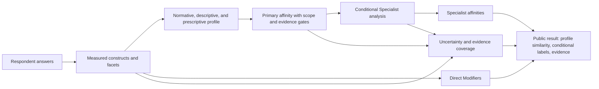

# vNext construct architecture and measurement blueprint — 2026-08

This document defines the construct and facet layer beneath the approved
Primary, Modifier, Specialist, and Context taxonomy architecture. It continues
the frozen Measurement Architecture at
`f0324dbf27dfc6e35ff557992e4643e3df15ee0e` and does not change the frozen
runtime scorer, question bank, taxonomy roster, or research records.

The integrated system authority is
[`vnext-integrated-system-specification-2026-08.md`](vnext-integrated-system-specification-2026-08.md);
this document remains the detailed construct/facet authority.

It is a conceptual and measurement-design blueprint. Item counts and coverage
labels below describe the current instrument and its content map. They do not
establish reliability, dimensionality, criterion validity, fairness, or
respondent understanding.

## 1. Executive decision

The authoritative measurement flow is:



The 26 frozen axis IDs remain the current root construct IDs. vNext adds
facet-level planning IDs beneath those roots without assuming that every root
is a single latent trait. Specialist-local constructs remain conditional
module constructs, not additional global axes. Direct Modifier constructs are
cross-host measurement nodes with their own indicator contracts.

The current effective instrument contains:

| Surface                             | Current inventory | Interpretation                                                                                                                                      |
| ----------------------------------- | ----------------: | --------------------------------------------------------------------------------------------------------------------------------------------------- |
| Active core bank                    |         338 items | Ordinary profile and Primary/Modifier paths                                                                                                         |
| Conditional Specialist modules      |          68 items | Nine focused modules; experimental and opt-in                                                                                                       |
| Effective respondent-facing bank    |         406 items | 338 core plus 68 conditional items, not one 406-item form                                                                                           |
| Root constructs                     |           26 axes | 10 normative, 7 descriptive, 9 prescriptive                                                                                                         |
| Operational domains                 |        20 domains | Current item-bank and family-audit grouping                                                                                                         |
| Direct ordinary Modifier constructs |                 7 | Anti-imperialism, Cosmopolitanism, Civil-libertarianism, Decentralist Orientation, Feminist Orientation, Multiculturalism, Technocratic Orientation |
| Specialist-local constructs         |                54 | Module-specific distinctions; mostly sparse and unvalidated                                                                                         |

## 2. Ontology and status rules

### 2.1 Construct layers

Every construct record must declare one primary role:

- `normative`: what the respondent treats as legitimate, just, valuable, or
  morally permissible;
- `descriptive`: what the respondent believes about institutions, mechanisms,
  causal processes, or likely outcomes;
- `prescriptive`: what the respondent recommends doing, especially under
  non-ideal constraints.

`ideal`, `nonideal`, and `mixed` remain theory-context metadata, not layers.
An item may have only one layer even when its theory context is mixed.

### 2.2 Construct levels

| Level                      | Purpose                                                                                                       | Current status                                                                            |
| -------------------------- | ------------------------------------------------------------------------------------------------------------- | ----------------------------------------------------------------------------------------- |
| Root construct             | Stable current axis ID and broad comparison coordinate                                                        | Existing v13 implementation surface; content status reviewed here                         |
| Facet                      | Narrow political question beneath a root, such as membership basis or expert accountability                   | vNext planning ontology; not yet a new runtime score                                      |
| Configuration              | A measured combination of host, facets, and relations, such as national priority plus conservative continuity | Taxonomy relation or research model; never inferred from one axis                         |
| Direct Modifier construct  | Cross-host construct with explicitly declared core indicators                                                 | Seven current direct constructs; remaining Modifier labels abstain or remain catalog-only |
| Specialist-local construct | Narrow within-family construct used by an opt-in module                                                       | 54 current nodes; experimental and evidence-gated                                         |

### 2.3 Coverage statuses

The status is a content and instrument-architecture judgment, not a validity
claim.

- `adequately covered`: current items provide a reasonably direct and varied
  content sample for the narrow root definition, subject to respondent
  validation;
- `overrepresented`: the root receives disproportionate item volume or repeated
  cross-domain loading relative to the rest of the instrument; high volume does
  not cure contamination;
- `underrepresented`: the root has too few independent, varied, or depth-usable
  indicators for its intended conceptual breadth;
- `contaminated`: substantial current content combines the root with neighboring
  constructs, making the root score difficult to interpret as a distinct
  construct;
- `effectively unmeasured`: no direct or sufficient construct-matched indicator
  exists for the intended facet or module construct.

No root axis is zero-item in the current bank. Several vNext facets, Modifier
labels, and Specialist-local constructs are nevertheless effectively unmeasured.

## 3. Authoritative root construct ontology

The facet IDs below are canonical vNext planning IDs. The existing axis IDs are
preserved as root IDs. Facet IDs do not authorize new scores until separately
versioned item development and respondent validation.

### 3.1 Normative roots

| Root ID and name                                                 | Domain                                                | Canonical definition and facets                                                                                                                                                                                                                                                                                                            | Expected ideological configurations                                                                                                                                                                            |
| ---------------------------------------------------------------- | ----------------------------------------------------- | ------------------------------------------------------------------------------------------------------------------------------------------------------------------------------------------------------------------------------------------------------------------------------------------------------------------------------------------ | -------------------------------------------------------------------------------------------------------------------------------------------------------------------------------------------------------------- |
| `authority-legitimacy` — Authority Legitimacy                    | Authority and constitutional order                    | Whether a central institution may rightfully hold exclusive law, taxation, and force. Facets: `authority.source` (consent, inheritance, tradition, expertise, necessity), `authority.scope` (what authority may decide), `authority.monopoly`, `authority.accountability`, `authority.contestability`, `authority.coercive-justification`. | Liberal constitutional limitation; monarchist or traditional authority; technocratic administration; socialist or developmental state capacity; anarchist anti-authority; religious final authority.           |
| `property-legitimacy` — Property Legitimacy                      | Ownership and political economy                       | The moral strength of private claims over productive assets relative to collective, public, worker, or common claims. Facets: `property.subject`, `property.productive-v-personal`, `property.control-v-title`, `property.acquisition`, `property.rent-and-exclusion`, `property.common-claims`.                                           | Classical and market liberalism; right-libertarian property; social democracy mixed ownership; democratic or Marxian socialism; anarchist communal or market property; Georgist land-rent claims.              |
| `liberty-noninterference` — Conceptions of Liberty               | Liberty, rights, and justice                          | Whether freedom is primarily absence of interference or also practical autonomy, capacity, and protection from domination. Facets: `liberty.noninterference`, `liberty.autonomy-capacity`, `liberty.exit`, `liberty.bodily`, `liberty.expression`, `liberty.due-process`.                                                                  | Classical and social liberalism; civil libertarianism; republican non-domination; anarchist autonomy; socialist or feminist material freedom; conservative order-based restriction.                            |
| `equality-theory` — Formal vs Substantive Equality               | Equality, status, and justice                         | Whether justice primarily requires equal legal status and rules or also reduction of material, relational, or capability disparities. Facets: `equality.formal-status`, `equality.opportunity`, `equality.distribution`, `equality.capability`, `equality.relativity-status`, `equality.remedy`.                                           | Formal liberal equality; egalitarian and social-democratic redistribution; socialist anti-class hierarchy; feminist and anti-racist structural equality; conservative equal citizenship with unequal outcomes. |
| `political-community-boundary` — Political Community Boundary    | Membership, sovereignty, and transnational order      | Whether moral and political obligation is bounded by a community or extends universally. Facets: `community.moral-scope`, `community.special-obligation`, `community.membership`, `community.sovereignty`, `community.layered-membership`, `community.outsider-standing`.                                                                  | National conservatism and nationalist priority; cosmopolitan moral concern; internationalism; anti-imperialism; identity-sovereignty traditions; religious or civilizational nationalism.                      |
| `moral-traditionalism` — Moral Traditionalism                    | Culture, religion, and social order                   | Whether inherited norms around personal, family, sexual, and religious conduct deserve public deference or enforcement. Facets: `tradition.inherited-authority`, `tradition.family-order`, `tradition.sexual-morality`, `tradition.religious-morality`, `tradition.public-enforcement`, `tradition.pluralist-tolerance`.                   | Prudential conservatism; social conservatism; Christian democracy; religious nationalism; liberal pluralism; feminist and queer critique; theocratic projects.                                                 |
| `anti-domination` — Anti-Domination vs Hierarchy Acceptance      | Authority, equality, and justice                      | Whether established hierarchy is entitled to deference or must remain open to challenge, effective checks, and non-arbitrary power. Facets: `domination.arbitrariness`, `domination.contestability`, `domination.dependence`, `domination.hierarchy`, `domination.workplace`, `domination.public-private`.                                 | Republicanism; radical democracy; libertarian and social anarchism; socialist anti-class domination; feminist anti-patriarchy; constitutional checks; populist anti-elite claims.                              |
| `human-nature-priority` — Ecocentric vs Anthropocentric Priority | Ecological relationship and intergenerational justice | Whether the nonhuman world has moral standing independent of human use. Facets: `ecology.intrinsic-standing`, `ecology.ecological-limits`, `ecology.intergenerational-duty`, `ecology.species-and-systems`, `ecology.human-use`.                                                                                                           | Green politics and deep ecology; ecosocialism; degrowth; ecomodernism and green capitalism; human-centered liberal, conservative, socialist, or developmental projects.                                        |
| `militarism-pacifism` — Pacifism vs Conditional Use of Force     | External order, war, and intervention                 | Whether military force can ever be morally justified under specified conditions. Facets: `force.justification`, `force.defense`, `force.intervention`, `force.civilian-harm`, `force.regime-change`, `force.military-institution`.                                                                                                         | Pacifism; defensive realism; anti-imperial restraint; liberal interventionism; nationalist expansion; authoritarian militarism.                                                                                |
| `secularism-religious` — Secularism vs Religious Public Order    | Religion and public authority                         | Whether public institutions should remain neutral among religion and non-religion or may reflect a religious moral order. Facets: `religion.state-neutrality`, `religion.public-expression`, `religion.establishment`, `religion.legal-authority`, `religion.clerical-power`, `religion.pluralism`.                                        | Secular liberalism; Christian democracy; religious conservatism; religious nationalism; Islamic constitutionalism; fundamentalist theocracy; anti-clerical republicanism.                                      |

### 3.2 Descriptive roots

| Root ID and name                                           | Domain                                         | Canonical definition and facets                                                                                                                                                                                                                                                                          | Expected ideological configurations                                                                                                                                                             |
| ---------------------------------------------------------- | ---------------------------------------------- | -------------------------------------------------------------------------------------------------------------------------------------------------------------------------------------------------------------------------------------------------------------------------------------------------------- | ----------------------------------------------------------------------------------------------------------------------------------------------------------------------------------------------- |
| `market-process-confidence` — Market-Process Confidence    | Markets, planning, and political economy       | Empirical confidence that decentralized price-driven exchange coordinates information and resources effectively. Facets: `market.information`, `market.discovery`, `market.incentives`, `market.externalities`, `market.concentration`, `market.distribution`, `market-alternative`.                     | Classical and market liberalism; right-libertarianism; social democracy with bounded market confidence; market socialism; anarchist market or communal coordination; anti-capitalist socialism. |
| `state-capacity-confidence` — State-Capacity Confidence    | Administration and institutional performance   | Empirical confidence that public institutions can execute complex programs competently. Facets: `state.implementation`, `state.coordination`, `state.administrative-skill`, `state.autonomy`, `state.accountability`, `state.failure`.                                                                   | Developmentalism; social democracy; technocratic administration; conservative state skepticism; anarchist and libertarian exit; authoritarian modernization.                                    |
| `public-choice-skepticism` — Public-Choice Skepticism      | Institutional incentives and political economy | Empirical expectation that public institutions are shaped by insiders, concentrated interests, self-interest, or capture. Facets: `public-choice.capture`, `public-choice.principal-agent`, `public-choice.concentrated-benefits`, `public-choice.information`, `public-choice.correctability`.          | Market liberal and right-libertarian skepticism; institutional reform liberalism; anti-bureaucratic conservatism; socialist skepticism of capital capture; populist anti-elite frames.          |
| `democratic-confidence` — Democratic Confidence            | Democracy and collective decision-making       | Empirical confidence that voters and majoritarian processes deliberate well and produce sound collective decisions. Facets: `democracy.voter-information`, `democracy.aggregation`, `democracy.deliberation`, `democracy.majoritarian-error`, `democracy.responsiveness`, `democracy.learning`.          | Democratic constitutionalism; radical democracy; technocratic or epistocratic alternatives; populist popular sovereignty; authoritarian or monarchist skepticism.                               |
| `expert-confidence` — Expert Confidence                    | Expertise and epistemic authority              | Empirical confidence that technical or professional expertise improves decisions when given authority. Facets: `expert.competence`, `expert.uncertainty`, `expert.transparency`, `expert.accountability`, `expert.capture`, `expert.public-knowledge`.                                                   | Technocratic Orientation; developmental and administrative projects; evidence-guided liberalism; democratic expertise; anti-technocratic populism or anarchism.                                 |
| `cultural-plasticity` — Cultural Plasticity vs Persistence | Social change and cultural reproduction        | Empirical belief about how readily norms, culture, and behavior respond to law and institutional design. Facets: `culture.path-dependence`, `culture.policy-malleability`, `culture.diffusion`, `culture.socialization`, `culture.institutional-feedback`, `culture.persistence`.                        | Conservative continuity; national conservatism; progressive reform; feminist and anti-racist structural change; liberal institutionalism; revolutionary transformation.                         |
| `coordination-optimism` — Coordination Optimism            | Coordination and institutional design          | Empirical expectation that decentralized, voluntary, market, communal, or polycentric arrangements succeed without a central coordinator. Facets: `coordination.trust`, `coordination.monitoring`, `coordination.information`, `coordination.scale`, `coordination.polycentric`, `coordination.failure`. | Market liberal and right-libertarian coordination; anarchist federation; cooperative socialism; federal and municipal designs; developmental and central-planning skepticism.                   |

### 3.3 Prescriptive roots

| Root ID and name                                                        | Domain                                        | Canonical definition and facets                                                                                                                                                                                                                                                                                                | Expected ideological configurations                                                                                                                                           |
| ----------------------------------------------------------------------- | --------------------------------------------- | ------------------------------------------------------------------------------------------------------------------------------------------------------------------------------------------------------------------------------------------------------------------------------------------------------------------------------ | ----------------------------------------------------------------------------------------------------------------------------------------------------------------------------- |
| `centralization-preference` — Centralization Preference                 | Authority and institutional distribution      | Whether power and policymaking should be concentrated or dispersed across levels and institutions. Facets: `centralization.level`, `centralization.uniformity`, `centralization.local-autonomy`, `centralization.federalism`, `centralization.polycentrism`, `centralization.exit`.                                            | Centralized socialist, developmental, authoritarian, or technocratic projects; federalism; libertarian municipalism; anarchist federation; confederal and regional designs.   |
| `reform-vs-revolution` — Reform vs Revolution                           | Political strategy and institutional change   | Whether desired change should work through current institutions or rupture and replace them. Facets: `change.continuity`, `change.rupture`, `change.transition`, `change.legitimacy`, `change.movement`, `change.institution-building`.                                                                                        | Social democracy and reform socialism; revolutionary socialism; anarchist prefiguration; conservative institutional continuity; accelerationist rupture; radical democracy.   |
| `gradualism-vs-immediatism` — Gradualism vs Immediatism                 | Political strategy and transition             | Whether favored change should be sequenced slowly to manage transition costs or implemented immediately. Facets: `pace.sequencing`, `pace.transition-risk`, `pace.crisis`, `pace.experimentation`, `pace.irreversibility`.                                                                                                     | Prudential conservatism; reform liberalism; social democracy; revolutionary immediatism; accelerationism; emergency or crisis politics.                                       |
| `state-action-vs-exit` — State Action vs Exit                           | Remedies, provision, and institutional choice | Whether problems are best solved through state action and public provision or exit into private, voluntary, or counter-institutional alternatives. Facets: `remedy.state-provision`, `remedy.private-exit`, `remedy.voice-exit`, `remedy.public-goods`, `remedy.counter-institution`, `remedy.enforcement`.                    | Social democracy and social liberalism; classical liberal and right-libertarian exit; anarchist counter-institutions; developmental state action; welfare and market hybrids. |
| `electoralism-vs-direct-action` — Electoralism vs Direct Action         | Movement strategy and political channels      | Whether change should rely on formal electoral/legal channels or direct action outside them. Facets: `strategy.electoral`, `strategy.legal`, `strategy.movement`, `strategy.disruption`, `strategy.direct-action`, `strategy.violence-separate`.                                                                               | Electoral liberalism and social democracy; syndicalism and anarchism; revolutionary movements; populist plebiscitary politics; civil-rights direct action.                    |
| `compromise-vs-persistence` — Compromise vs Persistence                 | Coalition and negotiation strategy            | Whether partial gains through negotiated compromise are preferable to holding out for fuller, uncompromised commitments. Facets: `bargaining.partial-gain`, `bargaining.issue-firmness`, `bargaining.coalition`, `bargaining.principle`, `bargaining.opposition`, `bargaining.long-horizon`.                                   | Pragmatic centrism and Third Way; coalition liberalism; reform socialism; ideological maximalism; revolutionary persistence; populist anti-compromise style.                  |
| `coercion-strategy` — Coercion Strategy                                 | Political means and force                     | Whether coercive or forceful tactics beyond ordinary persuasion and lawful process may be justified to advance political ends. Facets: `coercion.threshold`, `coercion.target`, `coercion.legality`, `coercion.violence`, `coercion.repression`, `coercion.nonviolence`.                                                       | Pacifist and civil-libertarian strategies; state enforcement; revolutionary coercion; authoritarian repression; anti-colonial resistance; militarist projects.                |
| `regulation-vs-deregulation` — Regulation vs Deregulation               | Economic and administrative governance        | Whether regulatory constraints and oversight should be reduced or strengthened. Facets: `regulation.scope`, `regulation.enforcement`, `regulation.entry`, `regulation.precaution`, `regulation.consumer`, `regulation.domain-specific`.                                                                                        | Market liberal deregulation; social-democratic and labor regulation; green precaution; public-health and safety governance; authoritarian administrative control.             |
| `redistribution-vs-predistribution` — Redistribution vs Predistribution | Distribution and economic rules               | Whether unmet material need is best addressed by transfers after market outcomes or by changing the rules and institutions that shape outcomes beforehand. Facets: `distribution.transfer`, `distribution.services`, `distribution.taxation`, `distribution.ownership`, `distribution.labor-rules`, `distribution.capability`. | Welfare-state redistribution; social investment and predistribution; socialist ownership; Georgist land rules; UBI; market-liberal limited transfer.                          |

## 4. Construct relationship map

The roots are related but non-equivalent. The vNext graph should use typed
relations rather than one latent left-right continuum.

| Relationship cluster                                                                                  | Required separation                                                                                                                                                                                                         |
| ----------------------------------------------------------------------------------------------------- | --------------------------------------------------------------------------------------------------------------------------------------------------------------------------------------------------------------------------- |
| Authority, liberty, anti-domination                                                                   | Authority asks who may rule; liberty asks what interference or capacity means; anti-domination asks whether power is arbitrary and contestable. Agreement on one is not evidence for either neighbor.                       |
| Property, equality, redistribution                                                                    | Property asks who may control productive assets; equality asks what justice requires; redistribution asks when and how resources or rules should change.                                                                    |
| Community boundary, membership, cosmopolitanism, internationalism                                     | Community boundary concerns moral scope; membership concerns who belongs; Cosmopolitanism concerns equal moral standing; Internationalism concerns cross-border cooperation; World Federalism is an institutional proposal. |
| Moral traditionalism, cultural plasticity, social conservatism                                        | Moral traditionalism is a normative claim; cultural plasticity is an empirical belief; Social Conservatism is a broader configuration requiring direct evidence beyond either root.                                         |
| Market confidence, coordination optimism, state capacity, public-choice skepticism, expert confidence | These are different empirical beliefs about markets, decentralized cooperation, state implementation, institutional incentives, and technical expertise. Scenario items must not force one to stand in for another.         |
| Democratic confidence, democratic legitimacy, popular sovereignty                                     | Confidence concerns expected competence or decision quality; legitimacy concerns rightfulness; popular sovereignty concerns authorization.                                                                                  |
| Centralization, state action, decentralist orientation, exit                                          | Centralization concerns where authority is located; state action concerns remedy locus; decentralism concerns institutional distribution; exit concerns opting out.                                                         |
| Reform, gradualism, compromise, electoralism, coercion                                                | Reform concerns continuity versus rupture; gradualism concerns pace; compromise concerns bargaining; electoralism concerns channels; coercion concerns means.                                                               |
| Human-nature priority, regulation, market confidence, state capacity                                  | Ecological moral standing is not a policy instrument, market belief, or administrative preference. Green morphology requires separate growth, technology, ownership, and governance facets.                                 |
| Secularism, religious authority, moral traditionalism                                                 | Secular public order, final religious legal authority, and inherited moral norms must be separately measured.                                                                                                               |

## 5. Current construct-to-taxonomy map

The following map uses the approved Primary scopes, Modifier domains, and
Specialist module architecture. “Specialists” means current focused families or
modules that can legitimately use the construct; it does not mean a current
assignment or validated result.

| Root construct                    | Applicable Primaries                                                                                                                                                                                        | Applicable Specialist families/modules                                                                                                  | Applicable Modifier domains                                                                               |
| --------------------------------- | ----------------------------------------------------------------------------------------------------------------------------------------------------------------------------------------------------------- | --------------------------------------------------------------------------------------------------------------------------------------- | --------------------------------------------------------------------------------------------------------- |
| Authority Legitimacy              | Market Liberal, Classical Liberalism, Marxism-Leninism, Republicanism, Libertarian Socialism, Radical Democracy, Market/Right-Libertarianism                                                                | Anarchist Families; Religious/National Politics; Monarchist/Municipal; Technology Governance; Socialist Families; Conservative Variants | Authority and Institutional Order; National Orientation; Transnational Order                              |
| Property Legitimacy               | Market Liberal, Democratic Socialist, Social Democrat, Christian Democrat, Marxism-Leninism, Classical Liberalism, Social Liberalism, Libertarian Socialism, Market/Right-Libertarianism, Marxian Socialism | Anarchist Families; Green Morphology; Socialist Families                                                                                | Economic Order and Public Finance                                                                         |
| Conceptions of Liberty            | Market Liberal, Classical Liberalism, Social Liberalism, Republicanism, Liberal Conservatism, Libertarian Socialism, Market/Right-Libertarianism                                                            | Anarchist Families; Feminist Factions; Identity/Sovereignty; Religious/National Politics; Technology Governance                         | Authority and Institutional Order; Social Relations and Cultural Order                                    |
| Formal/Substantive Equality       | Democratic Socialist, Social Democrat, Christian Democrat, Social Liberalism, Libertarian Socialism, Radical Democracy, Marxian Socialism                                                                   | Feminist Factions; Identity/Sovereignty; Green Morphology; Socialist Families; Religious/National Politics                              | Economic Order; Social Relations and Cultural Order; National Orientation                                 |
| Political Community Boundary      | National Conservatism                                                                                                                                                                                       | Identity/Sovereignty; Religious/National Politics; Conservative Variants; regional and nationalist Specialists                          | National Orientation and Political Community; Transnational Moral and Political Order                     |
| Moral Traditionalism              | No current Primary core treats it as a sufficient endpoint; related to Conservative and Christian Democrat concepts                                                                                         | Conservative Variants; Religious/National Politics; Feminist Factions                                                                   | Social Relations and Cultural Order; National Orientation                                                 |
| Anti-Domination                   | Democratic Socialist, Republicanism, Libertarian Socialism, Radical Democracy, Marxian Socialism                                                                                                            | Anarchist Families; Feminist Factions; Socialist Families; Green Morphology; Identity/Sovereignty                                       | Authority and Institutional Order; Social Relations and Cultural Order; National Orientation              |
| Human-Nature Priority             | Green Politics                                                                                                                                                                                              | Green Morphology; ecological and technology-governance Specialists                                                                      | Technology and Human Enhancement; Economic Order; Authority and Institutional Order                       |
| Militarism/Pacifism               | No current Primary core uses it as a required endpoint                                                                                                                                                      | Conservative Variants; Religious/National Politics; Identity/Sovereignty; foreign-policy Specialists                                    | Transnational Moral and Political Order; National Orientation                                             |
| Secularism/Religious Public Order | Christian Democrat                                                                                                                                                                                          | Religious/National Politics; Conservative Variants; religious and theocratic Specialists                                                | Social Relations and Cultural Order; National Orientation; Authority and Institutional Order              |
| Market-Process Confidence         | Market Liberal, Classical Liberalism, Marxism-Leninism, Liberal Conservatism, Market/Right-Libertarianism                                                                                                   | Anarchist Families; Green Morphology; Socialist Families                                                                                | Economic Order and Public Finance                                                                         |
| State-Capacity Confidence         | No current Primary scope; relevant to Social Democracy, Christian Democracy, and Developmentalism conceptually                                                                                              | Technology Governance; Monarchist/Municipal; Religious/National Politics; Socialist Families                                            | Authority and Institutional Order; Economic Order and Public Finance                                      |
| Public-Choice Skepticism          | No current Primary scope                                                                                                                                                                                    | Technology Governance; Anarchist Families; institutional-project Specialists                                                            | Authority and Institutional Order; Economic Order and Public Finance; People-versus-Elite Frame           |
| Democratic Confidence             | Explicitly excluded from Republicanism and Radical Democracy primary cores                                                                                                                                  | Religious/National Politics; Monarchist/Municipal; Socialist Families; Conservative Variants                                            | People-versus-Elite and Popular Sovereignty; Authority and Institutional Order                            |
| Expert Confidence                 | No current Primary scope                                                                                                                                                                                    | Technology Governance; Developmentalism and Technocratic Specialists; Religious/National Politics                                       | Authority and Institutional Order; Technology and Human Enhancement                                       |
| Cultural Plasticity               | National Conservatism, Liberal Conservatism, Conservative                                                                                                                                                   | Conservative Variants; Feminist Factions; Religious/National Politics                                                                   | Change, Reform, and Social Improvement; Social Relations and Cultural Order                               |
| Coordination Optimism             | No current Primary scope                                                                                                                                                                                    | Anarchist Families; Socialist Families; Green Morphology; Technology Governance                                                         | Authority and Institutional Order; Economic Order; Technology and Human Enhancement                       |
| Centralization Preference         | Christian Democrat, Marxism-Leninism, Libertarian Socialism, Radical Democracy                                                                                                                              | Anarchist Families; Technology Governance; Monarchist/Municipal; Socialist Families; Religious/National Politics                        | Authority and Institutional Order; National Orientation                                                   |
| Reform vs Revolution              | Social Democrat, Marxism-Leninism, Conservative (non-required comparison)                                                                                                                                   | Socialist Families; Anarchist Families; Feminist Factions; Technology Governance                                                        | Change, Reform, and Social Improvement                                                                    |
| Gradualism vs Immediatism         | Liberal Conservatism, Conservative                                                                                                                                                                          | Conservative Variants; Technology Governance; Socialist Families                                                                        | Change, Reform, and Social Improvement                                                                    |
| State Action vs Exit              | Social Democrat, Marxism-Leninism, Social Liberalism                                                                                                                                                        | Anarchist Families; Feminist Factions; Socialist Families; Green Morphology; Religious/National Politics                                | Authority and Institutional Order; Economic Order; Change and Social Improvement                          |
| Electoralism vs Direct Action     | No current Primary scope                                                                                                                                                                                    | Anarchist Families; Feminist Factions; Socialist Families; Identity/Sovereignty; Religious/National Politics                            | Change, Reform, and Social Improvement; People-versus-Elite Frame                                         |
| Compromise vs Persistence         | No current Primary scope                                                                                                                                                                                    | Conservative Variants; Socialist Families; Technology Governance; populist and centrist Specialists                                     | Change, Reform, and Social Improvement; People-versus-Elite Frame                                         |
| Coercion Strategy                 | No current Primary scope                                                                                                                                                                                    | Anarchist Families; Socialist Families; Religious/National Politics; Identity/Sovereignty; Conservative Variants                        | Transnational Moral and Political Order; Authority and Institutional Order; Change and Social Improvement |
| Regulation vs Deregulation        | No current Primary scope; relevant to market and welfare Primaries without being a complete host                                                                                                            | Green Morphology; Technology Governance; Socialist Families; Conservative Variants                                                      | Economic Order and Public Finance; Technology and Human Enhancement                                       |
| Redistribution vs Predistribution | No current Primary scope; related to Social Democrat, Democratic Socialist, Social Liberalism, and Marxian Socialism                                                                                        | Socialist Families; Green Morphology; Feminist Factions; identity and welfare Specialists                                               | Economic Order and Public Finance; Social Relations and Cultural Order                                    |

## 6. Measurement blueprint for every root

### 6.1 Shared indicator requirements

The following are development targets for a construct-specific item set, not
production activation thresholds:

- normative roots: multiple abstract-principle and concrete/non-ideal items,
  at least two independently worded directions, at least three institutional or
  policy contexts, and no single emotionally loaded exemplar carrying the
  construct;
- descriptive roots: multiple mechanisms and outcomes, positive and negative
  propositions, confidence and `dont_know` pathways, and enough ordinary
  examples that specialized factual knowledge is not the construct;
- prescriptive roots: separate ideal and non-ideal choices, policy or strategy
  alternatives that do not bundle outcomes with means, and priority/salience
  capture distinct from agreement;
- every construct: at least one item that is narrow and construct-pure, at
  least one item that tests a realistic application, cross-domain variation,
  response-format variation where justified, and cognitive review before any
  production claim;
- keyed directional balance: balance agreement-direction wording and reverse
  semantic direction rather than relying only on disagreement with positively
  keyed items; monitor acquiescence, midpoint, and extreme-response behavior;
- cross-loading: each item must declare a primary construct and any secondary
  construct. A secondary weight is not evidence that the roots are equivalent.

### 6.2 Root-level requirements, risks, and validation

| Root                              | Current status                                    | Required indicator diversity and directional balance                                                                                                                                         | Contamination, desirability, and knowledge risks                                                                                                                                  | Depth and validation requirement                                                                                                                                                    |
| --------------------------------- | ------------------------------------------------- | -------------------------------------------------------------------------------------------------------------------------------------------------------------------------------------------- | --------------------------------------------------------------------------------------------------------------------------------------------------------------------------------- | ----------------------------------------------------------------------------------------------------------------------------------------------------------------------------------- |
| Authority Legitimacy              | Contaminated                                      | Split authority source, scope, accountability, and monopoly; balance authority-affirming and authority-demanding wording across state, religious, expert, and inherited cases.               | Current items often load liberty, centralization, democracy, or force together; authority can sound socially desirable when framed as order.                                      | Core root in every depth; validate separation from centralization, democratic confidence, and anti-domination with cognitive interviews, EFA/CFA, retest, and criterion comparison. |
| Property Legitimacy               | Contaminated                                      | Separate title, control, acquisition, rent, productive/personal property, and common claims across housing, firms, land, information, and money.                                             | Current items are almost all multi-axis; respondents may answer based on policy consequences or fairness rather than ownership legitimacy.                                        | Full-depth priority; short forms need one pure ownership item. Validate against self-described economic institutions and domain-specific choices.                                   |
| Conceptions of Liberty            | Overrepresented                                   | Reduce repeated cross-domain loading; balance non-interference and autonomy/capacity items across speech, privacy, body, work, and legal process.                                            | 97 linked items, all multi-axis in the current audit; “freedom” is socially desirable and can be interpreted as market, property, or anti-state preference.                       | Present in all depths but do not treat volume as precision. Validate against civil-liberties scenarios, capability measures, and anti-domination discriminants.                     |
| Formal/Substantive Equality       | Contaminated                                      | Separate legal status, opportunity, distribution, relational status, capability, and remedy; use policy-neutral and concrete items.                                                          | Current items cross-load property, liberty, anti-domination, immigration, and welfare; egalitarian wording can trigger moral approval rather than considered judgment.            | Full-depth priority; validate formal/substantive and equality/status factors, subgroup DIF, and response-process interpretation.                                                    |
| Political Community Boundary      | Contaminated                                      | Separate moral scope, special obligations, membership basis, sovereignty, layered membership, and outsider standing; include civic, ancestry, residence, and universalist cases.             | Current items are concentrated in immigration, race, and sovereignty scenarios; nationalism and ethnonationalism are socially sensitive and can be misread as policy preferences. | Core coverage needs a direct membership module; validate with identity/sovereignty follow-up and community-informed review.                                                         |
| Moral Traditionalism              | Contaminated                                      | Separate inherited norms from public enforcement, private tolerance, religion, family, sexuality, and national continuity; balance personal and institutional cases.                         | Current items are all multi-axis; respondents may infer the “acceptable” answer, and religious or family wording increases desirability and subgroup interpretation risk.         | Full-depth and focused follow-up; validate against Social Conservatism and religious-authority constructs without assuming one factor.                                              |
| Anti-Domination                   | Overrepresented                                   | Narrow to arbitrary power, contestability, dependency, and hierarchy; balance public, workplace, household, and political cases.                                                             | 124 linked items, 118 multi-axis; it currently acts as a broad proxy for liberty, equality, decentralism, feminism, socialism, and democracy.                                     | Do not add volume. Recode and replace cross-loaded items; validate discriminant structure against liberty, authority, equality, and popular sovereignty.                            |
| Human-Nature Priority             | Adequately covered for the narrow root            | Current 11 core items are mostly single-root and ecological; add negative and positive framing without assuming growth, technology, or policy instrument.                                    | Green concern is socially desirable; “nature” can mean scenery, climate, human health, or intrinsic standing.                                                                     | Green Primary core in all meaningful depths; validate ecological-standing interpretation and green morphology separately.                                                           |
| Militarism/Pacifism               | Underrepresented                                  | Add defense, intervention, civilian harm, regime change, deterrence, and anti-imperial cases with balanced force-conditional wording.                                                        | Force and war items invite moral desirability, security framing, and specialized geopolitical knowledge; current items are concentrated in one domain.                            | Full-depth/focused first; include confidence or knowledge controls for descriptive foreign-policy work and validate pacifism versus interventionism.                                |
| Secularism/Religious Public Order | Contaminated                                      | Separate state neutrality, public expression, establishment, final legal authority, clerical power, and pluralism across religions and non-religion.                                         | Current items cross-load moral tradition, community boundary, and coercion; religion is highly sensitive and language-specific.                                                   | Focused religious-politics module; validate measurement invariance and final-authority distinctions before display.                                                                 |
| Market-Process Confidence         | Contaminated                                      | Separate information, incentives, discovery, externalities, concentration, distribution, and alternatives across markets, firms, labor, land, and money.                                     | Current 13 items include 9 multi-axis links; respondents may answer normative market legitimacy or policy preference instead of empirical efficacy.                               | Descriptive items need confidence and `dont_know`; validate against mechanism-specific forecasts and criterion tasks.                                                               |
| State-Capacity Confidence         | Underrepresented                                  | Add implementation, coordination, administrative skill, autonomy, accountability, and failure cases across welfare, infrastructure, crisis, and regulation.                                  | Only nine core items; complex policy scenarios require knowledge and may conflate state legitimacy or desired policy with ability.                                                | Promote descriptive coverage in moderate/full depths; validate with confidence, factual knowledge controls, and external implementation criteria.                                   |
| Public-Choice Skepticism          | Contaminated                                      | Separate capture, principal-agent failure, concentrated benefits, information problems, and institutional correctability; use public and private organizations.                              | Current items cross-load market, state, authority, and regulation; the `sq04` forced-choice defect demonstrates direct contamination with state capacity.                         | Replace forced bundles and add mechanism-pure items; validate against institutional-vignette judgments and state-capacity factors.                                                  |
| Democratic Confidence             | Adequately covered narrowly                       | Preserve voter information, aggregation, deliberation, majoritarian error, responsiveness, and learning as separate indicators with both favorable and skeptical wording.                    | Confidence can become partisan affect, democratic legitimacy, or factual knowledge; avoid normative “democracy is good” items.                                                    | Moderate/full depth; retain exclusion from Primary cores. Validate against information and deliberation criteria and retest.                                                        |
| Expert Confidence                 | Adequately covered narrowly                       | Current eight direct items are single-root; add competence, uncertainty, transparency, accountability, capture, and public knowledge across health, technology, economy, and administration. | Specialized knowledge and prestige effects can masquerade as confidence; technical items can be inaccessible.                                                                     | Moderate/full depth; confidence and `dont_know` required. Validate against expert-v-public vignettes and technocratic orientation.                                                  |
| Cultural Plasticity               | Adequately covered narrowly                       | Current direct items need balanced norm-change and norm-persistence claims across family, law, race, religion, and institutions.                                                             | Respondents may confuse what should change with what can change; cultural essentialism and social desirability are risks.                                                         | Required for Conservative, National Conservatism, and Liberal Conservatism scopes; validate change-belief versus moral-traditionalism.                                              |
| Coordination Optimism             | Contaminated                                      | Separate trust, monitoring, information, scale, polycentricity, and failure across markets, communes, firms, and federations.                                                                | Current items cross-load property, market confidence, decentralization, state action, and technology; “community cooperation” may be normatively attractive.                      | Full-depth/focused; validate against mechanism-specific coordination tasks and decentralist orientation.                                                                            |
| Centralization Preference         | Overrepresented                                   | Reduce generic authority/scale items; directly vary level, uniformity, local autonomy, federalism, polycentrism, and exit.                                                                   | 77 linked items, 67 multi-axis; centralization is often bundled with competence, equality, enforcement, or policy effectiveness.                                                  | Present in all depths but require a pure institutional-design block; validate against decentralist and state-action distinctions.                                                   |
| Reform vs Revolution              | Contaminated                                      | Separate rupture, continuity, transition, institution-building, movement organization, and legitimacy of replacement; balance historical and contemporary cases.                             | Strategy items often bundle means, ends, and moral evaluation; “revolution” can be interpreted as violence even when institutional rupture is intended.                           | Moderate/full and specialist modules; validate against gradualism, coercion, and electoral/direct-action factors.                                                                   |
| Gradualism vs Immediatism         | Contaminated                                      | Separate pace, sequencing, transition risk, crisis, experimentation, and irreversibility; include both rapid and phased changes.                                                             | Current 15 items are all multi-axis; gradualism can be a proxy for conservatism, competence, compromise, or risk aversion.                                                        | Full-depth; add pure pace items and validate against prudence, reform, and compromise.                                                                                              |
| State Action vs Exit              | Overrepresented                                   | Separate remedy locus, public goods, private exit, counter-institution, enforcement, and voice/exit; use matched policy vignettes.                                                           | 79 linked items, 77 multi-axis; current axis can absorb market, authority, decentralist, property, and welfare preferences.                                                       | Present in all depths but reduce repeated loading; validate against direct remedy-choice tasks.                                                                                     |
| Electoralism vs Direct Action     | Adequately covered narrowly                       | Preserve formal electoral, legal, movement, disruption, and direct-action facets; keep coercion and violence separate.                                                                       | Direct action may be romanticized or stigmatized; electoralism may be confused with democratic legitimacy or pragmatism.                                                          | Moderate/full and Specialist modules; validate with strategy vignettes and behavioral/criterion measures.                                                                           |
| Compromise vs Persistence         | Adequately covered structurally but depth-limited | Current nine items are mostly single-root; add issue firmness, partial gains, coalition, principle, and opposition cases with matched stakes.                                                | Agreement may reflect general agreeableness, risk aversion, or social desirability rather than political strategy.                                                                | Full-depth only at present; validate retest, behavioral bargaining tasks, and separation from gradualism.                                                                           |
| Coercion Strategy                 | Contaminated                                      | Separate threshold, target, legality, violence, repression, and nonviolence; distinguish state enforcement from movement coercion and war.                                                   | Current items are heavily multi-axis and force/violence-sensitive; respondents may underreport or moralize coercive preferences.                                                  | Focused and full-depth only; require sensitive wording, safety review, response-process work, and criterion separation from militarism.                                             |
| Regulation vs Deregulation        | Overrepresented                                   | Replace generic regulatory direction with domain-specific oversight, enforcement, entry, precaution, consumer, labor, and environmental items.                                               | 81 linked items, 76 multi-axis; a single regulatory factor cannot represent housing, speech, finance, labor, climate, and technology at once.                                     | Do not increase generic volume. Use domain-specific batteries and validate whether a cross-domain factor exists.                                                                    |
| Redistribution vs Predistribution | Contaminated                                      | Separate transfers, services, taxation, ownership, labor rules, capability, and rule-setting before market outcomes.                                                                         | Current 20 items are almost entirely multi-axis; respondents may answer equality, property, or welfare support rather than timing/mechanism.                                      | Full-depth/policy tasks; validate against explicit allocations, policy conjoint, and equality/property factors.                                                                     |

## 7. Current effective-bank coverage audit

The counts below count an item once for every root to which its current axis
weights or statement options refer. They are not independent indicator counts.
`Single` means the item refers to one root axis; `Multi` means it refers to two
or more. Core counts include only the 338 active core items; Specialist counts
include the 68 conditional module items.

| Root ID                             | Core | Specialist | Total | Single / multi | Core domains | Primary coverage status |
| ----------------------------------- | ---: | ---------: | ----: | -------------: | -----------: | ----------------------- |
| `authority-legitimacy`              |   53 |          5 |    58 |         2 / 56 |            9 | contaminated            |
| `property-legitimacy`               |   41 |          4 |    45 |         0 / 45 |            7 | contaminated            |
| `liberty-noninterference`           |   96 |          1 |    97 |         0 / 97 |           18 | overrepresented         |
| `equality-theory`                   |   47 |          9 |    56 |         3 / 53 |            8 | contaminated            |
| `political-community-boundary`      |   24 |          9 |    33 |         3 / 30 |            5 | contaminated            |
| `moral-traditionalism`              |   25 |          4 |    29 |         0 / 29 |            5 | contaminated            |
| `anti-domination`                   |  106 |         18 |   124 |        6 / 118 |           18 | overrepresented         |
| `human-nature-priority`             |   11 |          1 |    12 |         11 / 1 |            1 | adequately covered      |
| `militarism-pacifism`               |   10 |          0 |    10 |          3 / 7 |            1 | underrepresented        |
| `secularism-religious`              |   13 |          3 |    16 |         3 / 13 |            2 | contaminated            |
| `market-process-confidence`         |   11 |          2 |    13 |          4 / 9 |            7 | contaminated            |
| `state-capacity-confidence`         |    9 |          0 |     9 |          5 / 4 |            8 | underrepresented        |
| `public-choice-skepticism`          |   16 |          1 |    17 |          8 / 9 |           13 | contaminated            |
| `democratic-confidence`             |    9 |          1 |    10 |          8 / 2 |            2 | adequately covered      |
| `expert-confidence`                 |    8 |          0 |     8 |          8 / 0 |            1 | adequately covered      |
| `cultural-plasticity`               |    9 |          3 |    12 |         11 / 1 |            2 | adequately covered      |
| `coordination-optimism`             |    8 |          2 |    10 |          5 / 5 |            7 | contaminated            |
| `centralization-preference`         |   62 |         15 |    77 |        10 / 67 |           18 | overrepresented         |
| `reform-vs-revolution`              |    9 |          9 |    18 |         5 / 13 |            3 | contaminated            |
| `gradualism-vs-immediatism`         |   14 |          1 |    15 |         0 / 15 |            4 | contaminated            |
| `state-action-vs-exit`              |   68 |         11 |    79 |         2 / 77 |           19 | overrepresented         |
| `electoralism-vs-direct-action`     |    9 |         10 |    19 |         8 / 11 |            4 | adequately covered      |
| `compromise-vs-persistence`         |    9 |          0 |     9 |          7 / 2 |            3 | adequately covered      |
| `coercion-strategy`                 |   22 |          1 |    23 |         3 / 20 |            9 | contaminated            |
| `regulation-vs-deregulation`        |   77 |          4 |    81 |         5 / 76 |           17 | overrepresented         |
| `redistribution-vs-predistribution` |   20 |          0 |    20 |         1 / 19 |            6 | contaminated            |

### 7.1 Depth coverage

Core forms are cumulative. The current root-link counts at each core depth are
available from the effective tier selection; the sparse pattern is substantively
important even where the full bank has many items:

| Core depth        | Items | Roots with no item                                                                                                        | Most important missing or sparse constructs                                                                                                           |
| ----------------- | ----: | ------------------------------------------------------------------------------------------------------------------------- | ----------------------------------------------------------------------------------------------------------------------------------------------------- |
| Blitz             |    19 | Public-Choice Skepticism, Democratic Confidence, Expert Confidence, Cultural Plasticity, Reform, Electoralism, Compromise | Short-form descriptive and strategy coverage is absent or thin; direct Modifier output must abstain when its indicators are not in the selected form. |
| Quick             |    52 | Expert Confidence, Compromise                                                                                             | Several roots have only 1–2 items; quick results cannot support broad facet claims.                                                                   |
| Moderate/Balanced |   206 | None                                                                                                                      | Descriptive roots improve substantially, but high-loading roots remain contaminated and policy-specific facets remain absent.                         |
| Extensive/Full    |   338 | None                                                                                                                      | Full coverage still does not provide direct measurement of many named taxonomy constructs or psychometric validation.                                 |

### 7.2 Current keyed-direction imbalance

The current bank often uses positively keyed axis weights and relies on
agreement versus disagreement within an item. That is not the same as balanced
wording. The content audit therefore treats directional-balance requirements as
unmet for most roots until item wording is reviewed as a set. Particularly
important imbalances include:

- all current Liberty, Public-Choice Skepticism, and Coordination Optimism
  links are positively keyed at the axis-weight level;
- Anti-Domination, Equality, Human-Nature Priority, Redistribution, and
  Gradualism also have strongly asymmetric keyed directions;
- Authority, Centralization, State Action, Regulation, and Coercion have
  larger negative-keyed than positive-keyed link volume;
- statement-choice items must be audited at option level, not only at question
  level, because one forced choice can contain incompatible constructs.

This is an item-design finding, not evidence of respondent response bias. It
requires cognitive and psychometric testing rather than a synthetic rebalance of
weights.

## 8. Modifier construct coverage

The seven current direct Modifier constructs are structurally covered by the
existing direct indicator contracts, but none is thereby psychometrically
validated. Their indicators are preserved in
`src/data/modifierMeasurement.ts` and the existing modifier measurement review.

| Direct construct                                   | Current indicators                 | Root relationships                                          | Current disposition                                                                                                               |
| -------------------------------------------------- | ---------------------------------- | ----------------------------------------------------------- | --------------------------------------------------------------------------------------------------------------------------------- |
| Anti-imperial restraint                            | `q0321`, `q0322`, `q0323`, `q0326` | Community Boundary, Militarism/Pacifism, Coercion Strategy  | Adequately covered for direct core contract; validate external domination, defense, intervention, and solidarity separation.      |
| Equal moral concern across borders                 | `q0201`, `q0321`, `q0233`          | Community Boundary, layered membership, International Order | Adequately covered for direct core contract; not world government or open borders.                                                |
| Civil-liberties constraint                         | `q0161`, `q0164`, `q0173`          | Liberty, Authority, Secular/Religious Order                 | Adequately covered for direct core contract; validate rights-domain structure and social desirability.                            |
| Polycentric/decentralized institutional preference | `q0015`, `q0018`, `q0053`          | Centralization, Coordination, Authority                     | Adequately covered for direct core contract; validate localism, separatism, anarchism, and economic-order separation.             |
| Gendered power and liberation orientation          | `q0261`, `q0264`, `q0421`          | Equality, Anti-Domination, Moral Order                      | Adequately covered for direct core contract; subtype distinctions require the feminist module.                                    |
| Plural accommodation with equal status             | `q0281`, `q0282`, `q0293`          | Equality, Community Boundary, Cultural Order                | Adequately covered for direct core contract; validate accommodation, self-government, representation, and exemption distinctions. |
| Accountable evidence-guided administration         | `q0458`, `q0460`, `q0476`          | Expert Confidence, State Capacity, Authority                | Adequately covered for direct core contract; validate accountable expertise against centralization and insulated rule.            |

The following current Modifier concepts are not directly measured in the core
contract and must be treated as `effectively unmeasured` for ordinary output:

- National Orientation facets: national priority, membership basis, economic
  nationalism, separatism, expansion orientation, and regional authority;
- Populism facets: people-centrism, anti-elitism, anti-pluralism, popular
  sovereignty, and mobilization style;
- Fiscal Conservatism;
- Internationalism as cooperation distinct from Cosmopolitan moral scope;
- Progressivism, Communitarianism, Social Conservatism, Civic Nationalism,
  Regionalism, and Transhumanism as cross-host constructs;
- left/right nationalism and left/right populism as host configurations;
- Ethnonationalism outside the focused identity/sovereignty route.

## 9. Specialist-local construct coverage

All nine Specialist modules remain experimental. A local construct with three
or more direct items is `adequately covered` only as a structural inventory; two
items are `underrepresented`; one item is `effectively unmeasured` for any
reliable construct claim.

| Module                      | Local constructs and current direct-item count                                                                                                                                                                                                                                                                                    | Coverage disposition                                                                                                                                                                                                                                  |
| --------------------------- | --------------------------------------------------------------------------------------------------------------------------------------------------------------------------------------------------------------------------------------------------------------------------------------------------------------------------------- | ----------------------------------------------------------------------------------------------------------------------------------------------------------------------------------------------------------------------------------------------------- |
| Feminist Factions           | `legal-equality-reform` 3; `structural-patriarchy` 4; `class-social-reproduction` 2; `anti-hierarchy-strategy` 3                                                                                                                                                                                                                  | Three structurally adequate; class/social reproduction underrepresented.                                                                                                                                                                              |
| Identity/Sovereignty        | `ascriptive-membership` 2; `dominant-nation-congruence` 2; `pluralist-accommodation` 7; `institutional-recognition` 2; `autonomous-resurgence` 2; `minority-self-government` 6; `community-autonomy` 2; `territorial-separatism` 3; `decolonial-land-sovereignty` 3; `pan-african-solidarity` 2                                   | Pluralist accommodation, minority self-government, territorial separatism, and decolonial land sovereignty structurally adequate; the remaining six are underrepresented. Sensitive interpretation and community-informed validation remain required. |
| Anarchist Families          | `anti-authority`, `market-coordination`, `communal-coordination`, `communal-property`, `market-property`, `direct-federation` — 1 each                                                                                                                                                                                            | All six effectively unmeasured as local constructs; the four-item module cannot separate the family traditions it names.                                                                                                                              |
| Green Morphology            | `ecological-standing`, `post-growth`, `market-technology`, `democratic-decentralism`, `collective-ownership` — 1 each                                                                                                                                                                                                             | All five effectively unmeasured for morphology; the module remains a research prototype with no subtype validity claim.                                                                                                                               |
| Socialist Families          | `social-ownership` 1; `democratic-planning` 1; `reformism` 1; `revolutionary-strategy` 2                                                                                                                                                                                                                                          | All underrepresented or effectively unmeasured; direct ownership and planning items need replication and construct-pure counterparts.                                                                                                                 |
| Conservative Variants       | `prudence`, `moral-traditionalism`, `national-continuity`, `assertive-internationalism` — 1 each                                                                                                                                                                                                                                  | All four effectively unmeasured as Specialist-local constructs; current Primary scope uses narrow roots and does not validate these variants.                                                                                                         |
| Religious/National Politics | `popular-constitutionalism` 1; `religious-authority` 2; `civilizational-nationalism` 1; `religious-national-fusion` 1; `minority-citizenship` 1; `constitutional-review` 1; `party-competition` 1; `islamic-public-law` 1; `interpretive-pluralism` 1; `hindu-civilizational-belonging` 1; `jewish-national-self-determination` 1 | Religious authority underrepresented; all other local constructs effectively unmeasured. Sensitive, regional, and translation validation is mandatory.                                                                                                |
| Technology Governance       | `expert-administration`, `algorithmic-authority`, `decentralized-technology`, `accelerationist-strategy`, `market-acceleration`, `centralized-administration` — 1 each                                                                                                                                                            | All six effectively unmeasured as local constructs; no Technology-Governance Specialist assignment should be described as validated.                                                                                                                  |
| Monarchist/Municipal        | `hereditary-authority`, `constitutional-monarchy`, `municipal-autonomy`, `confederal-coordination` — 1 each                                                                                                                                                                                                                       | All four effectively unmeasured as local constructs; Constitutional Monarchism and municipal/confederal projects remain Context/Specialist research objects.                                                                                          |

The existing Specialist evidence gate can mark a one-item construct as
insufficient when unanswered, but code-level sufficiency is not a content or
psychometric adequacy claim. A future module must add direct indicators before
its local constructs can support a stable assignment.

## 10. Where current scoring compensates for missing constructs

The current Primary scope gates prevent completely unmeasured required roots
from being silently substituted. They do not eliminate proxy use within a
measured root. The following compensations are authoritative limitations:

| Taxonomy object                                         | Current measured proxy/configuration                                             | Missing underlying construct or facet                                                                                                                |
| ------------------------------------------------------- | -------------------------------------------------------------------------------- | ---------------------------------------------------------------------------------------------------------------------------------------------------- |
| National Conservatism                                   | Political Community Boundary plus Cultural Plasticity                            | National political priority, membership basis, sovereignty/autonomy, economic nationalism, and anti-cosmopolitan institutional ordering              |
| Liberal Conservatism                                    | Property, Liberty, Market Confidence, Cultural Plasticity, and Gradualism        | Institutional prudence, constitutionalism, ordered liberty, and the relationship between liberal reform and inherited continuity                     |
| Conservative                                            | Cultural Plasticity, Reform, and Gradualism                                      | Institutional prudence, inherited institutional knowledge, and the distinction between social conservatism and prudential conservatism               |
| Republicanism                                           | Liberty, Anti-Domination, and Authority                                          | Civic self-government, rule-of-law anti-arbitrariness, institutional independence, and popular authorization                                         |
| Radical Democracy                                       | Equality, Anti-Domination, Authority, and Centralization                         | Popular sovereignty, participation, contestability, deliberation, and anti-oligarchic institutional design                                           |
| Green Politics                                          | Human-Nature Priority                                                            | Growth/post-growth, ecological governance, technology, ownership, decentralization, and transition strategy                                          |
| Democratic/Socialist Primaries                          | Property, Equality, Anti-Domination, State Action, and Reform                    | Class analysis, democratic workplace control, labor institutions, welfare-regime design, and mixed-economy mechanisms                                |
| Marxism-Leninism                                        | Authority, Property, Market Confidence, Centralization, Reform, and State Action | Vanguard party, class theory, planned coordination, transition theory, and party-state accountability                                                |
| Christian Democracy                                     | Property, Equality, Centralization, and Secularism/Religious Order               | Subsidiarity, solidarity, social-market institutional design, family/corporate representation, and denominational variation                          |
| Market/Right-Libertarian and Classical Liberal families | Authority, Property, Liberty, and Market Confidence                              | Public goods, property acquisition, state boundary, legal order, and the difference between market liberalism and exit-oriented right-libertarianism |
| Social Liberalism                                       | Liberty, Equality, and State Action                                              | Positive liberty/capability, public-service design, market governance, and rights-versus-capacity tradeoffs                                          |
| Direct Modifiers                                        | Seven indicator sets with narrow boundaries                                      | The remaining Modifier domains, especially National Orientation, Populism, Fiscal Orientation, Internationalism, and host configurations             |

These are measurement limitations, not reasons to rewrite the approved
taxonomy. The next item-development stage should target the missing facets
directly and preserve abstention where they remain absent.

## 11. Prioritized item-development requirements

### P0 — Separate overloaded roots before adding taxonomy labels

1. Build pure item pairs for Authority, Liberty, Anti-Domination, and
   Centralization using matched cases. Do not add a single generic “authority”
   block that reproduces current cross-loadings.
2. Build Property, Equality, Redistribution, and Predistribution items that
   vary ownership, status, transfer, services, labor rules, and taxation
   independently.
3. Build distinct empirical items for Market Process, State Capacity,
   Public-Choice Skepticism, Expert Confidence, and Coordination Optimism with
   mechanism/outcome separation and confidence/dont-know handling.
4. Build National Orientation items for salience, priority, membership basis,
   sovereignty, separatism, expansion, economic nationalism, and regionalism.
5. Build Populism items for people-centrism, anti-elitism, anti-pluralism,
   popular sovereignty, and mobilization style before any left/right populist
   configuration is measured.

### P1 — Restore sparse political and institutional facets

6. Add force and foreign-policy items separating pacifism, defense,
   intervention, civilian harm, regime change, anti-imperial restraint, and
   expansion.
7. Add religious public-order items separating neutrality, establishment,
   public expression, final legal authority, clerical power, and pluralism.
8. Add institutional design items separating federalism, decentralism,
   municipal autonomy, confederal coordination, hereditary authority,
   constitutional monarchy, and liquid/delegative procedures.
9. Add strategy items separating reform/rupture, pace, compromise, electoral
   channels, direct action, and coercion.
10. Add ecological morphology items for intrinsic standing, growth strategy,
    technology, ownership, and democratic/decentralized governance.

### P2 — Strengthen conditional modules

11. Give every Specialist-local construct at least a small replicated indicator
    set across wording and scenario types before using it for assignment.
12. Add construct-pure counterparts for the one-item Anarchist, Green,
    Conservative, Religious/National, Technology, and Monarchist/Municipal
    constructs.
13. Preserve multi-affinity and evidence-based abstention while testing whether
    local constructs are separable, hierarchically related, or better treated as
    a single family-level research profile.

### Item-writing constraints

- One substantive claim per item unless a theory explicitly requires a
  relation and the relation is separately tested.
- Do not use a named ideology as the item’s answer key or ask respondents to
  infer a label from a bundle of policy consequences.
- Keep descriptive claims falsifiable and scope them to a population, mechanism,
  time horizon, and confidence response.
- Separate moral legitimacy, empirical efficacy, and strategic recommendation.
- Use matched positive/negative wording without loaded labels, threats,
  stigmatizing examples, or assumptions of respondent virtue.
- For sensitive identity, religion, nationalism, gender, race, and coercion
  content, use privacy-preserving response options, community-informed review,
  translation review, and explicit missingness.

## 12. Validation architecture

No current synthetic prototype, centroid recovery, source record, theoretical
coherence, software test, module assignment, or item count can satisfy these
gates.

1. **Content validity:** expert and source review establish construct boundaries,
   facet coverage, and non-equivalence edges.
2. **Cognitive validity:** interviews and response-process probes establish that
   respondents interpret the intended construct, layer, scope, and polarity.
3. **Internal structure:** EFA or exploratory network work is followed by
   held-out CFA or preregistered alternatives; test root, facet, bifactor,
   hierarchical, and correlated-factor models without presuming one geometry.
4. **Reliability and precision:** report internal consistency only where
   appropriate, test-retest stability, measurement error, effective item
   coverage, and short-form equivalence.
5. **Discriminant/convergent validity:** compare neighboring constructs and
   relevant external measures; especially test the relationship clusters in
   Section 4.
6. **Criterion validity:** predefine self-identification, expert coding,
   behavioral choices, forecasts, policy tasks, or historical knowledge as
   criterion data; keep criterion data outside production axis aggregation.
7. **Fairness and scope:** test DIF/invariance, language and translation,
   subgroup response processes, sensitivity, and selection into Specialist
   modules.
8. **Missingness:** distinguish skipped, refusal, dont-know, low confidence,
   planned depth omission, and module nonselection; estimate whether missingness
   is construct-related before interpreting scores.
9. **Predictive and presentation review:** test held-out replication, label
   exposure effects, comprehension, perceived fit, and whether a public display
   adds value without overstating certainty.
10. **Promotion decision:** only a new versioned decision may promote a facet,
    Modifier, Primary configuration, or Specialist construct into a public
    result path.

## 13. Unresolved latent-structure questions requiring respondent data

1. Are Authority, Liberty, and Anti-Domination three separable constructs, a
   hierarchical family, or context-dependent expressions of one broader power
   orientation?
2. Does Equality divide into formal status, material distribution, relational
   status, and capability factors, or do respondents treat them as one justice
   dimension?
3. Are Market Process, Coordination Optimism, State Capacity, Public-Choice
   Skepticism, and Expert Confidence separable empirical beliefs?
4. Does Democratic Confidence separate from democratic legitimacy and popular
   sovereignty across respondents with different democratic traditions?
5. Does Cultural Plasticity separate from Moral Traditionalism, or do
   respondents answer both as one change-versus-continuity attitude?
6. Can Centralization, State Action, Decentralist Orientation, and Exit be
   measured as distinct institutional choices rather than one state-size factor?
7. Are Reform, Gradualism, Compromise, Electoralism, and Coercion independent
   strategy dimensions or a smaller number of strategic styles?
8. Is Political Community Boundary a single moral-scope construct, or does it
   separate special obligation, membership basis, sovereignty, and outsider
   standing?
9. Does secular public neutrality form one construct with public religious
   expression, or do legal authority, establishment, and clerical power require
   separate factors?
10. Does Green Politics require a general ecological-standing factor plus
    independent morphology, or does ecological standing itself vary by growth,
    technology, and governance context?
11. Are direct Modifier constructs genuinely cross-host and invariant, or do
    their indicators function differently inside different Primary traditions?
12. Can current Specialist modules support multi-affinity profiles, or do their
    sparse local constructs collapse into family anchors and Context objects?
13. Do respondents understand historical and intellectual Specialist labels as
    identity claims, doctrine recognition, policy agreement, or something else?
14. Does the effective depth sequence preserve short-form construct coverage,
    or does it create systematic missingness for descriptive and strategic
    constructs?

## 14. Decision categories and downstream consequences

### Conceptual/political-theory decisions

- The 26 existing axis IDs remain root constructs, not assumed validated latent
  factors.
- vNext uses explicit facets and typed construct relationships beneath the
  named taxonomy.
- Normative, descriptive, and prescriptive constructs remain separate even when
  they concern the same political domain.
- Primaries are configurations of constructs; Specialists are conditional
  family/local configurations; Modifiers are cross-host constructs; Context
  objects are not measured constructs unless separately authorized.

### Measurement-design decisions

- Current item counts are structural inventory only.
- High-volume roots may be overrepresented and contaminated simultaneously;
  volume must not be used as a validity substitute.
- Facets marked effectively unmeasured cannot be inferred from neighboring roots,
  host labels, sources, centroids, or missing answers.
- Direct Modifier indicators remain direct-only; catalog-only Modifier labels
  continue to abstain.
- Specialist local constructs require construct-specific evidence and
  respondent validation before assignment or promotion.

### Empirical decisions

- Root/facet dimensionality, discriminant validity, short-form equivalence,
  response processes, criterion meaning, fairness, and missingness remain open.
- M0/M1 compositional tests for National Conservatism and Liberal Conservatism
  must use the construct/facet architecture but remain separate empirical
  studies.
- Latent-class/profile models remain challenger models and cannot replace the
  named taxonomy or ordinary scorer without a later decision.

### Implementation decisions

- Preserve existing axis IDs, item IDs, question provenance, modifier indicator
  IDs, Specialist module IDs, and version fingerprints.
- Do not change the current effective question bank or scoring weights in this
  architecture review.
- A future implementation may add a versioned construct registry with root,
  facet, layer, domain, indicator, relation, coverage, and validation metadata.
- The current W1 `constructFamilies` registry remains an auditable domain/layer
  inventory; this document is the vNext semantic construct blueprint and does
  not silently reinterpret W1 records.

## 15. Implementation handoff

The next implementation stage may add a research-only registry with fields such
as:

```ts
type ConstructRecord = {
  id: string;
  kind: "root" | "facet" | "modifier" | "specialist-local";
  parentId?: string;
  name: string;
  domainId: string;
  layer: "normative" | "descriptive" | "prescriptive";
  definition: string;
  facetIds: readonly string[];
  neighborRelations: readonly string[];
  applicablePrimaryIds: readonly string[];
  applicableSpecialistModuleIds: readonly string[];
  applicableModifierDomainIds: readonly string[];
  indicatorIds: readonly string[];
  coverageStatus: string;
  validationStatus: string;
  sourceScope: readonly string[];
};
```

The registry must validate that every active item is mapped through its existing
domain/layer metadata and root `axisWeights`, that every direct Modifier
indicator retains its provenance, and that Specialist-local weights remain
module-scoped. It must not make a new score path merely by adding metadata.

## 16. Full effective item audit

The complete item-level audit is recorded in
[`full-effective-item-audit-2026-08.md`](full-effective-item-audit-2026-08.md)
under audit version `2026-08-full-effective-item-audit-v1`. It audits all 338
active core items and all 68 active conditional Specialist items, preserving
the effective prompt, stable ID, domain, layer, current axis mapping, vNext
facet/local construct, semantic direction, nearest-root comparison set,
wording and response-process risks, depth, source/provenance status,
disposition, and construct-coverage consequence. The six statement-choice
items receive an additional option-level audit.

The current content dispositions are:

| Disposition                 | Count | Meaning at this stage                                                                                                              |
| --------------------------- | ----: | ---------------------------------------------------------------------------------------------------------------------------------- |
| `retain`                    |    49 | Content-ready for the next respondent-data gate; not validated.                                                                    |
| `retain with minor edit`    |     3 | Wording refinement can preserve the intended construct and provenance.                                                             |
| `rewrite`                   |    16 | Replace the current wording with a single-claim formulation before reuse.                                                          |
| `replace`                   |    10 | Develop and validate a new item before retiring the current bundle.                                                                |
| `empirical review required` |   328 | Content disposition depends on respondent dimensionality, item functioning, DIF/invariance, retest, criterion, or module evidence. |

These counts are not production activation decisions. All retained items remain
subject to the frozen respondent-validation gates. The audit identifies the
current agree-format acquiescence risk across the 400 Likert items, ipsative
constraints for the six statement-choice items, high cross-loading in many
multi-root items, directional asymmetry exposure, redundancy/parallel-form
clusters, specialized-knowledge dependence in scoped descriptive items, and
social-desirability or partisan anchoring risks in sensitive normative and
identity items.

The audit also marks current mapping proxies where an item contributes to a
measured root but does not directly measure the named vNext facet. These include
national sovereignty and layered membership, ecological governance and
morphology, technology and algorithmic authority, workplace/class governance,
and certain decentralization and cultural-continuity claims. A root score,
Primary affinity, Modifier, Specialist label, source, centroid, or software
test may not be used to impute those missing facets.

No item may be removed or replaced until its replacement is separately
versioned, content-reviewed, cognitively tested, and entered in the coverage
ledger. The replacement must preserve the item’s root/facet and layer coverage
or explicitly document the approved gap. All P0/P1 queues, cognitive-interview
targets, empirical item-analysis targets, dimensionality/DIF/invariance
dependencies, and missing-item families are authoritative in the full audit.

## 17. Authority record

This review is authoritative for the vNext construct/facet measurement
architecture and should be read with:

- [`vnext-taxonomy-measurement-architecture-review-2026-08.md`](vnext-taxonomy-measurement-architecture-review-2026-08.md)
- [`vnext-modifier-architecture-review-2026-08.md`](vnext-modifier-architecture-review-2026-08.md)
- [`vnext-specialist-architecture-review-2026-08.md`](vnext-specialist-architecture-review-2026-08.md)
- [`vnext-context-architecture-review-2026-08.md`](vnext-context-architecture-review-2026-08.md)
- [`construct-family-map-2026-08.md`](construct-family-map-2026-08.md)
- [`full-effective-item-audit-2026-08.md`](full-effective-item-audit-2026-08.md)
- [`scoring-architecture-specification-2026-08.md`](scoring-architecture-specification-2026-08.md)
- [`result-interpretation-public-claims-specification-2026-08.md`](result-interpretation-public-claims-specification-2026-08.md)
- [`empirical-validation-architecture-2026-08.md`](empirical-validation-architecture-2026-08.md)
- [`measurement-architecture-specification-2026-08.md`](measurement-architecture-specification-2026-08.md)
- [`methodological-change-decision-log-2026-08.md`](methodological-change-decision-log-2026-08.md)

No genuine contradiction with the frozen Measurement Architecture was found.
The next stage may proceed to a versioned research-only construct registry and
item-development plan without changing the frozen production contract.
