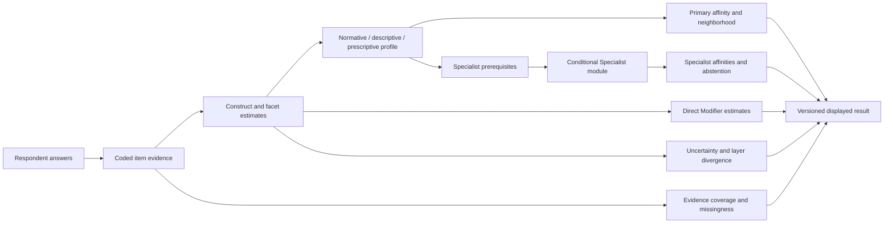

# Ideology Normative Sorter vNext Integrated System Specification — 2026-08

Status: authoritative cumulative vNext integration; production activation remains
version- and respondent-evidence-gated.

Frozen Measurement Architecture implementation baseline:
`f0324dbf27dfc6e35ff557992e4643e3df15ee0e`

System specification version: `2026-08-vnext-integrated-system-v1`

Codex implementation authority:
[`vnext-codex-implementation-specification-2026-08.md`](vnext-codex-implementation-specification-2026-08.md)

Decision authority:
[`methodological-change-decision-log-2026-08.md`](methodological-change-decision-log-2026-08.md)

This document integrates the frozen Measurement Architecture, the completed
taxonomy research, the approved Primary, Modifier, Specialist, Context,
construct, item, scoring, result-interpretation, and empirical-validation
decisions, and the actual repository at the frozen baseline. It is the single
entry point for the intended vNext system. It does not retroactively change
the frozen runtime.

## 1. Executive integration decision

The authoritative vNext system is a layered, profile-based measurement system:



The integrated decisions are:

1. Ideological labels are profile-similarity or configuration endpoints, not
   diagnoses, identities, probabilities, or population classifications.
2. Conceptual ontology, measurement status, and public product role are
   independent layers. A historically important object may remain Context or
   Specialist while its conceptual definition is fully documented.
3. Primaries are broad traditions or family anchors. Specialists are a
   conditional product-resolution role over more precise ideological objects.
   Modifiers are cross-host construct views. Context is a presentation and
   research status, never an implicit scoring path.
4. The current v13 scorer, bank, role arrays, specialist routing, and public
   compatibility behavior remain frozen until a separate versioned production
   decision is approved.
5. Constructs and facets are the measurement primitives. Named traditions are
   theory-led configurations over those primitives and must not be treated as
   empirically validated merely because a prototype or centroid is coherent.
6. Respondent validation is required for claims about reliability,
   dimensionality, separability, calibration, stability, fairness,
   cross-form equivalence, or validity.
7. No current Primary or Specialist is promoted to a validated respondent
   classification by this integration.

The current public evidence ceiling remains PC0 plus qualified PC1
profile-similarity language, as defined in the
[Result Interpretation and Public Claims Specification](result-interpretation-public-claims-specification-2026-08.md).

## 2. Precedence, categories, and contradiction policy

### 2.1 Authority order

| Question                                            | Authoritative source                                                                                    |
| --------------------------------------------------- | ------------------------------------------------------------------------------------------------------- |
| Frozen production behavior and stable IDs           | Actual repository at the frozen baseline                                                                |
| Frozen measurement boundary                         | [Measurement Architecture Specification](measurement-architecture-specification-2026-08.md)             |
| vNext conceptual taxonomy and Primary decisions     | [Taxonomy and Primary review](vnext-taxonomy-measurement-architecture-review-2026-08.md)                |
| vNext Modifier ontology                             | [Modifier review](vnext-modifier-architecture-review-2026-08.md)                                        |
| vNext Specialist ontology and modules               | [Specialist review](vnext-specialist-architecture-review-2026-08.md)                                    |
| vNext Context treatment                             | [Context review](vnext-context-architecture-review-2026-08.md)                                          |
| vNext constructs and coverage                       | [Construct blueprint](vnext-construct-architecture-measurement-blueprint-2026-08.md)                    |
| Current effective item dispositions                 | [Full effective item audit](full-effective-item-audit-2026-08.md)                                       |
| Scoring mechanics                                   | [Scoring Architecture](scoring-architecture-specification-2026-08.md)                                   |
| Public interpretation and claims                    | [Result Interpretation and Public Claims](result-interpretation-public-claims-specification-2026-08.md) |
| Respondent validation and promotion                 | [Empirical Validation Architecture](empirical-validation-architecture-2026-08.md)                       |
| Authorization, unresolved questions, and migrations | [Cumulative methodological decision log](methodological-change-decision-log-2026-08.md)                 |
| Execution order and repository changes              | [Codex Implementation Specification](vnext-codex-implementation-specification-2026-08.md)               |

When these sources appear to differ, the repository controls what currently
runs, the frozen Measurement Architecture controls what the current release
may mean, and the vNext documents control future architecture only. A
contradiction is never resolved by silently changing the baseline.

### 2.2 Required decision categories

Every change must be tagged as one or more of the following, with the tags
kept distinct in records and code reviews:

| Category                      | Decides                                                                                                           | Does not decide                                                            |
| ----------------------------- | ----------------------------------------------------------------------------------------------------------------- | -------------------------------------------------------------------------- |
| Conceptual / political theory | Definition, historical morphology, conceptual kind, boundary, and graph relation                                  | Respondent comprehension, reliability, validity, or public readiness       |
| Measurement design            | Constructs, facets, item mappings, gates, estimands, missingness, scoring, and evidence requirements              | Whether respondents actually interpret or answer the construct as intended |
| Empirical respondent evidence | Response process, internal structure, separability, calibration, stability, fairness, and criterion relationships | Historical meaning or whether a label is a legitimate ideological object   |
| Implementation                | Registries, schemas, versioning, adapters, validators, UI states, migration, and tests                            | Political-theory judgment or psychometric validity                         |

### 2.3 Contradiction rule

The integration audit found no genuine contradiction requiring reopening the
frozen Measurement Architecture. The following are mechanical clarifications,
not substantive reversals:

- the repository is on `2026-08-label-exposure-v2`; the earlier v1 wording in
  the log was corrected as historical rather than current;
- 338 active core items plus 68 conditional Specialist items are the effective
  scored surface; 496 core records include inactive historical traceability;
- the seven ordinary direct Modifier constructs are distinct from the 24
  conceptual Modifier labels;
- Specialist construct sufficiency (`>=0.50` weighted coverage where the
  module contract requires it) is distinct from the current public experimental
  display threshold (`fit >=0.60` and candidate evidence coverage `>=0.60`);
- v13 `parentId` and role/status fields remain historical compatibility data;
  vNext uses a versioned multi-edge graph and independent readiness fields.

## 3. Repository consistency audit

### 3.1 Frozen baseline inventory

The following values were checked against the current repository rather than
copied from an older document:

| Surface                                                         | Current repository value                                               |
| --------------------------------------------------------------- | ---------------------------------------------------------------------- |
| Frozen commit                                                   | `f0324dbf27dfc6e35ff557992e4643e3df15ee0e`                             |
| Architecture                                                    | `2026-08-measurement-architecture-v1`                                  |
| Runtime decision-log bundle                                     | `2026-08-methodological-decisions-v1`                                  |
| Taxonomy                                                        | `2026-08-taxonomy-v13`                                                 |
| Primary measurement                                             | `2026-08-primary-core-v1`                                              |
| Modifier measurement                                            | `2026-08-modifier-construct-v1`                                        |
| Production scoring                                              | `2026-08-13-taxonomy-v8`                                               |
| Active core items                                               | 338                                                                    |
| Inactive or historical core records retained in `coreQuestions` | 158                                                                    |
| All core records after effective transformations                | 496                                                                    |
| Conditional Specialist items                                    | 68                                                                     |
| Effective scored items                                          | 406: 400 Likert items and 6 statement-choice items                     |
| Public core forms                                               | Balanced 206; Full-depth 338                                           |
| Axes / roots                                                    | 26: 10 normative, 7 descriptive, 9 prescriptive                        |
| Primary labels                                                  | 16                                                                     |
| Specialist labels                                               | 78: 39 module-mapped, 39 provisional/catalog-only                      |
| Modifier labels                                                 | 24: 7 ordinary direct constructs, 1 focused follow-up, 16 catalog-only |
| Context labels                                                  | 19                                                                     |
| Retired compatibility labels                                    | 8                                                                      |
| Specialist modules                                              | 9, ordered under `2026-08-specialist-roster-v1` and `balanced-hash-v2` |
| Research schema / study / form                                  | `2026-08-v19` / `community-2026-v5` / `profile-form-v3`                |

The source files supporting these values are
`src/data/labelTaxonomy.ts`, `src/data/effectiveQuestions.ts`,
`src/data/axes.ts`, `src/data/primaryMeasurement.ts`,
`src/data/modifierMeasurement.ts`, `src/specialist/index.ts`,
`src/research/versions.ts`, and `src/validation/researchContracts.ts`.

### 3.2 Findings and disposition

| Audit ID | Finding                                                                                                                                                         | Status                             | Authoritative consequence                                                                                                             |
| -------- | --------------------------------------------------------------------------------------------------------------------------------------------------------------- | ---------------------------------- | ------------------------------------------------------------------------------------------------------------------------------------- |
| IA-01    | Current `parentId` is single-parent while vNext requires faceted polyhierarchy                                                                                  | Resolved as version boundary       | Preserve v13 metadata; add a vNext graph registry and validation rather than mutating v13                                             |
| IA-02    | v13 `core-primary` is derived from role and does not mean respondent validation                                                                                 | Resolved as status boundary        | Preserve v13 status; add independent conceptual, measurement, evidence, and public-readiness fields                                   |
| IA-03    | Seven direct Modifier contracts coexist with 24 conceptual Modifier labels                                                                                      | Resolved                           | Only the seven direct contracts may enter ordinary Modifier matching; all other labels abstain or use a focused module                |
| IA-04    | Specialist routing is broader than Specialist validity                                                                                                          | Resolved                           | Assignment is routing; module eligibility, evidence, candidate fit, criterion data, and promotion remain separate                     |
| IA-05    | Specialist internal sufficiency and public display thresholds were easy to conflate                                                                             | Resolved                           | Keep module-local sufficiency, candidate evidence coverage, fit, gates, and public display as separate fields                         |
| IA-06    | Effective item count differs from historical record count                                                                                                       | Resolved                           | `questions` is the active scored core; `coreQuestions`/`allQuestions` preserve traceability; no historical item is silently scored    |
| IA-07    | The current item audit records vNext facet intentions, but runtime `Question` metadata currently stores roots/axes and domain families, not canonical facet IDs | Open implementation gap            | Add research-only item annotations before using facet scores; do not infer facet validity from the audit table alone                  |
| IA-08    | The current scorer uses root-axis scopes and synthetic/reference prototypes, not validated facet estimates                                                      | Resolved as compatibility boundary | Keep v13 scoring; a facet-aware scorer requires respondent evidence, a new estimator, and a new scoring version                       |
| IA-09    | Current reliability-named fields are item-count coverage heuristics                                                                                             | Resolved as terminology boundary   | Preserve API fields for compatibility; public migration to “answer/evidence coverage” requires a presentation/version decision        |
| IA-10    | Context labels are present in the public catalog but not passed to `buildResultProfile`                                                                         | Confirmed consistent               | Maintain Context as catalog/explanation/research only; add tests that Context IDs never enter scoring arrays                          |
| IA-11    | All 16 Primary IDs have source-backed current scopes; no Primary scope is orphaned                                                                              | Confirmed consistent               | Preserve all scopes and required-axis abstention gates until a new Primary measurement version is approved                            |
| IA-12    | All 24 Modifier IDs have a measurement disposition; all 78 Specialist IDs are represented in the integrated registry                                            | Confirmed consistent               | Add generated integrity checks so roster drift fails closed                                                                           |
| IA-13    | Current public Specialist UI uses `0.60` fit and `0.60` candidate evidence coverage; the scoring document also describes `0.50` local construct sufficiency     | Resolved                           | Treat `0.50` as a local evidence-sufficiency rule and `0.60` as the current experimental display rule; neither is calibrated validity |
| IA-14    | The cumulative log contained a stale v1 label-exposure reference                                                                                                | Mechanically corrected             | Current contract is `2026-08-label-exposure-v2`; historical v1 is not reinterpreted                                                   |

### 3.3 Orphan, duplication, and unsupported-path result

The audit found no orphaned current roster ID, no duplicate active role ID, and
no Context label entering the ordinary scorer. It did find the following
unsupported-by-respondent-evidence paths, which remain intentionally blocked:

- vNext facet-level scores;
- independent M1 scores for National Conservatism and Liberal Conservatism;
- left/right Nationalist or Populist configuration scores;
- ordinary scoring for catalog-only or focused-follow-up Modifiers;
- validated Specialist assignment or subtype claims;
- calibrated exclusive Primary thresholds, probabilities, or standard errors;
- cross-language, cross-cultural, temporal, or population-generalized claims.

The existing audit reports 328 items as `empirical review required`, 49 as
`retain`, 16 as `rewrite`, 10 as `replace`, and 3 as `retain with minor edit`.
Those are content dispositions, not respondent validation results.

## 4. Foundational measurement principles

The following are system invariants. Codex must test them; it must not replace
them with an implementation convenience.

1. **Layer separation.** Normative judgment, descriptive belief, and
   prescriptive strategy are separate vectors. `ideal`, `nonideal`, and
   `mixed` are theory contexts, not additional layers.
2. **Profile before label.** The primary object is a multidimensional political
   profile. A named label is a scoped similarity/configuration view over that
   profile.
3. **Construct before taxonomy endpoint.** Items measure constructs and facets;
   traditions are expected configurations. A tradition cannot create a missing
   construct by naming it.
4. **No latent validity by construction.** Synthetic prototypes, centroid
   recovery, software tests, source coverage, expert agreement, and theoretical
   coherence can establish traceability or implementation integrity only.
5. **Missingness is not neutrality.** Omission, refusal, `dont_know`, skipped
   salience, unasked items, and unresolved response states are distinct and
   cannot be silently imputed.
6. **Evidence gates are abstention gates.** A required construct that is not
   measured blocks a label; a measured disagreement lowers affinity rather than
   being converted into a gate failure unless a hard constitutive condition is
   declared.
7. **Direct Modifier evidence.** A Modifier cannot be inferred from a host
   Primary, a neighboring Modifier, a source, or a centroid.
8. **Conditional Specialist resolution.** Specialist routing is not
   eligibility, and eligibility is not validity. A skipped or blocked module
   cannot change the Primary result.
9. **Historical and conceptual precision.** A label’s definition, graph edge,
   and public role must preserve its historical boundary and non-equivalence
   relations.
10. **Scope-bound claims.** Every result and claim carries its taxonomy,
    construct, item, scoring, form, interpretation, population, language, and
    validation scope.
11. **Self-identification is a criterion source.** It is never a production
    answer key, a scoring input, or the sole evidence for promotion.
12. **Evidence-dependent public language.** “Nearby,” “measured,”
    “experimental,” “provisional,” “uncertain,” and “unmeasured” are not
    interchangeable. Probability, diagnosis, identity, and population language
    are held absent a separate authorized estimand and evidence tier.

## 5. Conceptual ontology

### 5.1 Ontology node

Every vNext object is a versioned node with:

```text
OntologyNode {
  id,
  canonicalName,
  aliases,
  conceptualKind,
  secondaryKinds,
  canonicalDefinition,
  boundaryStatement,
  layerRelevance,
  historicalScope,
  geographicScope,
  constitutiveFacets,
  associatedFacets,
  nonConstitutiveFacets,
  graphRelations,
  conceptualStatus,
  measurementStatus,
  publicRoleView,
  evidenceRequirements,
  sourceRecords,
  version
}
```

Conceptual kind, measurement status, and public role are never stored as one
overloaded enum in vNext.

### 5.2 Controlled conceptual kinds

The accepted vocabulary is:

| Kind                                | Meaning                                                                  |
| ----------------------------------- | ------------------------------------------------------------------------ |
| `family-anchor`                     | Broad family organizer containing heterogeneous traditions               |
| `broad-tradition`                   | Durable cross-domain tradition with a recognizable morphology            |
| `compound-tradition`                | Historically fused combination with potentially non-additive structure   |
| `bridge-tradition`                  | Recurring synthesis between established families                         |
| `hybrid-configuration`              | Configuration of hosts/facets without established peer-level tradition   |
| `cross-cutting-orientation`         | Host-portable commitment that does not organize a complete program       |
| `subtype-tradition`                 | Narrower school, tendency, or variant inside a family                    |
| `regional-historical-variant`       | Region-, period-, language-, or movement-bound tradition                 |
| `institutional-project`             | Proposed institutional or governance arrangement                         |
| `strategy-or-program`               | Policy, economic regime, or change strategy                              |
| `regime-or-authoritarian-project`   | Authority/coercion/regime-oriented synthesis                             |
| `intellectual-current`              | Named analytical or intellectual current with contested public scope     |
| `discourse-frame`                   | Justificatory vocabulary or civilizational frame                         |
| `policy-proposal`                   | Specific policy instrument or program                                    |
| `governance-model`                  | Wider account of administration, expertise, information, or jurisdiction |
| `historical-reference`              | Important historical umbrella retained for explanation and research      |
| `speculative-technological-current` | Future-oriented technological worldview with unsettled political meaning |

### 5.3 Polyhierarchical relation graph

The vNext graph supports these typed edges:

| Relation                    | Semantics and constraint                                                         |
| --------------------------- | -------------------------------------------------------------------------------- |
| `subtype_of`                | Constitutive inheritance within a declared family; acyclic within that facet     |
| `family_member_of`          | Many-to-many family membership without subtype inheritance                       |
| `hybrid_of`                 | Historical/conceptual synthesis of two or more hosts or facets                   |
| `configures`                | Characteristic ordering or institutionalization of a facet; not mere correlation |
| `requires`                  | Constitutive condition needed to interpret the candidate                         |
| `overlaps_with`             | Shared field or constructs without equivalence; symmetric in the derived view    |
| `contrasts_with`            | Boundary-defining difference and named discriminating facet                      |
| `often_combines_with`       | Recurring co-occurrence that is not constitutive                                 |
| `regional_variant_of`       | Regional or historical expression that retains local morphology                  |
| `historical_predecessor_of` | Historical influence without present identity or subtype implication             |
| `influenced_by`             | Intellectual or historical influence without inheritance                         |
| `institutionalizes`         | Gives institutional form to a construct, ideal, or tradition                     |
| `context_for`               | Frames or locates another object without being its parent                        |
| `policy_expression_of`      | Policy expression of a host configuration, not identity with it                  |
| `alias_of`                  | Compatibility or lexical alias; does not create a second endpoint                |
| `not_equivalent_to`         | Explicit non-equivalence boundary                                                |
| `incompatible_with_core`    | Candidate cannot enter ordinary core measurement without direct evidence         |

Each edge carries `graphVersion`, provenance, conceptual facet, scope,
directionality, and a note. “Confidence” on a graph edge is a graph-maintenance
field, not respondent confidence or psychometric evidence.

### 5.4 Measurement-status architecture

Measurement status is a state machine, not a claim inferred from role:

| State                              | Meaning                                                                              | Allowed use                                    |
| ---------------------------------- | ------------------------------------------------------------------------------------ | ---------------------------------------------- |
| `not-started`                      | No authorized respondent measurement plan                                            | Documentation and research planning            |
| `catalog-only`                     | Conceptually documented but not directly measured                                    | Catalog, explanation, research candidate       |
| `research-candidate`               | Preregistered construct/module/card exists                                           | Data collection; no ordinary result            |
| `experimental`                     | Focused comparison passes limited current display guards                             | Clearly marked experimental/provisional result |
| `compatibility-scored-unvalidated` | Frozen scorer returns a compatibility comparison                                     | Qualified PC0/PC1 similarity language only     |
| `respondent-supported-scored`      | Required respondent evidence passes scoped gates                                     | Versioned scored use within tested scope       |
| `validated-scoped-public`          | Applicable evidence card, replication, fairness, uncertainty, and display gates pass | Public claims at authorized tier and scope     |
| `held`                             | Missing, failed, unsafe, or superseded evidence                                      | Abstain, restrict, revise, or retain history   |
| `retired-alias`                    | Compatibility history only                                                           | Decode old records; never score                |

The public role resolver uses conceptual kind, graph relations, measurement
status, high-risk policy, evidence coverage, and role policy. It does not use a
single numerical score or role array as a shortcut.

## 6. Derived product roles

| Role       | Underlying object                                                                                                  | Derivation rule                                                          | Ordinary result behavior                                                      |
| ---------- | ------------------------------------------------------------------------------------------------------------------ | ------------------------------------------------------------------------ | ----------------------------------------------------------------------------- |
| Primary    | Broad tradition or family anchor                                                                                   | Conceptual breadth plus approved primary scope and role policy           | Scoped neighborhood/affinity after required-core gates                        |
| Specialist | Narrow tradition, subtype, compound, regional, identity-sovereignty, institutional, or strategic object            | Conditional module, prerequisites, local constructs, and evidence status | Optional focused comparison; never changes the Primary result                 |
| Modifier   | Cross-host disposition, identity boundary, strategy, institutional preference, or orientation                      | Direct construct definition and host-portability policy                  | Direct-indicator estimate only; no full-ideology centroid                     |
| Context    | Policy, mechanism, governance model, intellectual current, historical reference, or unmeasured tradition candidate | Conceptual usefulness plus context-only policy                           | Catalog, explainer, graph, documentation, or research; never ordinary scoring |
| Retired    | Alias, decomposed synthetic compound, or compatibility record                                                      | Legacy mapping and no active endpoint                                    | Decode or explain history only                                                |

Derived role invariants:

- Context is not a fallback for every demoted label; a narrow tradition with a
  valid focused route remains Specialist, while a policy/mechanism remains
  Context.
- A Specialist may have multiple conceptual parents and still have one
  product module.
- A Modifier may relate to many Primaries and Specialists without being a
  subtype of any of them.
- A Primary may remain conceptually retained while its independent respondent
  endpoint is held or later demoted.

## 7. Authoritative taxonomy and label rosters

The following rosters are the authoritative IDs. Names and boundary prose are
canonicalized in the stage-specific reviews linked above; Codex must preserve
those definitions and aliases rather than authoring replacement theory.

### 7.1 Primary roster

All 16 are conceptually retained. All are currently
`compatibility-scored-unvalidated` and respondent-validation-held. The two
compound cases have explicit M1 holds.

| ID                            | Conceptual kind      | Canonical definition                                                                                                                                                          | M0/M1 and measurement disposition                                                                                    |
| ----------------------------- | -------------------- | ----------------------------------------------------------------------------------------------------------------------------------------------------------------------------- | -------------------------------------------------------------------------------------------------------------------- |
| `conservative`                | `family-anchor`      | Prudence, inherited institutions, social continuity, and gradual change, with economic, religious, national, and democratic variation left open                               | Retain broad anchor; current scope is compatibility-only and lacks a pure institutional-prudence facet               |
| `christian-democrat`          | `bridge-tradition`   | Democratic constitutionalism joined to Christian social ethics, subsidiarity, solidarity, social-market economics, family/community concerns, and welfare or labor protection | Retain; do not reduce to Social Conservatism, theocracy, or Distributism                                             |
| `classical-liberalism`        | `broad-tradition`    | Liberty, private property, contract, rule of law, and constitutionally limited government with disagreement over public goods and the social minimum                          | Retain; distinguish from Market Liberal and Right-Libertarianism by historical scope and state boundary              |
| `democratic-socialist`        | `compound-tradition` | Democratic control or social ownership of major productive assets while rejecting authoritarian one-party rule                                                                | Retain only with democratic-control residual kept distinct from Social Democracy                                     |
| `green-politics`              | `family-anchor`      | Ecological limits and the human/nonhuman relationship are central, while growth, markets, technology, governance, and strategy vary                                           | Retain family anchor; green morphology requires Specialist/facet measurement                                         |
| `liberal-conservatism`        | `bridge-tradition`   | Conservative continuity and cautious reform joined to liberal constitutionalism, civil liberty, limited government, and market order                                          | Named candidate; M1 independent endpoint remains evidence-held; `conservative-liberalism` is its compatibility alias |
| `libertarian-socialism`       | `family-anchor`      | Anti-authoritarian socialism opposing capitalist concentration and centralized state socialism through self-management and federated organization                             | Retain broad bridge; narrower anarchist/socialist traditions remain Specialist                                       |
| `market-liberal`              | `broad-tradition`    | Competitive markets, enterprise, trade, property, and rule-governed economic policy with enabling state, public goods, macro institutions, and limited safety net             | Retain; distinct from Classical Liberalism and Right-Libertarianism                                                  |
| `market-right-libertarianism` | `family-anchor`      | Voluntary exchange, strong personal liberty, private or use-based property, and skepticism of centralized authority while leaving state design open                           | Retain; anarcho-capitalism, Minarchism, Georgism, and Objectivism remain distinct                                    |
| `marxian-socialism`           | `family-anchor`      | Class power, social ownership/control, and transformation of capitalist institutions without assuming Leninist party-state organization                                       | Retain non-Leninist family anchor                                                                                    |
| `marxist-leninist`            | `compound-tradition` | Vanguard party, centralized state power, abolition of private capital, and planned or state-coordinated transition toward communism                                           | Retain with high-risk and constitutive gates; not a proxy for any historical regime                                  |
| `national-conservatism`       | `compound-tradition` | National sovereignty and the nation-state are primary political loci, joined to cultural continuity and resistance to cosmopolitan or rapid redesign                          | M0 host-plus-national/cultural facets versus M1 named residual; M1 held pending respondent evidence                  |
| `radical-democracy`           | `broad-tradition`    | Expanded participation, contestability, and democratized authority against concentrated institutional/economic power and oligarchy                                            | Retain, bounded by missing direct popular-sovereignty and participatory facets                                       |
| `republicanism`               | `broad-tradition`    | Freedom as non-domination, civic self-government, rule of law, accountable institutions, and equal civic standing                                                             | Retain, bounded by missing dedicated civic self-government facets                                                    |
| `social-democrat`             | `broad-tradition`    | Mixed economy and democratic institutions tempered through services, progressive taxation, unions, and incremental reform                                                     | Retain; preserve ownership/transition boundary against Democratic Socialism                                          |
| `social-liberalism`           | `broad-tradition`    | Markets and private property joined to public action and redistribution for substantive opportunity and individual freedom                                                    | Retain; not Social Democracy by definition                                                                           |

No Primary is promoted, merged, renamed, or demoted by this integration. Any
future M1 failure for National Conservatism or Liberal Conservatism may lead to
a new role decision, but it must preserve their conceptual history and alias
records.

### 7.2 Modifier domain hierarchy and roster

Modifiers are organized as domains and subdimensions. A domain is not itself a
score unless a construct battery authorizes it.

| Domain                                            | Subdimensions                                                                                                                                                         | Current labels                                                                                                                                                               |
| ------------------------------------------------- | --------------------------------------------------------------------------------------------------------------------------------------------------------------------- | ---------------------------------------------------------------------------------------------------------------------------------------------------------------------------- |
| National community, membership, and sovereignty   | Salience, political priority, membership basis, sovereignty/autonomy, territorial self-determination, separatism, expansion, regional authority, economic nationalism | `nationalism`, `civic-nationalist`, `ethnonationalist`, `left-wing-nationalism`, `separatist-nationalism`, `expansionist-nationalism`, `regionalism`, `economic-nationalism` |
| Cross-border moral scope and external order       | Anti-imperial restraint, cosmopolitan moral standing, international cooperation/solidarity                                                                            | `anti-imperialism`, `cosmopolitanism`, `internationalism`                                                                                                                    |
| Popular sovereignty and political style           | People-centrism, anti-elitism, anti-pluralism, popular sovereignty, mobilization style                                                                                | `populism`, `left-wing-populism`, `right-wing-populism`                                                                                                                      |
| Authority, rights, and institutional distribution | Civil-liberties constraint, decentralism/polycentricity, accountable expertise                                                                                        | `civil-libertarianism`, `decentralist-orientation`, `technocratic-orientation`                                                                                               |
| Culture, recognition, and social order            | Gendered power, plural accommodation, reform orientation, communitarian obligation, moral/family traditionalism                                                       | `feminist-orientation`, `multiculturalism`, `progressivism`, `communitarianism`, `social-conservatism`                                                                       |
| Political economy and fiscal orientation          | Fiscal restraint, redistribution, market/ownership host relations, national productive capacity                                                                       | `fiscal-conservatism`, with economic nationalism linked to the national domain                                                                                               |
| Technology and human futures                      | Deliberate enhancement, technology orientation, future-human boundary                                                                                                 | `transhumanism`                                                                                                                                                              |

Canonical Modifier IDs are exactly:

```text
anti-imperialism, civic-nationalist, communitarianism,
cosmopolitanism, civil-libertarianism, decentralist-orientation,
economic-nationalism, ethnonationalist, expansionist-nationalism,
fiscal-conservatism, internationalism, feminist-orientation,
left-wing-nationalism, left-wing-populism, multiculturalism, regionalism,
right-wing-populism, separatist-nationalism, progressivism,
social-conservatism, technocratic-orientation, nationalism, populism,
transhumanism
```

Current measurement status:

| Availability        | Labels                                                                                                                                                            | Current rule                                                                                                     |
| ------------------- | ----------------------------------------------------------------------------------------------------------------------------------------------------------------- | ---------------------------------------------------------------------------------------------------------------- |
| `core-construct`    | `anti-imperialism`, `cosmopolitanism`, `civil-libertarianism`, `decentralist-orientation`, `feminist-orientation`, `multiculturalism`, `technocratic-orientation` | Ordinary direct matching is permitted under `2026-08-modifier-construct-v1`; this is not psychometric validation |
| `focused-follow-up` | `ethnonationalist`                                                                                                                                                | Identity/sovereignty module only; no core inference                                                              |
| `catalog-only`      | All remaining 16 labels                                                                                                                                           | Catalog/research only until direct indicators and respondent gates exist                                         |

Direct core indicator sets are preserved exactly:

| Construct                                          | Indicator IDs                      |
| -------------------------------------------------- | ---------------------------------- |
| Anti-imperial restraint                            | `q0321`, `q0322`, `q0323`, `q0326` |
| Equal moral concern across borders                 | `q0201`, `q0321`, `q0233`          |
| Civil-liberties constraint                         | `q0161`, `q0164`, `q0173`          |
| Polycentric/decentralized institutional preference | `q0015`, `q0018`, `q0053`          |
| Gendered power and liberation orientation          | `q0261`, `q0264`, `q0421`          |
| Plural accommodation with equal status             | `q0281`, `q0282`, `q0293`          |
| Accountable evidence-guided administration         | `q0458`, `q0460`, `q0476`          |

Nationalism is not one bipolar score. Its eventual direct domain must separately
measure national-community salience, membership basis, economic nationalism,
sovereignty/autonomy, separatism, and expansion orientation, with regionalism
and host ideology retained as separate relations. Populism must separately
measure people-centrism, anti-elitism, anti-pluralism, popular sovereignty, and
mobilization style. Left/right variants are configuration nodes requiring host
evidence plus direct populist or nationalist facets; they are not current
ordinary Modifiers, Primaries, or Specialist shortcuts.

### 7.3 Specialist roster and family graph

The conceptual Specialist roster contains all 78 current Specialist IDs. The
following module groups are the authoritative module relations; a module
relation does not establish validity.

| Module / family                 | IDs and conceptual role summary                                                                                                                                                                                                                                                                                                 |
| ------------------------------- | ------------------------------------------------------------------------------------------------------------------------------------------------------------------------------------------------------------------------------------------------------------------------------------------------------------------------------- |
| Feminist factions               | `anarcha-feminism` (compound anarchist/feminist), `liberal-feminism` (liberal feminist subtype), `socialist-feminism` (compound feminist/socialist)                                                                                                                                                                             |
| Identity and sovereignty        | `black-nationalism` (identity-sovereignty), `indigenism` (decolonial sovereignty), `pan-africanism` (transnational identity-sovereignty)                                                                                                                                                                                        |
| Anarchist families              | `anarcho-capitalist` (hybrid), `anarcho-communist` (subtype), `social-anarchism` (family anchor), `individualist-anarchism` (family tradition), `anarcho-syndicalism` (strategic-organizational subtype), `market-anarchism` (family anchor/bridge), `mutualist` (bridge), `minarchist` (right-libertarian boundary subtype)    |
| Green morphology                | `deep-ecology` (ecological subtype), `degrowth-green` (green compound/strategy), `ecomodernist` (green technology variant), `ecosocialist` (green/socialist compound), `green-capitalism` (green/market compound)                                                                                                               |
| Socialist families              | `market-socialist` (economic-doctrinal subtype), `guild-socialism` (institutional economic doctrine), `council-communist` (organizational subtype), `syndicalist` (strategic-organizational current), `maoism` (historical-regional revolutionary variant), `trotskyism` (revolutionary subtype)                                |
| Conservative variants           | `neoconservative` (historical strategic current), `one-nation-conservatism` (conservative subtype/variant)                                                                                                                                                                                                                      |
| Religious and national politics | `islamic-democracy` (religious-constitutional compound), `political-islam` (religious political family), `hindutva` (regional civilizational-national tradition), `zionism` (historical identity-sovereignty tradition), `religious-nationalism` (religious/national compound), `theocrat` (religious-authority regime/project) |
| Technology and governance       | `techno-anarchism` (technology/anarchist compound), `technocratic-centralist` (technocratic/centralist institutional compound)                                                                                                                                                                                                  |
| Monarchist and municipal        | `absolute-monarchist` (hereditary-authority project), `traditional-monarchist` (monarchist subtype), `libertarian-municipalism` (institutional project), `democratic-confederalism` (institutional project)                                                                                                                     |

The 39 Specialist IDs without a current respondent-facing construct-matched
module are provisional/catalog-only and retain their conceptual definitions:

```text
agorist, agrarian-populism, anarcho-primitivism, bioregionalism,
bleeding-heart-libertarianism, christian-reconstructionism, christian-socialism,
eco-fascism, eco-authoritarianism, fascist-authoritarian, georgism,
geolibertarian, integralism, juche, kemalism, left-wing-market-anarchism,
national-bolshevism, national-socialism, neoreactionary, objectivism,
ordoliberalism, paleoconservatism, paleolibertarianism, participism,
stirnerism, strasserism, voluntaryism, third-way, distributism, neoliberalism,
developmentalism, pan-arabism, arab-socialism, radical-feminism,
black-feminism, queer-politics, confucian-political-revival, queer-anarchism,
welfare-chauvinism
```

For those IDs, the canonical kinds are respectively strategic-organizational,
historical-regional compound, anti-civilization subtype, ecological
institutional, bridge, religious-regime project, religious/socialist compound,
sensitive regime compound, sensitive regime project, economic doctrine or
bridge, regional state-building variant, market/anarchist bridge, sensitive
regime compound, sensitive regime ideology, intellectual/regime current,
intellectual or economic current, authoritarian-national/revolutionary
compound, racial-regime ideology, intellectual/regime current, intellectual
current, economic-governance current, conservative subtype, libertarian
subtype, institutional economic project, intellectual current, sensitive
historical regime subtype, intellectual/strategic current, historical
modernization current, economic doctrinal tradition, intellectual current,
developmental strategy, regional identity tradition, regional socialist
compound, feminist structural subtype, feminist/identity compound, queer
political current, intellectual-civilizational current, queer/anarchist
compound, and sensitive welfare/membership compound. Full canonical boundary
prose and relation notes remain authoritative in the Specialist review and
must be carried into the vNext ontology registry without paraphrase drift.

Specialist relation semantics are:

- `subtype_of`: inherited family boundary;
- `hybrid_of`: fused host traditions or facets;
- `requires`: prerequisite construct evidence;
- `overlaps_with`: shared field without identity;
- `often_combines_with`: recurring but non-constitutive co-occurrence;
- `regional_variant_of`: local or period-specific morphology;
- `influenced_by`: historical or intellectual influence;
- `institutionalizes`: institutional form given to a construct or ideal.

Assignment under `balanced-hash-v2` is routing only. Current module versions are
`feminist-faction-module` v6, `identity-sovereignty-module` v5, and the seven
experimental-wave modules under `2026-08-specialist-v11`. All current outputs
remain experimental, provisional, blocked, insufficient, or not-administered;
none is a validated identity classification.

### 7.4 Context roster

All 19 Context IDs remain `context-only`. Context is a product status, not a
claim about conceptual triviality.

| ID                               | Primary conceptual kind                        | Canonical treatment                                                                                                           |
| -------------------------------- | ---------------------------------------------- | ----------------------------------------------------------------------------------------------------------------------------- |
| `accelerationism`                | Intellectual/speculative technological current | Technology-centered intensification and transformation; left, right, and technology variants remain distinct                  |
| `asian-values`                   | Discourse frame / regional tradition           | Contested family-duty, harmony, order, and development discourse; not a regional stereotype or authoritarianism               |
| `baathism`                       | Compound regional tradition                    | Secular Arab-nationalist, state-led socialist and developmental synthesis; doctrine and later regime practice remain distinct |
| `constitutional-monarchism`      | Institutional model                            | Hereditary head of state under constitutional limits; not a complete ideology                                                 |
| `corporatism`                    | Governance model / regime project              | Functional-group representation under state direction; not generic fascism or democratic neocorporatism                       |
| `cyberocracy`                    | Governance model / institutional model         | Information and algorithmic administration with human-authority questions left open                                           |
| `dataism`                        | Speculative technological/intellectual current | Data-processing worldview; contested and not an organized political ideology                                                  |
| `developmental-authoritarianism` | Regime project / compound tradition            | Developmental state capacity paired with restricted pluralism or dominant-party rule                                          |
| `fourth-theory`                  | Intellectual current                           | Dugin’s anti-liberal, anti-communist, anti-fascist self-described civilizational project                                      |
| `fundamentalist-theocracy`       | Regime project                                 | Final religious legal authority and coercive public order; not generic religiosity                                            |
| `liquid-democracy`               | Institutional mechanism                        | Delegable or revocable representation mechanism; not democracy in general                                                     |
| `radical-centrism`               | Discourse/strategic frame                      | Cross-cutting reform and anti-polarization frame; not a complete ideology                                                     |
| `singularitarianism`             | Speculative technological current              | Future-oriented technological singularity worldview with unsettled political commitments                                      |
| `social-investment-state`        | Governance/policy model                        | Social policy organized around capabilities, human capital, and life-course investment                                        |
| `platformism`                    | Organizational current                         | Anarchist organizational doctrine emphasizing tactical unity and political organization                                       |
| `panarchism`                     | Governance/institutional model                 | Multiple voluntary jurisdictions or political orders; not generic decentralism or world federalism                            |
| `universal-basic-income`         | Policy proposal                                | Unconditional income policy; not Social Democracy, Social Liberalism, or Libertarianism by itself                             |
| `utopian-socialism`              | Historical reference                           | Early/socialist experimental traditions retained for historical framing, not a current endpoint                               |
| `world-federalism`               | Institutional model                            | Transnational federal authority; not equivalent to Cosmopolitanism or Internationalism                                        |

Context entries may appear in catalogs, explainers, graph documentation, and
research tasks. They must not enter ordinary nearest-label rankings, Modifier
matches, Specialist eligibility, or self-identification scoring without a new
role and measurement decision.

### 7.5 Retired and compatibility records

The eight retired IDs remain:

```text
conservative-liberalism, cultural-populism, bright-green-environmentalism,
civil-libertarian-cosmopolitan, decentralist-market-skeptic-of-state,
egalitarian-statist, national-traditionalist, revolutionary-collectivist
```

`conservative-liberalism` aliases `liberal-conservatism`; `bright-green-
environmentalism` aliases `ecomodernist`; the other synthetic combinations use
the approved split or keep-retired dispositions. Retired IDs never re-enter
ordinary scoring as hidden labels.

## 8. Construct and facet ontology

### 8.1 Root construct rule

The current 26 axis IDs are preserved as root IDs. The following facet IDs are
canonical vNext planning IDs. A facet is not a runtime score until it has
direct item annotations, response-process support, respondent structure, and a
versioned estimator.

| Root                                | Layer        | Canonical facets                                                                                                                                                                         |
| ----------------------------------- | ------------ | ---------------------------------------------------------------------------------------------------------------------------------------------------------------------------------------- |
| `authority-legitimacy`              | Normative    | `authority.source`, `authority.scope`, `authority.monopoly`, `authority.accountability`, `authority.contestability`, `authority.coercive-justification`                                  |
| `property-legitimacy`               | Normative    | `property.subject`, `property.productive-v-personal`, `property.control-v-title`, `property.acquisition`, `property.rent-and-exclusion`, `property.common-claims`                        |
| `liberty-noninterference`           | Normative    | `liberty.noninterference`, `liberty.autonomy-capacity`, `liberty.exit`, `liberty.bodily`, `liberty.expression`, `liberty.due-process`                                                    |
| `equality-theory`                   | Normative    | `equality.formal-status`, `equality.opportunity`, `equality.distribution`, `equality.capability`, `equality.relativity-status`, `equality.remedy`                                        |
| `political-community-boundary`      | Normative    | `community.moral-scope`, `community.special-obligation`, `community.membership`, `community.sovereignty`, `community.layered-membership`, `community.outsider-standing`                  |
| `moral-traditionalism`              | Normative    | `tradition.inherited-authority`, `tradition.family-order`, `tradition.sexual-morality`, `tradition.religious-morality`, `tradition.public-enforcement`, `tradition.pluralist-tolerance`  |
| `anti-domination`                   | Normative    | `domination.arbitrariness`, `domination.contestability`, `domination.dependence`, `domination.hierarchy`, `domination.workplace`, `domination.public-private`                            |
| `human-nature-priority`             | Normative    | `ecology.intrinsic-standing`, `ecology.ecological-limits`, `ecology.intergenerational-duty`, `ecology.species-and-systems`, `ecology.human-use`                                          |
| `militarism-pacifism`               | Normative    | `force.justification`, `force.defense`, `force.intervention`, `force.civilian-harm`, `force.regime-change`, `force.military-institution`                                                 |
| `secularism-religious`              | Normative    | `religion.state-neutrality`, `religion.public-expression`, `religion.establishment`, `religion.legal-authority`, `religion.clerical-power`, `religion.pluralism`                         |
| `market-process-confidence`         | Descriptive  | `market.information`, `market.discovery`, `market.incentives`, `market.externalities`, `market.concentration`, `market.distribution`, `market-alternative`                               |
| `state-capacity-confidence`         | Descriptive  | `state.implementation`, `state.coordination`, `state.administrative-skill`, `state.autonomy`, `state.accountability`, `state.failure`                                                    |
| `public-choice-skepticism`          | Descriptive  | `public-choice.capture`, `public-choice.principal-agent`, `public-choice.concentrated-benefits`, `public-choice.information`, `public-choice.correctability`                             |
| `democratic-confidence`             | Descriptive  | `democracy.voter-information`, `democracy.aggregation`, `democracy.deliberation`, `democracy.majoritarian-error`, `democracy.responsiveness`, `democracy.learning`                       |
| `expert-confidence`                 | Descriptive  | `expert.competence`, `expert.uncertainty`, `expert.transparency`, `expert.accountability`, `expert.capture`, `expert.public-knowledge`                                                   |
| `cultural-plasticity`               | Descriptive  | `culture.path-dependence`, `culture.policy-malleability`, `culture.diffusion`, `culture.socialization`, `culture.institutional-feedback`, `culture.persistence`                          |
| `coordination-optimism`             | Descriptive  | `coordination.trust`, `coordination.monitoring`, `coordination.information`, `coordination.scale`, `coordination.polycentric`, `coordination.failure`                                    |
| `centralization-preference`         | Prescriptive | `centralization.level`, `centralization.uniformity`, `centralization.local-autonomy`, `centralization.federalism`, `centralization.polycentrism`, `centralization.exit`                  |
| `reform-vs-revolution`              | Prescriptive | `change.continuity`, `change.rupture`, `change.transition`, `change.legitimacy`, `change.movement`, `change.institution-building`                                                        |
| `gradualism-vs-immediatism`         | Prescriptive | `pace.sequencing`, `pace.transition-risk`, `pace.crisis`, `pace.experimentation`, `pace.irreversibility`                                                                                 |
| `state-action-vs-exit`              | Prescriptive | `remedy.state-provision`, `remedy.private-exit`, `remedy.voice-exit`, `remedy.public-goods`, `remedy.counter-institution`, `remedy.enforcement`                                          |
| `electoralism-vs-direct-action`     | Prescriptive | `strategy.electoral`, `strategy.legal`, `strategy.movement`, `strategy.disruption`, `strategy.direct-action`, `strategy.violence-separate`                                               |
| `compromise-vs-persistence`         | Prescriptive | `bargaining.partial-gain`, `bargaining.issue-firmness`, `bargaining.coalition`, `bargaining.principle`, `bargaining.opposition`, `bargaining.long-horizon`                               |
| `coercion-strategy`                 | Prescriptive | `coercion.threshold`, `coercion.target`, `coercion.legality`, `coercion.violence`, `coercion.repression`, `coercion.nonviolence`                                                         |
| `regulation-vs-deregulation`        | Prescriptive | `regulation.domain`, `regulation.enforcement`, `regulation.entry`, `regulation.precaution`, `regulation.consumer`, `regulation.labor`, `regulation.environment`, `regulation.technology` |
| `redistribution-vs-predistribution` | Prescriptive | `distribution.transfer`, `distribution.services`, `distribution.taxation`, `distribution.ownership`, `distribution.labor-rules`, `distribution.capability`, `distribution.rule-setting`  |

### 8.2 Construct relationships

Root axes are not assumed independent. The architecture explicitly models
expected relations for later respondent testing:

- Authority, Liberty, Anti-Domination, and Centralization overlap but require
  distinct source, scope, contestability, and institutional facets.
- Property, Equality, Redistribution, and Predistribution overlap but must
  separate ownership, status, transfer, services, labor rules, and capability.
- Market Process, State Capacity, Public-Choice Skepticism, Expert Confidence,
  and Coordination Optimism are descriptive beliefs, not normative or
  prescriptive proxies.
- Community Boundary, Moral Traditionalism, Secular/Religious Order, and the
  Nationalism domain must separate membership, moral order, public authority,
  and territorial projects.
- Reform, Gradualism, Compromise, Electoralism, and Coercion are strategies;
  none is a direct synonym for political legitimacy or desired end-state.
- Human-Nature Priority is distinct from growth, technology, ownership,
  governance, and ecological strategy.

### 8.3 Current coverage and gaps

The current effective bank has structural root coverage but uneven construct
quality. Overrepresented roots include Liberty, Anti-Domination,
Centralization, State Action/Exit, and Regulation. Contaminated roots include
Authority, Property, Equality, Community Boundary, Moral Traditionalism,
Secular/Religious Order, Market Process, Public-Choice Skepticism,
Coordination, Reform, Gradualism, Coercion, and Redistribution/
Predistribution. Militarism/Pacifism and State Capacity are underrepresented.

Missing or effectively unmeasured families that must not be inferred from
neighbors include:

- nationalism’s salience, membership basis, economic nationalism,
  sovereignty/autonomy, separatism, and expansion;
- populism’s people-centrism, anti-elitism, anti-pluralism, popular sovereignty,
  and mobilization style;
- fiscal orientation, institutional prudence, civic self-government,
  subsidiarity, class analysis, workplace governance, ecological morphology,
  religious legal authority, and technology-governance boundaries;
- nearly all one-item Specialist-local constructs.

## 9. Question-bank architecture and approved item dispositions

### 9.1 Effective item contract

Every item must carry or resolve to:

```text
ItemRecord {
  questionId,
  bankVersion,
  active,
  domainId,
  layer,
  theoryContext,
  responseType,
  tier,
  rootIds,
  facetIds,
  localConstructIds,
  semanticDirection,
  responseProcessTags,
  wordingFormId,
  provenance,
  disposition,
  replacementOrRetirementPlan
}
```

The runtime currently has stable IDs, domains, layers, roots/axis weights,
response formats, tiers, source/context records, and research family metadata.
Canonical `facetIds`, disposition manifests, and validated construct estimates
are future research-only additions until their own version is approved.

Core tiers remain nested: Blitz, Quick, Moderate/Balanced, and Extensive/
Full-depth. Specialist questions are conditional module forms, not part of one
406-item respondent form.

Statement-choice questions are ipsative option-level instruments. They are not
ordinary Likert indicators and must not enter alpha/item-total estimates as if
they were scalar items.

### 9.2 Current item dispositions

The current audit is authoritative for all 406 effective items:

| Disposition                 | Count | Meaning                                                                       |
| --------------------------- | ----: | ----------------------------------------------------------------------------- |
| `empirical review required` |   328 | Content-retained or operationally present but respondent analysis is required |
| `retain`                    |    49 | Content-ready for the next empirical gate, not validated                      |
| `rewrite`                   |    16 | New single-claim formulation required                                         |
| `replace`                   |    10 | Replacement required before retirement                                        |
| `retain with minor edit`    |     3 | Wording edit without intended construct change                                |

The P0 replacement queue is `q0016`, `q0034`, `q0116`, `q0173`, `q0235`,
`q0255`, `q0316`, `q0337`, `q0377`, and `q0397`. The P1 rewrite queue and all
cognitive/empirical queues remain in the full audit. Removal or replacement
must preserve the listed root/facet coverage consequence; a missing construct
cannot be compensated by a neighboring label, centroid, source, or software
test.

### 9.3 Item development and validation rules

New items require one substantive claim, balanced directional coverage,
scenario/wording diversity, layer and theory-context clarity, specialized-
knowledge handling, social-desirability review, and sensitivity/community
review where appropriate. A new item cannot enter ordinary scoring until it
passes content, cognitive, item-functioning, missingness, and relevant
DIF/invariance gates.

## 10. Scoring architecture

### 10.1 Analytic separation

The system keeps three distinct analytic objects:

| Object                                   | Role                                                                              |
| ---------------------------------------- | --------------------------------------------------------------------------------- |
| Theory-led construct model               | Defines roots, facets, relations, constitutive gates, and expected configurations |
| Production prototype/configuration model | Frozen v13 compatibility scorer using declared root scopes and similarity         |
| Empirical challengers                    | Respondent-based latent, item, covariance, profile, and calibration analyses      |

The challenger objects may identify deficiencies in the theory-led model but
cannot silently replace the named taxonomy or production scorer.

### 10.2 Current compatibility equations

For item response `x_ri` coded to `[-1,1]`, signed item-to-root weight `w_ic`,
and substantive weight/salience `s_ri`, current root estimates are layer-
specific weighted normalized aggregates. For Primary `p`, the frozen scorer
uses only measured axes in the declared scope:

```text
e_rc = min(1, n_rc / 3)
M_rp = {c in scope(p) : n_rc > 0}

d_rp = sqrt(sum(c in M_rp) e_rc * (z_rc - t_pc)^2 /
            sum(c in M_rp) e_rc)
f_rp = max(0, 1 - d_rp / 2)
E_rp = sum(c in scope(p)) e_rc / |scope(p)|
```

`f_rp` is fit/proximity, not probability, posterior, accuracy, reliability,
or identity. Missing constitutive roots cause abstention through a core gate.
Measured disagreement lowers fit. Current compatibility output may return up to
20 eligible neighbors; future exclusive thresholds, margins, covariances, and
standard errors require respondent calibration.

### 10.3 Modifier scoring

For a direct Modifier `m`, only its declared indicator set `J_m` is used:

```text
v_rim = x_ri * direction_im
d_rm = sqrt(sum(i in answered(J_m)) s_ri * (v_rim - 1)^2 /
            sum(i in answered(J_m)) s_ri)
f_rm = max(0, 1 - d_rm / 2)
E_rm = sum(i in answered(J_m)) s_ri / |J_m|
```

The compatibility contract requires at least two direct substantive
indicators, `fit >=0.65`, `E >=0.40`, and non-high uncertainty, and returns at
most five matches. These are content/evidence guards, not respondent validity.

### 10.4 Specialist scoring and abstention

Specialist modules use local construct weights and candidate profiles. Missing
local constructs are not imputed. Current module-local sufficiency and
candidate coverage are distinct from current public display thresholds. A
candidate is blocked by a measured constitutive contradiction, marked
insufficient when defining evidence is absent, and shown as experimental only
when the current display rule passes. Self-description collected after the
module is criterion data and cannot feed the score.

### 10.5 Missingness, depth, and uncertainty

Missingness states remain explicit. Short forms expose their own measured mask
and cannot make claims that require unasked roots. Cross-depth comparison
requires respondent-based linking and held-out form-equivalence evidence.

Current item-count bands and margins are compatibility heuristics. The target
vNext system may add respondent-calibrated standard errors, information,
neighbor margins, and uncertainty intervals only under the empirical
validation architecture and a new scoring/interpretation version.

### 10.6 Compositional-residual scoring

For a compound candidate `M1` and a broader-host-plus-facets representation
`M0`:

```text
M0 = host configuration + relevant direct Modifier/facet evidence
M1 = M0 + independent named-configuration residual

incrementalValue(M1) = heldOutFit(M1) - heldOutFit(M0)
```

M1 requires historical/morphological coherence, non-additive ordering or
institutional logic, direct residual items, discriminant value against the
nearest host neighbors, criterion interpretation, retest, fairness/scope, and
presentation value. National Conservatism and Liberal Conservatism are
priority cases; the same test applies to left/right configurations and every
future compound.

## 11. Specialist architecture

The product sequence is:

```text
Primary profile
  -> host/prerequisite evidence
  -> assignment or explicit module selection
  -> module-local construct estimates
  -> candidate gates and within-family comparison
  -> multiple affinities or evidence abstention
```

The following are never conflated:

- assignment versus eligibility;
- eligibility versus conceptual fit;
- conceptual fit versus respondent validity;
- criterion self-description versus score;
- experimental display versus validated public classification.

Modules may use multiple conceptual parents and relation types. They must
declare local constructs, required prerequisites, sensitive-content handling,
candidate signals, gate conditions, minimum evidence, and public status.

All current Specialist modules remain experimental. The current four-item or
one-item local constructs identified in the construct blueprint are not
adequate for stable subtype claims simply because code can calculate a fit.

## 12. Result interpretation and public claims

### 12.1 Meaning of a neighborhood and affinity

A Primary neighborhood is a graded family-resemblance region among scoped
reference profiles and separately marked conceptual graph neighbors. An
affinity or similarity score means closeness in the measured, declared scope
under the versioned comparison. It does not mean membership, identity,
probability, causal explanation, or agreement with every doctrine associated
with a label.

Multiple nearby traditions, ties, layer divergences, and mixed configurations
are expected. A list-order tie-break is serialization only, never substantive
evidence. The UI should explain shared measured directions, largest measured
differences, missing discriminators, graph relations, and uncertainty.

Modifiers must be described through their own direct construct. Specialists
must be marked experimental/provisional until promoted. Context must be marked
as related context, not a scored result. Evidence coverage describes observed
answer coverage; it is not confidence or reliability.

### 12.2 Depth, self-identification, and abstention

Each depth reports its own measured scope. A shorter quiz may produce a
profile-only or affinity-set result even when a full form would expose more
neighbors. Shared links declare recomputation versus historical snapshots.

Self-identification is collected after the substantive result or in a separate
criterion condition. It may be compared with model output under exposure-aware,
held-out analysis, but it cannot certify or disprove ideological identity.

If required evidence is missing, contradictory, or too close to separate, the
system abstains or reports a neighborhood rather than manufacturing a winner.

### 12.3 Public claim tiers

| Tier | Minimum evidence                                                                                               | Permitted claim                                                                     |
| ---- | -------------------------------------------------------------------------------------------------------------- | ----------------------------------------------------------------------------------- |
| PC0  | Versioned implementation, provenance, deterministic operation, traceable response states                       | What version ran, what item/construct/label scope was used, and coverage facts      |
| PC1  | Conceptual/content review, wording/direction review, cognitive evidence where required, explicit measured mask | Qualified descriptions of measured profile directions and nearby reference profiles |
| PC2  | Respondent reliability, information/precision, appropriate uncertainty, replication                            | Scoped precision/reliability claims                                                 |
| PC3  | Dimensionality, convergent/discriminant/content/response-process evidence, held-out confirmation               | Scoped construct-validity and neighbor-separation claims                            |
| PC4  | Independent preregistered criterion, exposure control, held-out calibration                                    | Scoped criterion/self-description calibration claims                                |
| PC5  | Defined retest interval, form controls, respondent stability estimates                                         | Scoped temporal stability claims                                                    |
| PC6  | Adequate subgroup samples, DIF/invariance, fairness review                                                     | Comparability claims for tested groups/forms/languages                              |
| PC7  | Cross-cultural/temporal linking, adaptation, invariance, replication, scope-specific criteria                  | Transport claims for named cultures, languages, or periods                          |

The current release may use PC0 and qualified PC1 language only. It must not
claim “reliable,” “valid,” “accurate,” “calibrated,” “objective,” “diagnostic,”
“probability,” “posterior,” or “you are [ideology]” as respondent measurement
claims.

## 13. Empirical validation architecture

The staged respondent program is V0–V13:

| Stage | Purpose                                                                  | Promotion consequence                                          |
| ----- | ------------------------------------------------------------------------ | -------------------------------------------------------------- |
| V0    | Registry, scope, preregistration, estimands, version bundle, sample plan | No respondent claim; freezes analysis plan                     |
| V1    | Expert/content review                                                    | Content readiness only                                         |
| V2    | Cognitive interviews and response-process review                         | Interpretation readiness; rewrite/hold if needed               |
| V3    | Pilot sampling and administration                                        | Data-quality and feasibility diagnostics                       |
| V4    | Pilot item/response-process analysis                                     | Item retention, revision, contamination, missingness decisions |
| V5    | Pilot dimensionality/cross-loading/reliability/information               | Construct diagnostics; no automatic label promotion            |
| V6    | Confirmation sampling and held-out construct analysis                    | Confirmatory construct evidence                                |
| V7    | Test-retest and anchor/form linking                                      | Stability and form evidence within scope                       |
| V8    | Nearest-neighbor and label calibration                                   | Label separability and criterion calibration                   |
| V9    | M0/M1 residual and incremental validity                                  | Independent compound endpoint only if residual value passes    |
| V10   | Specialist module and prerequisite validation                            | Focused assignment/display eligibility                         |
| V11   | DIF, fairness, and measurement invariance                                | Group/language/form comparability scope                        |
| V12   | Uncertainty, omission, scoring-alternative, and robustness calibration   | Display and abstention calibration                             |
| V13   | Replication, evidence card, promotion record, public-claim review        | Scoped promotion or explicit hold/demotion                     |

Every scored Primary and Specialist receives a label-specific evidence card
with content validity, response process, internal structure, separability,
incremental validity, calibration, temporal stability, fairness, and
robustness components. No family/module result promotes every related label.

Challenger analyses remain separate:

1. theory-led multidimensional latent models;
2. frozen production prototype/configuration analysis;
3. exploratory person-centered LCA/LPA/profile/network models.

Model disagreement triggers a structured review of construct definitions,
cross-loadings, graph relations, historical morphology, and naming boundaries.
It does not allow a person-centered cluster to receive an ideological name
without historical and theoretical support, nor allow a theory label to be
retained as a measured endpoint when respondent evidence consistently fails.

## 14. Versioning and migration

### 14.1 Current compatibility tuple

The current runtime tuple is:

```text
architectureVersion       = 2026-08-measurement-architecture-v1
implementationSpecVersion = 2026-08-implementation-spec-v1
runtimeDecisionLogVersion = 2026-08-methodological-decisions-v1
taxonomyVersion            = 2026-08-taxonomy-v13
primaryMeasurementVersion = 2026-08-primary-core-v1
modifierMeasurementVersion= 2026-08-modifier-construct-v1
scoringVersion             = 2026-08-13-taxonomy-v8
schemaVersion              = 2026-08-v19
consentVersion             = 2026-08-12-v8
qualityRuleVersion         = data-quality-v2
studyId                    = community-2026-v5
formVersion                = profile-form-v3
specialistRosterVersion    = 2026-08-specialist-roster-v1
assignmentStrategy         = balanced-hash-v2
labelExposureVersion       = 2026-08-label-exposure-v2
```

The cumulative planning log and this integrated specification may have newer
document versions without changing the runtime tuple.

### 14.2 vNext version-bump matrix

| Change                                                                   | Required new version                                                        |
| ------------------------------------------------------------------------ | --------------------------------------------------------------------------- |
| Conceptual kind, graph edge, canonical definition, alias, or role policy | Ontology/graph/role registry version and decision-log record                |
| Root/facet definition or item-to-facet mapping                           | Construct-family and item-metadata versions                                 |
| Active item wording, direction, response type, or tier                   | Question-bank and wording/form versions; new validation scope               |
| Primary scope, prototype, gate, or roster                                | Primary measurement and taxonomy versions; scorer if behavior changes       |
| Modifier indicator or availability                                       | Modifier measurement version and scorer/interpretation version if displayed |
| Specialist module questions, constructs, candidates, or order            | Module version; roster/strategy/study version if assignment changes         |
| Similarity, threshold, missingness, uncertainty, or weighting rule       | Scoring version and validation report version                               |
| Public wording, status, claim, or result surface                         | Interpretation/presentation version and comprehension review                |
| Stored result/API envelope                                               | Schema version and migration/compatibility tests                            |
| Promotion to respondent-supported or validated public                    | Evidence-card, promotion-record, and release decision versions              |

### 14.3 Migration invariants

- Existing v13 records remain decodable under their original tuple.
- No analysis pools records across bank, taxonomy, scoring, form, roster,
  language, or study versions without an explicit linking decision.
- Shared links declare whether they recompute from answers or carry a snapshot.
- Legacy fields such as `predictedLabelIds`, `confidence`, and
  `reliability` remain machine-compatible but receive semantic documentation;
  renaming them requires an API migration.
- Retired aliases and split compounds preserve deterministic historical
  interpretation and never silently become new endpoints.
- A vNext facet-aware profile must carry both the root compatibility profile
  and the facet measured mask until migration equivalence is demonstrated.

## 15. Unresolved questions

This integration does not close unresolved conceptual or empirical questions.
The full cumulative identifiers remain authoritative. The most consequential
open questions are:

| Area                  | Open question                                                                                                          |
| --------------------- | ---------------------------------------------------------------------------------------------------------------------- |
| Construct structure   | Are the proposed roots/facets empirically separable, hierarchical, bifactor, or locally dependent?                     |
| Item design           | Which audited items survive cognitive, item-functioning, DIF, invariance, and retest review?                           |
| Weights               | Should content weights remain fixed, be empirically estimated, or use a hybrid with preregistered constraints?         |
| Covariance            | Does covariance-adjusted similarity improve neighbor discrimination without erasing theory-relevant differences?       |
| Primary neighbors     | Which pairs are empirically separable within the declared scope and depth?                                             |
| National Conservatism | Does a direct national-priority/cultural-continuity residual add held-out value beyond M0?                             |
| Liberal Conservatism  | Does liberal constitutionalism plus conservative continuity form a stable M1 residual beyond host/facet configuration? |
| Other compounds       | Do left/right nationalism, left/right populism, and Specialist compounds pass the same residual test?                  |
| Modifiers             | Which domains are genuinely cross-host and which are host-dependent configurations?                                    |
| Specialists           | Which module-local constructs are sufficiently diverse and stable for focused assignment?                              |
| Calibration           | What fit, margin, uncertainty, and abstention thresholds are supported for each object and scope?                      |
| Self-identification   | Does self-description measure recognition, identity acceptance, or both, and how does label exposure change it?        |
| Forms                 | Are Blitz, Quick, Balanced, and Full-depth results comparable after respondent-based linking?                          |
| Fairness              | What DIF/invariance patterns occur across groups, languages, regions, and sensitive-identity content?                  |
| Challengers           | When do LCA/LPA or latent-factor results reveal an omitted construct rather than a replacement taxonomy?               |
| Public interpretation | Which terminology is understood without inviting identity or diagnostic overclaim?                                     |

U1–U101 remain open in the cumulative log; the empirical-validation stage
adds U86–U101 for validation design, construct structure, calibration,
fairness, forms, challengers, and promotion.

## 16. Integrated acceptance criteria

The vNext integration is internally consistent only if:

1. all current roster IDs are represented exactly once in the intended role
   registries and all 16 Primary IDs have current scopes;
2. every vNext node has independent conceptual kind, graph, measurement status,
   public role, version, and provenance fields;
3. no Context or retired ID enters ordinary scoring arrays;
4. every ordinary Modifier has a direct indicator contract and every other
   Modifier abstains or routes to an authorized module;
5. every Specialist assignment distinguishes routing, prerequisites, local
   evidence, candidate status, and criterion data;
6. every item has a legitimate domain/layer/root mapping, and future facet
   mapping is explicit rather than inferred from a label;
7. all item dispositions preserve coverage consequences and stable provenance;
8. scoring never imputes missing constitutive evidence, converts fit to
   probability, or feeds self-identification back into matching;
9. public status, uncertainty, evidence coverage, depth, and claim tier are
   serialized with the result;
10. every empirical promotion has a preregistration, held-out confirmation,
    label evidence card, promotion record, scope, migration note, and
    reassessment date;
11. challenger disagreement creates a review artifact rather than an implicit
    taxonomy or scorer change; and
12. the implementation roadmap below can be executed without Codex making a
    new political-theory, taxonomy, measurement, or psychometric decision.

## 17. Related authoritative records

- [Frozen Measurement Architecture](measurement-architecture-specification-2026-08.md)
- [Frozen implementation specification](measurement-architecture-implementation-specification-2026-08.md)
- [Taxonomy and Primary review](vnext-taxonomy-measurement-architecture-review-2026-08.md)
- [Modifier review](vnext-modifier-architecture-review-2026-08.md)
- [Specialist review](vnext-specialist-architecture-review-2026-08.md)
- [Context review](vnext-context-architecture-review-2026-08.md)
- [Construct blueprint](vnext-construct-architecture-measurement-blueprint-2026-08.md)
- [Full effective item audit](full-effective-item-audit-2026-08.md)
- [Scoring Architecture](scoring-architecture-specification-2026-08.md)
- [Result Interpretation and Public Claims](result-interpretation-public-claims-specification-2026-08.md)
- [Empirical Validation Architecture](empirical-validation-architecture-2026-08.md)
- [Cumulative methodological decision log](methodological-change-decision-log-2026-08.md)
