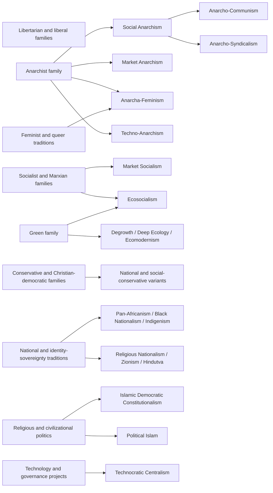

# vNext Specialist Architecture Review — 2026-08

Status: definitive vNext conceptual, graph, product-resolution, and
measurement-design review; production promotion remains respondent-evidence
gated.

Frozen implementation baseline:
`f0324dbf27dfc6e35ff557992e4643e3df15ee0e`

This review continues the approved [Primary and Modifier architecture](vnext-taxonomy-measurement-architecture-review-2026-08.md) and the [definitive Modifier review](vnext-modifier-architecture-review-2026-08.md). It does not reopen the frozen Measurement Architecture, change the current Specialist roster, alter assignment, or treat a module result as a validated identity.

## 1. Executive decision

**Specialist is a product-resolution role, not a single conceptual kind.** A
Specialist is the participant-facing route used when the system needs a focused
module or conditional comparison to resolve a narrower tradition, subtype,
compound, regional or historical variant, identity-sovereignty tradition,
institutional project, economic doctrine, or strategic-organizational current.

The underlying object is now classified separately through `specialistKind`,
polyhierarchical family relations, construct prerequisites, measurement status,
and display policy.

The authoritative current state is:

| Surface                                | Current frozen state                                                        |
| -------------------------------------- | --------------------------------------------------------------------------- |
| Specialist IDs                         | 78                                                                          |
| v13 role                               | All 78 are `specialist`                                                     |
| v13 measurement status                 | All 78 are `provisional-specialist`                                         |
| Assigned module labels                 | 39 across nine frozen module IDs                                            |
| Catalog-only labels                    | 39 without an assigned respondent module                                    |
| Active specialist questions            | 68                                                                          |
| Assignment strategy                    | `balanced-hash-v2`                                                          |
| Assignment roster                      | `2026-08-specialist-roster-v1`                                              |
| Experimental specialist construct bank | `2026-08-specialist-v11`                                                    |
| Respondent validity                    | Not established by source coverage, prototypes, centroids, or passing tests |

No current Specialist is promoted to Primary or Modifier in this review. No
current Specialist ID is retired, merged, or deleted. No new Specialist is
added. Several labels that are conceptually broad remain Specialist objects
because the current product role is the appropriate focused-resolution surface
and because conceptual breadth is not respondent validation.

## 2. Frozen boundary and product-resolution contract

The frozen Measurement Architecture requires Specialist entries to remain
outside ordinary Primary and Modifier scoring unless a later approved role and
measurement decision says otherwise. The current system already enforces the
important boundary:

- a module is selected through the frozen assignment contract, not because a
  broad Primary centroid proves a Specialist identity;
- local construct scores are calculated inside the module’s own construct bank;
- evidence sufficiency is tracked per construct;
- missing required evidence produces abstention rather than a midpoint or
  imputed match;
- a measured contradiction blocks a candidate when an explicit construct gate
  requires the opposite direction;
- self-identification, criterion selections, and module matches remain
  separate records;
- all results remain experimental/focused profile comparisons, not diagnoses,
  validated identities, or population claims.

The existing module evidence rules are retained as the minimum vNext contract:

1. each defining construct needs declared module items;
2. a construct normally needs at least two answered items and at least 50%
   weighted coverage;
3. a profile must cover the required construct set rather than only its easiest
   items;
4. missing evidence returns `insufficient-evidence`;
5. a direct contradiction returns `blocked` when the candidate declares a
   minimum or maximum gate;
6. fit is interpreted only after prerequisite construct evidence passes;
7. no centroid, Primary score, Modifier score, criterion answer, or source
   record can substitute for a missing defining construct.

## 3. Specialist ontology

### 3.1 Controlled `specialistKind` vocabulary

Every Specialist receives one primary `specialistKind` and may receive
secondary facet tags. The primary kind identifies what sort of ideological
object it is; it does not determine measurement readiness.

| Kind                               | Definition                                                                                                                                                  | Typical examples                                                            |
| ---------------------------------- | ----------------------------------------------------------------------------------------------------------------------------------------------------------- | --------------------------------------------------------------------------- |
| `family-anchor`                    | A broad internal family used to organize focused comparisons without becoming a new ordinary Primary by default                                             | Social Anarchism, Market Anarchism                                          |
| `subtype-tradition`                | A bounded branch of a Primary family with additional constitutive doctrine or strategy                                                                      | Anarcho-Communism, Deep Ecology, Liberal Feminism                           |
| `compound-tradition`               | A historically recognizable synthesis of two or more traditions or domains                                                                                  | Christian Socialism, Ecosocialism, Religious Nationalism                    |
| `bridge-tradition`                 | A current that links neighboring families and cannot be represented by one parent without loss                                                              | Mutualism, Geolibertarianism, Left-Wing Market Anarchism                    |
| `historical-regional-variant`      | A tradition whose identity depends materially on a historical movement, national setting, regional political vocabulary, or situated state-building project | Kemalism, Pan-Arabism, Third Way, Trotskyism                                |
| `identity-sovereignty-tradition`   | A tradition organized around a people’s membership, collective authority, land, sovereignty, self-determination, or transnational solidarity                | Black Nationalism, Indigenism, Pan-Africanism, Zionism                      |
| `institutional-project`            | A proposed or defended constitutional, regime, administrative, municipal, or organizational form                                                            | Democratic Confederalism, Libertarian Municipalism, Technocratic Centralism |
| `economic-doctrinal-tradition`     | A doctrine whose distinctive object is ownership, rent, exchange, planning, market order, public finance, or economic coordination                          | Georgism, Market Socialism, Ordoliberalism, Distributism                    |
| `strategic-organizational-current` | A tradition primarily distinguished by political agency, organization, mobilization, transition, or action strategy                                         | Agorism, Syndicalism, Maoism, Council Communism                             |
| `intellectual-current`             | A philosophical, theological, civilizational, or theoretical system that has political implications but is not reducible to one policy axis                 | Objectivism, Stirnerism, Confucian Political Revival                        |
| `regime-or-authoritarian-project`  | A regime logic or coercive political project with defining authority, exclusion, mobilization, or enforcement commitments                                   | Fascist Authoritarian, National Socialism, Eco-Authoritarianism, Theocrat   |
| `sensitive-compound`               | A high-risk compound whose defining claims concern coercion, exclusion, supremacy, religious law, racial-national authority, or ecological override         | Eco-Fascism, Welfare Chauvinism, Christian Reconstructionism                |

Kinds can overlap through graph relations. For example, Maoism is both a
historical-regional variant and a strategic-organizational current; Georgism is
an economic-doctrinal tradition with liberal-family relations; and
Anarcha-Feminism is a compound tradition with subtype relations to anarchism
and a `feminist-orientation` Modifier relation.

### 3.2 Specialist is not a latent level

The following are separate fields and must not be collapsed:

```text
conceptual kind -> family graph -> construct prerequisites -> module status
      -> evidence result -> product-resolution policy -> participant display
```

A broad family-anchor can remain provisional. A narrow historical label can
have a well-specified module without being psychometrically validated. A label
with no module can still be historically accurate and conceptually distinct.

## 4. Polyhierarchical relation graph

### 4.1 Relation semantics

The vNext graph formalizes the following relations. Existing v13 relations and
the single `parentId` remain decodable historical metadata; the new graph is an
additive versioned view.

| Relation              | Use                                                                                                         | Validation rule                                                                                       |
| --------------------- | ----------------------------------------------------------------------------------------------------------- | ----------------------------------------------------------------------------------------------------- |
| `subtype_of`          | The child is a narrower branch of the parent and inherits a meaningful portion of its constitutive doctrine | Do not use when the parent is merely an influence, a frequent host, or a shared policy                |
| `hybrid_of`           | The object is a synthesis of two or more independent traditions or constructs                               | Both parents must remain independently interpretable; a hybrid is not reducible to a weighted average |
| `requires`            | A construct or institutional commitment is necessary for the candidate’s definition or assignment gate      | A missing prerequisite causes abstention; an observed contradiction can block the candidate           |
| `overlaps_with`       | The traditions share substantial concepts or historical space but are not identical                         | Must document the discriminating construct or scope boundary                                          |
| `often_combines_with` | The traditions commonly co-occur without one being constitutive of the other                                | Never use co-occurrence as an assignment rule                                                         |
| `regional_variant_of` | The child is a geographically or historically situated variant of a broader doctrine                        | Regionality must be substantive, not a label translation or country association                       |
| `influenced_by`       | Intellectual, historical, or organizational influence without taxonomic identity                            | Influence does not establish subtype or current respondent endorsement                                |
| `institutionalizes`   | A doctrine or orientation is expressed through a specific institutional project                             | The institutional form cannot be inferred from the abstract Modifier alone                            |

The following compatibility relations remain available from v13: `contrasts_with`,
`alias_of`, `context_for`, `historical_predecessor_of`, and
`incompatible_with_core`. `requires` is reserved for constitutive or
assignment prerequisites; it must not become a vague “usually associated with”
edge.

### 4.2 High-level graph



This diagram is intentionally non-exclusive. It is a family graph, not a
single-choice classifier.

## 5. Family and module architecture

The existing nine-module assignment surface is retained as a frozen product
and research contract. It is reorganized conceptually as follows:

| Module                      | Current status                     | Local construct purpose                                                                                                                                                                                                       | Current label coverage                                                                                                                                 |
| --------------------------- | ---------------------------------- | ----------------------------------------------------------------------------------------------------------------------------------------------------------------------------------------------------------------------------- | ------------------------------------------------------------------------------------------------------------------------------------------------------ |
| Feminist traditions         | Focused/experimental, `2026-08-v6` | Legal-equality reform; structural patriarchy; class/social reproduction; anti-hierarchy strategy                                                                                                                              | Liberal Feminism, Socialist/Marxist Feminism, Anarcha-Feminism; Radical Feminism remains a candidate within the module; Black Feminism is catalog-only |
| Identity and sovereignty    | Focused, `2026-08-v5`              | Ascriptive membership; dominant-nation congruence; pluralist accommodation; minority self-government; community autonomy; territorial separatism; decolonial land sovereignty; recognition/resurgence; Pan-African solidarity | Ethnonationalist as Modifier follow-up; Indigenism, Black Nationalism, Pan-Africanism; Multiculturalism as Modifier relation                           |
| Anarchist families          | Experimental                       | Anti-authority; market/communal coordination; property regime; direct federation and strategy                                                                                                                                 | Social Anarchism, Anarcho-Communism, Individualist Anarchism, Market Anarchism, Mutualism, Anarcho-Syndicalism, Anarcho-Capitalism, Minarchism         |
| Green morphology            | Experimental                       | Ecological moral standing; post-growth; market/technology strategy; democratic decentralism                                                                                                                                   | Deep Ecology, Degrowth Green, Ecomodernist, Ecosocialist, Green Capitalism                                                                             |
| Socialist families          | Experimental                       | Social ownership; democratic planning; reformism; revolutionary strategy                                                                                                                                                      | Democratic Socialist, Marxian Socialism, Market Socialist, Guild Socialism, Council Communist, Syndicalist, Maoism, Trotskyism                         |
| Conservative variants       | Experimental                       | Prudential continuity; moral traditionalism; national continuity; assertive internationalism                                                                                                                                  | Conservative, Social Conservatism, National Conservatism, Christian Democrat, Liberal Conservatism, Neoconservative                                    |
| Religious-national politics | Experimental                       | Popular constitutional sovereignty; religious legal authority; pluralism; clerical power; religious-national fusion; civilizational membership                                                                                | Islamic Democratic Constitutionalism, Political Islam, Hindutva, Zionism, Religious Nationalism, Theocratic Politics                                   |
| Technology governance       | Experimental                       | Technology intensification; cybernetic authority; privacy/decentralized infrastructure; market/state/commons coordination                                                                                                     | Techno-Anarchism, Technocratic Centralism; adjacent Context and Modifier labels remain separate                                                        |
| Monarchist and municipal    | Experimental                       | Hereditary authority; constitutional monarchy; municipal autonomy; confederal coordination                                                                                                                                    | Absolute Monarchist, Traditional Monarchist, Libertarian Municipalism, Democratic Confederalism; Constitutional Monarchism remains Context             |

The assignment roster is a research allocation surface, not a claim that every
label in a module shares one family or that every assigned participant is a
plausible adherent. Within-module comparisons must be conditional on construct
coverage and module version.

## 6. Authoritative Specialist roster

The tables below are the definitive conceptual disposition of every current
Specialist. `Current status` is the frozen v13 status; `vNext assignment` is a
recommendation for future module and product resolution, not a runtime change.
Each row states the primary family graph, conceptual kind, historical boundary,
nearest neighbors, discriminating constructs, and relation to the approved
Primary/Modifier architecture.

### 6.1 Anarchist, anti-state, municipal, and libertarian bridge traditions

| ID                              | Kind and family graph                                                                                                        | Canonical definition, historical boundary, and nearest neighbors                                                                                                                                                 | Primary/Modifier relationship and unique constructs                                                                                                                                                                            | Current status; vNext assignment requirement                                                                                              |
| ------------------------------- | ---------------------------------------------------------------------------------------------------------------------------- | ---------------------------------------------------------------------------------------------------------------------------------------------------------------------------------------------------------------- | ------------------------------------------------------------------------------------------------------------------------------------------------------------------------------------------------------------------------------ | ----------------------------------------------------------------------------------------------------------------------------------------- |
| `agorist`                       | Strategic-organizational current; `subtype_of` Market Anarchism; `influenced_by` libertarian and counter-economic traditions | Counter-economics and voluntary exchange are used to erode or bypass state power; not every black-market, anti-tax, or market-libertarian view is Agorism                                                        | Relates to Market Right-Libertarianism, Anarchist families, Decentralist Orientation, and state-action/exit strategy; discriminators are counter-economic strategy, anti-electoral emphasis, and parallel institution building | Provisional catalog-only; require direct counter-economics, strategy, state-replacement, and organization items                           |
| `anarcho-capitalist`            | Bridge/compound tradition; `hybrid_of` Anarchist family + Market Right-Libertarianism                                        | Stateless order through private property, contract, and competing protection/arbitration; distinct from market anarchisms that reject capitalist property privilege                                              | Relates to Market Right-Libertarianism, Market Anarchism, and Civil-Libertarianism; discriminators are private property, private law, and non-state provision                                                                  | Experimental Anarchist Families module; require property regime, public-goods, coercion, and institutional provision evidence             |
| `anarcho-communist`             | Subtype tradition; `subtype_of` Social Anarchism and Libertarian Socialism                                                   | Stateless common ownership and distribution by need with voluntary/decentralized association; not all anti-state socialism or communalism is anarcho-communism                                                   | Relates to Libertarian Socialism, Democratic Socialism, Ecosocialism, Decentralist Orientation, and Anarchist Families; discriminators are common ownership, need-based distribution, and anti-state transition                | Experimental Anarchist Families module; require property, coordination, anti-authority, and transition evidence                           |
| `anarcha-feminism`              | Compound tradition; `hybrid_of` Anarchist family + Feminist Orientation                                                      | Connects gender domination with state, economic, intimate, and other hierarchies; does not require one theory of gender abolition or family                                                                      | Relates to Libertarian Socialism, Social Anarchism, Feminist Orientation, Radical Feminism, and Queer Politics; discriminators are joint patriarchy/anti-hierarchy analysis and strategy                                       | Focused Feminist module; require structural patriarchy, gender power, anti-hierarchy, and organizational strategy evidence                |
| `anarcho-primitivism`           | Anti-civilization subtype; `subtype_of` Anarchist family; `overlaps_with` Deep Ecology                                       | Rejects civilization, industrial technology, mass organization, and domestication as sources of domination; not generic environmentalism or technology skepticism                                                | Relates to Deep Ecology, Green Politics, Decentralist Orientation, and Anarchist families; discriminators are anti-civilization and anti-industrial commitments                                                                | Provisional catalog-only; require direct anti-civilization, technology, scale, and ecological-order items                                 |
| `anarcho-syndicalism`           | Strategic-organizational subtype; `subtype_of` Social Anarchism; `institutionalizes` worker syndicates                       | Worker syndicates and direct action are the vehicle for replacing capitalism and the state; distinct from generic unionism or all syndicalism                                                                    | Relates to Libertarian Socialism, Syndicalism, Council Communism, and Direct-Action/Decentralist facets; discriminators are worker organization, direct action, federation, and revolutionary transition                       | Experimental Anarchist Families module; require organization, worker control, direct action, and anti-party-state evidence                |
| `bleeding-heart-libertarianism` | Bridge tradition; `hybrid_of` Market Right-Libertarianism + Civil-Libertarian/Egalitarian concerns                           | Combines strong liberty/market commitments with concern for disadvantage, systemic inequality, and meaningful freedom; not generic charity or social liberalism                                                  | Relates to Market Liberal, Market Right-Libertarianism, Civil-Libertarianism, and Equality constructs; discriminators are the conjunction of market liberty and structural disadvantage concern                                | Provisional catalog-only; require liberty, property, market, equality, and institutional-remedy items                                     |
| `democratic-confederalism`      | Institutional project; `institutionalizes` Decentralist Orientation, Regionalism, Feminist and Ecological commitments        | Bottom-up communes, councils, and confederations reject centralized state sovereignty; not generic federalism or decentralization                                                                                | Relates to Radical Democracy, Green Politics, Decentralist Orientation, Regionalism, and identity-sovereignty traditions; discriminators are confederal democracy, communal autonomy, ecology, and gender equality             | Experimental Monarchist/Municipal module; require authority distribution, confederal coordination, participation, and rights safeguards   |
| `geolibertarian`                | Economic-doctrinal bridge; `hybrid_of` Georgism + Market Right-Libertarianism                                                | Natural opportunities/rents should not be privately monopolized while produced wealth remains voluntarily exchangeable; distinct from generic land tax or libertarianism                                         | Relates to Georgism, Market Right-Libertarianism, Market Liberal, and Property/Rent constructs; discriminators are natural-resource rent and non-aggression combination                                                        | Provisional catalog-only; require land/resource rent, property, tax, migration, and market items                                          |
| `georgism`                      | Economic-doctrinal tradition; liberal-family bridge                                                                          | Socially generated land/resource rent should be publicly captured, classically through land-value taxation; not merely one tax preference or socialism                                                           | Relates to Market Liberal, Social Liberalism, Market Right-Libertarianism, and Economic Order; discriminators are land rent, produced/private value, and public capture                                                        | Provisional catalog-only; require rent/property/tax construct set                                                                         |
| `individualist-anarchism`       | Family tradition; broad anarchist subtype with `influenced_by` Mutualism and overlaps with Egoist Anarchism                  | Centers individual autonomy and voluntary association while rejecting compulsory political authority; not reducible to Stirnerism, mutualism, or selfishness                                                     | Relates to Market Anarchism, Social Anarchism, Civil-Libertarianism, Mutualism, Stirnerism, and Voluntaryism; discriminators are individual sovereignty, voluntary association, and property/organization openness             | Experimental Anarchist Families module; require individual autonomy, authority rejection, property, and association evidence              |
| `left-wing-market-anarchism`    | Bridge tradition; `hybrid_of` Market Anarchism + anti-capitalist/economic-egalitarian host                                   | Freed markets are defended while state privilege and concentrated corporate power are opposed; not Anarcho-Capitalism or a synonym for Mutualism                                                                 | Relates to Libertarian Socialism, Market Anarchism, Mutualism, Market Socialism, and Economic Nationalism only by contrast; discriminators are anti-capitalist privilege analysis plus market coordination                     | Provisional catalog-only; require property privilege, exchange, anti-capitalism, and organization items                                   |
| `libertarian-municipalism`      | Institutional project; `institutionalizes` Decentralist Orientation and direct democracy                                     | Direct-democratic municipalities and confederation replace state sovereignty and capitalist market coordination; not all municipalism or local government                                                        | Relates to Radical Democracy, Democratic Confederalism, Green Politics, and Decentralist Orientation; discriminators are municipal assembly, confederation, direct democracy, and economic transformation                      | Experimental Monarchist/Municipal module; require municipal governance, direct participation, confederation, and market/property evidence |
| `market-anarchism`              | Family-anchor/bridge tradition; overlaps with Mutualism and Anarcho-Capitalism                                               | Anarchist family of non-state exchange and coordination models that leaves property, reciprocity, and anti-capitalist boundaries internally plural                                                               | Relates to Market Right-Libertarianism, Libertarian Socialism, Mutualism, Anarcho-Capitalism, and Decentralist Orientation; discriminators are non-state market coordination and unresolved property regime                    | Experimental Anarchist Families module; require market coordination, authority, property, and communal/individual organization evidence   |
| `minarchist`                    | Subtype/neighbor tradition; `subtype_of` Market Right-Libertarianism, not Anarchism                                          | A minimal rights-protecting state remains legitimate for courts, police, and defense; distinct from anarcho-capitalism and ordinary limited government                                                           | Relates to Market Right-Libertarianism, Classical/Market Liberalism, Civil-Libertarianism, and Decentralist Orientation; discriminators are minimal-state necessity and bounded public force                                   | Experimental Anarchist Families module as a boundary case; require state-minimum, public-goods, rights, and private-provision items       |
| `mutualist`                     | Bridge tradition; overlaps with Individualist, Social, and Market Anarchism; `influenced_by` Proudhonian thought             | Reciprocal association, anti-privilege, mutual credit/cooperation, and federated provision recur across plural Proudhonian, American individualist, and contemporary currents; not one settled property doctrine | Relates to Libertarian Socialism, Market Anarchism, Georgism by contrast, and Decentralist Orientation; discriminators are reciprocity, rent/possession, mutual credit, and federation                                         | Experimental Anarchist Families module; require property/possession, anti-rent, mutual credit/cooperation, and federation items           |
| `queer-anarchism`               | Compound tradition; `hybrid_of` Social Anarchism + Queer Politics                                                            | Connects anti-authoritarian opposition to domination with resistance to enforced sexual and gender conformity; not one universal identity or gender-abolition program                                            | Relates to Anarcha-Feminism, Feminist Orientation, Civil-Libertarianism, Queer Politics, and Social Anarchism; discriminators are queer norm critique plus anti-hierarchical strategy                                          | Provisional catalog-only; require queer norm power, anti-domination, organization, and rights items                                       |
| `social-anarchism`              | Family-anchor; `subtype_of` Libertarian Socialism and broad Anarchist family                                                 | Social/communal anti-authoritarian branch emphasizing collective freedom, solidarity, and decentralized association; not a synonym for Anarcho-Communism or all anarchism                                        | Relates to Anarcho-Communism, Anarcho-Syndicalism, Anarcha-Feminism, Mutualism, Green Politics, and Decentralist Orientation                                                                                                   | Experimental Anarchist Families module; require anti-authority, communal coordination, property, and federation evidence                  |
| `stirnerism`                    | Intellectual current; `subtype_of` or `influenced_by` Individualist Anarchism                                                | Stirnerian egoism criticizes fixed ideas and externally imposed authority and allows contingent unions; not ordinary selfishness, nihilism, or all individualist anarchism                                       | Relates to Individualist Anarchism, Voluntaryism, Civil-Libertarianism, and anti-essentialist identity critique; discriminators are egoist critique and contingent association                                                 | Provisional catalog-only; require direct egoist/authority/association items                                                               |
| `techno-anarchism`              | Compound/institutional current; `hybrid_of` Anarchist family + technology/decentralization                                   | Encryption, anonymity, peer-to-peer, and decentralized networks are used against state/corporate control; not blockchain advocacy or generic digital freedom                                                     | Relates to Decentralist Orientation, Civil-Libertarianism, Transhumanism, Technocratic Centralism by contrast, and Technology Governance                                                                                       | Experimental Technology Governance module; require technology strategy, privacy, decentralization, and market/state/commons evidence      |
| `voluntaryism`                  | Intellectual/strategic current; overlaps with Anarchism and Minarchism                                                       | Political institutions should depend on voluntary support; Herbert’s voluntary state and later anti-state currents must remain historically distinct                                                             | Relates to Civil-Libertarianism, Market Right-Libertarianism, Anarchism, and State Action/Exit; discriminators are voluntariness, taxation, electoral authority, and state status                                              | Provisional catalog-only; require historical variant, coercion, taxation, and institution items                                           |

### 6.2 Socialist, labor, revolutionary, and economic-doctrinal traditions

| ID                    | Kind and family graph                                                                                                                  | Canonical definition, historical boundary, and nearest neighbors                                                                                                                                                     | Primary/Modifier relationship and unique constructs                                                                                                                                                                                                 | Current status; vNext assignment requirement                                                                                               |
| --------------------- | -------------------------------------------------------------------------------------------------------------------------------------- | -------------------------------------------------------------------------------------------------------------------------------------------------------------------------------------------------------------------- | --------------------------------------------------------------------------------------------------------------------------------------------------------------------------------------------------------------------------------------------------- | ------------------------------------------------------------------------------------------------------------------------------------------ |
| `arab-socialism`      | Historical-regional compound tradition; `regional_variant_of` Socialist and Pan-Arab currents                                          | Anti-colonial, state-led, secular Arab socialist projects vary over ownership, nationalism, and one-party development; not generic socialism or Pan-Arabism                                                          | Relates to Marxian/Democratic Socialism, Pan-Arabism, Developmentalism, National Orientation, and Internationalism; discriminators are Arab unity, state-led development, secularism, and social ownership                                          | Provisional catalog-only; require regional nationalism, ownership, state-building, and party/authority items                               |
| `christian-socialism` | Compound tradition; `hybrid_of` Socialist + Christian social thought                                                                   | Christian solidarity, justice, communal obligation, and concern for workers applied to industrial capitalism; not Christian Democracy, theocracy, or one ownership system                                            | Relates to Democratic Socialism, Christian Democrat, Communitarianism, Religious Politics, and Social Provision; discriminators are religious-socialist justification and ownership/reform strategy                                                 | Provisional catalog-only; require religious authority, social ownership, labor, welfare, and pluralism items                               |
| `council-communist`   | Strategic-organizational subtype; `subtype_of` Libertarian Socialism/Communist tradition                                               | Workers’ councils directly govern production, rejecting both market coordination and vanguard-party bureaucracy; not every worker-control or anti-Stalinist view                                                     | Relates to Marxian Socialism, Libertarian Socialism, Syndicalism, Participism, and Decentralist Orientation; discriminators are council sovereignty, anti-party-state, and direct production control                                                | Experimental Socialist Families module; require social ownership, council governance, planning, and party-state rejection                  |
| `developmentalism`    | Economic-institutional and historical-regional tradition                                                                               | State-led industrialization, productive transformation, and national development are treated as central; democratic and authoritarian variants must remain distinct                                                  | Relates to Economic Nationalism, Technocratic Orientation, National Conservatism, Social Democracy, and Developmental Authoritarianism Context; discriminators are developmental sequencing, state capacity, industrial policy, and regime openness | Provisional catalog-only; require development goals, state capacity, ownership, technocracy, and democratic constraint items               |
| `distributism`        | Economic-doctrinal compound; `hybrid_of` Christian social thought + decentralized property order                                       | Widespread family/local productive ownership is preferred over concentrated corporate capital and state ownership; not generic small business or Catholic traditionalism                                             | Relates to Christian Democrat, Communitarianism, Georgism by contrast, Market Liberal, and Decentralist Orientation; discriminators are dispersed ownership, subsidiarity, and anti-concentration                                                   | Provisional catalog-only; require ownership scale, property, guild/localism, welfare, and religious-social reasoning                       |
| `geolibertarian`      | Economic-doctrinal bridge; `hybrid_of` Georgism + Market Right-Libertarianism                                                          | See Section 6.1; natural-resource rent and produced wealth are treated differently                                                                                                                                   | Relates to Georgism, Market Right-Libertarianism, Property Legitimacy, and Fiscal Orientation                                                                                                                                                       | Provisional catalog-only; require land/resource rent and property/market boundary                                                          |
| `georgism`            | Economic-doctrinal tradition                                                                                                           | See Section 6.1; land/resource rent is the constitutive doctrine, not the generic presence of taxation                                                                                                               | Relates to Market Liberal, Social Liberalism, Market Right-Libertarianism, Fiscal Orientation, and Economic Order                                                                                                                                   | Provisional catalog-only; require rent, property, tax, and public-goods constructs                                                         |
| `guild-socialism`     | Economic-doctrinal and strategic-organizational tradition                                                                              | Democratic worker guilds govern production and negotiate with the public; historical proposals vary over ownership and state relation                                                                                | Relates to Democratic Socialism, Syndicalism, Council Communism, Participism, and Social Ownership                                                                                                                                                  | Experimental Socialist Families module; require worker self-government, guild representation, ownership, and public coordination           |
| `juche`               | Historical-regime intellectual current; `hybrid_of` socialist state ideology + national self-reliance                                  | DPRK/Kimist doctrine centers political independence, state-directed self-reliance, military defense, and supreme-leader party-state authority; not generic socialism or anti-imperialism                             | Relates to Marxist-Leninist, National Orientation, Developmentalism, Technocratic Centralism, and Anti-Imperialism; discriminators are supreme-leader authority, national self-reliance, and regime organization                                    | Provisional catalog-only; require party-state, leadership, self-reliance, militarism, and economic-control items                           |
| `maoism`              | Historical-regional and strategic-organizational subtype; `influenced_by` Marxism-Leninism                                             | Mass-line politics, protracted struggle, peasant/peripheral mobilization, anti-revisionism, and continuing revolutionary transformation; not generic communism or peasant populism                                   | Relates to Marxist-Leninist, Marxian Socialism, Agrarian Populism, Anti-Imperialism, and Revolutionary Strategy                                                                                                                                     | Experimental Socialist Families module; require party strategy, mass line, class, revolution, state, and rural mobilization evidence       |
| `market-socialist`    | Economic-doctrinal tradition; `hybrid_of` Socialism + market coordination                                                              | Social/cooperative ownership of productive capital is combined with market pricing/competition; not social democracy or state capitalism by default                                                                  | Relates to Democratic Socialism, Marxian Socialism, Guild Socialism, Market Liberal by contrast, and Economic Order                                                                                                                                 | Experimental Socialist Families module; require ownership, market coordination, worker control, and planning evidence                      |
| `neoliberalism`       | Historical-intellectual and economic-governance current                                                                                | Market-oriented governance through competition, privatization/outsourcing, expert institutions, and international rules; the term is broader and more contested than one policy                                      | Relates to Market Liberal, Ordoliberalism, Technocratic Orientation, Fiscal Orientation, and Internationalism; discriminators are market governance, expert institutions, and global rules                                                          | Provisional catalog-only; require governance instruments, market order, state capacity, and international-rule items                       |
| `objectivism`         | Intellectual/economic-doctrinal current; liberal-family relation                                                                       | Randian rational self-interest, individual rights, productive achievement, and laissez-faire capitalism with limited rights-protecting government; not generic selfishness or libertarianism                         | Relates to Market Liberal, Market Right-Libertarianism, Civil-Libertarianism, and Individualist Anarchism by contrast; discriminators are rational egoism, rights, capitalism, and state limit                                                      | Provisional catalog-only; require moral theory, property, rights, capitalism, and government items                                         |
| `ordoliberalism`      | Economic-doctrinal and historical-regional liberal tradition                                                                           | A competitive market order is treated as a constitutional public good requiring strong rule-bound institutions against cartels and capture; not generic deregulation, neoliberalism, or discretionary state planning | Relates to Market Liberal, Neoliberalism, Christian Democrat, Technocratic Orientation, Fiscal Orientation, and Regulatory Order; discriminators are competition order, rule-bound state capacity, and anti-cartel governance                       | Provisional catalog-only; require competition, constitutional rules, state capacity, market order, and intervention-boundary items         |
| `participism`         | Economic-doctrinal and institutional project; `hybrid_of` participatory democracy + socialist planning                                 | Worker/consumer councils, balanced job complexes, and negotiated planning reject both capitalist ownership and centralized command; not generic participation                                                        | Relates to Democratic Socialism, Council Communism, Guild Socialism, Radical Democracy, and Decentralist Orientation                                                                                                                                | Provisional catalog-only; require council governance, planning, labor division, ownership, and participation items                         |
| `syndicalist`         | Strategic-organizational tradition; overlaps with Anarcho-Syndicalism and Libertarian Socialism                                        | Federated labor unions and direct action are the vehicle for abolishing capitalism; not generic union support or every worker-control proposal                                                                       | Relates to Anarcho-Syndicalism, Council Communism, Democratic Socialism, and Direct-Action Strategy                                                                                                                                                 | Experimental Socialist Families module; require union sovereignty, direct action, worker control, and party/state relation                 |
| `third-way`           | Historical-modernizing variant; bridge between Social Democracy and market governance                                                  | A bounded modernizing current combining social investment, market-compatible reform, and institutional modernization; not one universal centrist ideology                                                            | Relates to Social Democrat, Social Liberalism, Neoliberalism, Technocratic Orientation, and Progressivism                                                                                                                                           | Provisional catalog-only; require period/scope framing, market-welfare mix, reform, and governance constructs                              |
| `trotskyism`          | Historical-regional and strategic-organizational subtype; `influenced_by` Marxism-Leninism, `contrasts_with` Stalinist state socialism | Permanent international revolution, anti-Stalinist party politics, and critique of bureaucratic state socialism; not generic revolutionary socialism                                                                 | Relates to Marxist-Leninist, Marxian Socialism, Council Communism, Internationalism, and Anti-Imperialism                                                                                                                                           | Experimental Socialist Families module; require permanent revolution, party democracy, internationalism, bureaucracy, and state transition |

### 6.3 Green, ecological, and ecological-authority traditions

| ID                     | Kind and family graph                                                                                | Canonical definition, historical boundary, and nearest neighbors                                                                                                                | Primary/Modifier relationship and unique constructs                                                                                                                                                          | Current status; vNext assignment requirement                                                                                    |
| ---------------------- | ---------------------------------------------------------------------------------------------------- | ------------------------------------------------------------------------------------------------------------------------------------------------------------------------------- | ------------------------------------------------------------------------------------------------------------------------------------------------------------------------------------------------------------ | ------------------------------------------------------------------------------------------------------------------------------- |
| `bioregionalism`       | Ecological-regional institutional tradition; `hybrid_of` Green Politics + Regionalism                | Governance and economic life are organized around ecological/cultural regions rather than inherited borders alone; not generic localism or environmentalism                     | Relates to Green Politics, Decentralist Orientation, Regionalism, Democratic Confederalism, and Indigenous Sovereignty; discriminators are bioregional scale, ecological place, and institutional redesign   | Provisional catalog-only; require ecological region, authority, economy, and existing-state relation items                      |
| `deep-ecology`         | Green intellectual/moral tradition; `subtype_of` Green Politics; `overlaps_with` Anarcho-Primitivism | Nonhuman nature has intrinsic worth and ecological integrity should structure social/economic life; not conservation policy or anti-humanism by definition                      | Relates to Green Politics, Anarcho-Primitivism, Degrowth, Bioregionalism, and Ecological Standing; discriminators are ecocentrism and intrinsic-value limits                                                 | Experimental Green Morphology module; require ecological moral standing, human-nature priority, scale, and economic-order items |
| `degrowth-green`       | Green economic-doctrinal tradition; `subtype_of` Green Politics                                      | Democratic reduction of material throughput in affluent economies in favor of sufficiency and shared well-being; not recession, austerity, or every growth critique             | Relates to Green Politics, Ecosocialism, Deep Ecology, Communitarianism, and Economic Order; discriminators are planned post-growth, sufficiency, and distribution                                           | Experimental Green Morphology module; require growth/throughput, sufficiency, planning, distribution, and democracy items       |
| `eco-authoritarianism` | Sensitive compound/regime project; `hybrid_of` ecological priority + concentrated authority          | Ecological crisis is used to justify centralized coercive enforcement overriding ordinary democratic or rights constraints; not generic environmental regulation or technocracy | Relates to Green Politics, Technocratic Orientation, Technocratic Centralism, Fascist/Eco-Fascist projects, and Civil-Libertarianism by contrast                                                             | Candidate-module review only; require direct ecological override, authority, rights, emergency, and enforcement evidence        |
| `eco-fascism`          | Sensitive regime compound; `hybrid_of` Fascist Authoritarian + ecological/national exclusion         | Ecological preservation is fused with fascist ultranationalism, demographic control, ethnic hierarchy, and coercive power; not eco-authoritarianism in general                  | Relates to Fascist Authoritarian, National Socialism, Eco-Authoritarianism, Expansion Orientation, and National Orientation; discriminators are palingenetic nationalism, exclusion, and ecological coercion | Provisional catalog-only; require separate fascist-rebirth, ethnonational, ecological, and coercive-state prerequisites         |
| `ecomodernist`         | Green subtype/bridge; `subtype_of` Green Politics                                                    | Technology, urbanization, high-density energy, and capable institutions are used for ecological decoupling and human flourishing; not generic technocracy                       | Relates to Green Politics, Technocratic Orientation, Transhumanism, Market Governance, and Developmentalism                                                                                                  | Experimental Green Morphology module; require ecological decoupling, technology, institutions, and human-nature constructs      |
| `ecosocialist`         | Compound tradition; `hybrid_of` Green Politics + Democratic Socialism                                | Ecological crisis is inseparable from capitalist ownership and growth, requiring democratic collective control within ecological limits                                         | Relates to Democratic Socialism, Marxian Socialism, Green Politics, Economic Nationalism by contrast, and Ecosocialist constructs                                                                            | Experimental Green Morphology module; require ecological standing, social ownership, planning, growth, and democracy            |
| `green-capitalism`     | Economic-doctrinal green subtype; `hybrid_of` Green Politics + market governance                     | Market institutions, carbon pricing, green growth, renewable investment, and corporate sustainability are used without systemic abolition of capitalism                         | Relates to Green Politics, Market Liberal, Neoliberalism, Ecomodernism, and Technocratic Orientation; discriminators are market-based ecological transition and growth compatibility                         | Experimental Green Morphology module; require market instruments, ecological transition, growth, and regulation                 |

### 6.4 Conservative, liberal-conservative, monarchist, and reactionary traditions

| ID                            | Kind and family graph                                                                             | Canonical definition, historical boundary, and nearest neighbors                                                                                                                           | Primary/Modifier relationship and unique constructs                                                                                             | Current status; vNext assignment requirement                                                                                                                |
| ----------------------------- | ------------------------------------------------------------------------------------------------- | ------------------------------------------------------------------------------------------------------------------------------------------------------------------------------------------ | ----------------------------------------------------------------------------------------------------------------------------------------------- | ----------------------------------------------------------------------------------------------------------------------------------------------------------- |
| `absolute-monarchist`         | Regime project; `subtype_of` Monarchist tradition                                                 | Supreme largely unchecked hereditary authority is preferred over elected/deliberative government; not all monarchy or ceremonial royalism                                                  | Relates to Conservative, National Conservatism, Traditional Monarchism, Neoreaction, Authority/Institutional Order, and the Monarchist module   | Experimental Monarchist/Municipal module; require hereditary legitimacy, royal prerogative, representation, rights, and succession items                    |
| `christian-reconstructionism` | Sensitive religious-regime compound; `hybrid_of` Christian theonomy + authoritarian/legal project | Reformed Calvinist reconstruction of civil government through Biblical judicial law; not generic Christian Democracy, religious conservatism, or private faith                             | Relates to Christian Democrat, Integralism, Theocrat, Social Conservatism, Religious Politics, and Civil-Law Authority                          | Candidate-module review only; require final religious legal authority, theonomy, civil coercion, pluralism, and constitutional limits                       |
| `integralism`                 | Religious-civilizational regime doctrine; `hybrid_of` Catholic social order + anti-secular state  | Catholic faith should ground public law and civil authority is subordinate to divine moral order; not Christian Democracy or ordinary religious traditionalism                             | Relates to Christian Democrat, Christian Reconstructionism, Theocrat, Communitarianism, and Social Conservatism                                 | Provisional catalog-only; require religious legal authority, church-state relation, rights, pluralism, and hierarchy items                                  |
| `neoconservative`             | Historical-modern U.S. conservative variant; `subtype_of` Conservative with external-order bridge | Conservative or market-liberal domestic commitments combine with assertive international power and democracy promotion; not generic interventionism or all conservatism                    | Relates to National Conservatism, Conservative, Market Liberal, Internationalism, Anti-Imperialism by contrast, and Technocratic Orientation    | Experimental Conservative Variants module; require foreign-policy force, democracy promotion, national interest, domestic host, and alliance items          |
| `neoreactionary`              | Regime/intellectual project; overlaps with monarchist and anti-democratic currents                | Democracy is rejected in favor of accountable sovereign-executive/corporate governance and jurisdictional exit; not ordinary authoritarianism or libertarianism                            | Relates to Absolute Monarchism, Technocratic Centralism, Market Right-Libertarianism, Civil-Libertarianism by contrast, and Authority Order     | Provisional catalog-only; require anti-democracy, executive sovereignty, exit, hierarchy, and market-governance items                                       |
| `one-nation-conservatism`     | Historical-regional conservative variant; `subtype_of` Conservative                               | Paternalistic conservative cohesion accepts welfare and moderate intervention while favoring gradual reform; not social democracy or generic welfare support                               | Relates to Conservative, Christian Democrat, Social Conservatism, Communitarianism, and Fiscal Orientation                                      | Experimental Conservative Variants module; require continuity, social cohesion, welfare, hierarchy, and gradualism items                                    |
| `paleoconservatism`           | Historical-regional conservative variant; `subtype_of` Conservative                               | U.S. Old Right current combining cultural tradition, nationalism, localism, immigration restriction, trade skepticism, and non-interventionism; not National Conservatism in every context | Relates to Conservative, National Conservatism, Social Conservatism, Economic Nationalism, and Anti-Imperialism by contrast                     | Provisional catalog-only; require scope-specific tradition, immigration/membership, trade, localism, and foreign-policy items                               |
| `paleolibertarianism`         | Bridge tradition; `hybrid_of` Market Right-Libertarianism + traditional social order              | Strict property/non-aggression economics combines with inherited cultural/familial order and decentralized governance; not Paleoconservatism or ordinary libertarianism                    | Relates to Market Right-Libertarianism, Social Conservatism, Civil-Libertarianism, and Decentralist Orientation                                 | Provisional catalog-only; require liberty/property, state scope, social traditionalism, and decentralization                                                |
| `theocrat`                    | Sensitive regime project; `subtype_of` religious-authority politics                               | Public authority and civil law derive from and enforce religious doctrine, with revealed law or religious institutions taking priority over pluralism                                      | Relates to Christian Reconstructionism, Integralism, Political Islam, Religious Nationalism, Social Conservatism, and Religious Legal Authority | Experimental Religious-National Politics module; require direct final-religious-authority comparison, coercive law, clerical power, and minority safeguards |
| `traditional-monarchist`      | Regime/traditionalist subtype; `subtype_of` Monarchist tradition                                  | Hereditary monarchy is historically or traditionally legitimate, with variation over royal prerogative, popular sovereignty, and constitutional limits                                     | Relates to Absolute Monarchism, Conservative, Christian Democrat, Neoreaction, and Authority Order                                              | Experimental Monarchist/Municipal module; require hereditary legitimacy, constitutional limits, democratic representation, and royal power                  |

### 6.5 Feminist, gender, and queer traditions

| ID                   | Kind and family graph                                                                                         | Canonical definition, historical boundary, and nearest neighbors                                                                                                                                 | Primary/Modifier relationship and unique constructs                                                                                                                                               | Current status; vNext assignment requirement                                                                                              |
| -------------------- | ------------------------------------------------------------------------------------------------------------- | ------------------------------------------------------------------------------------------------------------------------------------------------------------------------------------------------ | ------------------------------------------------------------------------------------------------------------------------------------------------------------------------------------------------- | ----------------------------------------------------------------------------------------------------------------------------------------- |
| `black-feminism`     | Identity-situated compound tradition; `hybrid_of` Feminist Orientation + anti-racist/Black political analysis | Gender, race, class, sexuality, and power are analyzed together; not a race-swapped generic feminism or one policy program                                                                       | Relates to Feminist Orientation, Black Nationalism, Multiculturalism, Queer Politics, and Anti-Imperialism; discriminators are intersectional power and Black feminist epistemic/political agency | Provisional catalog-only; require gendered power, racial domination, class/social reproduction, identity, and strategy items              |
| `liberal-feminism`   | Subtype tradition; `subtype_of` Feminist political family                                                     | Gender equality is pursued through autonomy, equal rights, anti-discrimination, and reform within liberal-democratic institutions; not all formal equality or Social Liberalism                  | Relates to Social Liberalism, Civil-Libertarianism, Feminist Orientation, and Liberal Family; discriminators are legal-equality reform and institutional strategy                                 | Focused Feminist module; require legal equality, autonomy, reform, and structural-boundary items                                          |
| `queer-politics`     | Identity/critical tradition; overlaps with Feminist Orientation and Queer Anarchism                           | Political critique and transformation of sexual/gender norms, categories, institutions, and exclusions; not one identity, lifestyle, or gender-abolition program                                 | Relates to Feminist Orientation, Civil-Libertarianism, Social Liberalism, Multiculturalism, and Anarchist traditions                                                                              | Provisional catalog-only; require norm critique, institutional power, identity pluralism, rights, and strategy items                      |
| `radical-feminism`   | Subtype/structural tradition; `subtype_of` Feminist political family                                          | Patriarchy and male dominance are treated as a distinct structural system, with sexuality, reproduction, and family as central power sites; not generic social conservatism or anti-men rhetoric | Relates to Feminist Orientation, Anarcha-Feminism, Socialist Feminism, Black Feminism, and Structural Patriarchy                                                                                  | Candidate within Focused Feminist module; require patriarchy, sexuality/reproduction, institutional power, and strategy evidence          |
| `socialist-feminism` | Compound tradition; `hybrid_of` Feminist Orientation + Socialist/Marxian analysis                             | Gender domination is analyzed through class, property, paid work, unpaid care, social reproduction, and patriarchy; not all social-democratic gender policy                                      | Relates to Democratic Socialism, Marxian Socialism, Feminist Orientation, Social Ownership, and Class/Social Reproduction                                                                         | Focused Feminist module; current module intentionally uses one Socialist/Marxist Feminist endpoint until respondent data supports a split |

### 6.6 National, identity-sovereignty, and regional-historical traditions

| ID                      | Kind and family graph                                                                                                          | Canonical definition, historical boundary, and nearest neighbors                                                                                                                               | Primary/Modifier relationship and unique constructs                                                                                                                                                                    | Current status; vNext assignment requirement                                                                                                                   |
| ----------------------- | ------------------------------------------------------------------------------------------------------------------------------ | ---------------------------------------------------------------------------------------------------------------------------------------------------------------------------------------------- | ---------------------------------------------------------------------------------------------------------------------------------------------------------------------------------------------------------------------- | -------------------------------------------------------------------------------------------------------------------------------------------------------------- |
| `black-nationalism`     | Identity-sovereignty tradition; overlaps with Pan-Africanism and requires identity/sovereignty distinctions                    | Black political autonomy, community institution-building, and/or separatist self-determination; community nationalism and separatist nationalism must not be collapsed                         | Relates to National Orientation, Multiculturalism, Anti-Imperialism, Pan-Africanism, Indigenism, and identity sovereignty; discriminators are community autonomy, minority self-government, and territorial separatism | Focused Identity/Sovereignty module; require community/separatist variant evidence and criterion separation                                                    |
| `hindutva`              | Identity-civilizational national tradition; `subtype_of` Religious Nationalism in a regional context                           | Indian national identity is framed through Hindu civilizational/cultural categories; formulations differ over membership, secularism, minorities, and state power                              | Relates to National Orientation, Religious Nationalism, Social Conservatism, Political Islam by contrast, and Multiculturalism; discriminators are Hindu civilizational membership and public-law implications         | Experimental Religious-National Politics module; require civilizational membership, minority citizenship, religious authority, and state-power items           |
| `indigenism`            | Identity-sovereignty tradition; `hybrid_of` self-determination + decolonial land sovereignty                                   | Indigenous peoples’ land, cultural continuity, collective authority, and decolonial sovereignty respond to imposed state/market structures; not generic ethnonationalism                       | Relates to National Orientation, Multiculturalism, Anti-Imperialism, Regionalism, Black Nationalism by comparison, and Decentralist/Community Autonomy facets                                                          | Focused Identity/Sovereignty module; require institutional self-government, land sovereignty, recognition/refusal, and resurgence evidence                     |
| `kemalism`              | Historical-regional state-building variant; `hybrid_of` civic nationalism + secular republican modernization                   | Republicanism, nationalism, peopleism, statism, laicism, and reformism organize a secular modernizing state project; not generic secularism or authoritarian modernization                     | Relates to Republicanism, National Orientation, Technocratic Orientation, Developmentalism, Social Conservatism by contrast, and Internationalism                                                                      | Provisional catalog-only; require Six Arrows constructs, secular public law, state capacity, nationalism, and reform                                           |
| `national-bolshevism`   | Sensitive historical-regime compound; `hybrid_of` radical nationalism + revolutionary socialism                                | Historically variable synthesis; current scope uses post-Soviet authoritarian-nationalist currents associated with Limonov/Dugin milieus, not orthodox Marxism                                 | Relates to National Socialism, Marxist-Leninist, National Conservatism, Fascist Authoritarian, Economic Nationalism, and Anti-Imperialism                                                                              | Provisional catalog-only; require national rebirth, party/state, socialist economy, authority, and historical-scope items                                      |
| `national-socialism`    | Sensitive regime ideology; `hybrid_of` fascist ultranationalism + racial state project                                         | Nazi ideology of racial hierarchy, antisemitic exclusion, totalizing national authority, militarist expansion, and state-directed economy; anti-capitalist rhetoric does not make it socialism | Relates to Fascist Authoritarian, Strasserism, National Bolshevism, Expansion Orientation, Ethnonationalist, and Social Conservatism by contrast                                                                       | Provisional catalog-only; require direct racial-national authority, palingenesis, exclusion, expansion, coercion, and regime constructs                        |
| `pan-africanism`        | Identity-sovereignty and transnational tradition; overlaps with Black Nationalism; `often_combines_with` Internationalism      | Plural traditions of African unity, transnational solidarity, sovereignty, anti-colonialism, and sometimes nativism; not Black separatism or generic ethnonationalism                          | Relates to Black Nationalism, Indigenism, Anti-Imperialism, Internationalism, National Orientation, and Multiculturalism; discriminators are transnational solidarity and unity scale                                  | Focused Identity/Sovereignty module; require Pan-African solidarity, unity, sovereignty, and separatist-boundary evidence                                      |
| `pan-arabism`           | Historical-regional identity-sovereignty tradition                                                                             | Arab political unity and shared cultural-linguistic nationhood are prioritized across existing state borders; not Arab Socialism or Baʿthism by definition                                     | Relates to National Orientation, Internationalism, Arab Socialism, Religious Nationalism by contrast, and Regionalism                                                                                                  | Provisional catalog-only; require Arab unity, state sovereignty, secular/religious scope, economic order, and institutional strategy                           |
| `religious-nationalism` | Compound tradition; `hybrid_of` National Orientation + religious identity/public authority                                     | National identity or sovereignty is connected to a particular religion as culture, membership boundary, public authority, or state project; not one doctrine                                   | Relates to Hindutva, Zionism, Political Islam, Theocrat, Social Conservatism, and National Orientation                                                                                                                 | Experimental Religious-National Politics module; require religious-national fusion, membership, public authority, minority citizenship, and territorial claims |
| `welfare-chauvinism`    | Sensitive compound; `hybrid_of` welfare distribution + bounded national membership                                             | Generous welfare provision is restricted to a national/ethnic in-group; not generic welfare, fiscal conservatism, or nationalism                                                               | Relates to Social Democrat, National Orientation, Economic Nationalism, Social Conservatism, and Populist configurations; discriminators are welfare access boundary and in-group exclusion                            | Candidate-module review only; require welfare entitlement, membership boundary, immigration, fiscal rationale, and exclusion evidence                          |
| `zionism`               | Identity-sovereignty and historical-regional tradition; `subtype_of` Jewish national self-determination with internal variants | Jewish national self-determination and statehood in the Land of Israel; liberal, socialist, religious, revisionist, and territorial variants must remain distinct                              | Relates to National Orientation, Religious Nationalism, Pan-African/Indigenous self-determination by comparison, Internationalism, and identity sovereignty                                                            | Experimental Religious-National Politics module; require national self-determination, territory, membership, state form, and variant evidence                  |

### 6.7 Religious, civilizational, populist, and regime projects

| ID                            | Kind and family graph                                                                                                   | Canonical definition, historical boundary, and nearest neighbors                                                                                                                               | Primary/Modifier relationship and unique constructs                                                                                                                                              | Current status; vNext assignment requirement                                                                                                                                           |
| ----------------------------- | ----------------------------------------------------------------------------------------------------------------------- | ---------------------------------------------------------------------------------------------------------------------------------------------------------------------------------------------- | ------------------------------------------------------------------------------------------------------------------------------------------------------------------------------------------------ | -------------------------------------------------------------------------------------------------------------------------------------------------------------------------------------- |
| `agrarian-populism`           | Historical-regional strategic/compound tradition; `hybrid_of` Populist Frame + agrarian producer politics               | Rural/farming communities mobilize against urban, financial, or corporate elites; not generic rural preference or all left populism                                                            | Relates to Populism, Radical Democracy, Social Democrat, Economic Nationalism, and Maoism by comparison; discriminators are producer class, rural organization, elite frame, and economic reform | Provisional catalog-only; require people/elite, agrarian class, ownership, organization, and reform items                                                                              |
| `confucian-political-revival` | Intellectual-civilizational current; overlaps with Communitarianism and democratic/constitutional/meritocratic branches | Modern Confucian political arguments about hierarchy, civic virtue, merit, family, and public order; not synonymous with Asian Values or authoritarianism                                      | Relates to Communitarianism, Republicanism, Social Conservatism, Technocratic Orientation, and civilizational Context                                                                            | Provisional catalog-only; require Confucian norm, hierarchy, merit, rights, democracy, and institutional authority constructs                                                          |
| `eco-fascism`                 | Sensitive regime compound; see Section 6.3                                                                              | Ecological concern is subordinated to fascist ultranationalist, demographic, and coercive projects; not an environmental modifier                                                              | Relates to Fascist Authoritarian, National Socialism, Eco-Authoritarianism, and Expansion Orientation                                                                                            | Provisional catalog-only; require all defining prerequisites; abstain on partial ecological or national evidence                                                                       |
| `fascist-authoritarian`       | Sensitive regime project; `subtype_of` fascist/palingenetic ultranationalist tradition                                  | National rebirth through authoritarian mobilization, hierarchy, anti-liberal politics, exclusion, and coercive state power; not generic authoritarianism or conservatism                       | Relates to National Socialism, Strasserism, Eco-Fascism, National Conservatism by contrast, Expansion Orientation, and Social Conservatism                                                       | Candidate-module review only; require palingenesis, ultranationalism, mass mobilization, hierarchy, coercion, and anti-liberal authority                                               |
| `islamic-democracy`           | Religious-constitutional compound tradition; `hybrid_of` Islamic public-law framing + constitutional democracy          | Electoral government, constitutional limits, accountability, and Islamic ethical/legal frameworks are combined with unresolved authority, interpretation, party, and minority-rights questions | Relates to Political Islam, Theocrat, Republicanism, Christian Democracy by comparison, Religious Nationalism, and Civil-Libertarianism                                                          | Experimental Religious-National Politics module; require popular sovereignty, constitutional review, religious authority, minority rights, party competition, and peaceful alternation |
| `political-islam`             | Religious-political family tradition                                                                                    | Governance/public life are related to Islamic principles across democratic, pluralist, constitutional, and comprehensive Islamist variants; not one theocratic endpoint                        | Relates to Islamic Democratic Constitutionalism, Theocrat, Religious Nationalism, Social Conservatism, and Internationalism                                                                      | Experimental Religious-National Politics module; require public-law authority, interpretation, state form, pluralism, party/constitutional strategy                                    |
| `strasserism`                 | Sensitive historical-regime subtype; `subtype_of` Fascist Authoritarian/National Socialism                              | Radical fascist current combining palingenetic ultranationalism, mass mobilization, and anti-capitalist rhetoric; rhetoric does not make it socialism                                          | Relates to National Socialism, Fascist Authoritarian, National Bolshevism, Economic Nationalism, and Revolutionary Strategy                                                                      | Provisional catalog-only; require fascist rebirth, authority, racial/national exclusion, economic rhetoric, and historical-scope evidence                                              |

### 6.8 Technology and administrative authority

| ID                        | Kind and family graph                                                                       | Canonical definition, historical boundary, and nearest neighbors                                                                                                             | Primary/Modifier relationship and unique constructs                                                                                              | Current status; vNext assignment requirement                                                                                                                                    |
| ------------------------- | ------------------------------------------------------------------------------------------- | ---------------------------------------------------------------------------------------------------------------------------------------------------------------------------- | ------------------------------------------------------------------------------------------------------------------------------------------------ | ------------------------------------------------------------------------------------------------------------------------------------------------------------------------------- |
| `technocratic-centralist` | Institutional/regime compound; `hybrid_of` Technocratic Orientation + centralized authority | Governing authority is assigned to technical experts and concentrated administration in technically complex domains; not evidence-guided policy or administrative competence | Relates to Technocratic Orientation, Developmentalism, Developmental Authoritarianism Context, Neoreaction, and Civil-Libertarianism by contrast | Experimental Technology Governance module; require expert authority, centralization, accountability limits, and rights constraints; ordinary technocratic score is insufficient |

## 7. Family-specific architecture decisions

### 7.1 Anarchisms

Use a family hierarchy plus multiple economic and strategic parents:

```text
Anarchist family
├── Social Anarchism
│   ├── Anarcho-Communism
│   ├── Anarcho-Syndicalism
│   ├── Anarcha-Feminism
│   └── Queer Anarchism
├── Individualist Anarchism
│   ├── Stirnerism / Egoist Anarchism
│   └── Mutualism (bridge)
├── Market Anarchism
│   ├── Anarcho-Capitalism
│   ├── Left-Wing Market Anarchism
│   └── Agorism
├── Anti-Civilization
│   └── Anarcho-Primitivism
└── Technology / municipal projects
    ├── Techno-Anarchism
    ├── Libertarian Municipalism
    └── Democratic Confederalism
```

Do not force Mutualism, Market Anarchism, Anarcho-Capitalism, and Individualist
Anarchism into a single linear chain. Their property, exchange, federation,
anti-domination, and individual/communal emphases cross-cut one another.
Minarchism remains a liberal boundary case in the Anarchist Families module,
not an Anarchist subtype.

### 7.2 Socialist traditions

Compare Socialist Specialists on at least two axes: economic organization and
political strategy. The module must distinguish social ownership from state
ownership, democratic planning from command administration, and reform,
revolution, council, syndical, mass-line, permanent-revolution, and party-state
strategies. No label is assigned from “left,” redistribution, or anti-capitalist
rhetoric alone.

### 7.3 Green traditions

Use an ecological morphology rather than a single green intensity score:

- moral standing: anthropocentric, ecocentric, or mixed;
- growth: growth-compatible, post-growth, or anti-industrial;
- economy: market, social ownership, commons, or mixed;
- technology: confident, conditional, skeptical, or anti-industrial;
- governance: centralized, democratic, decentralized, or coercive;
- human/nonhuman relation: stewardship, intrinsic value, limits, or domination
  critique.

Eco-Authoritarianism and Eco-Fascism require authority and exclusion
prerequisites. Ecological concern cannot be used as a proxy for either.

### 7.4 Conservative and liberal-conservative variants

Within-family comparison must keep prudential continuity, moral traditionalism,
national continuity, Christian social thought, market governance, foreign
policy, and fiscal orientation separate. The existing Conservative Variants
module is a within-family comparison, not a generic conservative classifier.
Neoconservatism, Paleoconservatism, One-Nation Conservatism,
Paleolibertarianism, and Christian Democracy are not ordered on one
traditionalism-to-modernism line.

### 7.5 Nationalist and identity-sovereignty traditions

The Modifier review’s National Orientation domain supplies constructs, not
Specialist labels. Identity-sovereignty modules must distinguish:

- majority national priority from minority self-government;
- community autonomy from separatist statehood;
- civic, ethnocultural, religious, and territorial membership;
- anti-colonial self-determination from exclusionary supremacy;
- transnational solidarity from one-state nationalism;
- recognition within a state from resurgence/refusal outside state recognition.

No Specialist is created by replacing the group name in an Ethnonationalist
profile.

### 7.6 Religious politics

Religious affiliation, religious social conservatism, religious nationalism,
religious public authority, theocracy, and religious constitutionalism are
separate constructs. The Religious-National Politics module must therefore
compare authority, constitutional sovereignty, membership, minority rights,
interpretive pluralism, and party competition rather than asking whether a
respondent is “religious.”

### 7.7 Feminist traditions

The current four-construct Feminist module is retained. Socialist and Marxist
Feminism remain one family-level endpoint until respondent evidence supports a
reliable split. Radical Feminism and Black Feminism remain conceptual
Specialists/candidates; their historical accuracy does not authorize separate
ordinary output.

### 7.8 Technology and governance

Technology governance must distinguish:

- technology as a transformation strategy;
- technology as administrative authority;
- privacy/decentralized infrastructure;
- enhancement and human futures;
- market, state, and commons coordination;
- centralized expert rule.

Technocratic Orientation, Technocratic Centralism, Techno-Anarchism,
Ecomodernism, and Transhumanism cannot be inferred from one another.

## 8. Assignment architecture

### 8.1 Product-resolution sequence

The vNext resolver should follow this sequence:

1. identify the module from the versioned assignment surface or an explicit
   respondent-selected focused module;
2. load the module version and candidate roster;
3. score local constructs only from declared module items;
4. evaluate prerequisite gates before distance or affinity ranking;
5. compare candidates within the declared family or module scope;
6. return zero, one, or multiple provisional matches according to the module’s
   policy;
7. retain evidence status, failed gates, construct coverage, module version,
   assignment version, and criterion responses separately;
8. display a focused profile comparison only if the module’s presentation
   contract permits it.

The frozen `balanced-hash-v2` assignment is not changed in this stage. A future
module or roster change requires a new assignment strategy or research cohort.

### 8.2 Within-family versus cross-family classification

Use hierarchical classification when a label is a genuine subtype and the
parent’s defining constructs are necessary. Use multiple parents when the
label is a hybrid or bridge. Use within-family comparisons when the candidate
set shares a module and the purpose is to resolve internal morphology. Use
cross-family edges for overlapping constructs, not for a single winner.

A Specialist result may therefore be:

- one family subtype with a passed prerequisite gate;
- multiple compatible family affinities;
- a family-level result with unresolved internal subtype;
- a configuration profile showing its component traditions;
- an explicit evidence-based abstention.

The system must not force a single Specialist merely because the UI has room
for one label.

### 8.3 Evidence-based abstention

Abstain when:

- a defining construct has no sufficient direct evidence;
- a required construct is contradicted;
- the module’s answer coverage is below its minimum;
- the nearest candidates are not discriminated by their unique constructs;
- a sensitive/high-risk candidate has only generic or indirect evidence;
- a regional/historical label lacks scope information;
- the module version or assignment roster is unavailable or mismatched.

“No Specialist resolution” is a valid result and must remain distinguishable
from a low-affinity result.

## 9. Measurement-status recommendations

The vNext registry should distinguish these statuses:

| Status                         | Meaning                                                                                                         |
| ------------------------------ | --------------------------------------------------------------------------------------------------------------- |
| `conceptual-catalog`           | Historically/conceptually specified, but no respondent module or direct assignment path                         |
| `candidate-module`             | Defining constructs identified and expert-reviewed enough for module design, but not yet a stable module        |
| `module-assigned-experimental` | Included in a current module or experimental candidate bank; respondent validity remains unestablished          |
| `focused-follow-up`            | Available through a dedicated opt-in/follow-up surface with direct construct evidence, but not ordinary scoring |
| `validated-specialist`         | Reserved for a later decision after cognitive, psychometric, criterion, fairness, scope, and replication gates  |
| `abstain-only`                 | Conceptually retained, but current evidence policy forbids a candidate assignment under the available module    |

Current recommendation by population:

- 39 module-assigned labels: `module-assigned-experimental`;
- 39 labels without a module: `conceptual-catalog`, except the four sensitive
  compound candidates (`fascist-authoritarian`, `eco-authoritarianism`,
  `welfare-chauvinism`, `christian-reconstructionism`) which are
  `candidate-module`;
- no label is `validated-specialist`;
- no label enters ordinary Primary or Modifier scoring.

The existing v13 `provisional-specialist` status remains frozen and decodable.
The vNext status is additive and must not be read backward into historical
records.

## 10. Validation requirements

Every Specialist module or assignment promotion requires:

1. historical/conceptual review of definition, scope, and nearest neighbors;
2. expert review of each construct and item boundary;
3. cognitive interviews demonstrating that respondents understand the intended
   tradition or construct rather than a name cue;
4. sufficient direct item coverage and preregistered missingness rules;
5. reliability or a justified information alternative for each defining
   construct;
6. within-family discriminant analysis and cross-family non-equivalence tests;
7. criterion comparison using independently collected self-identification or
   expert/behavioral criteria, without treating self-identification as truth;
8. test-retest or temporal stability evidence for disposition-like constructs;
9. fairness, DIF, language, geographic, historical-scope, and community-informed
   review where applicable;
10. held-out replication and false-positive/false-negative review;
11. presentation-value and comprehension review before public label display;
12. an explicit decision among promote, retain provisional, move to Modifier,
    move to Context, narrow the scope, or abstain.

Centroid recovery, synthetic archetype separation, passing software tests,
source presence, historical recognizability, and theoretical coherence do not
satisfy any of these respondent gates.

## 11. Retain, promote, demote, merge, rename, retire, and add decisions

| Decision              | Roster consequence                                                                                                                                                                                                                                                               |
| --------------------- | -------------------------------------------------------------------------------------------------------------------------------------------------------------------------------------------------------------------------------------------------------------------------------- |
| Retain                | Retain all 78 current IDs as Specialist product-resolution entries with the conceptual kinds and graph relations in Section 6                                                                                                                                                    |
| Promote to Primary    | None                                                                                                                                                                                                                                                                             |
| Promote to Modifier   | None                                                                                                                                                                                                                                                                             |
| Demote to Context     | None in this review; a future evidence decision may route institutional projects or intellectual contexts through Context while preserving their graph history                                                                                                                   |
| Merge                 | None; close traditions remain distinct where their constitutive constructs differ, even when they share a module                                                                                                                                                                 |
| Rename                | No ID rename. Preserve current canonical display corrections such as Fascist/Palingenetic Ultranationalist, Islamic Democratic Constitutionalism, Egoist Anarchism, Market-Governance Liberalism, and Theocratic Politics; any new wording requires a versioned display decision |
| Retire                | None                                                                                                                                                                                                                                                                             |
| Add                   | None; current roster already covers the demonstrated family gaps without a new label                                                                                                                                                                                             |
| Module-level grouping | Retain grouped module endpoints where current item resolution is intentionally coarser, especially Socialist/Marxist Feminism; do not interpret grouping as label merger                                                                                                         |

## 12. Downstream consequences

### Primaries

- Primary membership remains unchanged.
- A Specialist’s parent or `hybrid_of` relation does not make it a Primary
  subtype score.
- National Conservatism, Liberal Conservatism, Christian Democracy,
  Libertarian Socialism, Green Politics, and other Primaries remain complete
  host traditions; Specialist facets do not replace their required constructs.
- The compositional-residual test for National Conservatism and Liberal
  Conservatism remains separate from Specialist assignment.

### Modifiers

- Specialist relationships to National Orientation, Populism, Feminist
  Orientation, Multiculturalism, Decentralist Orientation, Technocratic
  Orientation, Anti-Imperialism, Internationalism, and Transhumanism are typed
  relations only.
- A Specialist cannot be reconstructed by combining Modifier scores unless a
  later versioned configuration resolver has direct component evidence and an
  approved M0/M1 or configuration validation study.
- The Modifier domain hierarchy remains the authoritative facet layer; the
  Specialist graph references it rather than duplicating it.

### Questions and modules

- New Specialist questions must be module-local, layer-aware, source-scoped,
  and tied to a construct rather than a label name.
- A question may contribute to ordinary global axes and a Specialist construct,
  but the Specialist result must still use its local evidence contract.
- Module versions, item rosters, assignment rosters, and candidate profiles
  must be versioned independently.

### Scoring and display

- Existing v13 Specialist behavior remains the implementation authority.
- Future results should use “focused profile comparison,” “evidence coverage,”
  “provisional,” and “insufficient evidence” language.
- Do not display a Specialist as a validated identity, probability, posterior,
  or population classification.
- Multiple compatible Specialist affinities may be displayed only when the
  module explicitly permits multi-affinity output and every displayed candidate
  passes its own evidence gate.

Context objects remain a separate product role. The
[definitive Context architecture review](vnext-context-architecture-review-2026-08.md)
classifies policy, institutional, intellectual, historical, regional, and
regime objects that may be Specialist neighbors or future module candidates;
Context adjacency does not add an ID to this 78-label Specialist roster or
authorize assignment.

## 13. Unresolved questions

1. Should family anchors such as Social Anarchism and Market Anarchism remain
   Specialist endpoints or become a separate family-resolution layer?
2. Which Specialist modules should return multiple affinities rather than one
   nearest family candidate?
3. Can respondent evidence separate Mutualism, Individualist Anarchism,
   Market Anarchism, and Anarcho-Capitalism without forcing property doctrine
   into an anti-authority score?
4. Does the Socialist module require a separate Marxian-non-Leninist endpoint
   or should that remain a future related tradition outside the current roster?
5. Can the Green module distinguish ecological moral standing from growth,
   technology, and authority without producing a generic green intensity score?
6. Which nationalist and identity-sovereignty objects require community review,
   scope-specific language, or sensitive-content safeguards before display?
7. Can religious-national and religious-constitutional traditions be compared
   across different religious contexts without treating one tradition as the
   universal template?
8. Does the current 68-item module bank support enough retest and criterion
   coverage for any `validated-specialist` decision?
9. What is the correct graph behavior when a Specialist is historically
   influenced by a Primary but contemporary adherents reject that lineage?
10. Which institutional projects should ultimately be routed to Context rather
    than Specialist while preserving respondent-facing depth modules?
11. How should vNext preserve historical assignment records if graph relations,
    candidate profiles, or module labels change?

## 14. Implementation handoff

The next implementation stage may proceed only as versioned research and
metadata scaffolding:

1. add a vNext Specialist ontology registry with `specialistKind`, facets,
   family parents, graph relations, construct prerequisites, module policy,
   and display policy;
2. preserve v13 `SPECIALIST_LABEL_IDS`, `specialistModuleByLabel`, assignment
   roster, module IDs, and historical relations unchanged;
3. map the 78 current IDs to the Section 6 dispositions and validate complete
   roster coverage;
4. add relation validators for subtype, hybrid, requirement, regional, and
   institutional edges;
5. preserve module-local evidence gates and explicit abstention;
6. add new question sets only for demonstrated construct gaps and only under a
   new versioned module contract;
7. keep all criterion, self-identification, expert-code, and respondent data
   outside ordinary construct scoring unless a later decision authorizes a
   specific use;
8. record any promotion, demotion, merge, rename, retirement, or new label as a
   new cumulative methodological decision.

The construct blueprint is now the required dependency for Specialist
prerequisites and module design. Specialist-local constructs must reference
its module-scoped construct layer, retain explicit evidence coverage, and
abstain when defining respondent evidence is missing.

## 15. Source and authority record

This review is grounded in the frozen and current repository records:

- [Measurement Architecture Specification](measurement-architecture-specification-2026-08.md)
- [Measurement Architecture Implementation Specification](measurement-architecture-implementation-specification-2026-08.md)
- [Cumulative Methodological Change Decision Log](methodological-change-decision-log-2026-08.md)
- [vNext Primary architecture review](vnext-taxonomy-measurement-architecture-review-2026-08.md)
- [vNext Modifier architecture review](vnext-modifier-architecture-review-2026-08.md)
- [vNext Construct Architecture and Measurement Blueprint](vnext-construct-architecture-measurement-blueprint-2026-08.md)
- [Primary-core measurement audit](primary-core-measurement-audit-2026-08.md)
- [Feminist breadth pass](feminist-breadth-pass.md)
- [Identity and sovereignty investigation](identity-sovereignty-investigation.md)
- [Socialist breadth review](socialist-breadth-review-2026-08.md)
- [Anarchist term-guide review](anarchist-term-guide-fourteenth-pass-2026-08.md)
- [Related-tradition expansion](related-tradition-expansion-2026-08.md)
- `src/data/labelTaxonomy.ts`
- `src/data/specialistMeasurementReview.ts`
- `src/data/specialistEvidence.ts`
- `src/data/feministBreadth.ts`
- `src/data/identitySovereigntyBreadth.ts`
- `src/data/experimentalSpecialists.ts`
- `src/specialist/index.ts`

These records support conceptual definitions, historical boundaries, relation
metadata, module design, and implementation constraints. They do not establish
respondent validity for any Specialist.
